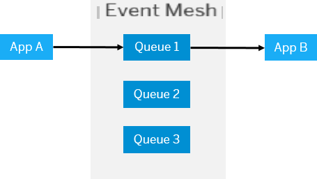
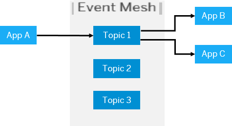
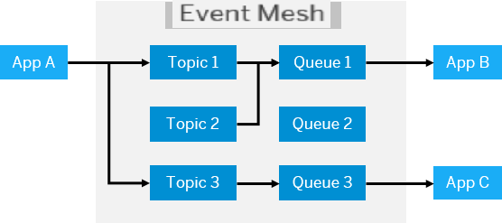

## Prerequisites
- [Start Developing on SAP Business Technology Platform](mission.scp-1-start-developing)

---

## Details
### You will learn
  - What the SAP Event Mesh service is
  - What you can do with SAP Event Mesh
  - Messaging protocols and libraries
  - Basic messaging concepts

[ACCORDION-BEGIN [Step 1: ](What is the SAP Event Mesh service?)]

**SAP Event Mesh** is a fully-managed service to connect applications, services, and systems so they can interact with each other through messages and events.

It replaces traditional point-to-point communication by introducing a **central message broker**. While point-to-point communication is fine for sharing data between a limited number of senders and receivers, scalability can quickly become an issue. SAP Event Mesh solves this issue and ensures messages can be exchanged reliably between senders and multiple receivers at large scale.

In addition, through the introduction of a message broker, you **decouple communication between applications, services, and systems** so that messages can be sent asynchronously (non-blocking). **Asynchronous communication** improves performance and scalability since senders are not slowed down or blocked while they wait for individual receivers to be online to receive direct messages.

Since SAP Event Mesh is responsible for message delivery, senders do not need to know which applications, services or systems will receive what data.

- **Sending applications** are not slowed down by waiting for a non-critical response from receivers that might be offline and unable to receive and respond to a message as it is published.

- **Receiving applications** can subscribe to messages of business importance and ensure to receive all relevant updates and can consume these messages at their own pace.

[VALIDATE_1]
[ACCORDION-END]

[ACCORDION-BEGIN [Step 2: ](Use cases)]

What can you do with SAP Event Mesh?

- **Decoupling:** Remote and asynchronous communication.

- **Integration:** Universal translator between different programming languages/environments and systems.

- **Reliability:** Ensure message delivery according to different quality of service levels and act as a mediator between producer and consumer.

- **High Volume:** Message broker elasticity supports highly scalable communication use cases.

- **Event Driven Architectures:** Distribute events across system and landscape boundaries and power event-driven architectures based on different SAP backend systems.

Which features and characteristics of SAP Event Mesh do the use cases build on?

- Communicate **reliably at a large scale**
- **Connect** applications, systems, and services seamlessly
- **Decouple** communication for **greater scalability**
- Provide elasticity to **handle unexpected peaks** in data traffic
- Transport, manage, and consume **events** in the cloud
- Ensure seamless **integration** based on standards

[VALIDATE_2]
[ACCORDION-END]

[ACCORDION-BEGIN [Step 3: ](Protocols and libraries)]

SAP Event Mesh supports standard messaging protocols to connect applications, services, and systems across hybrid landscapes.

- **Advanced Messaging Queuing Protocol (AMQP) 1.0** over WebSocket is an open standard protocol for messaging between applications or organizations. The defining features of AMQP are message orientation, queuing, routing (including point-to-point and publish-and-subscribe), reliability and security.

- **Message Queuing Telemetry Transport (MQTT) 3.1.1** over WebSocket is a lightweight messaging protocol designed for low bandwidth, high latency. It is the recommended protocol for use by applications not running in the cloud.

- **HTTP 1.1 REST** support allows to expose messaging capabilities using REST APIs. Messages can be published to and consumed from queues and topics via HTTP REST calls.

You can use the AMQP 1.0 over WebSocket libraries and MQTT 3.1.1. over WebSocket libraries for node.js. SAP Event Mesh also supports protocol-agnostic libraries that can be used at application configuration level for Java and Node.js.

[VALIDATE_3]
[ACCORDION-END]

[ACCORDION-BEGIN [Step 4: ](Messaging concepts)]

SAP Event Mesh supports central messaging concepts:

**Queues**

A queue is a collection in which the entities in the collection are kept in order and the main operations on the queue are the addition of entities to the rear terminal position and removal of entities from the front terminal position.

SAP Event Mesh  enables applications to communicate with each other through message queues. A sending application sends a message to a specific named queue. There's a one-to-one correspondence between a receiving application and its queue. The message queue retains the messages until the receiving application consumes it. You can manage these queues using the SAP Event Mesh dashboard.

**Topics**

Topics are named logical channels to which messages are published. Subscribers in a topic-based system receive all messages published to the topics to which they have subscribed. All subscribers to a topic receive their own copy of the same message.

SAP Event Mesh enables a sending application to publish messages and events to a topic. Applications must be subscribed to that topic and be active when the message is sent. Topics do not retain messages. This method can be used when each message needs to be consumed by a number of receiving applications.

**Queue Subscriptions**

With queue subscriptions SAP Event Mesh enables a sending application to publish messages to a topic. The topic sends the message directly to the queue to which it is bound. For example, events from an SAP S/4HANA system (event source) can only be sent to a topic. A queue subscription ensures that the message is retained until it is consumed by the receiving application.

**Message Client**

A message client allows you to connect to the SAP Event Mesh service using its own unique credentials to send and receive messages. The client can run within SAP Business Technology Platform or outside it.

You can create multiple message clients that can be distinguished by a set of credentials that consist of a namespace and connection rules that define the list of queues or topics to which the message client can send and receive messages.

The namespace is a unique prefix that defines all the queues or topics that have been created in the context of a particular message client. When you manage queues or topics in SAP Event Mesh,  the namespace allows message clients to identify the queues or topics for communication.

[VALIDATE_4]
[ACCORDION-END]

---
