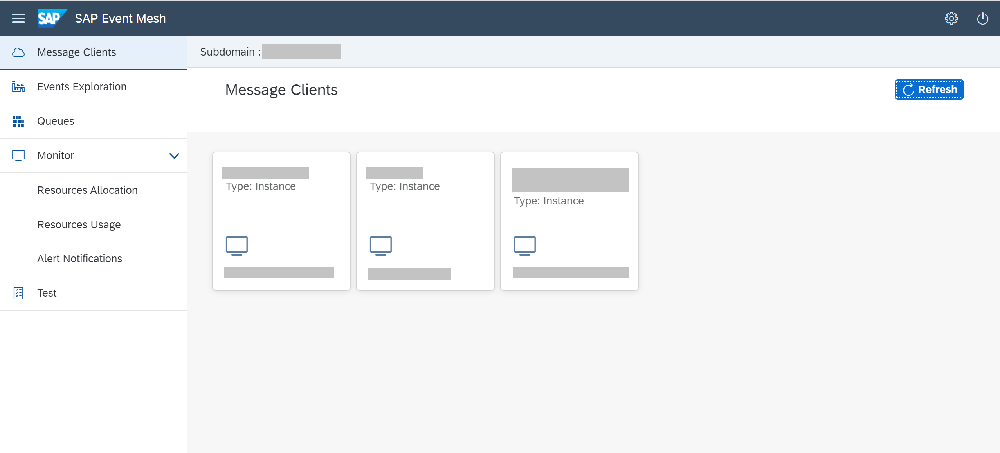
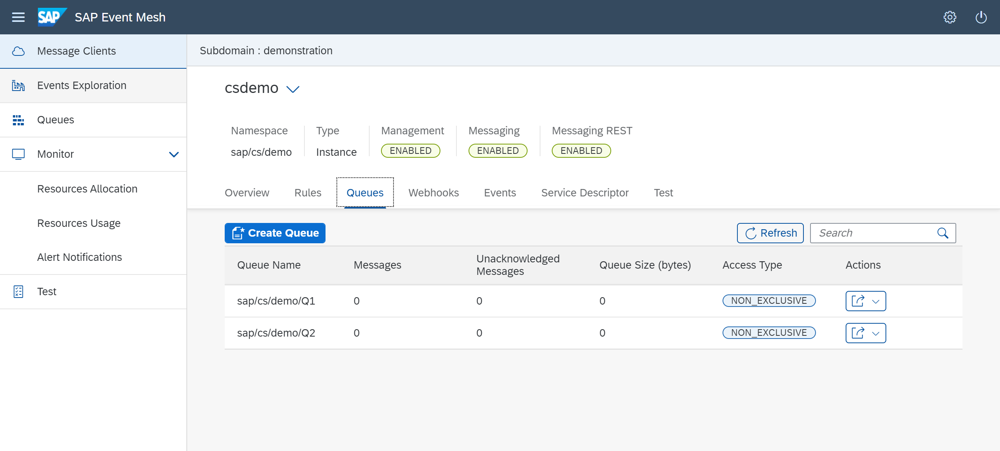
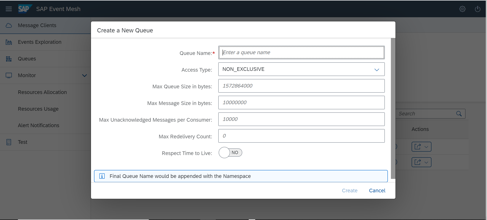
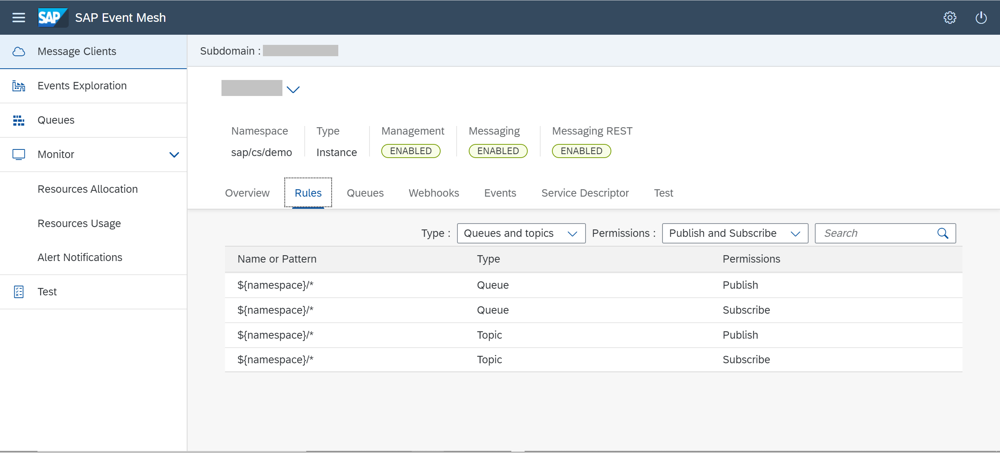
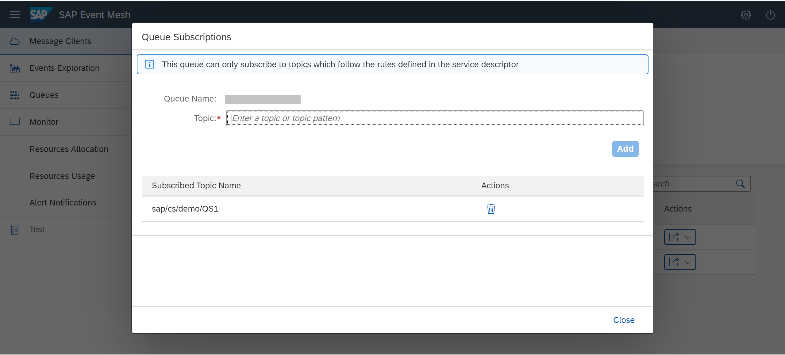

## Prerequisites
- An instance of SAP Event Mesh has already been created

## Details
### You will learn
  - How to manage queues, topics and queue subscriptions using the SAP Event Mesh management dashboard.

Queues and queue subscriptions are the core of asynchronous messaging. Messages are retained in queues until they are consumed by subscribing applications.

The SAP Event Mesh management dashboard for the default service plan is provided as a multitenant business application. Subscription can be set up only by administrators of the global account.

---
[ACCORDION-BEGIN [Step 1: ](Subscribe to Event Mesh)]
You need to subscribe to SAP Event Mesh in order to access its management dashboard.

To subscribe to SAP Event Mesh

1. Open your global account, then subaccount.
2. Choose **Instances and Subscriptions** in the left pane.
3. Choose *Create*.
4. Choose *Event Mesh* and *standard* plan.
5. Choose *Create*.

[DONE]
[ACCORDION-END]

[ACCORDION-BEGIN [Step 2: ](Open management dashboard)]

1. Open the SAP BTP Cockpit.

2. Click on the **Subscriptions** menu.

3. Subscribe to SAP Event Mesh.

4. Click on **Go to Application**.

    

    It opens the SAP Eventing Mesh management dashboard screen. The management dashboard allows you to manage different messaging clients as shown below.

5. Select the message client.
6. It will open the SAP Event Mesh Management Dashboard screen  **Overview** tab.

    

[DONE]
[ACCORDION-END]

  [ACCORDION-BEGIN [Step 3: ](Manage queue)]

On the Management Dashboard, you can create a queue to work with SAP Event Mesh.

> Queues enable point-to-point communication between two applications. An application can subscribe to a queue.

To create a queue, click on **Create Queue**.

  

Enter the name of the queue. For example, queue `salesorder`.

  

> The name of the queue has to follow the pattern you specified in the (JSON) descriptor when you created the SAP Event Mesh service instance. Choose the **View Rules** tab, to see the rules that must be followed when you enter the queue name. As shown in the screenshot below, the **View Rules** tab provides the following information for the instance:
>
  - List of rules.
>
  - Type to which the rule belongs.
>
  - Permissions defined for the rule.

In your example, you need to follow following pattern.

After the queue has been created, the queue name is appended to the namespace and is displayed on the UI.

On the **Queues** tab, you can view

  - List of queues.

  - Number of messages in each queue.

  - Size (in kilobytes) of all the messages in each queue.

For the `salesorder` queue you've created in the example, the values are displayed as below:

If you want to delete the `salesorder` queue, you can delete the queue using **delete a queue** icon.

>**CAUTION:** Deleting a queue also deletes any associated queue subscriptions and any messages that are in the queue.

[VALIDATE_2]

[ACCORDION-END]

[ACCORDION-BEGIN [Step 4: ]( Manage queue subscriptions)]
>
Service enables a sending application to publish messages and events to a topic. Applications must be subscribed to that topic, and be active when the message is sent. Topics do not retain messages.
>
Create a queue subscription if you want to retain messages that are sent to a topic.

In this example, subscribe queue `salesorder` to the `s4hanasalesorder` topic.

1. Click on the **Show subscriptions for this queue** icon under **Actions**.

2. The Queue Subscription screen is displayed. Create the `s4hanasalesorder` topics.

Below screen displays how to create a topic and once a topic is created how is it displayed.

>
1. This queue can only subscribe to topics that follow the rules defined in the service descriptor
>
2. An external source can publish messages to the topic. Messages can only be consumed from the queue.
>
3. Multiple queues can subscribe to one topic. In this case, the same message is published to all the subscribed queues.
>
4. One queue also can be associated with multiple topics. In this case, any message that is published to all these topics is stored in the subscribed queue.

You can delete a topic using the **delete** icon.

[VALIDATE_3]

[ACCORDION-END]

---
