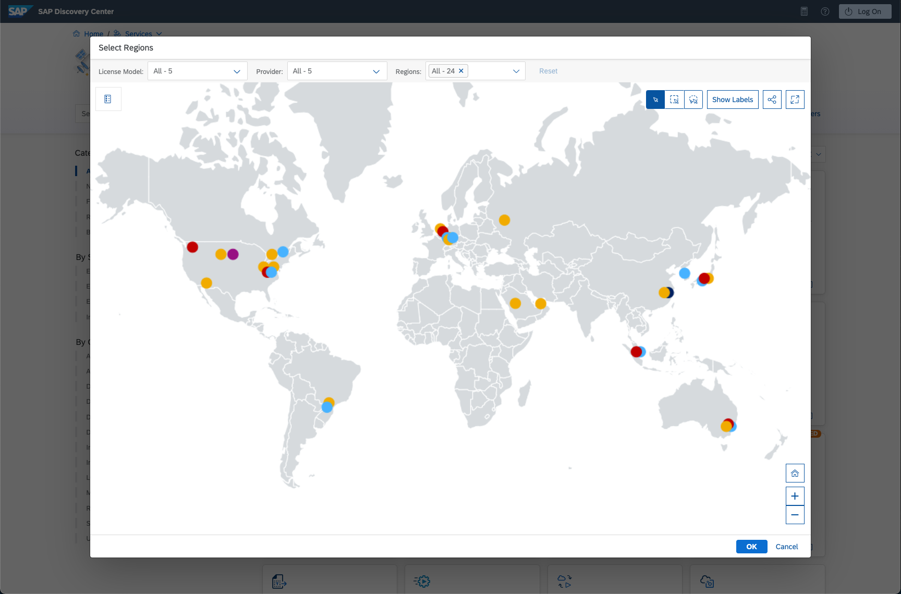

## Prerequisites  
 - There are none. If you want to start learning about SAP BTP, this is the very beginning.

## Details
### You will learn  
  - What SAP BTP is
  - What SaaS, PaaS, and IaaS mean and how they work
  - What services are, and where to find them
  - What the different environments of SAP BTP are

[ACCORDION-BEGIN [Step](Introduction to SAP BTP)]

**Welcome to the SAP BTP**

SAP BTP is an open set of Software, Platform, and Infrastructure as a Service systems that delivers in-memory capabilities, core platform services, and unique micro-services for building and extending intelligent, mobile and browser enabled applications.  SAP BTP is multi-lingual, with support for most major languages ([now including ABAP](https://blogs.sap.com/2018/09/04/sap-cloud-platform-abap-environment/)) and support for development, testing, and production systems both inside an organization and to the larger public.  

SAP BTP provides a large number of SAP software packages, or services, that deliver all the functionality of on-premise SAP applications, but in a cloud focused way.  It also provides a way for developers to customize those services, or build entirely new applications, to deliver custom applications personalized to your organization.

SAP BTP is also constantly evolving.  SAP continuously updates the services we provide, the platforms that run the custom code, and the infrastructure that supports everything.  This allows developers to focus on the custom code, and not worry about hardware maintenance or software upgrades.

Let's start with an overview of the different types of "as a Service" that SAP BTP provides.

[DONE]
[ACCORDION-END]

[ACCORDION-BEGIN [Step](What does "as a Service" mean?)]

A term that is widely used in Cloud computing is "*Something* as a Service".  Services, in this case, mean anything provided in the cloud for the organization.  So, the important part of the term is the first word - the *Something*.

There are multiple ways that an organization can purchase and use cloud resources.  The four most common are:

- On premise (since nothing is in a cloud, none of this is a "service")
- Infrastructure as a Service (IaaS)
- Platform as a Service (PaaS)
- Software as a Service (SaaS)

The three different service levels are:

| Acronym |  Name | Description |
| ------- | ------------ | ----------- |
| IaaS | Infrastructure as a Service | The cloud provides the hardware, and the operating system, the customer provides the runtime and everything else. |
| PaaS | Platform as a Service | The cloud provides the hardware, the runtime and the operating system.  The customer chooses the application and provides the software. |
| SaaS | Software as a Service | The cloud provides the hardware, the operating system, and the software.  The client uses the software directly, with no changes or customized to suit their business needs. |

[VALIDATE_1]
[ACCORDION-END]

[ACCORDION-BEGIN [Step](SAP BTP service types)]

SAP BTP provides both Platform as a Service (PaaS) and Software as a Service (SaaS).  

Why does SAP provide both?  The combination of both PaaS and SaaS provide all the tools we have traditionally sold, new tools that are specific to the cloud, and also the ability to customize all of our products to fit each individual organization.  

We have a lot of SaaS solutions available in the SAP Cloud.  They include our core package, S/4HANA, as well as Workflow, Human Resources, and new products like Internet of Things.  There are many more in the list, so [take a look at a more complete list for details](https://www.sap.com/about/agreements/policies/cloud-platform.html).

> **Note**:  There are two different types of Services being described here.  The software listed above are stand-alone software packages, which can be used without customization.  These are all Software as a Service, but we refer to those applications as **Solutions**.  
>
> SAP BTP also offers services, called "Platform Services", which provide additional functionality to custom code. These "Platform Services" do not run independently.  SAP refers to these as **Services**, especially in Cloud Foundry.  So when you see the name "Service" in later tutorials, this usually means "Platform Services".

SAP also offers Platform as a Service (PaaS).  Developers can write code in almost any language, and run that software in the same cloud with our services.  Organizations can use this to run independent software, or to customize the SAP services to meet specific needs.

---

Finally, SAP also offers IaaS in the cloud.  We didn't mention this before, because it is not used very often.  But, if the organization needs the flexibility to run a very specific operating system and software configuration, we have data centers that can support that as part of the SAP cloud.

[DONE]
[ACCORDION-END]

[ACCORDION-BEGIN [Step](SAP BTP data centers)]

The SAP BTP is available in two different types of data centers.  First, SAP runs it's own data centers around the world, optimized for SAP software.  Second, SAP also partners with other cloud infrastructure providers.  Currently, we partner with Amazon Web Services (AWS), Microsoft Azure, Google Cloud Platform (GCP), and Alibaba Cloud.

!

This is a graphical representation of all the SAP data centers worldwide. You can open this map when you click on the globe icon on this page to [see a complete list of the types of centers and the services provided at each data center](https://discovery-center.cloud.sap/viewServices).

The list of services and data centers is constantly updated, so please use the link to find the latest information.

[DONE]
[ACCORDION-END]

[ACCORDION-BEGIN [Step](Neo, ABAP, Cloud Foundry, and Kubernetes)]

There are four different PaaS environments in the SAP cloud.

The first environment is called [SAP BTP, Neo environment](https://help.sap.com/viewer/3504ec5ef16548778610c7e89cc0eac3/Cloud/en-US/0f79436cf43a4785bb5b7ee9dac0c76a.html).  It's is the original SAP runtime environment.  The Neo environment lets you develop HTML5, Java, and SAP HANA extended application services (SAP HANA XS) applications. You can also use the UI Development Toolkit for HTML5 (SAPUI5) to develop rich user interfaces for modern web-based business applications.  Neo is run in the SAP BTP on servers that SAP maintains and supports.

The second environment is  [SAP BTP, Cloud Foundry environment](https://help.sap.com/viewer/3504ec5ef16548778610c7e89cc0eac3/Cloud/en-US/9c7092c7b7ae4d49bc8ae35fdd0e0b18.html#loio9c7092c7b7ae4d49bc8ae35fdd0e0b18/).  This environment was added in 2017.  [Cloud Foundry is an open source project and standard](https://www.cloudfoundry.org/), run by the Cloud Foundry Foundation (and before that, the Linux Foundation).  SAP has implemented Cloud Foundry on the SAP BTP, using servers in our expanding network of third party data centers (like AWS, Azure, Google Cloud, and Alibaba Cloud).

The [SAP BTP,  ABAP environment](https://help.sap.com/viewer/3504ec5ef16548778610c7e89cc0eac3/Cloud/en-US/11d62652aa2b4600a0fa136de0789648.html) allows you to create extensions for ABAP-based products, such as SAP S/4HANA Cloud, and develop new cloud applications. You can transform existing ABAP-based custom code or extensions to the cloud.

The [SAP BTP, Kubernetes environment](https://help.sap.com/viewer/3504ec5ef16548778610c7e89cc0eac3/Cloud/en-US/468c2f3c3ca24c2c8497ef9f83154c44.html) is based on the open-source project [Kyma](https://kyma-project.io/) that allows developers to extend SAP solutions with server-less functions and combine them with containerized microservices. It comes with the SAP BTP, Kyma runtime.

Which environment is right for you?  That's a good question.  Each environment has it's strengths, and some services are only available in one of the environments.  Take a look at all of them before making a decision, and use our [online map to guide you](https://help.sap.com/viewer/65de2977205c403bbc107264b8eccf4b/Cloud/en-US/73beb06e127f4e47b849aa95344aabe1.html).

SAP offers a [free trial of SAP BTP](hcp-create-trial-account) for all environments.

That's it!  That is the 10,000 meter overview of SAP BTP.  Please follow the later tutorials to get a trial account, get the account configured, and get started with services and writing new code for the cloud.  Have fun!

[DONE]
[ACCORDION-END]

---
