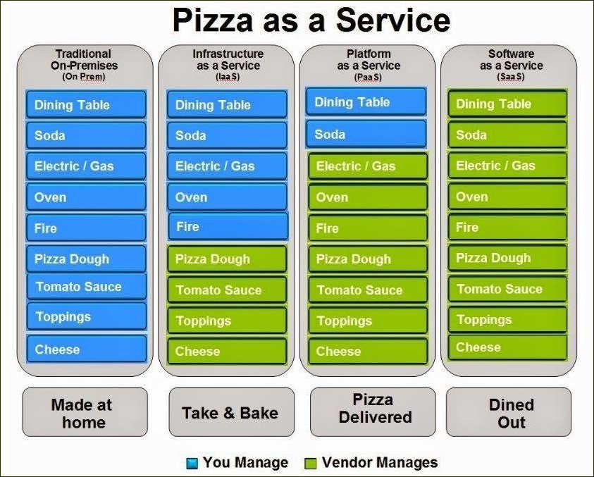
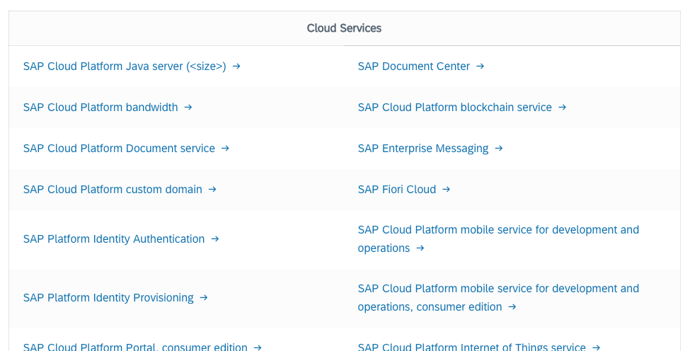
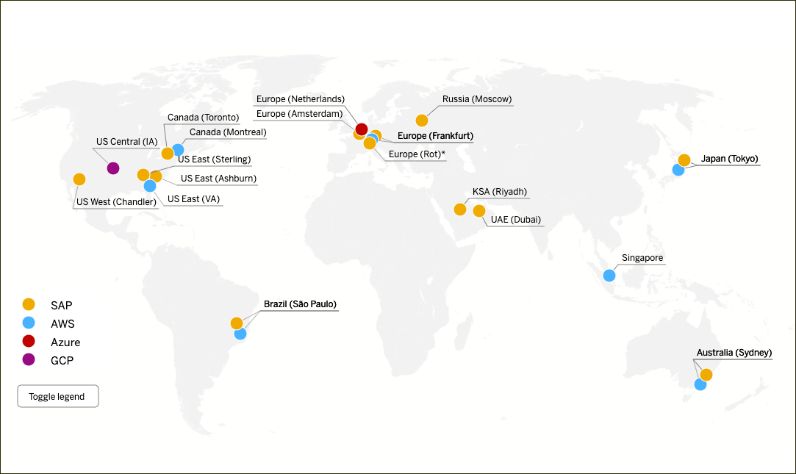
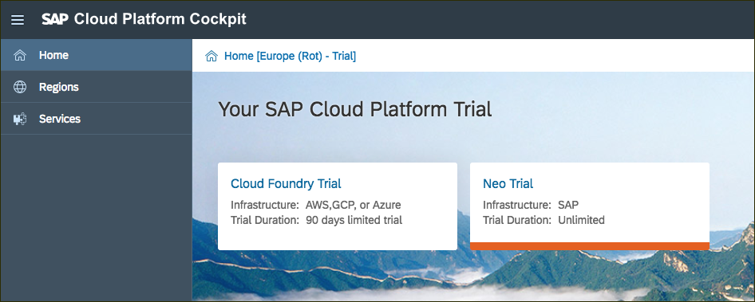
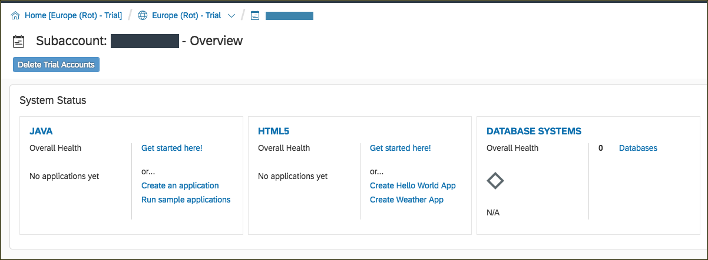
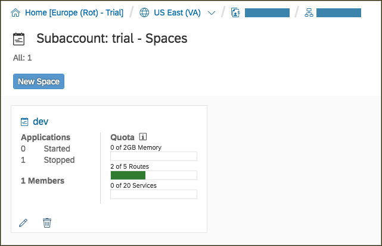
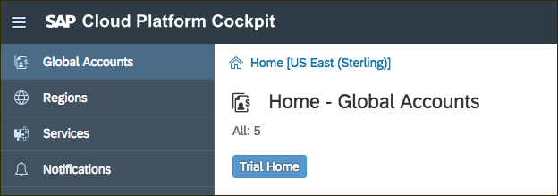
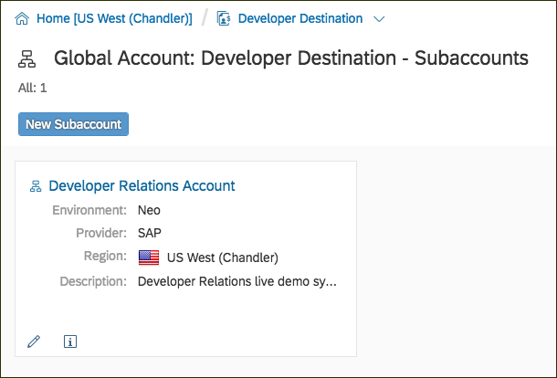
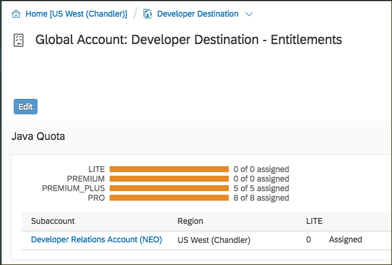

## Prerequisites  
 - There are none. If you want to start learning about SAP Cloud Platform, this is the very beginning.

## Details
### You will learn  
  - What is SAP Cloud Platform?
  - What do SaaS, PaaS, and IaaS mean and how do they work?
  - What are services, and where can I find out about them?
  - What are the different flavors of SAP Cloud Platform?
  - How do organizations and accounts fit together?

[ACCORDION-BEGIN [Step](Introduction to SAP Cloud Platform)]

**Welcome to the SAP Cloud Platform**

SAP Cloud Platform is an open set of Software, Platform, and Infrastructure as a Service systems that delivers in-memory capabilities, core platform services, and unique micro-services for building and extending intelligent, mobile and browser enabled applications.  SAP Cloud Platform is multi-lingual, with support for most major languages ([now including ABAP](https://blogs.sap.com/2018/09/04/sap-cloud-platform-abap-environment/)) and support for development, testing, and production systems both inside an organization and to the larger public.  

SAP Cloud Platform provides a large number of SAP software packages, or services, that deliver all the functionality of on-premise SAP applications, but in a cloud focused way.  It also provides a way for developers to customize those services, or build entirely new applications, to deliver custom applications personalized to your organization.

SAP Cloud Platform is also constantly evolving.  SAP continuously updates the services we provide, the platforms that run the custom code, and the infrastructure that supports everything.  This allows developers to focus on the custom code, and not worry about hardware maintenance or software upgrades.

Let's start with an overview of the different types of "as a Service" that SAP Cloud Platform provides.

[DONE]
[ACCORDION-END]

[ACCORDION-BEGIN [Step](What does "as a Service" mean?)]

A term that is widely used in Cloud computing is "*Something* as a Service".  Services, in this case, mean anything provided in the cloud for the organization.  So, the important part of the term is the first word - the *Something*.

There are multiple ways that an organization can purchase and use cloud resources.  The four most common are:

- On premise (since nothing is in a cloud, none of this is a "service")
- Infrastructure as a Service (IaaS)
- Platform as a Service (PaaS)
- Software as a Service (SaaS)

The easiest way to describe them all is to compare them to Pizza.  This diagram describes the difference between all four:

In other words, the three different service levels are:

| Acronym |  Name | Description |
| ------- | ------------ | ----------- |
| IaaS | Infrastructure as a Service | The cloud provides the hardware, the customer provides the Operating System and everything else. |
| PaaS | Platform as a Service | The cloud provides the hardware, and the operating system.  The customer chooses the application and provides the software. |
| SaaS | Software as a Service | The cloud provides the hardware, the operating system, and the software.  The client uses the software directly, with no changes or customized to suit their business needs. |

[VALIDATE_1]
[ACCORDION-END]

[ACCORDION-BEGIN [Step](SAP Cloud Platform service types)]

SAP Cloud Platform provides both Platform as a Service (PaaS) and Software as a Service (SaaS).  

Why does SAP provide both?  The combination of both PaaS and SaaS provide all the tools we have traditionally sold, new tools that are specific to the cloud, and also the ability to customize all of our products to fit each individual organization.  

We have a lot of SaaS solutions available in the SAP Cloud.  They include our core package, S/4HANA, as well as Workflow, Human Resources, and new products like Internet of Things.  There are many more in the list, so [take a look at a more complete list for details](https://cloudplatform.sap.com/support/service-description.html).

> **Note**:  There are two different types of Services being described here.  The software listed above are stand-alone software packages, which can be used without customization.  These are all Software as a Service, but we refer to those applications as **Solutions**.  
>
> SAP Cloud Platform also offers services, called "Platform Services", which provide additional functionality to custom code. These "Platform Services" do not run independently.  SAP refers to these as **Services**, especially in Cloud Foundry.  So when you see the name "Service" in later tutorials, this usually means "Platform Services".

SAP also offers Platform as a Service (PaaS).  Developers can write code in almost any language, and run that software in the same cloud with our services.  Organizations can use this to run independent software, or to customize the SAP services to meet specific needs.

---

Finally, SAP also offers IaaS in the cloud.  We didn't mention this before, because it is not used very often.  But, if the organization needs the flexibility to run a very specific operating system and software configuration, we have data centers that can support that as part of the SAP cloud.

[DONE]
[ACCORDION-END]

[ACCORDION-BEGIN [Step](SAP Cloud Platform data centers)]

The SAP Cloud Platform is available in two different types of data centers.  First, SAP runs it's own data centers around the world, optimized for SAP software.  Second, SAP also partners with other cloud infrastructure providers.  Currently, we partner with Amazon Web Services (AWS), Microsoft Azure, and Google Cloud Platform (GCP).

This is a graphical representation of all the SAP data centers worldwide.  [This page also contains a complete list of the types of centers, and the services provided at each data center.](https://help.sap.com/doc/aa1ccd10da6c4337aa737df2ead1855b/Cloud/en-US/3b642f68227b4b1398d2ce1a5351389a.html?3b642f68227b4b1398d2ce1a5351389a.html).

The list of services and data centers is constantly updated, so please use the link to find the latest information.

[DONE]
[ACCORDION-END]

[ACCORDION-BEGIN [Step](Neo, Cloud Foundry, Kubernetes, and ABAP)]

There are two different PaaS environments in the SAP cloud.

The first environment is called "Neo".  It's is the original SAP runtime environment.  The Neo environment lets you develop HTML5, Java, and SAP HANA extended application services (SAP HANA XS) applications. You can also use the UI Development Toolkit for HTML5 (SAPUI5) to develop rich user interfaces for modern web-based business applications.  Neo is run in the SAP Cloud Platform on servers that SAP maintains and supports.

The second environment is Cloud Foundry.  This environment was added in 2017.  [Cloud Foundry is an open source project and standard](https://www.cloudfoundry.org/), run by the Cloud Foundry Foundation (and before that, the Linux Foundation).  SAP has implemented the Cloud Foundry on the SAP Cloud Platform, using servers in our expanding network of third party data centers (like AWS, Azure, and Google Cloud).

Which environment is right for you?  That's a good question.  Each environment has it's strengths, and some services are only available in one of the environments.  Take a look at both before making a decision, and use our [online map to guide you](https://help.sap.com/doc/aa1ccd10da6c4337aa737df2ead1855b/Cloud/en-US/3b642f68227b4b1398d2ce1a5351389a.html?3b642f68227b4b1398d2ce1a5351389a.html).

>  We will also be adding two new PaaS environments in the near future:  [Kubernetes](https://cloudplatform.sap.com/enterprise-paas/kubernetes.html), and [ABAP](https://cloudplatform.sap.com/enterprise-paas/abap.html).  Look for more details on those links, and expect more announcements soon.

[DONE]
[ACCORDION-END]

[ACCORDION-BEGIN [Step](SAP Cloud Foundry cockpit)]

Accessing SAP Cloud Foundry starts with the [SAP Cloud Platform cockpit](https://account.hanatrial.ondemand.com/register) .

Developers can access the SAP Cloud Platform cockpits to log in and access both PaaS and SaaS systems in the cloud.  

> Bookmark the link for fast and quick access to the cockpit.  
>&nbsp;

> Each page in the cockpit is also a separate URL, so you can bookmark those too for faster access to frequently used pages.

[DONE]
[ACCORDION-END]

[ACCORDION-BEGIN [Step](Trial accounts on SAP Cloud Platform)]

SAP offers a [free trial of SAP Cloud Platform](https://account.hanatrial.ondemand.com/register).  Both the Neo and Cloud Foundry environments are available for trial.  

The Neo environment is a lifetime free trial, and never expires.  

The Cloud Foundry trial expires after 90 days, but can be renewed as many times as you want.

Later tutorials will describe how to create accounts for both Neo and Cloud Foundry.

[DONE]
[ACCORDION-END]

[ACCORDION-BEGIN [Step](Accounts and Sub-Accounts)]

SAP Cloud Platform uses two levels of accounts:  Global Accounts, and Sub-Accounts.  

A Global Account is the primary account for your organization or team.  It is the central pool of all the resources.  The Global Account isn't accessed directly, it just acts as an "umbrella" or container for all of the Sub-Accounts.

Sub-Accounts are created by the Global Account, and can be used to sub-divide resources.  Each sub-account has a distinct name.

Each sub-account is given a share of the resources through Entitlements.  Resources can be given to a single sub-account, or divided amongst multiple sub-accounts.  Then, when any individual sub-account needs more resources, they can be assigned here.

> **Note**
>
> Trial accounts have a single Global Account, and a single sub-account.  Most of these details won't matter to a trial account, but it's good to know how everything works if you ever move to a more complex setup.

[DONE]
[ACCORDION-END]

That's it!  That is the 10,000 meter overview of SAP Cloud Platform.  Please follow the later tutorials to get a trial account, get the account configured, and get started with services and writing new code for the cloud.  Have fun!

---
