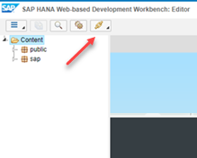

## Next Steps
- [Leverage SAP HANA 1.0 Machine Learning capabilities to build a recommendation engine on the SAP Cloud Platform](https://developers.sap.com/group.cp-hana-aa-movielens.html)

## Details
### You will learn
- How to setup your SAP HANA XS OData service to be used in your SAPUI5 application

[ACCORDION-BEGIN [Step 1: ](Switch to the Catalog perspective)]

In order to create the CDS and XS OData artifacts, we will be using the **Catalog** perspective available in the **SAP HANA Web-based Development Workbench**.

From the ***SAP HANA Web-based Development Workbench*** main panel, click on **Catalog**:


Else, if you are already accessing one of the perspective, then use the  icon from the menu:



> ### **Note**
>**Make sure the currently connected user is `MOVIELENS_USER` and not SYSTEM**. Check the upper right corner of the SAP HANA Web-based Development Workbench.

[DONE]
[ACCORDION-END]

[ACCORDION-BEGIN [Step 2: ](Create additional views)]

Inspired by the series of SQL used to validate our SAP HANA APL & PAL results, you will create a set of views that will help provide a better user experience.

For example, you can create a view that present a ***user rating summary*** which include the number of rating, the average notation using the following SQL:

```SQL
DROP   VIEW "MOVIELENS"."SUMMARY_RATING_USER";
CREATE VIEW "MOVIELENS"."SUMMARY_RATING_USER" AS
SELECT DISTINCT
    "USERID"
  , 'User Id: ' || "USERID" || ' - Rating count: ' ||   COUNT(1) over( PARTITION BY "USERID" )  AS DESCRIPTION
  , COUNT(1)               over( PARTITION BY "USERID" ) AS "RATING_COUNT"
  , AVG("RATING")          over( PARTITION BY "USERID" ) AS "RATING_AVG"
  , NTH_VALUE("TIMESTAMP",1) over( PARTITION BY "USERID"  ORDER BY "TIMESTAMP" DESC, "MOVIEID") AS "LAST_RATING_DATE"
  , NTH_VALUE("RATING"   ,1) over( PARTITION BY "USERID"  ORDER BY "TIMESTAMP" DESC, "MOVIEID") AS "LAST_RATING"
  , NTH_VALUE("MOVIEID"  ,1) over( PARTITION BY "USERID"  ORDER BY "TIMESTAMP" DESC, "MOVIEID") AS "LAST_MOVIEID"
FROM "MOVIELENS"."public.aa.movielens.hdb::data.RATINGS";
```

Now a ***movie rating summary***:

```SQL
DROP   VIEW "MOVIELENS"."SUMMARY_RATING_MOVIE";
CREATE VIEW "MOVIELENS"."SUMMARY_RATING_MOVIE" AS
SELECT DISTINCT
    "T1"."MOVIEID"
  , 'Movie Id: ' || "T1"."MOVIEID" || ' - Rating count: ' ||  COUNT(1) over( PARTITION BY "T1"."MOVIEID" ) AS DESCRIPTION
  , "T2". "TITLE"
  , "T2". "GENRES"
  , "T3". "IMDBID"
  , "T3". "TMDBID"
  , COUNT(1)               over( PARTITION BY "T1"."MOVIEID" ) AS "RATING_COUNT"
  , AVG("RATING")          over( PARTITION BY "T1"."MOVIEID" ) AS "RATING_AVG"
  , NTH_VALUE("TIMESTAMP",1) over( PARTITION BY "T1"."MOVIEID"  ORDER BY "T1"."TIMESTAMP" DESC, "T1"."MOVIEID") AS "LAST_RATING_DATE"
  , NTH_VALUE("RATING"   ,1) over( PARTITION BY "T1"."MOVIEID"  ORDER BY "T1"."TIMESTAMP" DESC, "T1"."MOVIEID") AS "LAST_RATING"
  , NTH_VALUE("USERID"   ,1) over( PARTITION BY "T1"."MOVIEID"  ORDER BY "T1"."TIMESTAMP" DESC, "T1"."MOVIEID") AS "LAST_USERID"
FROM "MOVIELENS"."public.aa.movielens.hdb::data.RATINGS" "T1"
LEFT OUTER JOIN "MOVIELENS"."public.aa.movielens.hdb::data.MOVIES" "T2" on ("T1".MOVIEID = "T2".MOVIEID)
LEFT OUTER JOIN "MOVIELENS"."public.aa.movielens.hdb::data.LINKS"  "T3" on ("T1".MOVIEID = "T3".MOVIEID);
```

And finally, the ***rating details***:

```SQL
DROP   VIEW "MOVIELENS"."SUMMARY_RATING_DETAILS";
CREATE VIEW "MOVIELENS"."SUMMARY_RATING_DETAILS" AS
SELECT
    "T1"."MOVIEID"
  , "T1"."USERID"
  , 'User Id: ' || "T1"."USERID" || ' - User Rating: ' || "T1"."RATING" || ' - Movie Id: ' || "T1"."MOVIEID" || ' - Title: ' || "T2"."TITLE" AS DESCRIPTION
  , "T2"."TITLE"
  , "T2"."GENRES"
  , "T3"."IMDBID"
  , "T3"."TMDBID"
  , "T1"."RATING"
  , "T1"."TIMESTAMP"
FROM "MOVIELENS"."public.aa.movielens.hdb::data.RATINGS" "T1"
LEFT OUTER JOIN "MOVIELENS"."public.aa.movielens.hdb::data.MOVIES" "T2" on ("T1".MOVIEID = "T2".MOVIEID)
LEFT OUTER JOIN "MOVIELENS"."public.aa.movielens.hdb::data.LINKS"  "T3" on ("T1".MOVIEID = "T3".MOVIEID);
```

> ### **Note**
>You may receive a series of errors and warnings in the console log while running the above code. They should all be related to the drop statements at the beginning which are intended to help you re-run the script if needed.

[DONE]
[ACCORDION-END]

[ACCORDION-BEGIN [Step 3: ](Switch to the Editor perspective)]

In order to create the CDS and XS OData artifacts, we will be using the **Editor** perspective available in the **SAP HANA Web-based Development Workbench**.

From the ***SAP HANA Web-based Development Workbench*** main panel, click on **Editor**:


Else, if you are already accessing one of the perspective, then use the  icon from the menu:


> ### **Note**
>**Make sure the currently connected user is `MOVIELENS_USER` and not SYSTEM**. Check the upper right corner of the SAP HANA Web-based Development Workbench.

[DONE]
[ACCORDION-END]

[ACCORDION-BEGIN [Step 4: ](Create SAP HANA XS OData services)]

> **SAP HANA XS OData services**
>
>OData is a resource-based web protocol for querying and updating data. OData defines operations on resources using HTTP commands (for example, GET, PUT, POST, and DELETE) and specifies the uniform resource indicator (URI) syntax to use to identify the resources.
>
>The main aim of OData is to define an abstract data model and a protocol which, combined, enable any client to access data exposed by any data source. Clients might include Web browsers, mobile devices, business-intelligence tools, and custom applications (for example, written in programming languages such as PHP or Java); data sources can include databases, content-management systems, the Cloud, or custom applications (for example, written in Java).
>
>SAP HANA version 1.0 SPS 12 currently supports OData version 2.0.
>
>To create an OData service, you create a flat file that contains the set of OData service. You save this file with the suffix `.xsodata` in the appropriate package for your application in the SAP HANA repository.

Create a new file named **`data.xsodata`** in the **`public/aa/movielens/service`** package.

Paste the following content in the console.

```JavaScript
service {
  // expose the model result views
  "MOVIELENS"."APL_RECO_MODEL_USERS_RESULTS"    as "APL_RECO_MODEL_USERS_RESULTS" key ("USERID" , "RANK");
  "MOVIELENS"."APL_RECO_MODEL_ITEMS_RESULTS"    as "APL_RECO_MODEL_ITEMS_RESULTS" key ("MOVIEID", "RANK");

  "MOVIELENS"."PAL_APRIORI_MODEL_ITEMS_RESULTS" as "PAL_APRIORI_MODEL_ITEMS_RESULTS" key ("MOVIEID", "RANK");
  "MOVIELENS"."PAL_APRIORI_MODEL_USERS_RESULTS" as "PAL_APRIORI_MODEL_USERS_RESULTS" key ("USERID" , "RANK");

  // expose the summary user and movie views
  "MOVIELENS"."SUMMARY_RATING_USER"       as "SUMMARY_RATING_USER"     key ("USERID");
  "MOVIELENS"."SUMMARY_RATING_MOVIE"      as "SUMMARY_RATING_MOVIE"    key ("MOVIEID");
  "MOVIELENS"."SUMMARY_RATING_DETAILS"    as "SUMMARY_RATING_DETAILS"  key ("USERID", "MOVIEID");
}
```

Here we have added a set of services that we will be using in our SAPUI5 application to read the algorithm result but any other declared services.

Save the file using the  icon from the menu or press `CTRL+S`.

Check the message console, and make sure there is no errors. The following messages should be displayed:

```
[xx:xx:xx] File /public/aa/movielens/service/data.xsodata created successfully.
[xx:xx:xx] File /public/aa/movielens/service/data.xsodata saved & activated successfully.
```

Now, let's run the `XS OData` service using the execute icon  from the menu.

Append the following text to your XS OData URL:

```HTML
/APL_RECO_MODEL_USERS_RESULTS(USERID=1,RANK=1)/TITLE?$format=json
```

You should get the first recommendation from the APL algorithm results for user id 1.

Provide an answer to the question below then click on **Validate**.

[VALIDATE_1]
[ACCORDION-END]
