## Prerequisites
- [Leverage SAP HANA 1.0 Machine Learning capabilities to build a recommendation engine on the SAP Cloud Platform](https://developers.sap.com/group.cp-hana-aa-movielens.html)

## Details
### You will learn
- How to add a destination to your SAP Cloud Platform account
- How to create a SAPUI5 application from a template using the SAP Web IDE
- How to add a destination to your SAPUI5 application
- Run your SAPUI5 application

**Note:** The intent of the following tutorials is not to focus on SAPUI5 but to use it as mean to execute the SAP Predictive services.
For more content on SAPUI5, you can check the dedicated <a href="https://sapui5.hana.ondemand.com/#/topic/3da5f4be63264db99f2e5b04c5e853db" target="new">tutorials</a> section available on the <a href="https://sapui5.hana.ondemand.com" target="new">SAPUI5 documentation</a>.

[ACCORDION-BEGIN [Step 1: ](Create your destination)]

Log into the <a href="https://account.hanatrial.ondemand.com/cockpit#/region/neo-eu1-trial/overview" target="new"><b>SAP Cloud Platform Cockpit Neo Trial</b></a> with your free trial account on **Europe (Rot) - Trial** and access ***Your Personal Developer Account***.

Click on your ***SAP Cloud Platform Account*** identifier (which ends with *trial* by default) as highlighted on the below screenshot.


You are now in your ***SAP Cloud Platform developer*** account!

> If you are unclear with what is your SAP Cloud Platform account name, you can refer to the following blog entry: [SAP Cloud Platform login, user name, account id, name or display name: you are lost? Not anymore!](https://blogs.sap.com/2017/01/31/sap-hana-cloud-platform-trial-login-name-user-name-account-name-account-identifier-you-are-lost-not-anymore/)


On the left side bar, you can navigate in **Connectivity** > **Destinations**.

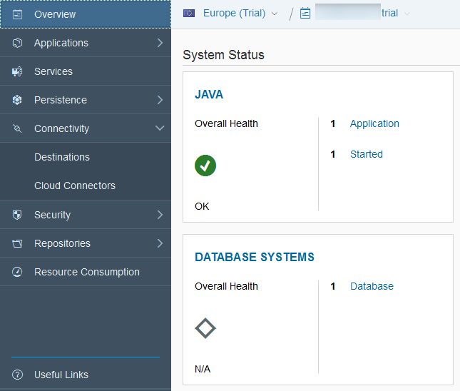

On the ***Destinations*** overview page, click on **New Destination**

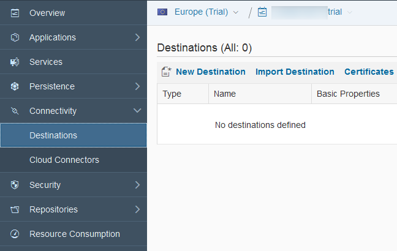

Enter the following information:

Field Name           | Value
-------------------- | --------------
Name                 | `movielens`
Type                 | `HTTP`
Description          | `SAP HANA XS OData Movielens services`
URL                  | your SAP HANA XS OData URL
Proxy Type           | `Internet`
Authentication       | `BasicAuthentication`
User                 | `MOVIELENS_USER`
Password             | `Welcome18Welcome18`

> ### **Note**:
>**Make sure you paste your SAP HANA XS OData URL from the last tutorial in the URL field.**
>**The URL should end like `data.xsodata` with no slash "/" at the end**

Before clicking on **Save**, you will need to add the following properties to the destination using the ***New Property*** button:

Property Name          | Value
---------------------- | --------------
`WebIDEEnabled`        | `true`
`WebIDEUsage`          | `odata_gen,odata_xs`
`WebIDEAdditionalData` | `full_url`

> ### **Note**:
> The ***New Property*** button is not available is you are not in edit mode.

Click on **Save**

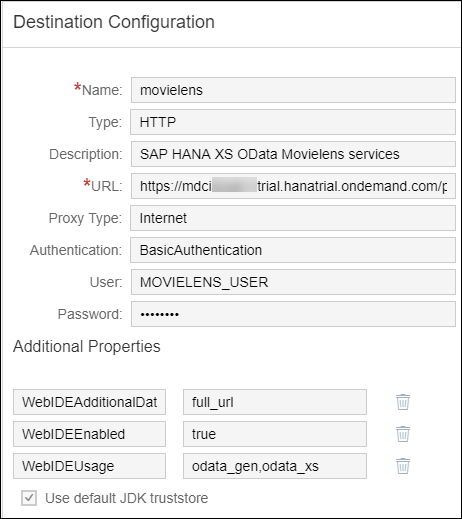

You can use the **Check Connection** button or the  icon to your **Destination** to validate your configuration.

[DONE]
[ACCORDION-END]

[ACCORDION-BEGIN [Step 2: ](Open the Web IDE)]

On the left side bar, you can navigate in **Services**, then using the search box enter **SAP Web IDE**.

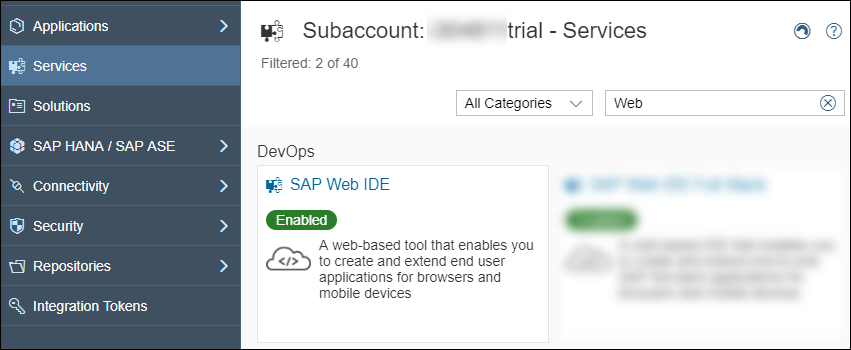

Click on the **SAP Web IDE** tile, then click on **Go to Service**.

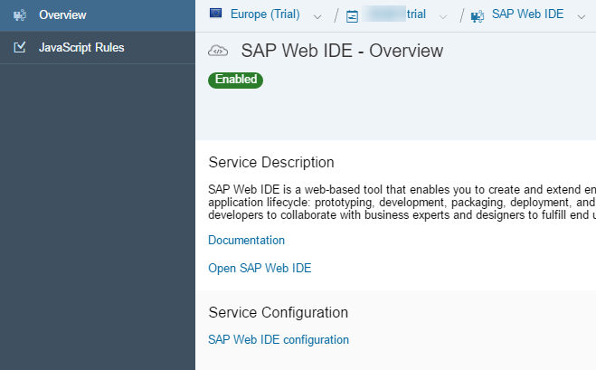

You will get access to the **SAP Web IDE** main page:

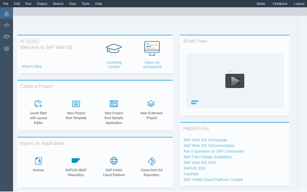

[DONE]
[ACCORDION-END]

[ACCORDION-BEGIN [Step 3: ](Create your application using the SAPUI5 template)]

Using the **File** menu, navigate **New** > **Project from Template**.


Select the **SAPUI5 Application** tile, then click on **Next**

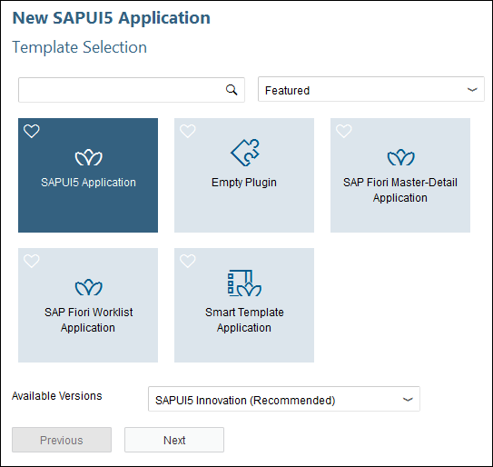

Enter the following information, then click on **Next**

Field Name           | Value
-------------------- | --------------
Project Name         | `movielens`
Namespace            | `ml`

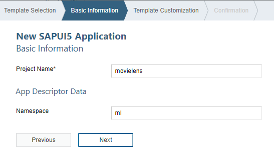

Enter the following information, then click on **Finish**

Field Name           | Value
-------------------- | --------------
View Type            | `XML`
View Name            | `demo`

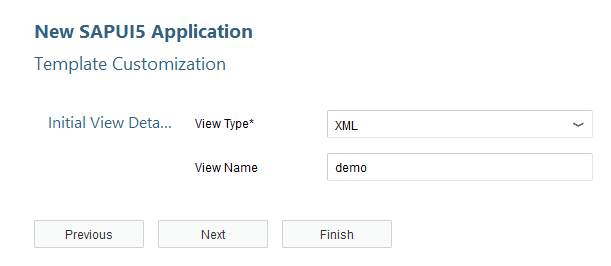

[DONE]
[ACCORDION-END]

[ACCORDION-BEGIN [Step 4: ](Add the destinations as your data source)]

Your project is created! Let's continue, and add the "destinations" previously created in the SAP Cloud Platform cockpit as our project "data source".

On left side tree, expand the **`movielens\webapp`** item, and right click on the `manifest.json` file, and select **Open with** \ **Descriptor Editor**.

You can also switch to the ***Descriptor Editor*** (using the tabs at the bottom of the screen).

Then select the ***Data sources*** tab at the top, and click on the  icon as highlighted on the screen:

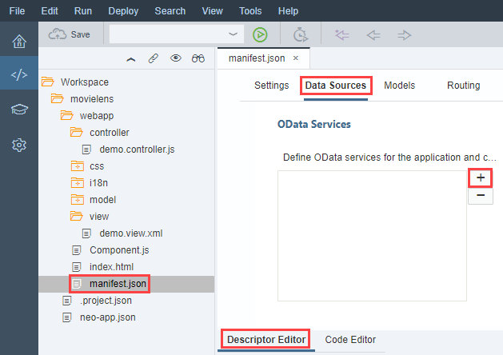

Select the **Service URL** item on the left side list, the pick your destination from the drop down.

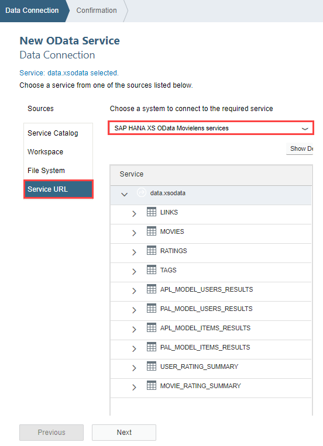

Click on **Next** to move to the next screen, then on **Finish**.

You should now have one entry in your ***OData Service*** list.

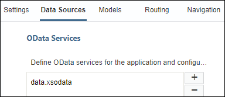

[DONE]
[ACCORDION-END]

[ACCORDION-BEGIN [Step 5: ](Add your data source as default model)]

Now, select ***Models*** and click on the  icon.

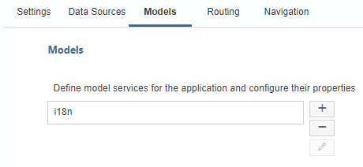

Select ***Select data source*** radio, then pick ***`data.xsodata`***, check the ***Set as default model for the application***.

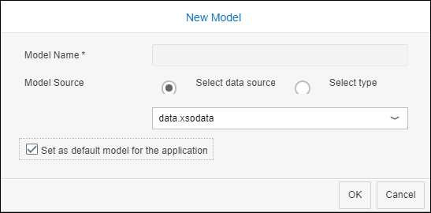

Then click on ***OK***.

Now, let's update the model setting by setting **Preload** to **false** and **Binding Mode** to **`TwoWay`** as displayed on the screenshot.

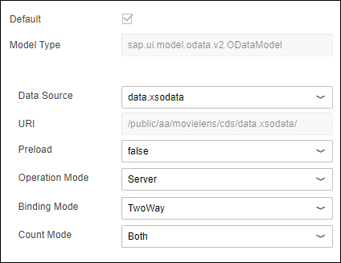

Click on the  button (or press CTRL+S). This should save the `manifest.json` file.

Provide an answer to the question below then click on **Validate**.

[VALIDATE_1]
[ACCORDION-END]

[ACCORDION-BEGIN [Step 6: ](Update the default view: demo.view.xml)]

The default view created is located in `webapp/view/demo.view.xml`. We will update the view to prepare for the next steps.

Open the `webapp/view/demo.view.xml` file and replace the existing code with the following code:

```xml
<mvc:View controllerName="mlmovielens.controller.demo" xmlns:html="http://www.w3.org/2000/xhtml" xmlns:mvc="sap.ui.core.mvc"
  displayBlock="true" xmlns="sap.m" xmlns:custom="http://schemas.sap.com/sapui5/extension/sap.ui.core.CustomData/1">
  <SplitApp id="SplitAppDemo" initialMaster="master" initialDetail="detail">
    <masterPages>
      <Page id="master" title="Scenario">
        <content>
          <List itemPress="onDetailListItemPress">
            <items>
              <StandardListItem title="Collaborative Filtering" type="Navigation" custom:to="detail_collaborative"/>
              <StandardListItem title="Content-based Filtering" type="Navigation" custom:to="detail_contentbased"/>
            </items>
          </List>
        </content>
      </Page>
    </masterPages>
    <detailPages>
      <Page id="detail" title="MovieLens Recommendation">
        <content></content>
      </Page>
      <Page id="detail_collaborative" title="Collaborative Filtering">
        <content>
          <!--<mvc:XMLView viewName="mlmovielens.view.collaborative"/>-->
        </content>
      </Page>
      <Page id="detail_contentbased" title="Content-based Filtering">
        <content>
          <!--<mvc:XMLView viewName="mlmovielens.view.contentbased"/>-->
        </content>
      </Page>
    </detailPages>
  </SplitApp>
</mvc:View>
```

Click on the  button (or press CTRL+S).

[DONE]
[ACCORDION-END]

[ACCORDION-BEGIN [Step 7: ](Update the default controller: demo.controller.js)]

The default controller is located in `webapp/controller/demo.controller.js`. We will update the view to prepare for the next steps.

Open the `webapp/controller/demo.controller.js` file and replace the existing code with the following code:

```js
sap.ui.define([
  "sap/ui/core/mvc/Controller",
  "sap/m/MessageToast"
], function(Controller, MessageToast) {
  "use strict";

  return Controller.extend("mlmovielens.controller.demo", {
    onInit: function() {
      if (typeof sap.ui.getCore().getModel() === 'undefined') {
        sap.ui.getCore().setModel(new sap.ui.model.json.JSONModel());
      }
    },
    getSplitAppObj: function() {
      var result = sap.ui.getCore().byId(this.createId("SplitAppDemo"));
      if (!result) {
        MessageToast.show("SplitApp object can't be found", {
          duration: 5000
        });
      }
      return result;
    },
    onDetailListItemPress: function(oEvent) {
      var sToPageId = oEvent.getParameter("listItem").getCustomData()[0].getValue();
      this.getSplitAppObj().toDetail(this.createId(sToPageId));
    }
  });
});
```

Click on the  button (or press CTRL+S)

[DONE]
[ACCORDION-END]

[ACCORDION-BEGIN [Step 7: ](Run the application)]

From the menu bar, select **Run** > **Run As** > **Web Application**  or use the  **Run** button.

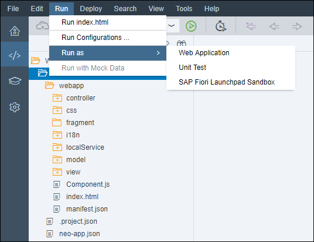

This will open a web page with the following content:

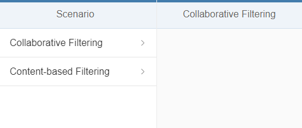

[DONE]
[ACCORDION-END]

[ACCORDION-BEGIN [Solution: ](Created and modified files)]

In case you are having problems when running the application, please find bellow the created and modified files:

  - <a href="https://raw.githubusercontent.com/SAPDocuments/Tutorials/master/tutorials/cp-hana-aa-movielens-06/movielens/webapp/manifest.json" target="new">`manifest.json`</a>
  - <a href="https://raw.githubusercontent.com/SAPDocuments/Tutorials/master/tutorials/cp-hana-aa-movielens-06/movielens/webapp/controller/demo.controller.js" target="new">`webapp/controller/demo.controller.js`</a>
  - <a href="https://raw.githubusercontent.com/SAPDocuments/Tutorials/master/tutorials/cp-hana-aa-movielens-06/movielens/webapp/view/demo.view.xml" target="new">`webapp/view/demo.view.xml`</a>

The complete project can be found on SAP Tutorial public <a href="https://github.com/SAPDocuments/Tutorials/tree/master/tutorials/cp-hana-aa-movielens-06/movielens" target="new">GitHub repository</a>.

However, you won't be able to clone the repository and directly run the code from the current directory structure. You have to copy the `movielens` directory content into your existing project directory.

Make sure you check the <a href="https://github.com/SAPDocuments/Tutorials/blob/master/LICENSE.txt" target="new">LICENSE</a> before starting using its content.

[DONE]
[ACCORDION-END]
