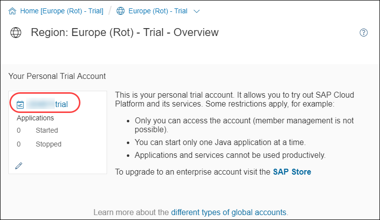
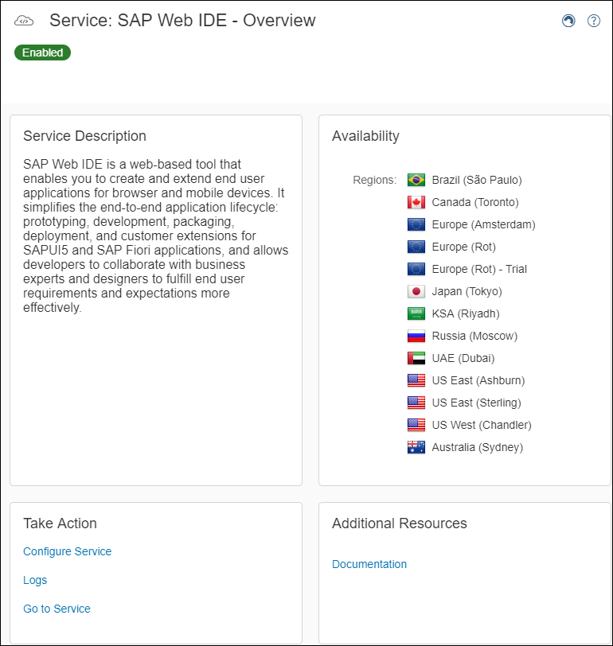
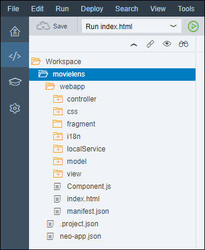
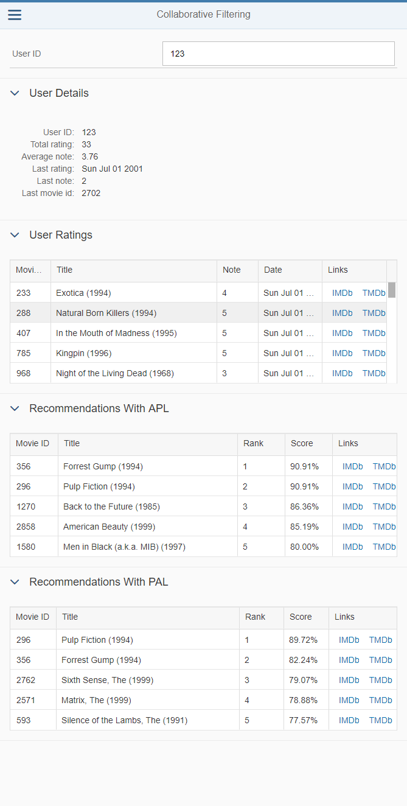

## Prerequisites
 - **Proficiency:** Beginner

## Details
### You will learn

-  How to add a SAPUI5 controller and interact with the SAP HANA XS OData service
-  How to add a SAPUI5 view and interact with the SAP HANA XS OData service

&nbsp;

### Time to Complete
**10 Min**

[ACCORDION-BEGIN [Step 1: ](Open SAP Web IDE)]

Log into the <a href="https://account.hanatrial.ondemand.com/cockpit#/region/neo-eu1-trial/overview" target="new"><b>SAP Cloud Platform Cockpit</b></a> with your free trial account on **Europe (Rot) - Trial** and access "Your Personal Developer Account".

Click on your ***SAP Cloud Platform Account Name*** as highlighted on the below screenshot.



On the left side bar, you can navigate in **Services**, then using the search box enter `Web IDE`.


Click on the tile, then click on **Open SAP Web IDE**.



This will open the ***SAP Web IDE*** where you have previously created your application using the project template.



[DONE]
[ACCORDION-END]

[ACCORDION-BEGIN [Step 2: ](Create a new controller)]

Create a new file **`collaborative.controller.js`** in `webapp/controller` either using the "File" menu or using the right click menu.

Open the `webapp/controller/collaborative.controller.js` file and add the following code:

```js
sap.ui.define([
  "sap/ui/core/mvc/Controller",
  "sap/m/MessageToast",
  'sap/ui/model/Filter',
  'sap/ui/model/FilterOperator'
], function(Controller, MessageToast, Filter, FilterOperator) {
  "use strict";

  return Controller.extend("mlmovielens.controller.collaborative", {
    onInit: function() {
      if (typeof sap.ui.getCore().getModel() === 'undefined') {
        sap.ui.getCore().setModel(new sap.ui.model.json.JSONModel());
      }
      this.getView().setModel(new sap.ui.model.json.JSONModel(), "item");
    },
    onAfterRendering: function() {
      this.selectItem("");
    },
    formatEpoch: function(value) {
      if (value !== 'undefined' && this.isNumeric(value)) {
        return new Date(value * 1000).toDateString();
      } else {
        return "";
      }
    },
    formatNumber: function(value) {
      if (value !== 'undefined' && this.isNumeric(value)) {
        return Number(value).toFixed(2);
      } else {
        return "";
      }
    },
    formatPercent: function(value) {
      if (value !== 'undefined' && this.isNumeric(value)) {
        return Number(value * 100).toFixed(2) + "%";
      } else {
        return "";
      }
    },
    isNumeric: function(oValue) {
      var tmp = oValue && oValue.toString();
      return !jQuery.isArray(oValue) && (tmp - parseFloat(tmp) + 1) >= 0;
    },
    selectItem: function(value) {
      var oItemModel = this.getView().getModel("item");
      var tableFilters = [];

      // only allow numeric direct input
      if (this.isNumeric(value)) {
        // get the current model
        var oModel = this.getView().getModel();
        var item = oModel.getProperty("/SUMMARY_RATING_USER(" + value + ")", this, true);
        if (item !== 'undefined') {
          tableFilters = [
            new Filter([
              new Filter("USERID", FilterOperator.EQ, item.USERID)
            ], false)
          ];

          oItemModel.setProperty("/selectedItemId", item.USERID);
          oItemModel.setProperty("/item", item);
        }
      } else {
        tableFilters = [
          new Filter([
            new Filter("USERID", FilterOperator.EQ, -1)
          ], false)
        ];
      }
      this.getView().byId("history").getBinding("rows").filter(tableFilters);
      this.getView().byId("recommendation_apl").getBinding("rows").filter(tableFilters);
      this.getView().byId("recommendation_pal").getBinding("rows").filter(tableFilters);
    },
    onSubmit: function(oEvent) {
      var key = oEvent.getParameter("value");
      this.selectItem(key);
    },
    onSuggestionItemSelected: function(oEvent) {
      if (oEvent.getParameter("selectedItem") !== null) {
        var key = oEvent.getParameter("selectedItem").getKey();
        this.selectItem(key);
      }
    },
    onSuggest: function(oEvent) {
      var value = oEvent.getSource().getValue();
      var suggestionFilters = [];
      if (value) {
        // don't search numeric field if the input is not numerci
        if (!this.isNumeric(value)) {
          suggestionFilters = [
            new Filter([
              new Filter("tolower(DESCRIPTION)", FilterOperator.Contains, "'" + value.toLowerCase() + "'"),
            ], false)
          ];
        } else {
          suggestionFilters = [
            new Filter([
              new Filter("tolower(DESCRIPTION)", FilterOperator.Contains, "'" + value.toLowerCase() + "'"),
              new Filter("USERID", FilterOperator.EQ, value),
              new Filter("RATING_COUNT", FilterOperator.EQ, value)
            ], false)
          ];
        }
      }
      this.getView().byId("input").getBinding("suggestionItems").filter(suggestionFilters);
    }
  });
});
```

A few details about the controller:

- to provide the number and date values in a nicer format, there are a few format functions
- as we use an OData model, we can play with model filters to simplify our implementation with the input suggestion or the display tables that will be added in the view

Click on the  button (or press CTRL+S)

[DONE]
[ACCORDION-END]

[ACCORDION-BEGIN [Step 3: ](Create a new view)]

Create a new file **`collaborative.view.xml`** in `webapp/view` either using the "File" menu or using the right click menu.

Open the `webapp/view/collaborative.view.xml` file and add the following code:

```xml
<mvc:View xmlns:html="http://www.w3.org/2000/xhtml" xmlns:mvc="sap.ui.core.mvc" xmlns="sap.m" xmlns:form="sap.ui.layout.form"
  xmlns:table="sap.ui.table" xmlns:core="sap.ui.core" controllerName="mlmovielens.controller.collaborative">
  <Panel expandable="false">
    <Toolbar>
      <ToolbarSpacer/>
      <Label text="User ID" labelFor="input" width="50%"/>
      <Input id="input" showSuggestion="true" suggest="onSuggest" submit="onSubmit" suggestionItemSelected="onSuggestionItemSelected" width="80%"
        suggestionItems="{ path: '/SUMMARY_RATING_USER'}" placeholder="Enter a user identifier or a rating count...">
        <suggestionItems>
          <core:ListItem key="{USERID}" text="{USERID}" additionalText="Rating count : {RATING_COUNT}"/>
        </suggestionItems>
      </Input>
      <ToolbarSpacer/>
    </Toolbar>
  </Panel>
  <Panel headerText="User Details" expandable="true" expanded="true">
    <form:Form editable="false" class="isReadonly">
      <form:layout>
        <form:ResponsiveGridLayout columnsL="1" columnsM="1"/>
      </form:layout>
      <form:formContainers>
        <form:FormContainer>
          <form:formElements>
            <form:FormElement label="User ID">
              <form:fields>
                <Text text="{item>/item/USERID}"/>
              </form:fields>
            </form:FormElement>
            <form:FormElement label="Total rating">
              <form:fields>
                <Text text="{item>/item/RATING_COUNT}"/>
              </form:fields>
            </form:FormElement>
            <form:FormElement label="Average note">
              <form:fields>
                <Text text="{path : 'item>/item/RATING_AVG', formatter : '.formatNumber'}"/>
              </form:fields>
            </form:FormElement>
            <form:FormElement label="Last rating">
              <form:fields>
                <Text text="{path : 'item>/item/LAST_RATING_DATE', formatter : '.formatEpoch'}"/>
              </form:fields>
            </form:FormElement>
            <form:FormElement label="Last note">
              <form:fields>
                <Text text="{item>/item/LAST_RATING}"/>
              </form:fields>
            </form:FormElement>
            <form:FormElement label="Last movie id">
              <form:fields>
                <Text text="{item>/item/LAST_MOVIEID}"/>
              </form:fields>
            </form:FormElement>
          </form:formElements>
        </form:FormContainer>
      </form:formContainers>
    </form:Form>
  </Panel>
  <Panel headerText="User Ratings" expandable="true" expanded="true">
    <table:Table selectionMode="None" visibleRowCount="5" enableBusyIndicator="true" refresh="true" id="history"
      rows="{ path: '/SUMMARY_RATING_DETAILS'}">
      <table:columns>
        <table:Column sortProperty="MOVIEID" width="10%">
          <Label text="Movie ID"/>
          <table:template>
            <Text text="{MOVIEID}"/>
          </table:template>
        </table:Column>
        <table:Column sortProperty="TITLE">
          <Label text="Title"/>
          <table:template>
            <Text text="{TITLE}"/>
          </table:template>
        </table:Column>
        <table:Column sortProperty="RATING" width="10%">
          <Label text="Note"/>
          <table:template>
            <Text text="{RATING}"/>
          </table:template>
        </table:Column>
        <table:Column sortProperty="TIMESTAMP" width="15%">
          <Label text="Date"/>
          <table:template>
            <Text text="{path : 'TIMESTAMP', formatter : '.formatEpoch'}"/>
          </table:template>
        </table:Column>
        <table:Column width="15%">
          <Label text="Links"/>
          <table:template>
            <HBox>
              <Link text="IMDb {IMDBID}" class="sapUiTinyMarginBeginEnd" target="_blank" href="http://www.imdb.com/title/tt{IMDBID}"/>
              <Link text="TMDb {TMDBID}" class="sapUiTinyMarginBeginEnd" target="_blank" href="https://www.themoviedb.org/movie/{TMDBID}"/>
            </HBox>
          </table:template>
        </table:Column>
      </table:columns>
    </table:Table>
  </Panel>
  <Panel headerText="Recommendations With APL" expandable="true" expanded="true">
    <table:Table selectionMode="None" visibleRowCount="5" enableBusyIndicator="true" refresh="true" id="recommendation_apl"
      rows="{ path: '/APL_RECO_MODEL_USERS_RESULTS'}">
      <table:columns>
        <table:Column sortProperty="MOVIEID" width="10%">
          <Label text="Movie ID"/>
          <table:template>
            <Text text="{MOVIEID}"/>
          </table:template>
        </table:Column>
        <table:Column sortProperty="TITLE">
          <Label text="Title"/>
          <table:template>
            <Text text="{TITLE}"/>
          </table:template>
        </table:Column>
        <table:Column sortProperty="RANK" width="10%">
          <Label text="Rank"/>
          <table:template>
            <Text text="{RANK}"/>
          </table:template>
        </table:Column>
        <table:Column sortProperty="SCORE" width="10%">
          <Label text="Score"/>
          <table:template>
            <Text text="{path : 'SCORE', formatter : '.formatPercent'}"/>
          </table:template>
        </table:Column>
        <table:Column width="15%">
          <Label text="Links"/>
          <table:template>
            <HBox>
              <Link text="IMDb" class="sapUiTinyMarginBeginEnd" target="_blank" href="http://www.imdb.com/title/tt{IMDBID}"/>
              <Link text="TMDb" class="sapUiTinyMarginBeginEnd" target="_blank" href="https://www.themoviedb.org/movie/{TMDBID}"/>
            </HBox>
          </table:template>
        </table:Column>
      </table:columns>
    </table:Table>
  </Panel>
  <Panel headerText="Recommendations With PAL" expandable="true" expanded="true">
    <table:Table selectionMode="None" visibleRowCount="5" enableBusyIndicator="true" refresh="true" id="recommendation_pal"
      rows="{ path: '/PAL_APRIORI_MODEL_USERS_RESULTS'}">
      <table:columns>
        <table:Column sortProperty="MOVIEID" width="10%">
          <Label text="Movie ID"/>
          <table:template>
            <Text text="{MOVIEID}"/>
          </table:template>
        </table:Column>
        <table:Column sortProperty="TITLE">
          <Label text="Title"/>
          <table:template>
            <Text text="{TITLE}"/>
          </table:template>
        </table:Column>
        <table:Column sortProperty="RANK" width="10%">
          <Label text="Rank"/>
          <table:template>
            <Text text="{RANK}"/>
          </table:template>
        </table:Column>
        <table:Column sortProperty="SCORE" width="10%">
          <Label text="Score"/>
          <table:template>
            <Text text="{path : 'SCORE', formatter : '.formatPercent'}"/>
          </table:template>
        </table:Column>
        <table:Column width="15%">
          <Label text="Links"/>
          <table:template>
            <HBox>
              <Link text="IMDb" class="sapUiTinyMarginBeginEnd" target="_blank" href="http://www.imdb.com/title/tt{IMDBID}"/>
              <Link text="TMDb" class="sapUiTinyMarginBeginEnd" target="_blank" href="https://www.themoviedb.org/movie/{TMDBID}"/>
            </HBox>
          </table:template>
        </table:Column>
      </table:columns>
    </table:Table>
  </Panel>
</mvc:View>
```

Click on the  button (or press CTRL+S)

The view will contain:

- a input field that will provide suggestion when the first characters are typed leveraging the OData services and its filtering capabilities
  - the search will look into the user identifier & the rating count
- a series of tables to display:
  - the user details including the rating count & the average note, plus some details about the last rating
  - the recommendations for the user based on the SAP HANA APL and PAL
- each movie will include a link to the ***`IMDb`*** (`IMDb`) and to ***The Movie DB*** (`TMDb`) sites

[DONE]
[ACCORDION-END]

[ACCORDION-BEGIN [Step 4: ](Extend the default view)]

Now let's enable the new view.

Edit the `demo.view.xml` file located in the `webapp/view`.

Inside the `<detailPages>` element, remove the XML comment tag for the view by replacing this:

```xml
<!--<mvc:XMLView viewName="mlmovielens.view.collaborative"/>-->
```
by this:

```xml
<mvc:XMLView viewName="mlmovielens.view.collaborative"/>
```

Click on the  button (or press CTRL+S)

[DONE]
[ACCORDION-END]

[ACCORDION-BEGIN [Step 5: ](Run the application)]

Then, click on the **Run** icon  or press `ALT+F5`.

On the left panel, you should see an item labeled ***Collaborative Filtering***, click on it. Then enter ***123*** in the ***User ID*** field.

A drop down should appear with the list of element containing ***123***.

Select the one that displays ***123 Rating count: 33***.

The user details and list of previous rating should appear along with the recommendations from both algorithm.

Et voilà!



Provide an answer to the question below then click on **Validate**.

[VALIDATE_1]
[ACCORDION-END]

[ACCORDION-BEGIN [Solution: ](Created and modified files)]

In case you are having problems when running the application, please find bellow the created and modified files:

  - <a href="https://raw.githubusercontent.com/SAPDocuments/Tutorials/master/tutorials/cp-hana-aa-movielens-07/movielens/webapp/controller/collaborative.controller.js" target="new">`webapp/controller/collaborative.controller.js`</a>
  - <a href="https://raw.githubusercontent.com/SAPDocuments/Tutorials/master/tutorials/cp-hana-aa-movielens-07/movielens/webapp/view/collaborative.view.xml" target="new">`webapp/view/collaborative.view.xml`</a>
  - <a href="https://raw.githubusercontent.com/SAPDocuments/Tutorials/master/tutorials/cp-hana-aa-movielens-07/movielens/webapp/view/demo.view.xml" target="new">`webapp/view/demo.view.xml`</a>

The complete project can be found on the SAP Tutorial public <a href="https://github.com/SAPDocuments/Tutorials/tree/master/tutorials/cp-hana-aa-movielens-07/movielens" target="new">GitHub repository</a>.

However, you won't be able to clone the repository and directly run the code from the current directory structure. You have to copy the `movielens` directory content into your existing project directory.

Make sure you check the <a href="https://github.com/SAPDocuments/Tutorials/blob/master/LICENSE.txt" target="new">LICENSE</a> before starting using its content.

[DONE]
[ACCORDION-END]
