## Prerequisites
 - [Get a Free Trial Account on SAP Cloud Platform](hcp-create-trial-account)

## Details
### You will learn
  - How to establish trust between your SAP Cloud Platform Neo subaccount and the SAP Identity Authentication service
  - How to configure users for single sign-on usage

---

[ACCORDION-BEGIN [Step 1: ](Log onto SAP Cloud Platform)]

Go to [SAP Cloud Platform](https://cockpit.hanatrial.ondemand.com/cockpit/#/home/trial) and **log in** with your credentials.

>If you don't have an account yet, sign up for an [SAP Cloud Platform Trial account](hcp-create-trial-account).

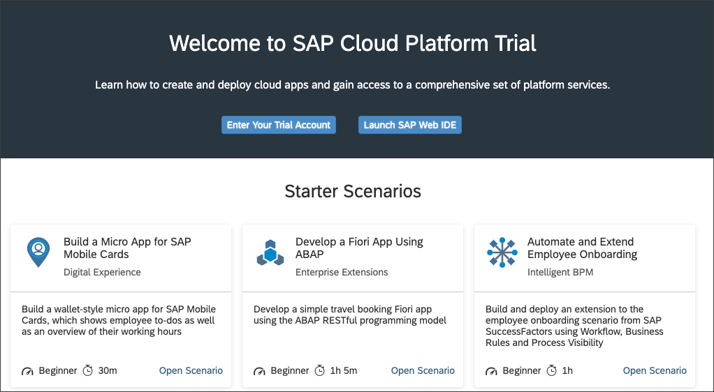

[DONE]
[ACCORDION-END]

[ACCORDION-BEGIN [Step 2: ](Navigate to SAP Cloud Platform Neo subaccount)]

**Scroll down** to the bottom of the page and **Click** on **Access Neo Trial**.

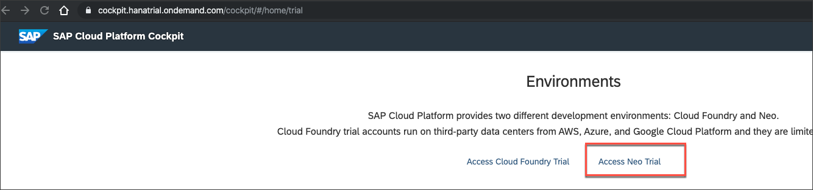

[DONE]
[ACCORDION-END]

[ACCORDION-BEGIN [Step 3: ](Change local service provider to Custom)]

**Expand** the **Security** menu item and navigate to **Trust**.

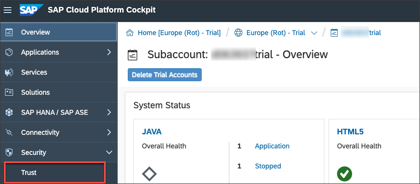

Switch the **Local Service Provider** from Default to **Custom**. Some more input fields are appearing.

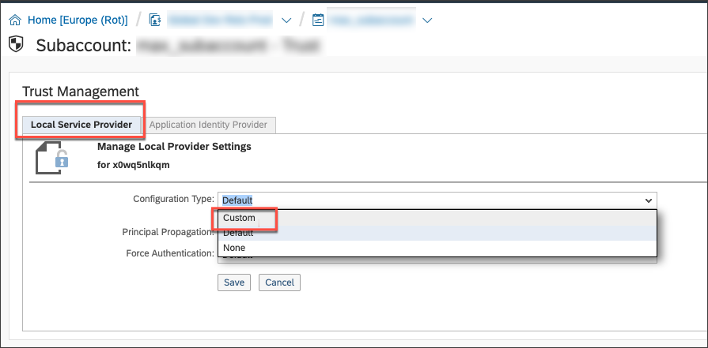

Press the **Generate Key Pair** button to fill the `Signing Key` and `Signing Certificate` fields. Change the **Principal Propagation** to **Enabled** and **Save**.

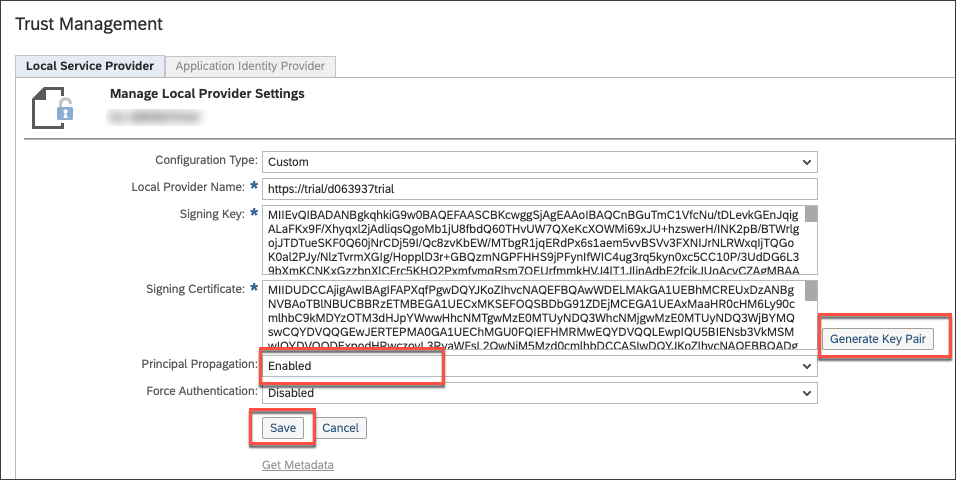

[VALIDATE_1]
[ACCORDION-END]

[ACCORDION-BEGIN [Step 4: ](Add trusted identity provider)]

Click the **Application Identity Provider** tab. Add a new **Trusted Identity Provider** through the according link.

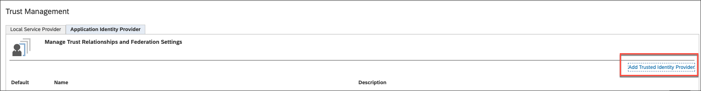

[DONE]
[ACCORDION-END]

[ACCORDION-BEGIN [Step 5: ](Upload metadata file from SAP Cloud Platform Identity Authentication service)]

Upload the SAML metadata file you have download in the previous Tutorial. If you don't have it anymore, you can download it in the **Tenant Settings > SAML 2.0** section in the SAP Cloud Platform Identity Authentication Service.

> Note: You can also download the SAML 2.0 metadata through accessing the following URL. https://[TENANT_ID].accounts.ondemand.com/saml2/metadata Tenant ID is an automatically generated ID by the system. The first administrator created for the tenant receives an activation e-mail with a URL in it. This URL contains the tenant ID. For more information have a look at the [Product Page](https://www.sap.com/products/cloud-platform/capabilities/foundation.identity-authentication.html#identity-authentication)

Click **Browse** and select the metadata file.

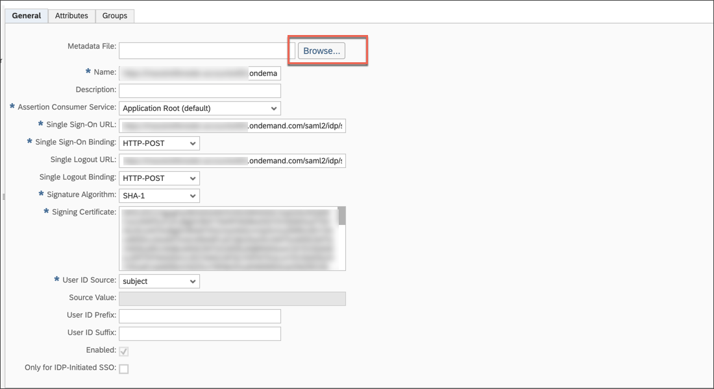

All other information from the file should be taken into the shown form. No further manual actions necessary.

Click **Save** to continue.

[DONE]
[ACCORDION-END]

[ACCORDION-BEGIN [Step 6: ](Download SAP Cloud Platform subaccount SAML metadata)]

Go back to the **Local Service Provider** tab and download the metadata of your SAP Cloud Platform subaccount. **Click** on **Get Metadata** to do so.

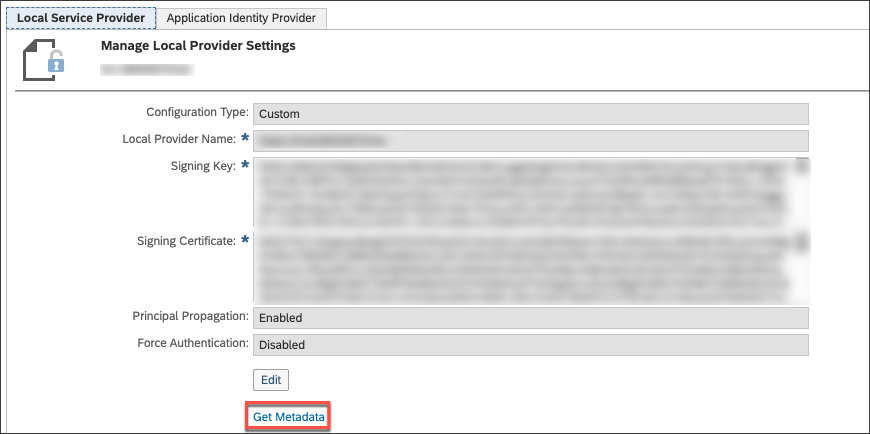

[DONE]
[ACCORDION-END]

[ACCORDION-BEGIN [Step 7: ](Create application in SAP Cloud Platform Identity Authentication service)]

Log in to the administration console of SAP Cloud Platform Identity Authentication service through your particular URL.

The URL therefore is: **`https://[TENANT_ID].accounts.ondemand.com/admin`**

Navigate to the menu item **Applications**, **Click** on **Add** provide a name for the application.

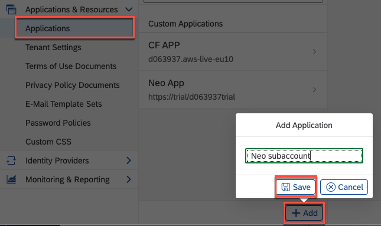

**Save** to continue.

[DONE]
[ACCORDION-END]

[ACCORDION-BEGIN [Step 8: ](Upload SAP Cloud Platform subaccount SAML metadata)]

Navigate to **SAML 2.0 Configuration** and **Click** on the menu item.

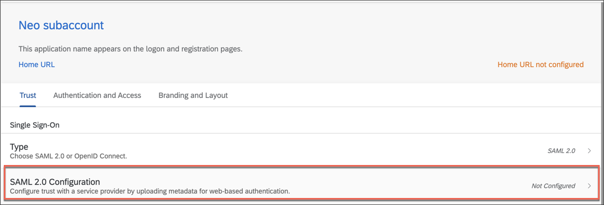

Choose the recently downloaded SAP Cloud Platform SAML metadata file from your local file system.

> You have downloaded the according file in Step 6, `Download SAP Cloud Platform subaccount SAML metadata`.

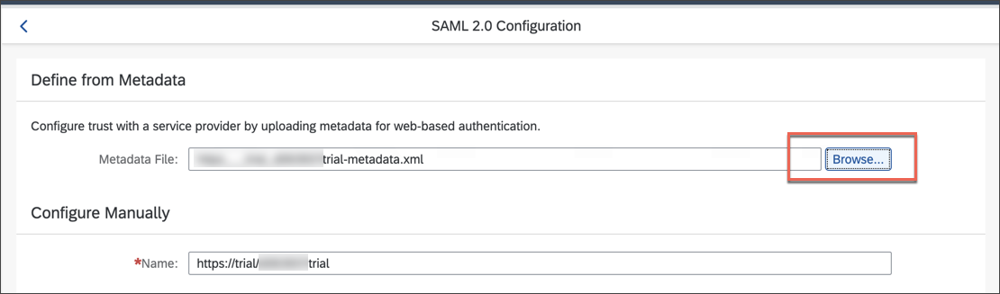

All fields below are automatically going to be filled due to the information provided through the uploaded file.

**Save** to continue.

[DONE]
[ACCORDION-END]

[ACCORDION-BEGIN [Step 9: ](Change subject name identifier)]

Although the configuration is already done and would work, change the unique identifier from User ID to the Email-Address so that you can enable Single-Sign On from SAP Cloud Platform to Azure Active Directory later on more easily.

**Click** on the menu item **Subject Name Identifier**.

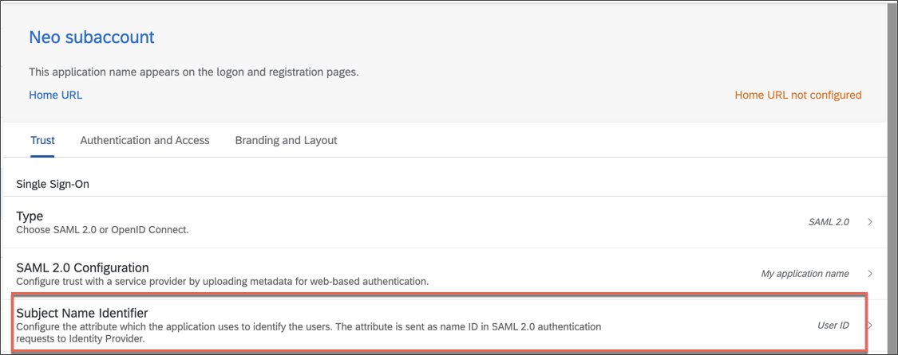

Change the basic attribute to **E-Mail**. This attribute is used to match User IDs from Azure AD and SAP Cloud Platform.

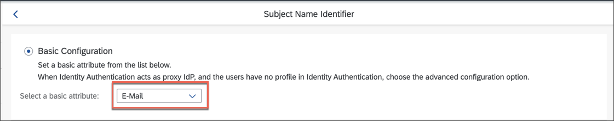

**Save** the configuration.

[DONE]
[ACCORDION-END]

[ACCORDION-BEGIN [Step 10: ](Create new test user)]

Now, users that have access to the Application in Azure Active Directory and to the application on the SAP Cloud Platform can seamlessly access the application with their Azure Active Directory credentials.

Therefore, we will create a new test user in Azure Active Directory and add it to the enterprise application in Azure Active Directory.

Go to the [Azure Portal](https://portal.azure.com) and search for **Azure Active Directory** and select the according result.

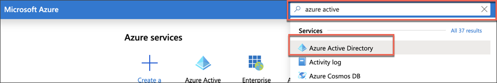

**Navigate** to the menu item **Users**.

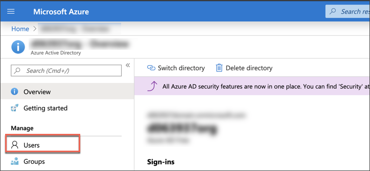

Click **New guest user**.

Choose **Invite user** and provide name and a mail address of the invited user - in this case any of your mail addresses.

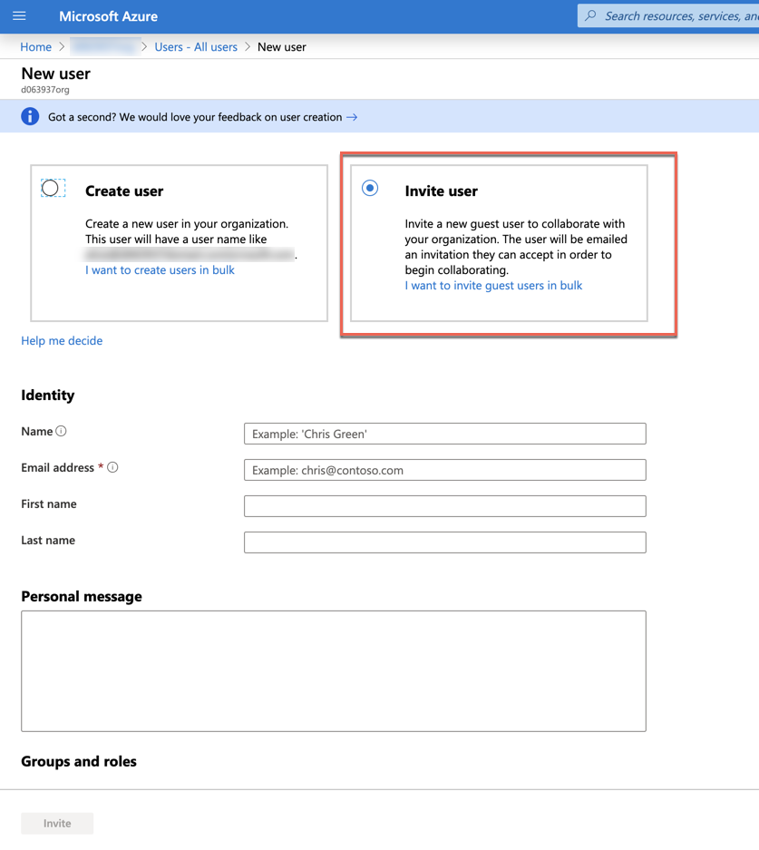

Press **Invite** at the bottom of the page to send out the invitation. The user will receive an invitation mail.

[DONE]
[ACCORDION-END]

[ACCORDION-BEGIN [Step 11: ](Assign user to the enterprise application )]

The user generally exists now in the Azure Active Directory without having access to the enterprise application. Thus, add it to the enterprise application as follows:

Go to your **enterprise applications** (either through the search bar on top of the page or through the menu bar) and select your application you have created for SAP Cloud Platform Identity Authentication Service.

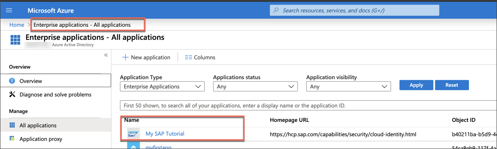

Select the tile **Assign users and groups**.

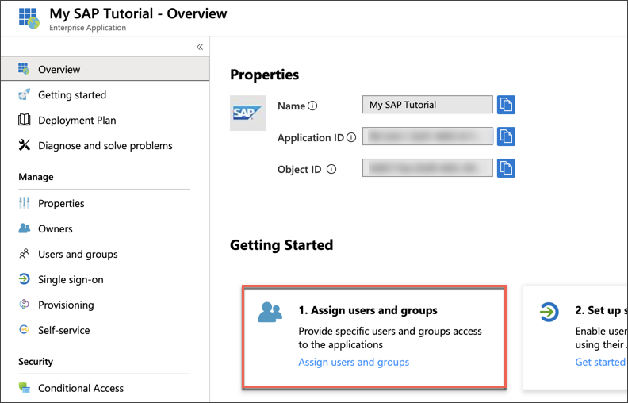

Click **Add user**.

Click **Users - None Selected** to search for available users. Either search for a user or directly select one from the result list below.

Click **Select** and afterwards on **Save** at the bottom of the page to continue.

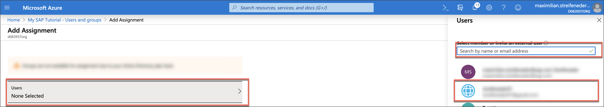

[DONE]
[ACCORDION-END]

[ACCORDION-BEGIN [Step 12: ](Access SAP Web IDE)]

To test the recent configurations, try to access the SAP Web IDE Full-Stack. Therefore, go to the [SAP Cloud Platform Trial cockpit](https://cockpit.hanatrial.ondemand.com/cockpit/#/home/trial) and **scroll down** to the bottom of the page and **click** on **Access Neo Trial**.

**Navigate** to the **Services** menu item and search for **SAP Web IDE Full-Stack**. Click the tile to go to the service.

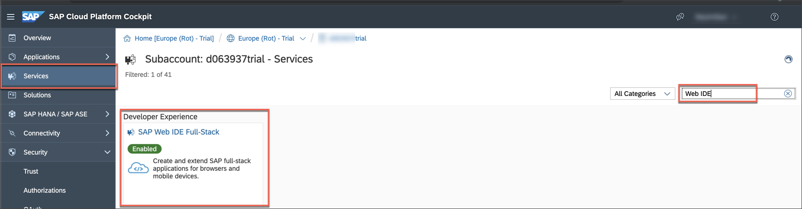

You are now on the overview page of the service. **Open** the service now in a new **Incognito Window**.

You'll be redirected to an Azure Active Directory authentication page, where you can **log in** with the recently created user in Azure Active Directory.

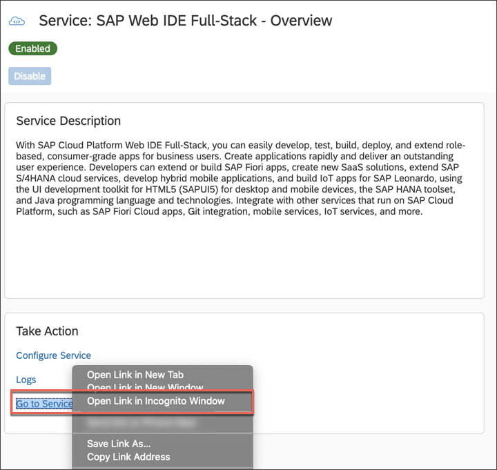

An error message will appear saying that you are not authorized to access SAP Web IDE Full-Stack.

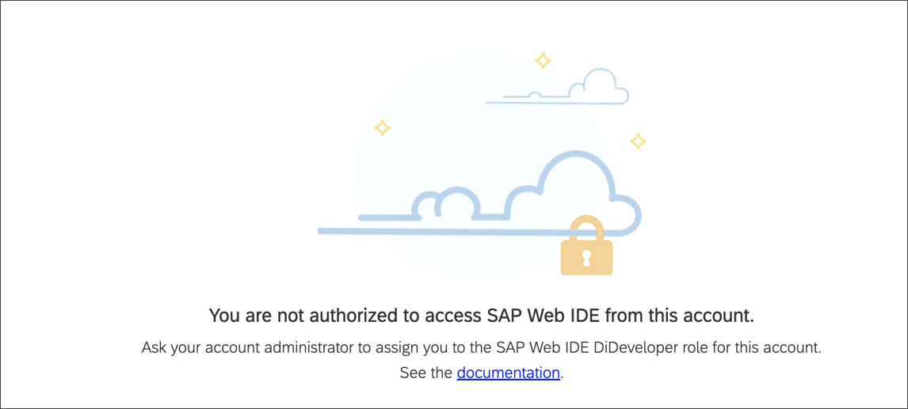

Why is that? The necessary role for SAP Web IDE Full-Stack is not yet assigned to this user.

[DONE]
[ACCORDION-END]

[ACCORDION-BEGIN [Step 13: ](Assign roles to user)]

Go back to the **overview page** of **SAP Web IDE Full-Stack**. Click **Configure Service**.

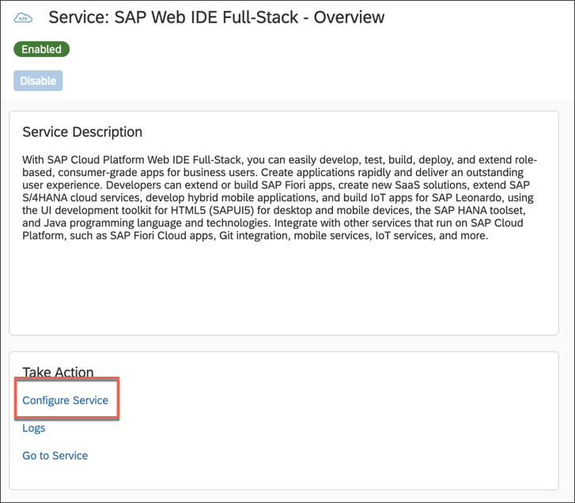.

Select the **`DiDeveloper`** Role and **Click** on **Assign** to an individual user. Enter the mail address of the user you have defined in Azure Active Directory and **Assign**.

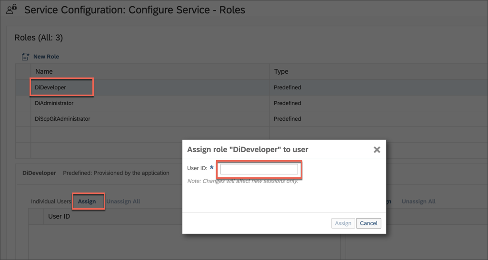.

[DONE]
[ACCORDION-END]

[ACCORDION-BEGIN [Step 13: ](Log into SAP Web IDE Full-Stack again)]

The assignment will only be taken into account in a new session. Therefore go back to the **overview page** of the service.

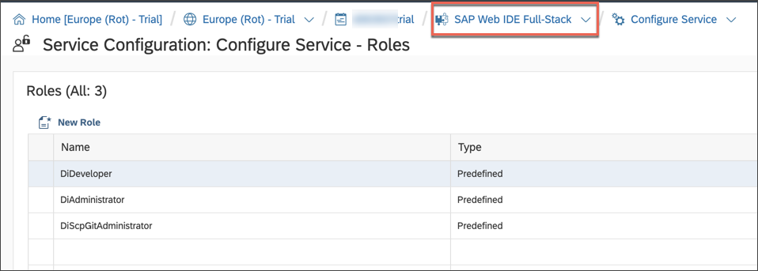.

**Open** the service now in a new **Incognito Window** and log in again.

You should now be forwarded to **SAP Web IDE Full-Stack**.

[DONE]
[ACCORDION-END]

Congratulations!

You have successfully connected Azure Active Directory with your SAP Cloud Platform Identity Authentication Service tenant. Furthermore, the SAP Cloud Platform Neo subaccount can now leverage all the capabilities of SAP Cloud Platform Identity Authentication service.

Good Job!

---
