## Prerequisites
 - [Identity Authentication service tenant](https://www.sapstore.com/solutions/40132/SAP-Cloud-Platform-Identity-Authentication)
 - [Sign Up for Microsoft Azure](https://azure.microsoft.com/en-us/resources/videos/sign-up-for-microsoft-azure/)

## Details
### You will learn
  - How to establish trust between your Identity Authentication service and Azure Active Directory

The Identity Authentication service offers end-to-end security including several authentication methods between your end users and applications. Leverage a variety of authentication methods including form-based/SAML, client certificate, username and password, and OAuth. In this tutorial we are initially setting up the connection between your Azure Active Directory and the Identity Authentication service in form of exchanging metadata.

Once the connection between your Azure Active Directory and the Identity Authentication service is done you can simply use it to connect it to several applications and environments.

To summarize the steps in this tutorial overall: You are going to exchange metadata (files) of Azure Active Directory and your Identity Authentication service to make them known to each other.

---

[ACCORDION-BEGIN [Step 1: ](Log into Azure Portal)]

Login to **Azure Portal** by going to [https://portal.azure.com](https://portal.azure.com) and provide your credentials.

Make sure you are using the right directory within the Azure subscription. The current directory is shown below your user name.

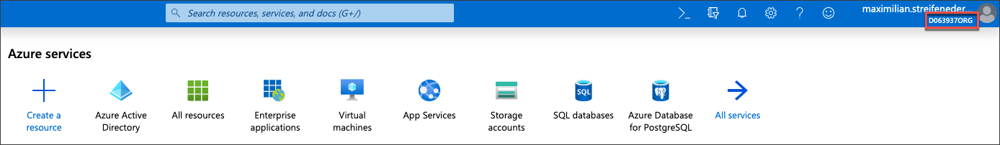

If it's not the one you want to use, **click on your profile** and choose **Switch Directory**.

Either set your **Default directory** by selecting an item in the Dropdown or choose the directory for this particular session by selecting one of the listed options. (see both variants on the screenshot below)

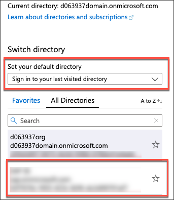

[DONE]
[ACCORDION-END]

[ACCORDION-BEGIN [Step 2: ](Create enterprise application in Azure Active Directory)]

**Search** for **Azure Active Directory** in the search bar on the top of the page and select the according entry in the shown results below.

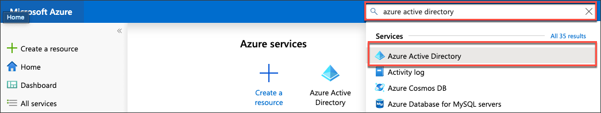

Click the menu item **Enterprise applications**.

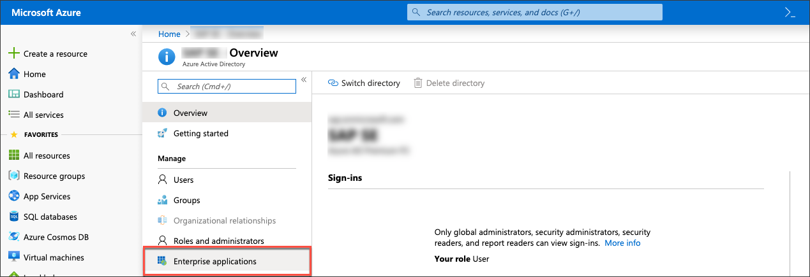

Click **New application**.

Azure Active Directory has templates for a variety of applications, one of them is the SAP Cloud Platform Identity Authentication Service. **Search** for this and select it.

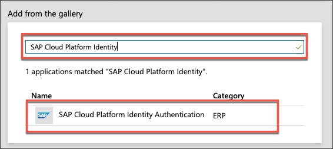

A new column on the right side will appear to give the application a name. Give the application a name and click **Add**.

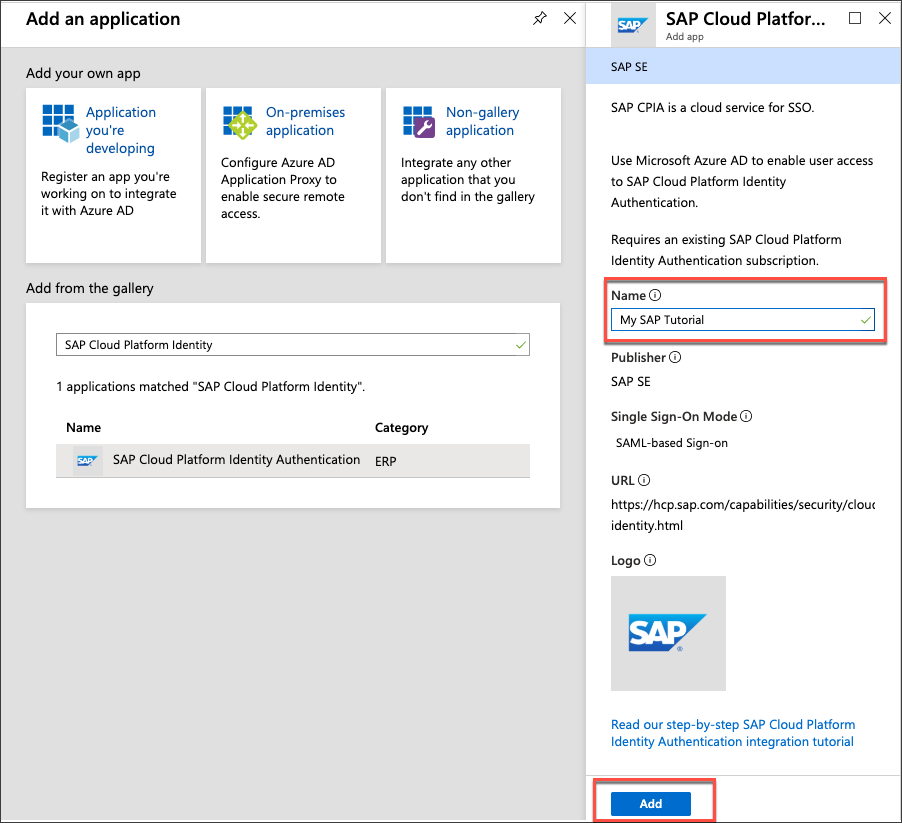

[VALIDATE_1]
[ACCORDION-END]

[ACCORDION-BEGIN [Step 3: ](Download single sign-on metadata from Azure Active Directory)]

Click the menu item **Single sign-on**.

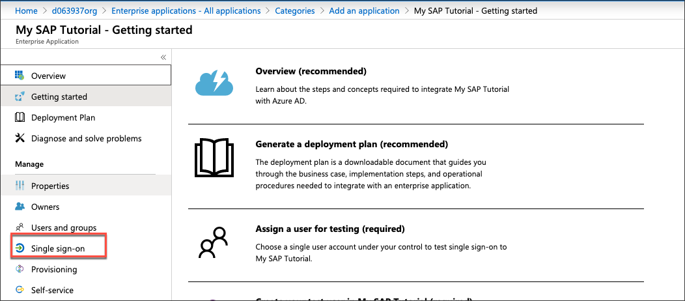

Choose **SAML** as the Single-Sign On method.

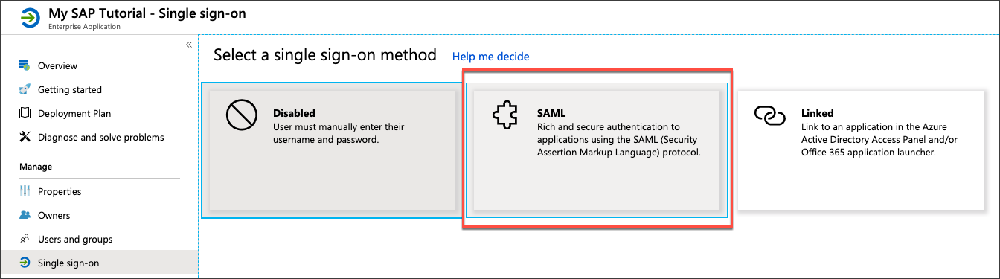

Download the federation metadata as shown below.

With this information we can setup the trust between Azure Active Directory and Identity Authentication service.

[DONE]
[ACCORDION-END]

[ACCORDION-BEGIN [Step 4: ](Log onto Identity Authentication service)]

Login to the administration console of Identity Authentication service through your particular URL.

The URL therefore is: **`https://[TENANT_ID].accounts.ondemand.com/admin`**

>Tenant ID is an automatically generated ID by the system. The first administrator created for the tenant receives an activation e-mail with a URL in it. This URL contains the tenant ID. For more information have a look at [SAP Cloud Identity Services - Identity Authentication](https://discovery-center.cloud.sap/serviceCatalog/identity-authentication) in the SAP Discovery Center.

[DONE]
[ACCORDION-END]

[ACCORDION-BEGIN [Step 5: ](Create corporate identity provider)]

Navigate to **Identity Providers** and click **Corporate Identity Providers**.

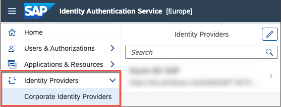

Click **Add** at the bottom of the page and define a name for the Identity Provider. Click **Save** to finally create the Identity Provider.

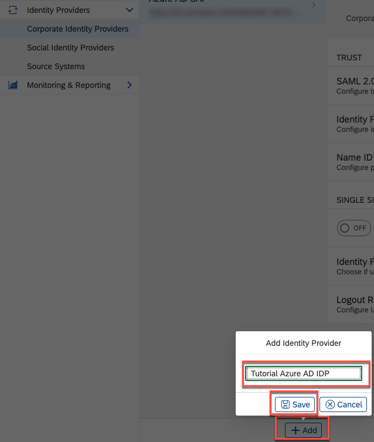

[DONE]
[ACCORDION-END]

[ACCORDION-BEGIN [Step 6: ](Upload Azure Active Directory federation metadata file)]

Click **SAML 2.0 Configuration** and to upload the recently downloaded federation metadata from Azure Active Directory.

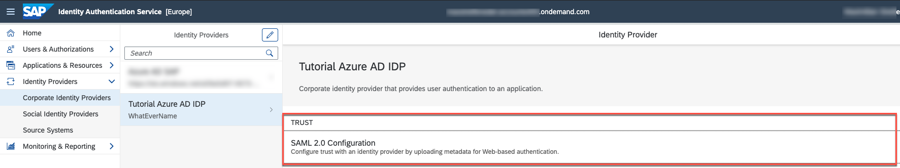

Choose the file from your local file system.

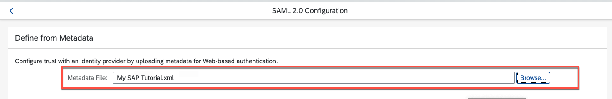

All fields below are automatically going to be filled due to the information provided through the uploaded file.

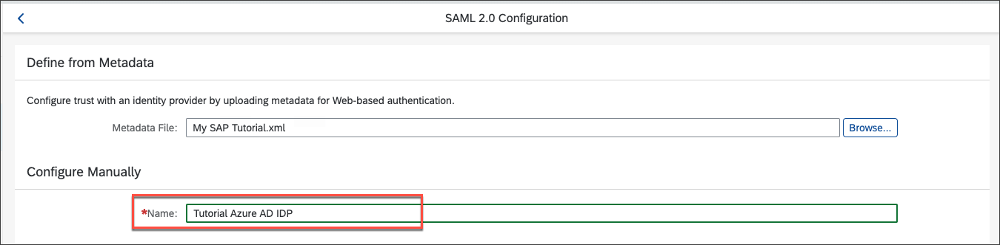

Click **Save** at the bottom of the page.

[DONE]
[ACCORDION-END]

[ACCORDION-BEGIN [Step 7: ](Change identity provider type)]

**Click** on **Identity Provider Type**.

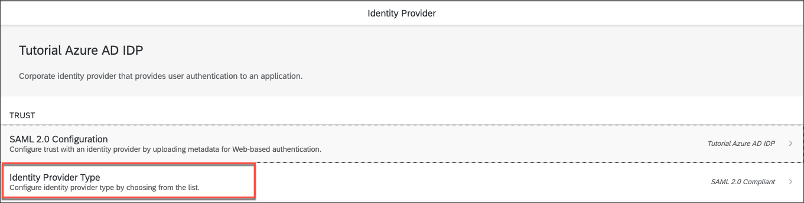

Change the selection to **Microsoft ADFS / Azure AD**. Save the the configuration through clicking the **Save** button at the bottom of the page.

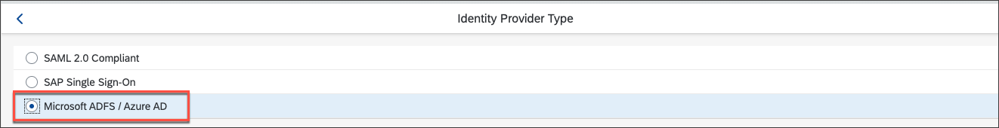

[DONE]
[ACCORDION-END]

[ACCORDION-BEGIN [Step 8: ](Download Identity Authentication service tenant metadata)]

Go to the **Tenant Settings** in SAP Cloud Platform Identity Authentication Service and navigate to the **SAML 2.0 Configuration**.

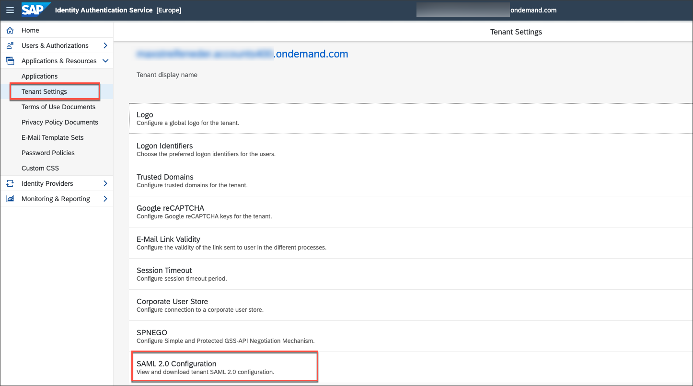

**Scroll down** to the bottom of the page and **Download** the metadata file.

[DONE]
[ACCORDION-END]

[ACCORDION-BEGIN [Step 9: ](Upload Identity Authentication service tenant metadata to Azure Active Directory)]

You have already uploaded the metadata file from Azure Active Directory to Identity Authentication service. It's time to do it the other way round now and upload the metadata of Identity Authentication service to Azure Active Directory.

Go back to the [https://portal.azure.com](https://portal.azure.com) and search for **Enterprise application** in the search bar on top of the page. Select the according result.

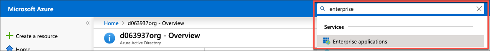

Select the application you created previously in this tutorial.

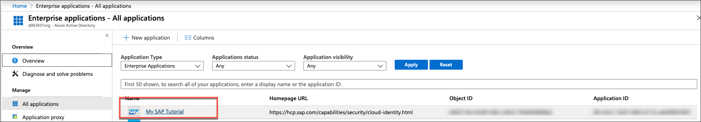

Go to **Single sign-on** and select **SAML** as Single-Sign On method. Click  **Upload metadata** to upload the metadata file from Identity Authentication service.

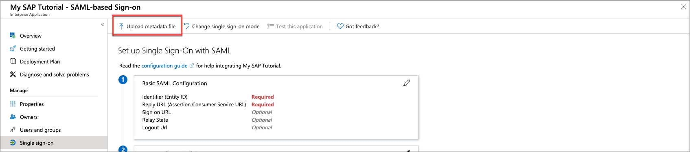

All the details are now taken from the metadata file. There's nothing to do for you other than saving the details. Therefore, click **Save**.

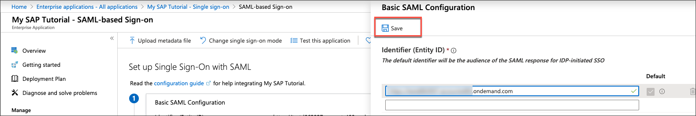

[DONE]
[ACCORDION-END]

---
