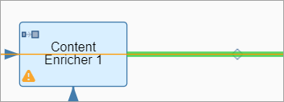
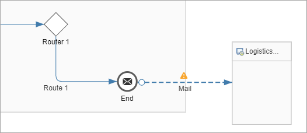
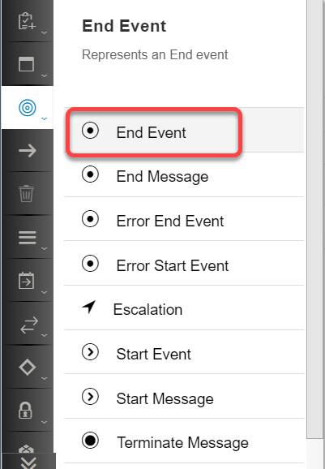
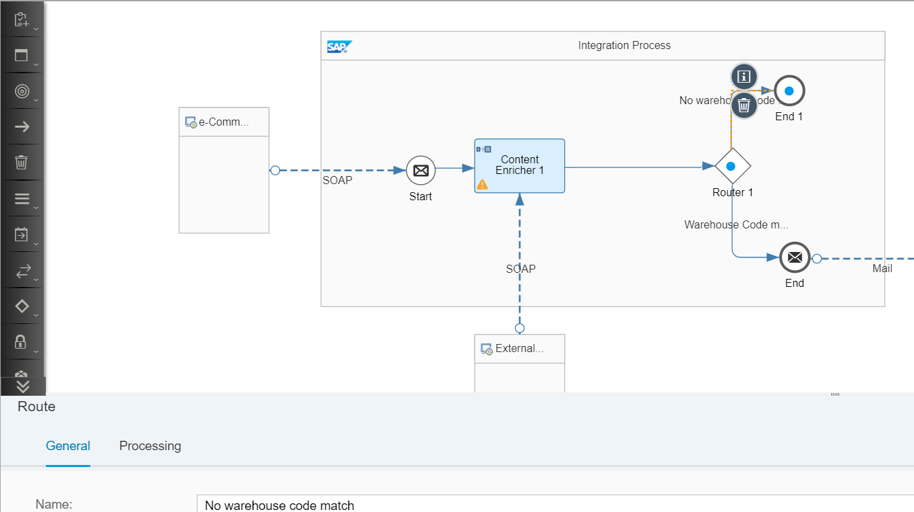
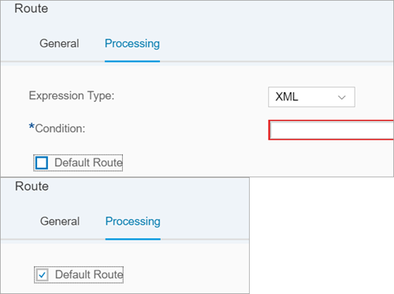
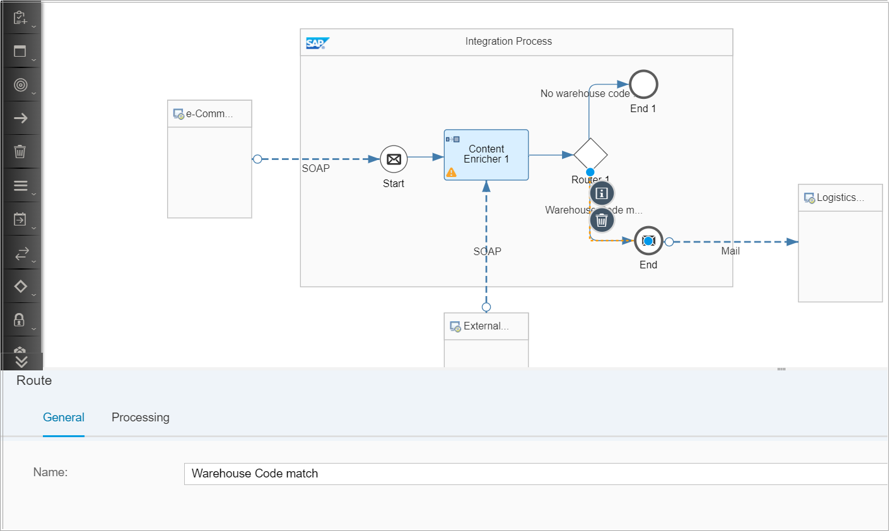
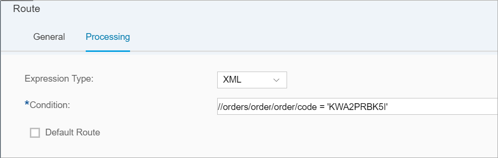
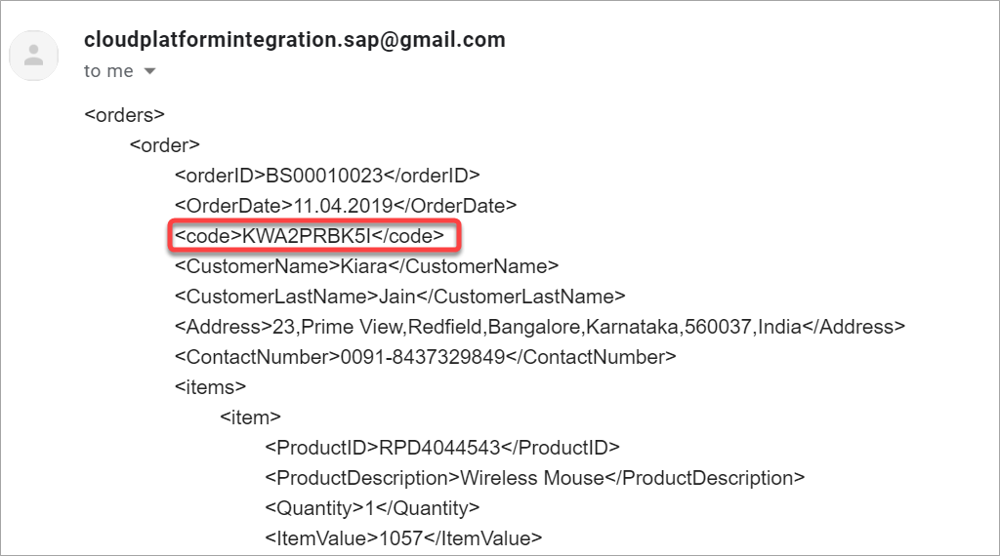

## Details
### You will learn
  - How to add conditional routing in an integration flow
  - How to define routing conditions
  - How to define routing conditions based on message content
  - How to configure multiple routes in your integration flow

Lets us check the value of the code retrieved in the previous exercise to define how the purchase order needs to be processed.

In this exercise, we terminate the processing in case we receive anything apart from KWA2PRBK5I.

---

[ACCORDION-BEGIN [Step 1: ](Add a router step)]

1. Click the design palette.

2. Choose **Message Routing**, and then choose **Router**.

    

3. Drag it onto the execution pipeline after the **Content Enricher** step.

    

4. Add the existing connectors as shown in the picture below:

    

[DONE]
[ACCORDION-END]

[ACCORDION-BEGIN [Step 2: ](Add additional end event)]

1. Click the design palette.

2. Choose **Events**, and then choose **End Event**.

    !

3. Drag it onto the execution pipeline next to the **Router** step.

      

[DONE]
[ACCORDION-END]

[ACCORDION-BEGIN [Step 3: ](Define the default route)]
1. Connect the router step to the newly added **End Event**.

2. Click the connector, and go to the properties sheet.

    On the **General** tab, rename the step to **No warehouse code match**.

    

3. Click the connector, and go to the properties sheet.

    On the **Processing** tab, choose **Default Route**.

    

[DONE]
[ACCORDION-END]

[ACCORDION-BEGIN [Step 4: ](Configure routing condition)]
1. Click the connector between the router and the End Message Event.

2. Click the connector, and go to the properties sheet.

    On the **General** tab, rename the step to **Warehouse code match**.

    

3. Click the connector, and go to the properties sheet.

    On the **Processing** tab, add the following:

    | Field     | Value     |
    | :------------- | :------------- |
    | Expression Type       | XML       |
    | Condition       | `//orders/order/order/code = 'KWA2PRBK5I'`       |

    

[DONE]
[ACCORDION-END]

[ACCORDION-BEGIN [Step 5: ](Execute the flow)]
1. Save, deploy and execute the flow with the existing input message.

2. Check the mail received. You should have received the following mail:

         

[DONE]
[ACCORDION-END]

[ACCORDION-BEGIN [Step 6: ](Change input message)]
Now change the input message by changing the value of the address field in the input message.

Change the address to __2025,M Street,Northwest,Washington DC,20036,USA__ in Postman and execute the flow again.

You should not receive any mail. This indicates that the processing took the default route because the warehouse code generated from the new address is not __KWA2PRBK5I__.

[DONE]
[ACCORDION-END]

[ACCORDION-BEGIN [Step 7: ](Test yourself)]

[VALIDATE_1]
[ACCORDION-END]

---
