## Details
### You will learn
  - How to add additional routes to the router
  - How to send messages to different receivers based on the value of the warehouse code
  - How to convert message formats based on the requirements of the different receivers
  - How to copy channel configuration from a configured channel to another

In this exercise, you will add one additional route for a different warehouse code (KWA2MNW2U). You will add receivers to each route and also additional processing to show how you can vary the processing to adjust the message as required by the receiver.

For the sake of simplicity, you shall continue to send mails to each of the different receivers but with different Subject.

> Each receiver could ideally have different modes of communication, like API call (via OData, HTTP, SOAP, etc.), file transfer, remote function call, IDOC, etc.

Finally, you shall convert the message to different formats like flat file and JSON for different receivers.

---

[ACCORDION-BEGIN [Step 1: ](Add additional routes to the router step)]
1. Add an End message event:

    * Click on the design Palette.
    * Choose __Events__.
    * Choose __End Message Event__.


    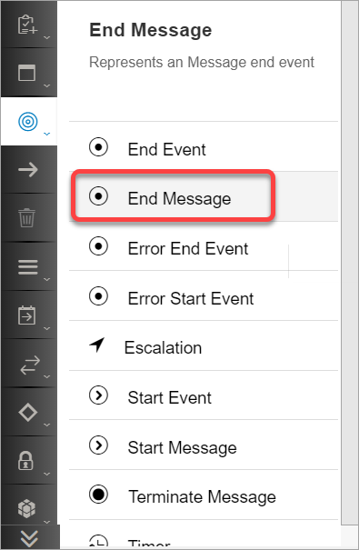

    * Drag it on to the execution pipeline next to the __Router__ step.

    * Connect the router to the __End Message Event__ just added.

    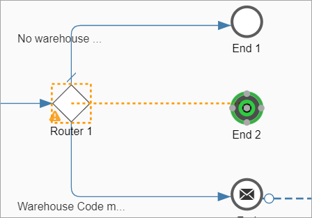

    * Click on the connector, go to the properties sheet, __General__ tab and rename the connector to __Warehouse 2 code match__.

    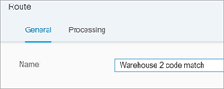

2. Add a receiver for this route:

    * Click on the design palette.
    * Choose __Participants__.
    * Choose __Receiver__.

    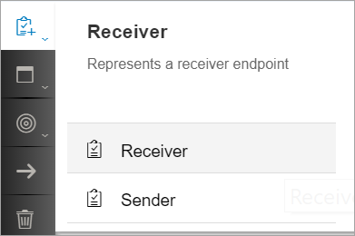

    * Drag the receiver on the canvas as shown below.

    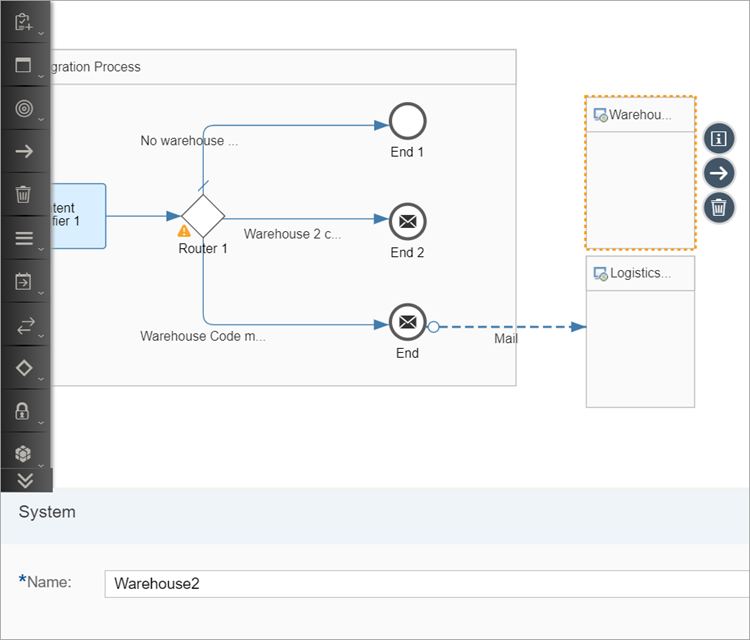

    * Rename the receiver __Warehouse2__.   

    * Connect the newly added End Message Event to the receiver created above and choose __Mail__.

    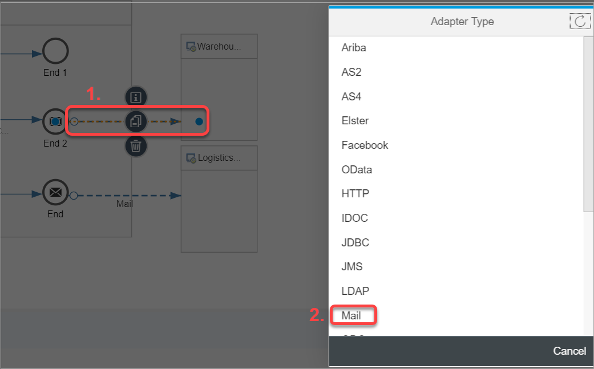

3. Copy the mail channel configuration:

    * Click on the mail channel created and configured in the previous exercise. Choose the speed button for __Copy Configuration__.

    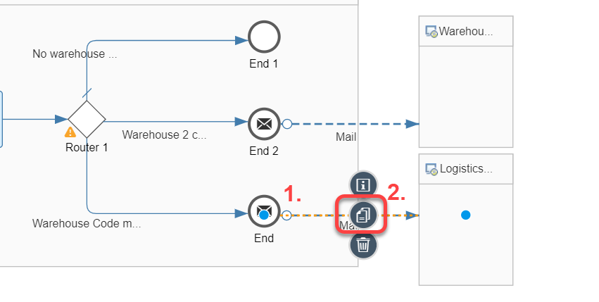

    * Now select the newly created mail channel and choose the speed button for __Paste Configuration__. Click __yes__ on the confirmation pop-up.

    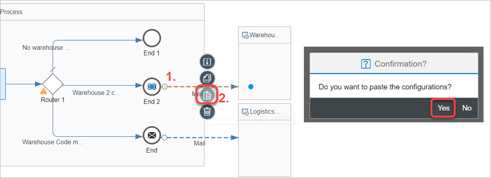    

4. Configure different mail Subject to differentiate between the mails from different routes.

    * Click on the first mail channel, go to the __Properties Sheet__, go to the __Connection__ tab and set the __Subject__ field to __Mail for route KWA2PRBK5I__.

      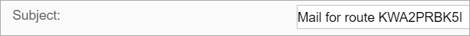  

    * Now choose the newly created mail channel and set its subject to __Mail for route KWA2MNW2U__.

      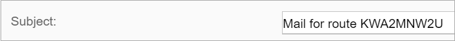  

 4. Configure the routing condition for the new warehouse code.

    * Click on the connector, go to the properties sheet, __Processing__ tab and add the following:

    | Field     | Value     |
    | :------------- | :------------- |
    | Expression Type       | XML       |
    | Condition       | ```//orders/order/order/code = 'KWA2MNW2U' ```      |

    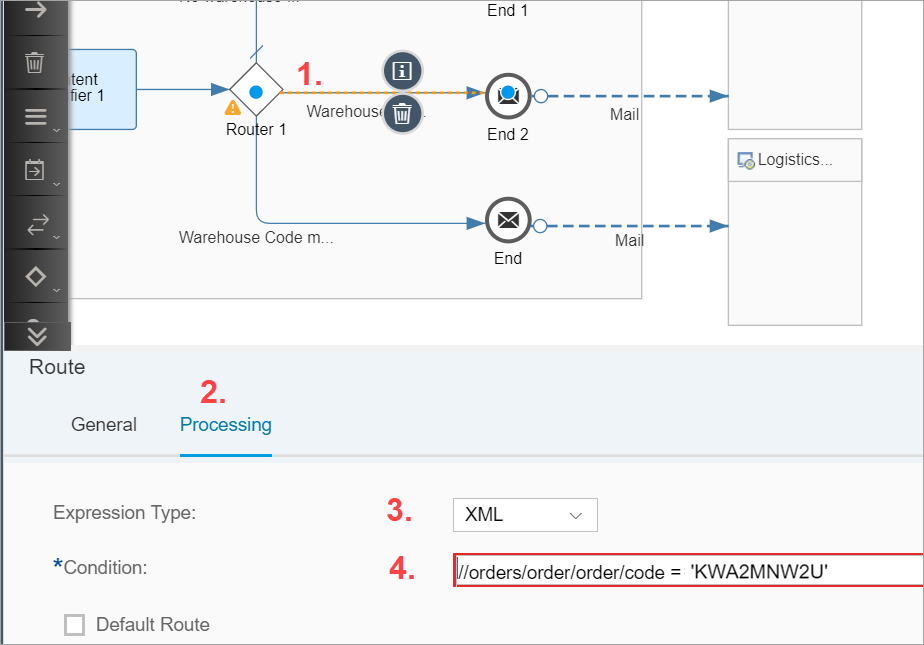

  5. Save, deploy and execute the flow with the existing input message with the changed address field again.

    Last time you executed the flow, you did not receive any mail. However, now you should be able to see the below mail with the following address:

    __2025 M Street,Northwest,Washington DC,20036__:

    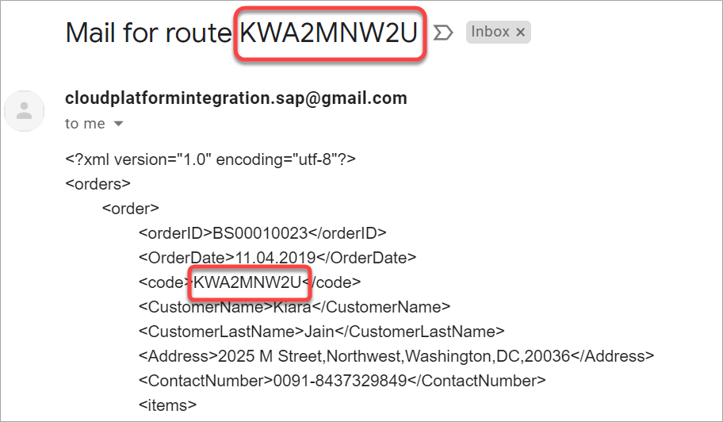   

[DONE]
[ACCORDION-END]

[ACCORDION-BEGIN [Step 2: ](Convert message formats)]

Assume that the Warehouse 1 (KWA2PRBK5I) expects a CSV file and Warehouse 2 (KWA2MNW2U) expects a JSON message:

1. Covert the message for Warehouse1 to Flat file:

    * Click on the design palette.
    * Choose __Message Transformers__.
    * Choose __Converter__.
    * Choose __XML to CSV Converter__.

    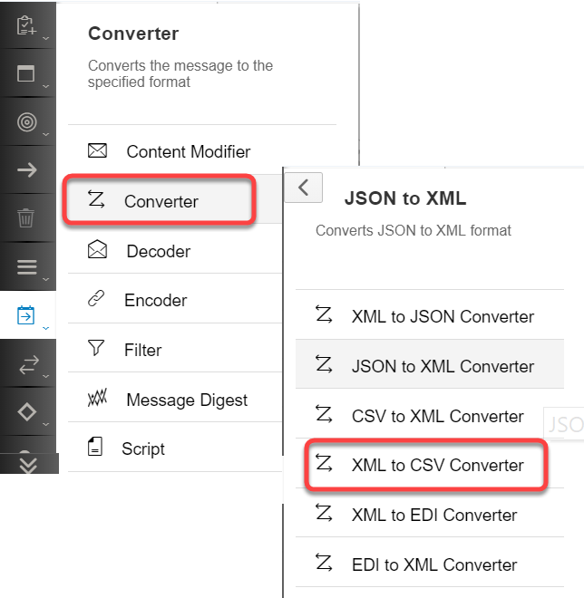

    * Drag the CSV converter on the execution pipeline next to the __Router__ step.

    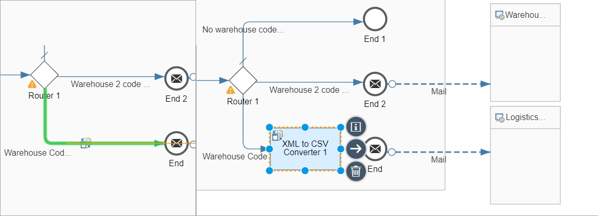

    * Configure the following values in the XML to CSV converter:


    | Field | Value     |
    | :------------- | :------------- |
    | Path to Source Element in XSD       | //orders       |
    | Field Separator in CSV       | Comma(,)       |
    | Include Field Name as Headers       | Checked       |
    | Include Parent Element       | Unchecked       |
    | Include Attribute Values       | Unchecked       |

    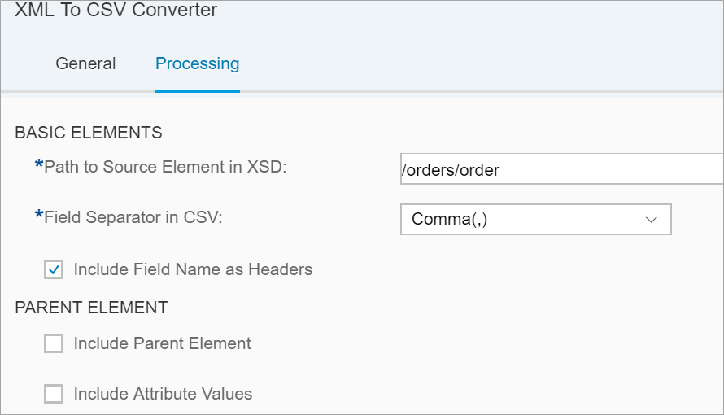

2. Covert the message for Warehouse2 to JSON:

    * Click on the design palette
    * Choose __Message Transformers__
    * Choose __Converter__
    * Choose __XML to JSON Converter__

    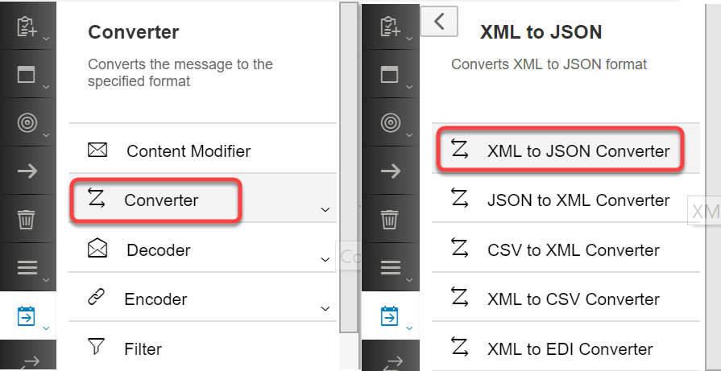

    * Drag the CSV converter on the execution pipeline next to the __Router__ step.

    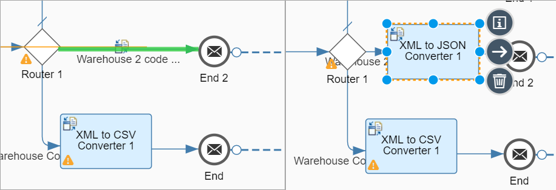

    * Leave the configure of the XML to JSON converter unchanged.

3. Save, deploy and execute the flow twice - one for each of the following address:

    * ```23,Prime View,Redfield,Bangalore,Karnataka,560037,India``` - here you get a flat file in your email:

    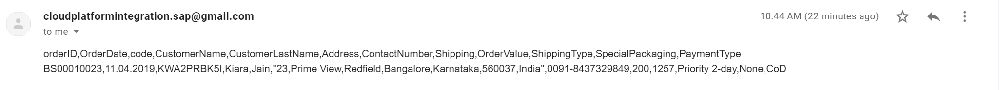     

    * ```2025,M Street,Northwest,Washington DC,20036,USA``` - here you get a JSON message in your email:

    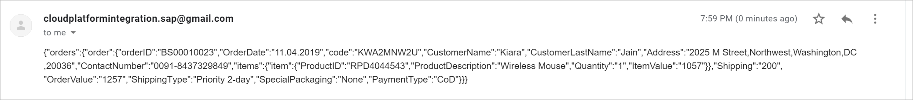     

[VALIDATE_1]

[ACCORDION-END]


---
