## Prerequisites
- You have an SAP Cloud Platform Integration tenant.
- You have assigned `ESBMessaging.send` role in the SAP Cloud Platform cockpit to the user that will be used for calling the flow. You can do this by following step 6 in the [Integration Suite Onboarding Tutorial](cp-starter-isuite-onboard-subscribe)

## Details
### You will learn
  - How to create a basic integration flow
  - How to add sender and receiver channel
  - How to expose a SOAP endpoint
  - How to configure a mail receiver
  - How to deploy, execute and monitor an integration flow


---

[ACCORDION-BEGIN [Step 1: ](Launch SAP Cloud Platform Integration)]

1. Launch an HTML5 compliant internet browser.

2. Access the Web Interface using the URL: `<tenant URL>/itspaces/`

    If you  get a security warning dialog, click __yes__  and proceed.

    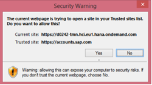  

    After logging in, you should see the following screen:

    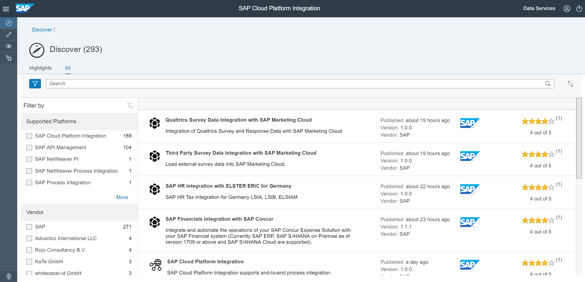  


    > With the navigation on the left, you can switch between the following sections of the Web Interface:

    > - **Discover** → SAP's reference catalog.

    > - **Design** → customer's workspace - design time.

    > - **Monitor** → Monitoring  messages, deployed artifacts and perform other operational tasks.

[DONE]
[ACCORDION-END]

[ACCORDION-BEGIN [Step 2: ](Create an integration flow)]

1. Click __Design__ to open the Designer View.

    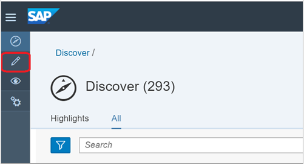

    OR

    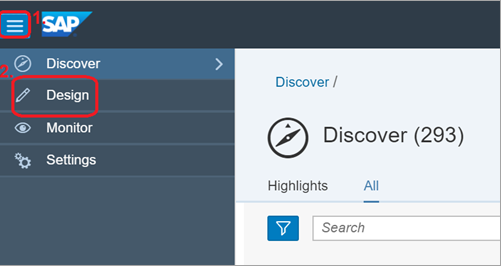

2. Create an Integration Package by clicking on __Create__.

    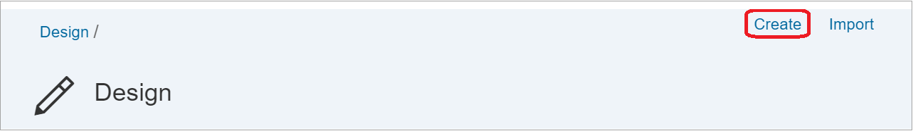

    > An integration package is a container for your integration artifacts like integration flows or value mappings and supporting documents. It is a logical grouping of your integration content.

    Enter the following values:  

    Field Name             | Value
    ---------              | -------------
    Name                   | SAP Cloud Platform Integration Tutorials
    Short Description      | Bottom-up tutorials to teach you how to create basic to complex integration flows in SAP Cloud Platform Integration
    Version                | 1.0.0
    Vendor                 | SAP

3. Click **Save**.

    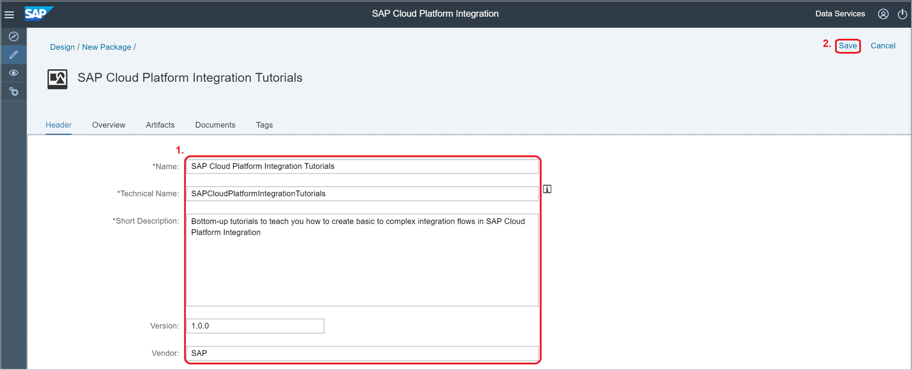

4. Add an integration flow to this package.
     - Go to the __Artifacts__ tab.
     - Click __Edit__.
     - In the __Add__ dropdown, choose __Integration Flow__.

      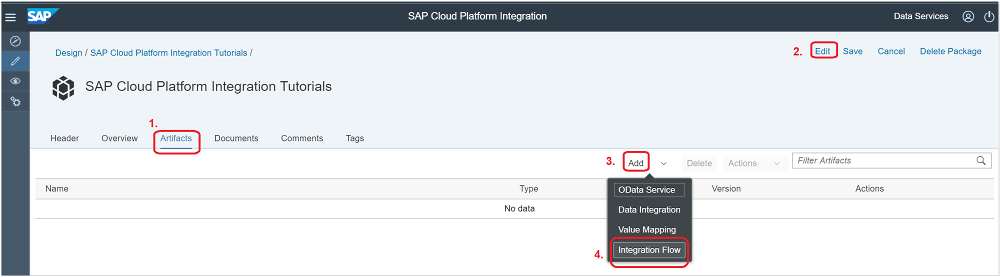

5. Choose __Create__.

    Field Name             | Value
    ---------              | -------------
    Name                   | Manage Freight Logistics
    Short Description      | Raise a transportation request for the goods bought online to most relevant logistics vendor based on the location of the goods and the customer.

    Keep the rest of the settings as it is.

    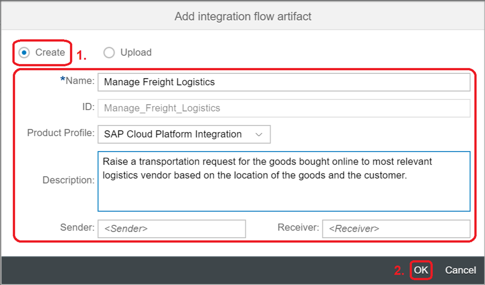

6. Click __OK__.

    An integration flow is now created and added to the integration package.

    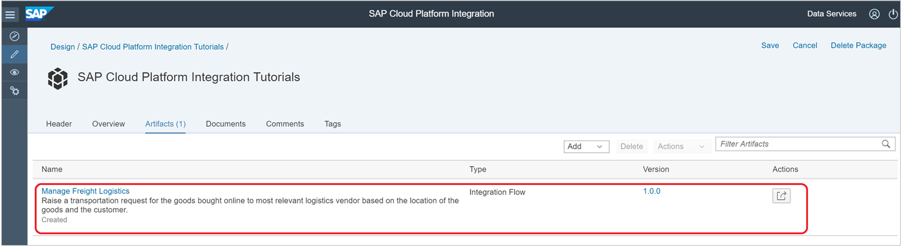

7. Click the name of the integration flow to launch the integration flow editor.

    The system creates a skeleton flow for you by default.

    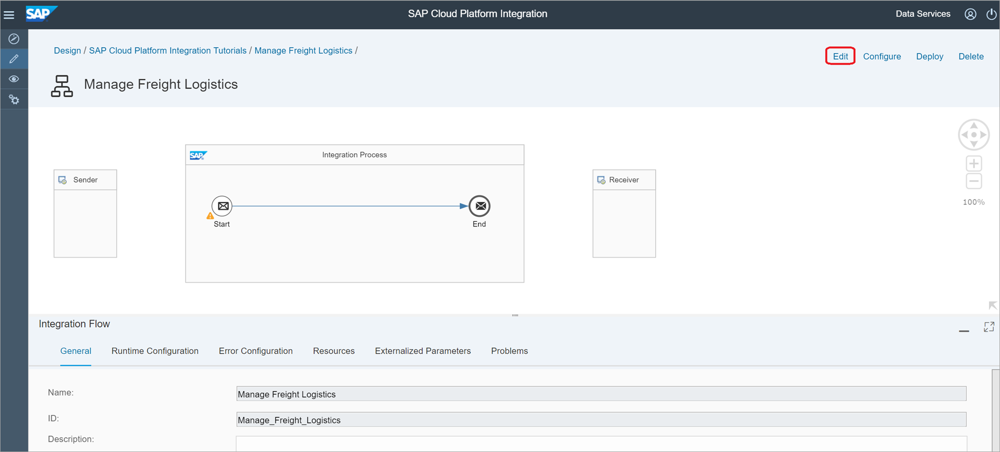

8. Click __Edit__ to start adding logic to your integration flow.

    The __design palette__ appears on the left side that provides all the process steps that can be added to the integration flow.


[DONE]
[ACCORDION-END]


[ACCORDION-BEGIN [Step 3: ](Expose a SOAP endpoint)]

1. Give a name to the sender system:
    - Click on the Sender.

    - Go to the properties sheet.

    - Set the name to __e-Commerce Vendor__.

    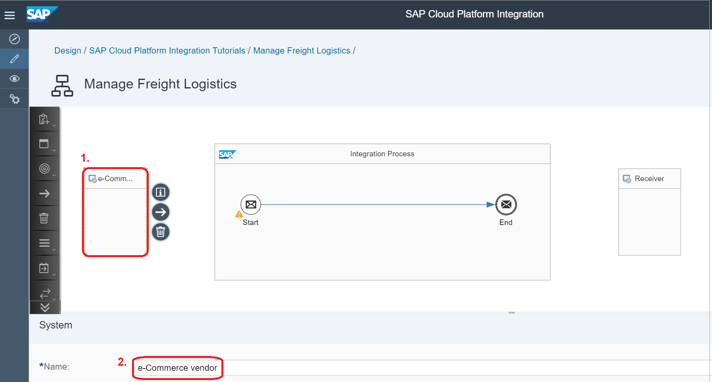

2. Create the sender channel:
    - Click on the Sender.
    - Choose the __Connector__ speed button.

    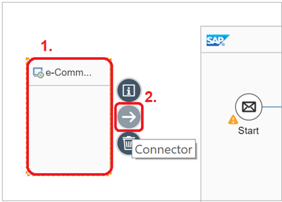

    - Drag the arrow to the __Start message event__.
    - Choose __SOAP__ from the __Adapter Type__ pop-up.
    - Choose __SOAP 1.x__ in the next screen.

    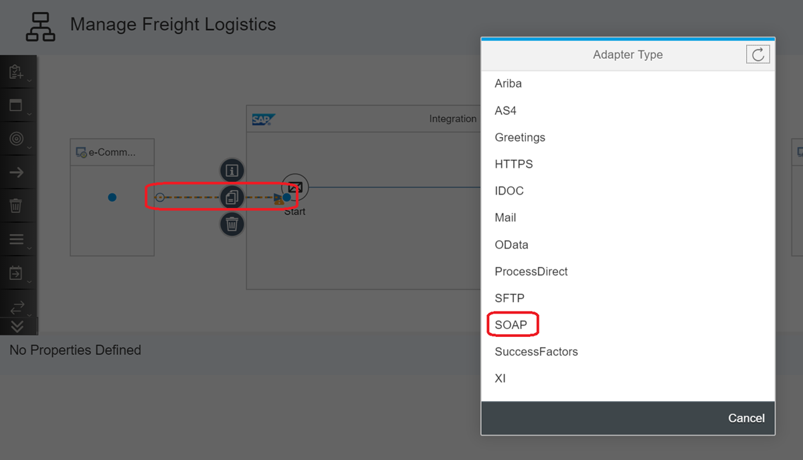

3. Configure the SOAP sender:   
     - Click on the SOAP sender channel.   
     - Go to the __Properties sheet__.
     - Go to the __Connection__ tab.
     - Set __Address__ to **`/submitFreightInfo`**.

>   This is the SOAP endpoint that you will expose from this integration flow. It will be prefixed with the tenant URL to get the full URL.


  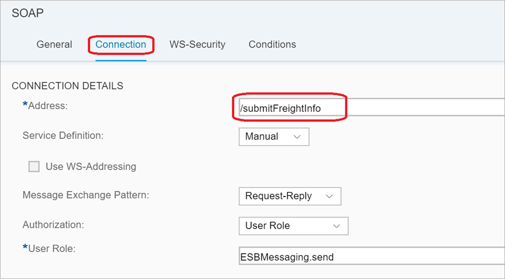

[DONE]
[ACCORDION-END]

[ACCORDION-BEGIN [Step 4: ](Create a user credential)]
> A _User Credential_ is an artifact created in the secure store of SAP Cloud Platform Integration to securely store user/passwords. The credential artifact is always stored as encrypted and hence keeps the password safe.

1.	Create and deploy a credential for sending mail on behalf of a mail account:
    - Go to the __Monitor view__.
    - Click on the tile called __Security Material__.
    - Add __User Credential__.
    - Set __Name__ to **`mailSender`**.
    - Configure the mail sender's email address and passwords.

    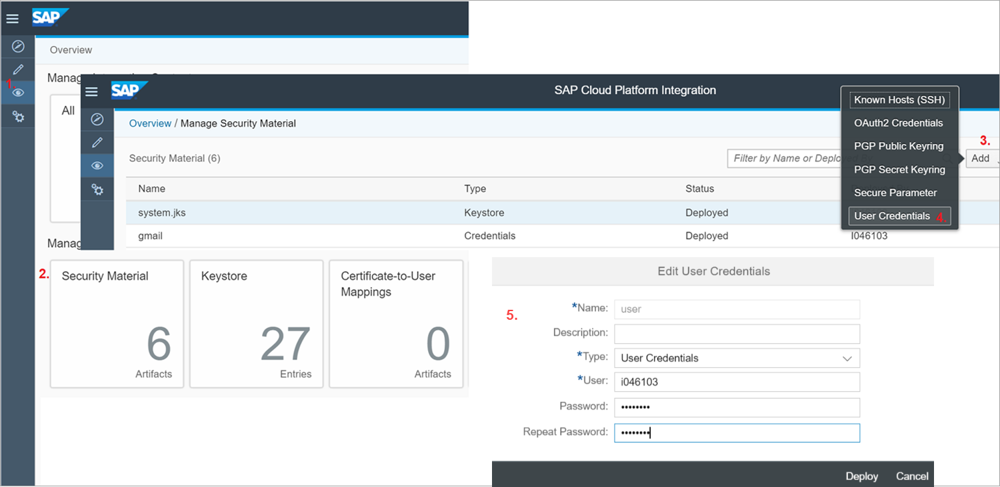

    Click __Deploy__.

[DONE]
[ACCORDION-END]

[ACCORDION-BEGIN [Step 5: ](Add a mail receiver)]
1. Give a name to the receiver system:
    - Click on the Receiver.
    - Go to the __Properties sheet__.
    - Set the name to __Logistics Manager__.

    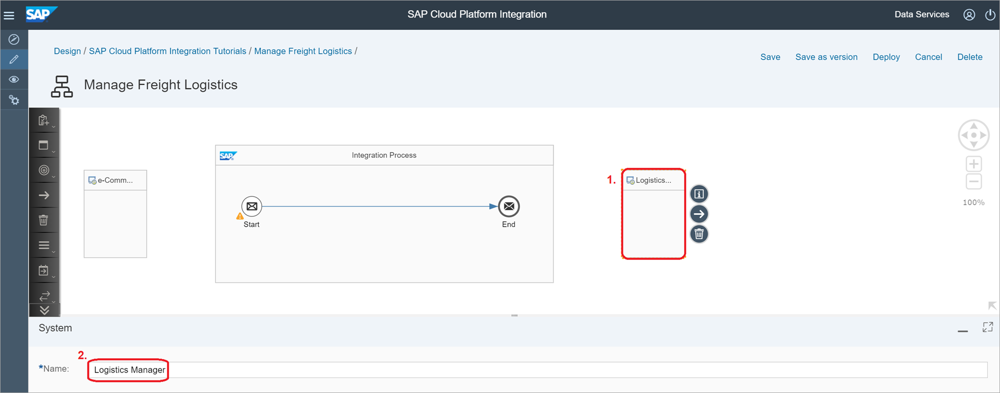

2. Create the sender channel:
    - Click on the __End message event__.
    - Choose the __Connector__ speed button.

    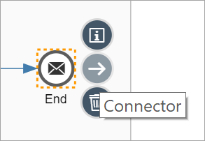

    - Drag the arrow to the Receiver system.
    - Choose __Mail__ from the __Adapter Type__ pop-up.

    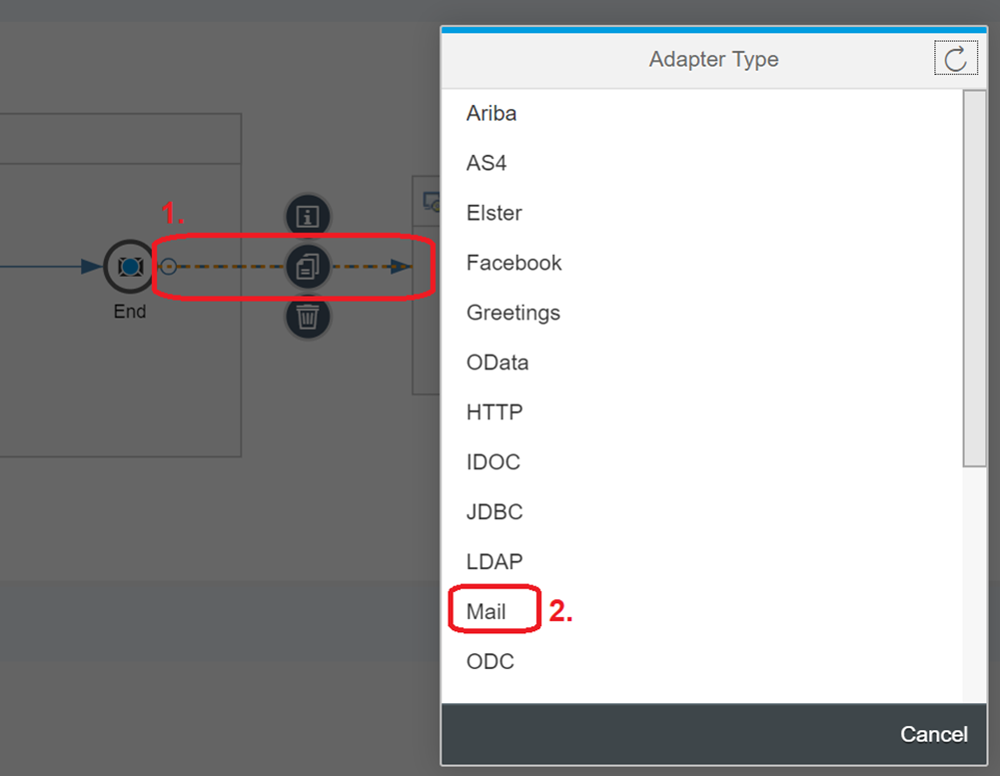

3. Configure the Mail receiver:   
     - Click on the mail receiver channel.   
     - Go to the __Properties sheet__.
     - Go to the __Connection__ tab.

     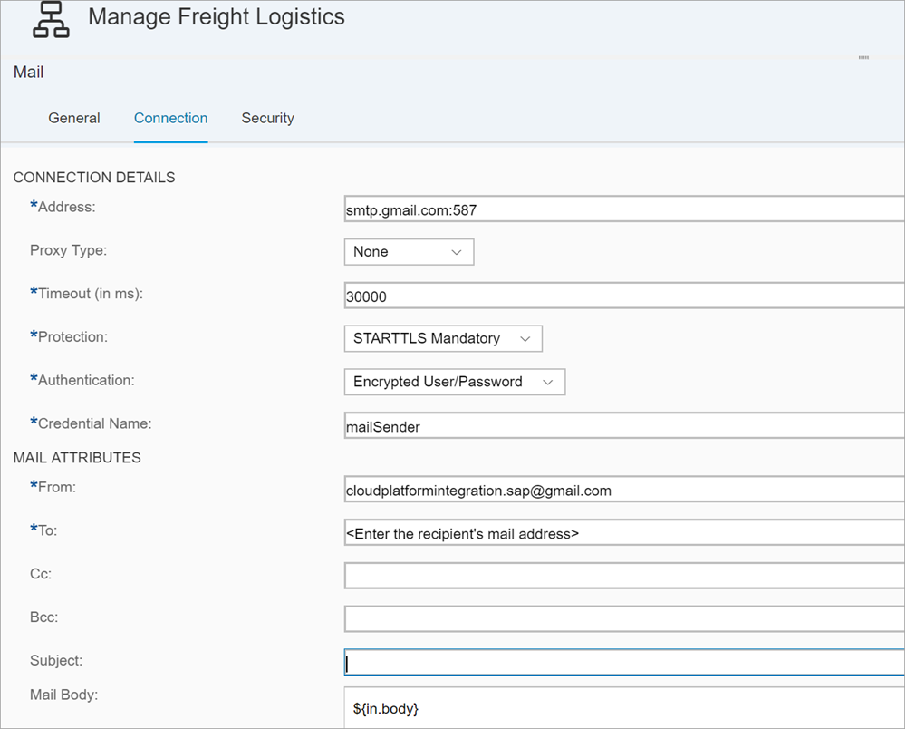

4. Enter the following values:  

    Field Name      | Value
    ---------       | -------------
    Address         | smtp.gmail.com:587
    Proxy Type      | None
    Protection      | STARTTLS Mandatory
    Authentication  | Encrypted User/Password
    Credential Name |**`mailSender`**
    From            | \<Sender mail Address>
    To              | \<Receiver mail Address>

    Finally, your flow must look like:

    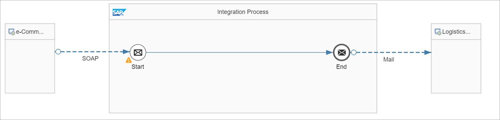   

[DONE]
[ACCORDION-END]

[ACCORDION-BEGIN [Step 6: ](Save, deploy and execute the flow)]
1. Save the integration flow by clicking on __Save__.

    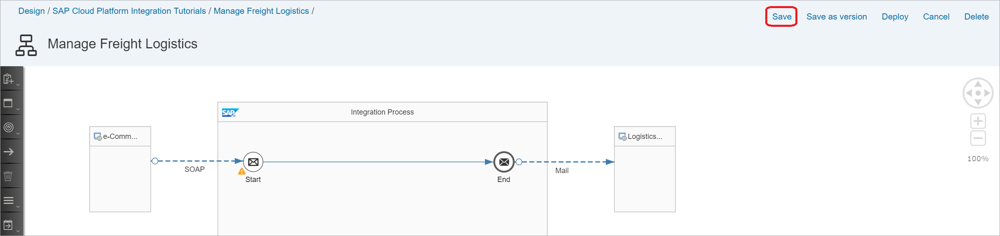  

    > Alternatively, you can use __Save as version__ to change the version of the integration flow. Versions are managed by the Web Interface which also allows you to rollback to saved versions.

    > The system performs configuration check of all the integration flow settings that you configured so far and lists them in the __Problems View__. Errors and warnings are displayed.

2. Deploy the integration flow by clicking on __Deploy__.

    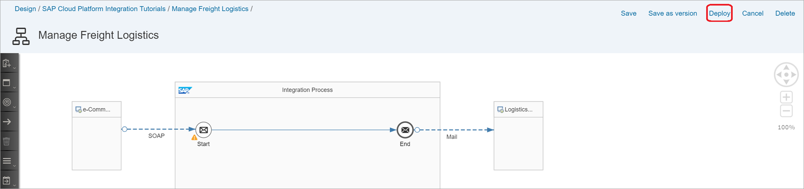  

    Click __Yes__ in the Confirmation dialog.

    Click __OK__ in the Deployment pop-up.

    > In case of an error in configuration, the system shall not allow to deploy the flow. You shall see a __Validation Error__.

    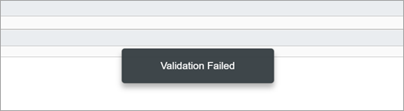  

    Refer the __Problems View__ for more details about the reason of the failure.

    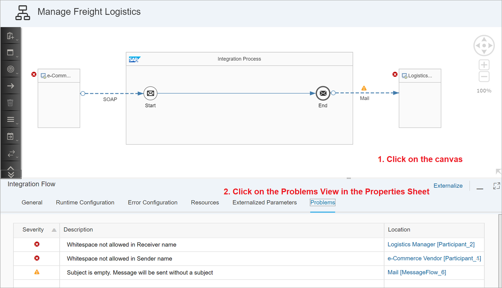  

    The error says that the name of the sender and receiver systems should not have any space.

    Change the name of the Sender system from __e-Commerce Vendor__ to __e-CommerceVendor__.

    Similarly, change the name of the Receiver system from __Logistics Manager__ to __Logistics Manager__.

    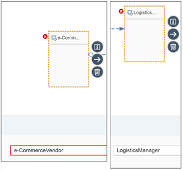  

    Save and redeploy the integration flow.

[DONE]
[ACCORDION-END]

[ACCORDION-BEGIN [Step 7: ](Check deployment status)]

1. Click on __Monitor__ to open the Monitoring View.
2. Click on the tile for __Manage Integration Content__.

    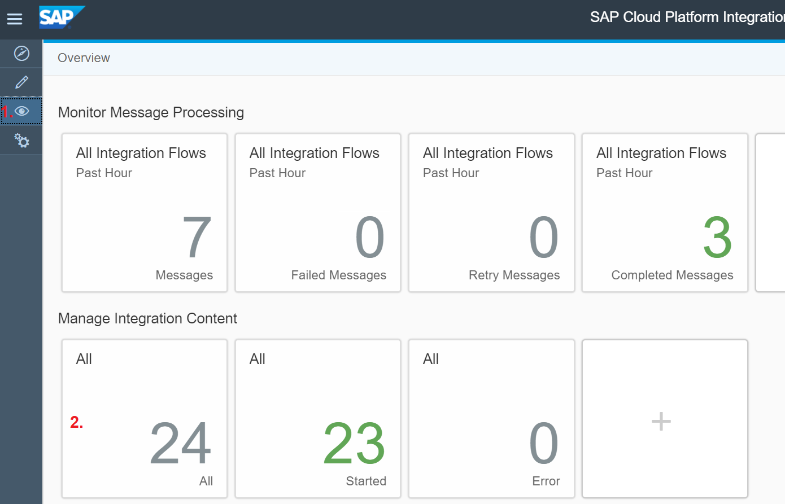  

3. Look for your integration flow. Make sure it is in __Started__ state.

    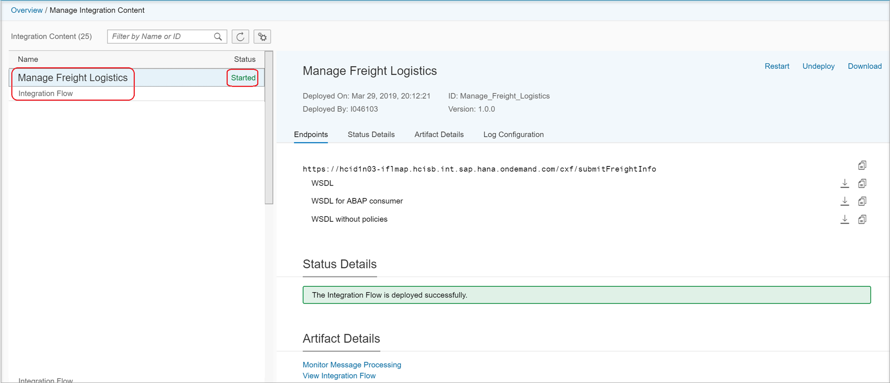  

    You can find more details about the deployed bundle, especially the exposed endpoints on the right hand pane.

[DONE]
[ACCORDION-END]

[ACCORDION-BEGIN [Step 8: ](Trigger the integration flow)]
1. Retrieve the endpoint URL of deployed integration flow:
    * Ensure you are in the _Manage Integration Content_ view.
    * Locate your integration flow.
    * Make sure it is in started state.
    * Select the flow to view  the endpoint details on the right hand pane.
    * Copy the endpoint URL with the speed button on the right.

    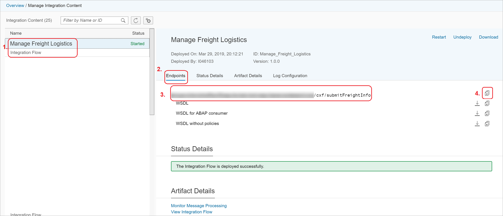  

2. Launch the __Postman App__.

    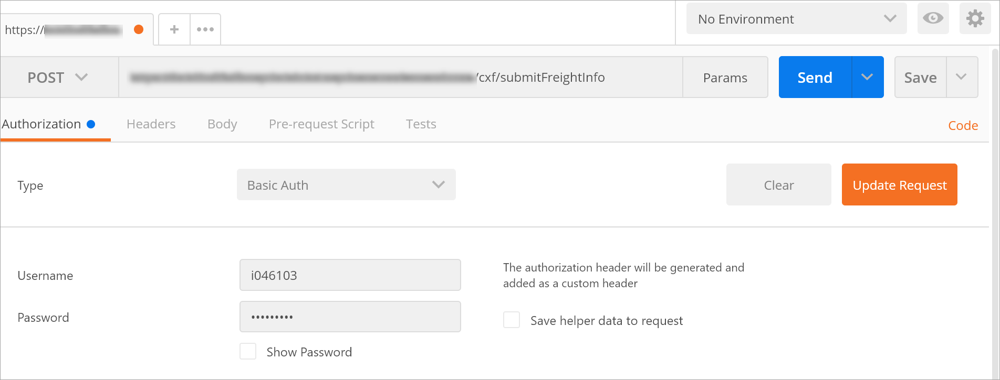  

3. Configure Postman:

    Field name     | Value     
    -------------  | -------------
    Verb           | POST
    URL            | **`\<tenant URL>/cxf/submitFreightInfo`**
    __Authorization__  |
    Type            | Basic Auth
    Username       | \<Your user on your tenant>
    password       | \<Password of the user>
    __Body__       |
    Format         | Raw, text

    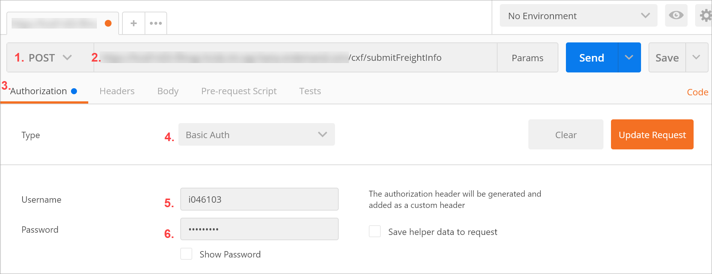

    Use the following input message:

    ```
    <soapenv:Envelope xmlns:soapenv="http://schemas.xmlsoap.org/soap/envelope/" xmlns:dis="http://camel.apache.org/cxf/jaxws/dispatch">
   <soapenv:Header/>
   <soapenv:Body>
     <orders>
     	<order>
     		<orderID>BS00010023</orderID>
     		<OrderDate>11.04.2019</OrderDate>
     		<CustomerName>Kiara</CustomerName>
     		<CustomerLastName>Jain</CustomerLastName>
     		<Address>23,Prime View,Redfield,Bangalore,Karnataka,560037,India</Address>  
     		<ContactNumber>0091-8437329849</ContactNumber>
     		<items>
     			<item>
     				<ProductID>RPD4044543</ProductID>
     				<ProductDescription>Wireless Mouse</ProductDescription>
     				<Quantity>1</Quantity>
     			</item>
     		</items>
     		<OrderValue>1257</OrderValue>
     		<ShippingType>Priority 2-day</ShippingType>
     		<SpecialPackaging>None</SpecialPackaging>
     		<PaymentType>CoD</PaymentType>
     	</order>
     </orders>
     </soapenv:Body>
</soapenv:Envelope>   
     ```  

   Hit __Send__.

   You should see a response status __200 OK__.

   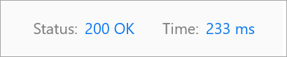


[DONE]
[ACCORDION-END]

[ACCORDION-BEGIN [Step 9: ](Monitor the flow)]

1. Click on __Monitor__ to open the Monitoring View.
2. Click on __All Integration Flows__ tile under __Monitor Message Processing__.

    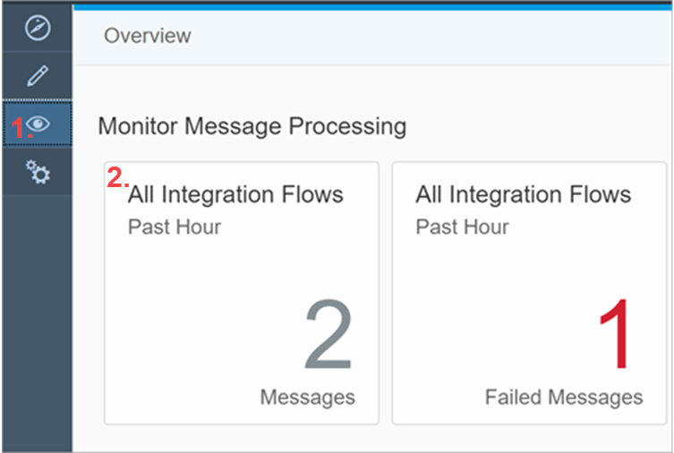

3. Look for your message processing. Make sure that the status of processing is __Completed__.

    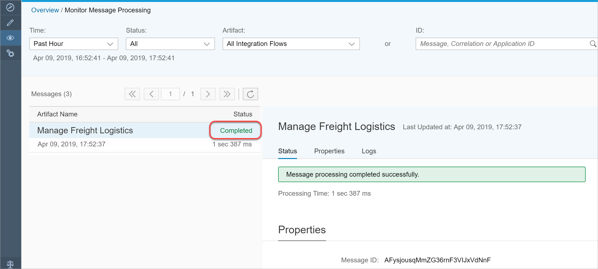

4. You should have received a mail at the mail address you configured in the mail receiver channel.

    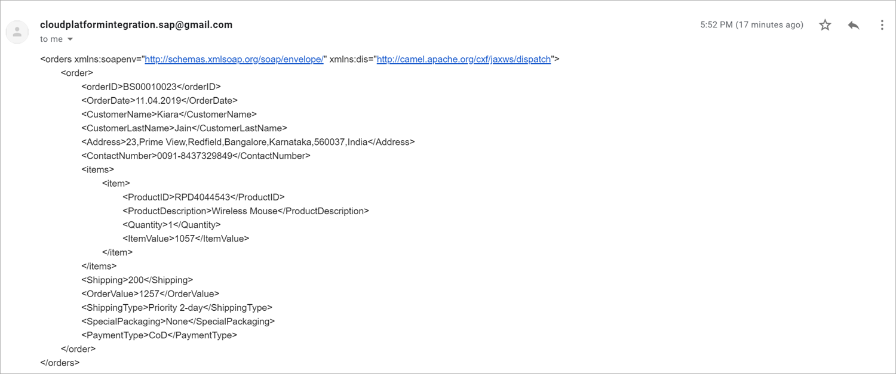

[VALIDATE_1]

[ACCORDION-END]

---
