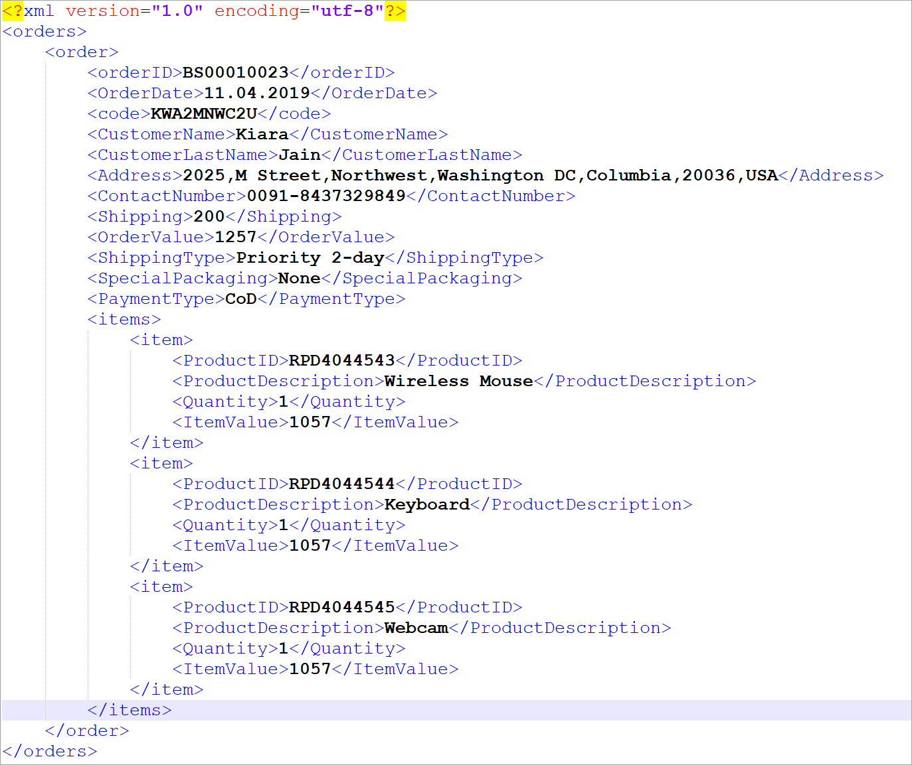
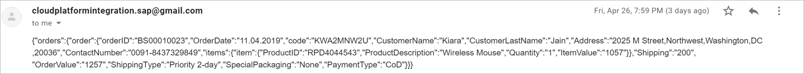
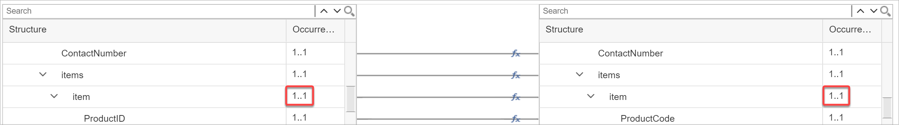
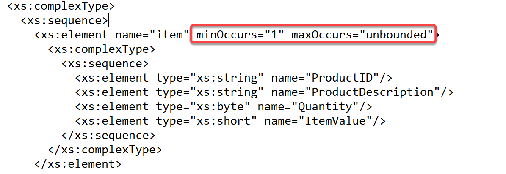
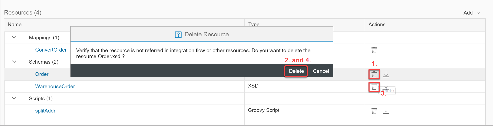
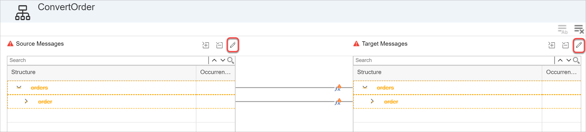
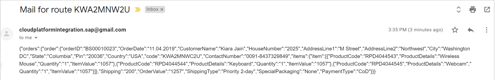
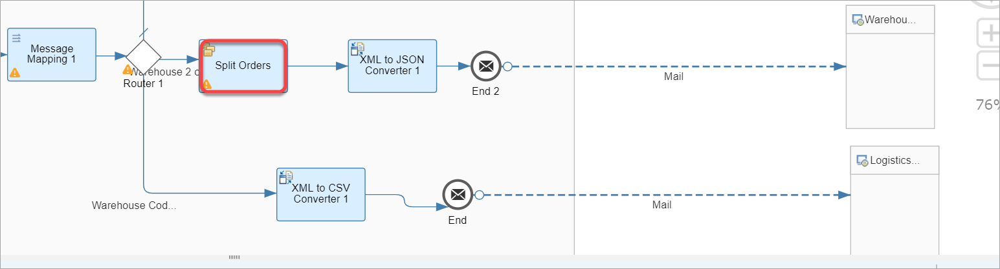
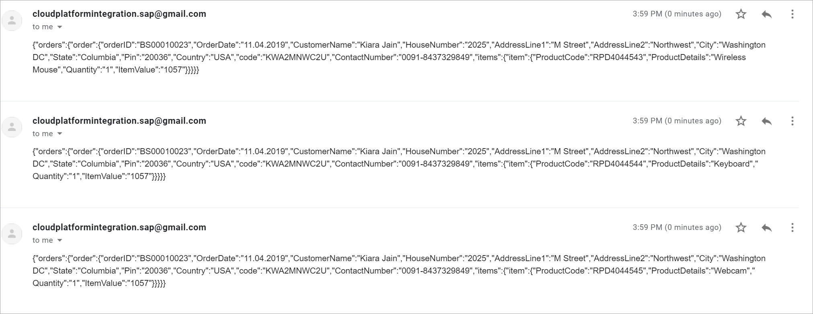

## Details
### You will learn
  - How to split a message containing multiple messages into individual messages
  - How mapping works with bulk messages

Assume that a customer orders multiple items. The input XML will then contain all the item information. In this exercise, we shall separate the items and process them individually.

---

[ACCORDION-BEGIN [Step 1: ](Process a bulk message)]

1. Let us change our input message and add 2 more items to it.

    * Add the following text to your input message:

    ```XML
    <item>
    <ProductID>RPD4044544</ProductID>
    <ProductDescription>Keyboard</ProductDescription>
    <Quantity>1</Quantity>
    <ItemValue>1057</ItemValue>
    </item>

    <item>
    <ProductID>RPD4044545</ProductID>
    <ProductDescription>Webcam</ProductDescription>
    <Quantity>1</Quantity>
    <ItemValue>1057</ItemValue>
    </item>  

    ```

    Once done, your message should look like:

    

2. Execute your flow with the new message. You will see that the output mail only contains 1 item information:

    

3. This is because the cardinality of the __Item__ field is set to 1..1.

    

4. Edit the XSD.

    * Go to the __Item__ field and add ```minOccurs="1" maxOccurs="unbounded"``` to it as attributes as follows:

    

    * Go to the integration flow's __Resources View__ and delete both Order.xsd and WarehouseOrder.xsd.

    

    * Go to the Message Mapping and reimport the edited XSD.

    

    > In spite of having deleted the XSD, SAP Cloud Platform Integration preserves the maps.  

    * Check if all the maps are configured.

    * Save, deploy and execute your flow. You should get one composite mail containing all product information:

    

[DONE]
[ACCORDION-END]

[ACCORDION-BEGIN [Step 2: ](Split message)]

1. Add a __Splitter__ step to the integration flow:

    * Click on the design Palette.
    * Choose __Message Routing__.
    * Go to __Splitter__.
    * Choose __General Splitter__.

    

    * Drag it on to the execution pipeline between the __Router__ and __XML to JSON Converter__ step on the branch for __KWA2MNWC2U__.
    Name it __Split Orders__.

    

    * Configure the __General Splitter__ as follows:

    | Field   | Value    |
    | :------------- | :------------- |
    | Expression Type       | XPATH       |    
    | `XPath` Expression       | /orders/order/items/item       |
    | Grouping      | 1    |
    | Streaming       | Checked       |
    | Parallel Processing       | Unchecked       |
    | Stop on Exception       | Checked       |


    * Save, deploy and execute your flow. You should get one 3 individual mails containing individual product information:

    

    > Play around with the different types of splitters  and different configuration, to understand how the results differ.

[VALIDATE_1]

[ACCORDION-END]


---
