 

## Details
### You will learn
  - How to induce an artificial error or exception in your message pipeline
  - How to handle exceptions through _Exception Sub-process_
  - How to use different end events to manage errors
  - What is a send step

In this exercise, we will induce an artificial exception situation via a script.
An _Exception Sub-process_ will be added to handle the artificial exception.
We will also play with the different End Events to see how they differ.

---

[ACCORDION-BEGIN [Step 1: ](Induce artificial exception)]

Let us induce an artificial error in the integration flow. We shall use the script step for the same.

1. Add a script step:

    * Click on the design palette.
    * Choose __Message Transformers__.
    * Choose __Script__.
    * Choose __Groovy Script__.
    * Drag it on to the execution pipeline before the __Message Mapping__ step.
    * Click the __Script__ step and choose __Create (+)__ from the list of speed buttons.

        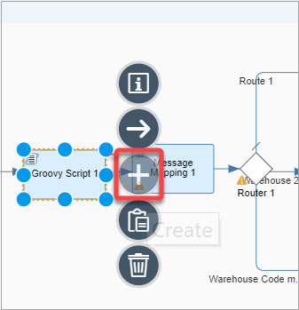

    * Add the following code to the script's `processData` method:

        ```Groovy
        def Message processData(Message message)
        {
            throw new Exception();
        }
        ```     

        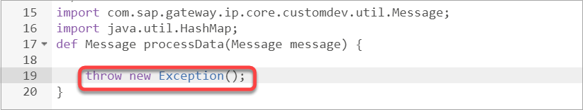

    * Click __Ok__.

2. Save, deploy and execute the integration flow.

     * Go to the **Monitoring** view and look for an entry for the message just processed. The status of the message should be __Failed__ -- this indicates that an exception was thrown.     

          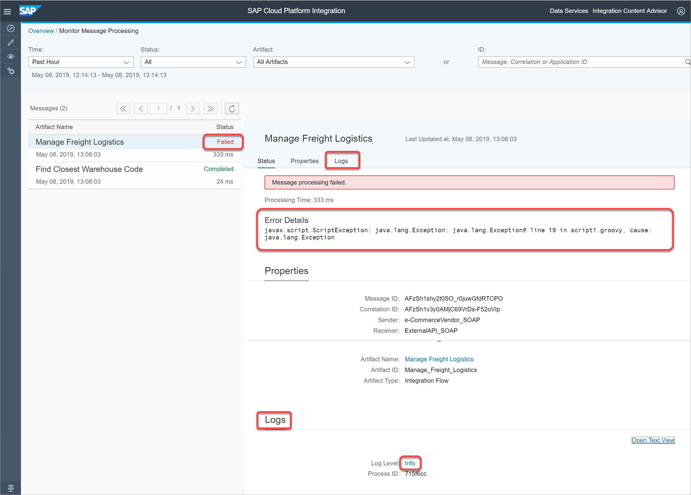

     The __Error Details__ section gives more information about the exception.

     * To get additional information about the exception, scroll down to the __logs__ section (or click on the __Logs__ tab) and click __Info__.

     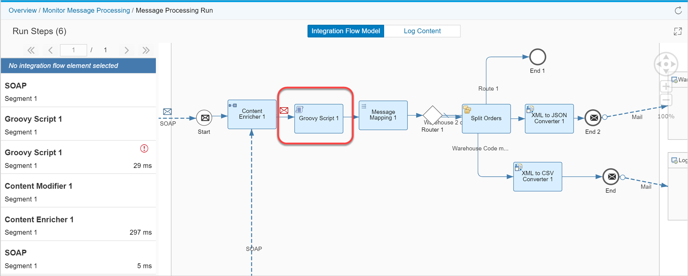

     A graphical viewer opens up and provides a visual representation of the exception location on the message execution pipeline.

     As the graphical viewer shows, the exception is caused by the __Script__ step.


[DONE]
[ACCORDION-END]

[ACCORDION-BEGIN [Step 2: ](Add Exception Sub-process to handle exception)]

Let us now add an Exception Sub-process to catch the exception and handle it.

1. Add a Exception Sub-process to the Integration Flow:

    * Click on the design palette.

    * Choose __Process__.

    * Choose __Exception Subprocess__.

        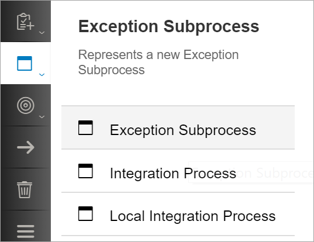

    * Drag it within the __Integration Flow__.

        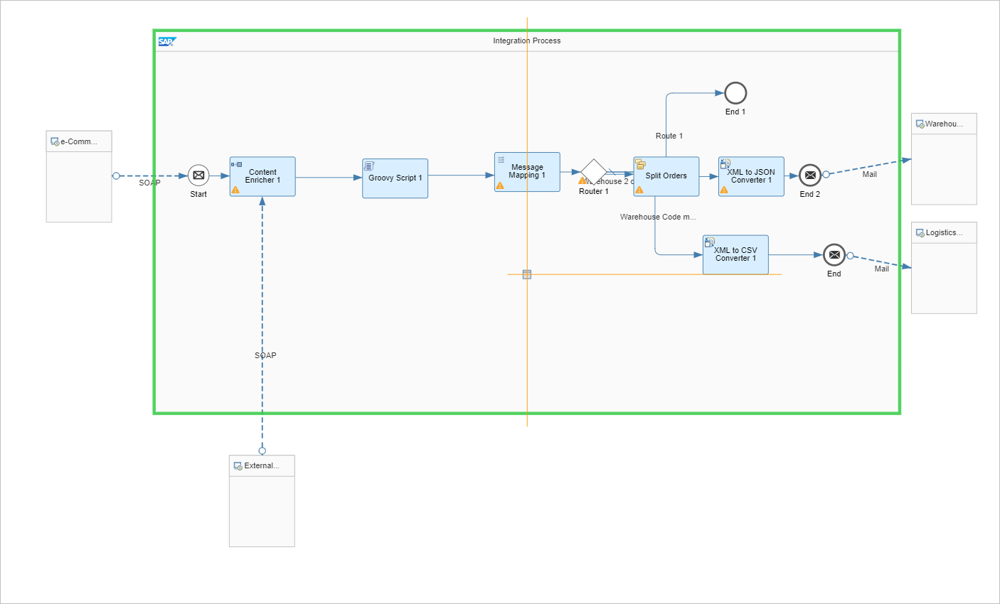

        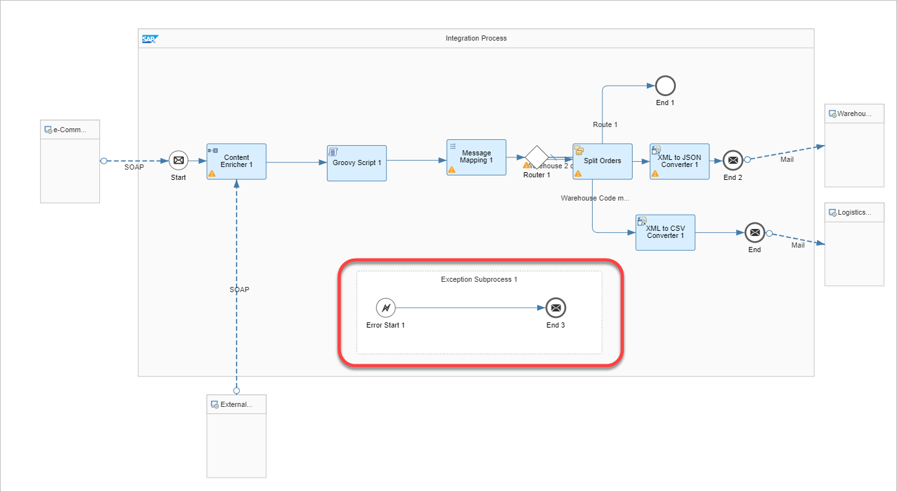

2. Save, deploy and execute the integration flow.

       * Go to the __Monitoring view__ and look for an entry for the message just processed.  The status of the message should be __Completed__ -- this indicates that the exception thrown by the script step is caught by the __Exception Subprocess__.     

       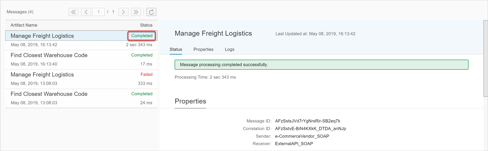    


[DONE]
[ACCORDION-END]

[ACCORDION-BEGIN [Step 3: ](Send mail to intimate about exception)]

You can configure additional actions in the Exception Sub-process that you would like to perform in case of an exception. In the exercise below, we intimate a systems manager about the exception via an email and ask him to resend the request if he likes us to reprocess.

1. Add a mail receiver

    * Add a receiver to the canvas and connect it to the _End Message_ in the _Exception Sub-process_.

    * Choose a mail adapter:

    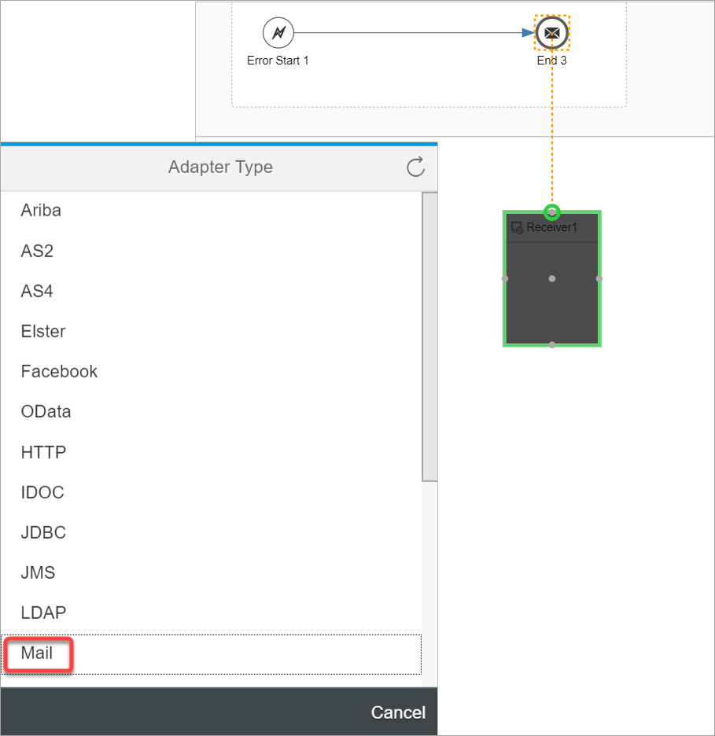

    * Copy the mail channel configuration:

        * Click any of the configured mail channel and choose the speed button for _Copy Configuration_.
        * Now select the newly created mail channel and choose the speed button for _Paste Configuration_. Click _yes_ on the confirmation pop-up.

          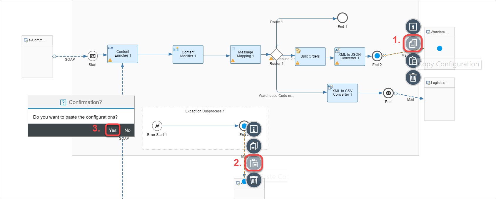    

    * Click on the new mail channel, go to the _Properties Sheet_, go to the _Connection_ tab and set the _Subject_ field to _An error occurred - Please resend_:

            

2. Save, deploy and execute the integration flow.

3. Check your configured inbox. You should get the following email:

    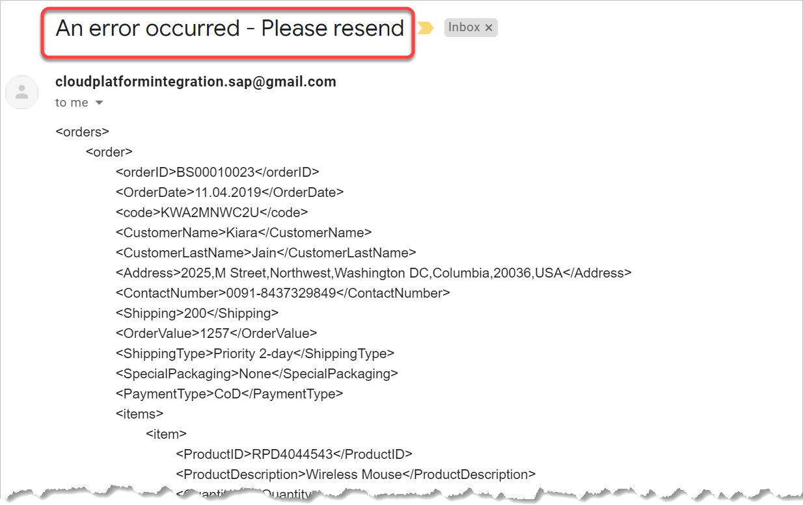   

[DONE]
[ACCORDION-END]


[ACCORDION-BEGIN [Step 4: ](Switch to Error End Event)]

In the following exercise, we will change the __End Message__ in the Exception Sub-process to an __Error End Event__.
The __Error End Event__ will change the Message Execution status to __Failed__ -- similar to how it would have been if the exception was not handled in the Exception Sub-process.

Additionally you shall be able to perform additional tasks in case of an exception.

To summarize, with __End Message__, the Message Execution Status is set to __Completed__, where as with __Error End Event__, the status is set to __Failed__. In both cases, you can add additional processing in case of an error.

1. Delete the __End Message__ step in the __Exception Sub-process__ and replace it with an __Error End Event__ step:

    * Hover over the _End Message_ step and click on the _Delete_ speed button:

      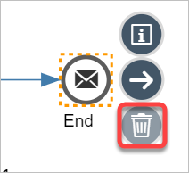

    * Click on the design palette.

    * Choose __Events__.

    * Choose __Error End Event__.

        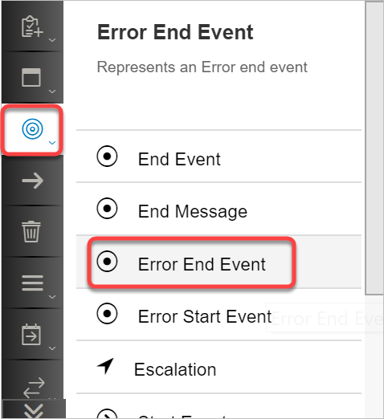

    * Drag it within the __Exception Sub-process__ and connect it to the __Error Start Event__.

        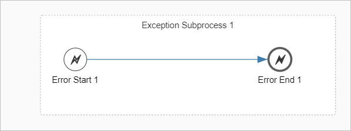

2. Save, deploy and execute the integration flow.

    * Go to the __Monitoring view__ and look for an entry for the message just processed.  The status of the message should be __Failed__ - this message status indicates that the exception was raised, caught by the Exception Subprocess and finally set by the __Error End Event__.   

            


[DONE]
[ACCORDION-END]

[ACCORDION-BEGIN [Step 5: ](Use send step to intimate an exception)]

In the following exercise, we shall be sending an email to the systems manager to intimate about the error in processing. You can model anything in the exception sub-process - similar to how you model the processing logic in the message execution pipeline. Here in the following steps, we are only sending an email.

Please note that you cannot connect the _Error End Event_ to a receiver - Hence we will use an alternate way of sending an email.

1. Add a send step to the message execution pipeline:

    * Click on the design palette.

    * Choose __Call__.

    * Choose __External Call__.

    * Click on __Send__.

        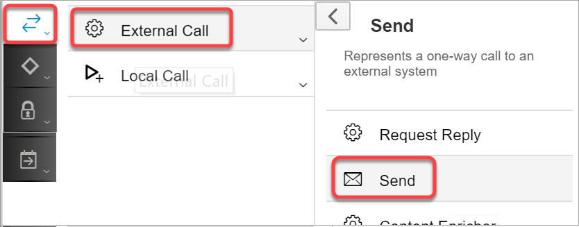

    * Drag it within the __Exception Sub-process__ between the __Error Start Event__ and the __Error End Event__.

        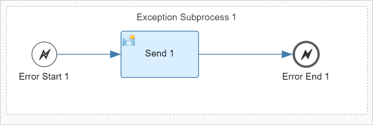  

  2. Add a mail receiver

      * Add a receiver to the canvas and connect it to the _Send_ step in the _Exception Sub-process_.
      * Choose a mail adapter:

      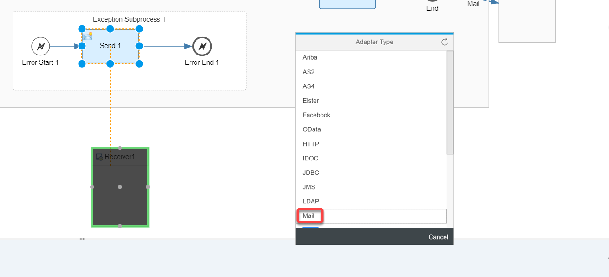

      * Copy the mail channel configuration:

          * Click on any of the configured mail channel and choose the speed button for __Copy Configuration__.
          * Now select the newly created mail channel and choose the speed button for __Paste Configuration__. Click __yes__ on the confirmation pop-up.

            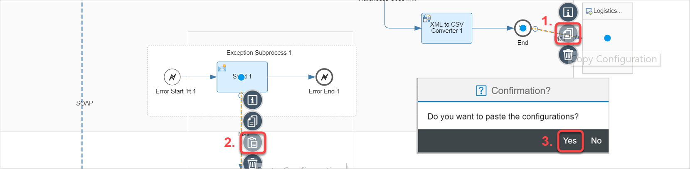    

      * Click on the new mail channel, go to the __Properties Sheet__, go to the __Connection__ tab and set the __Subject__ field to __An error occurred - Please resend__:

              

  2. Save, deploy and execute the integration flow.

  3. Check your configured inbox. You should get the following email:

         


[DONE]
[ACCORDION-END]


[ACCORDION-BEGIN [Step 6: ](Switch to Escalation End Event)]

In this exercise, we shall change the __Error End Event__ to __Escalation End Event__ and understand how the processing differs. As we shall see, the processing is unchanged - the __Escalation End Event__ gives us a way to set the message execution status to a different value: __Escalated__.

1. Delete the __Error End Event__ step in the __Exception Sub-process__ and replace it with an __Escalation End Event__ step:

    * Hover over the __Error End Event__ step and click on the __Delete__ speed button:

      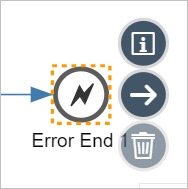

    * Click on the design palette.

    * Choose __Events__.

    * Choose __Escalation End Event__.

        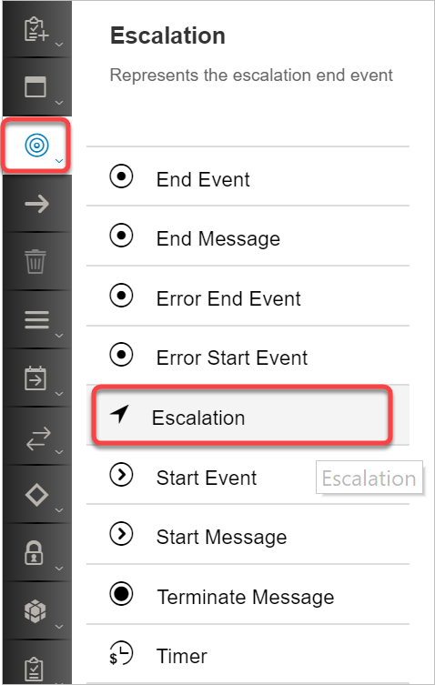

    * Drag it within the __Exception Sub-process__ and connect it to the __Send__ step.

        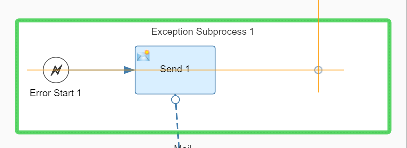

        

2. Save, deploy and execute the integration flow.

     * Go to the __Monitoring view__ and look for an entry for the message just processed.  The status of the message should be __Escalated__ - this message status indicates that the exception was raised, caught by the Exception Sub-process and finally set by the __Escalation End Event__.   

        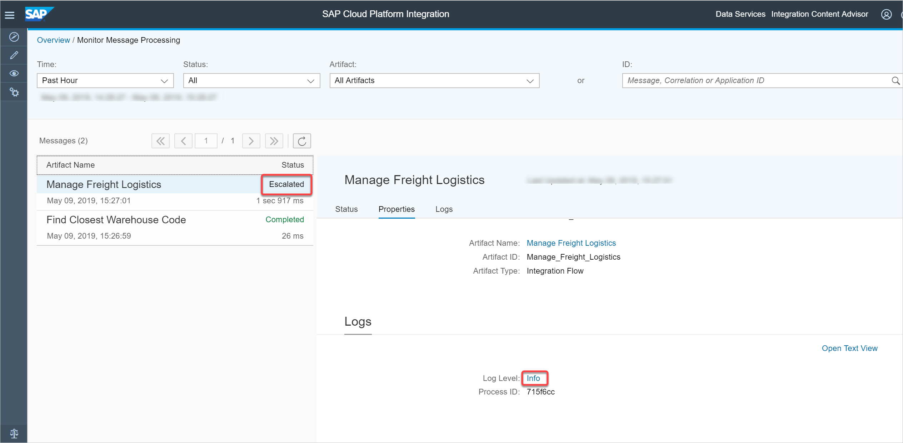    

        The __Error Details__ section gives more information about the exception.

    * To get additional information about the exception, scroll down to the __logs__ section (or click on the __Logs__ tab) and click on __Info__.

    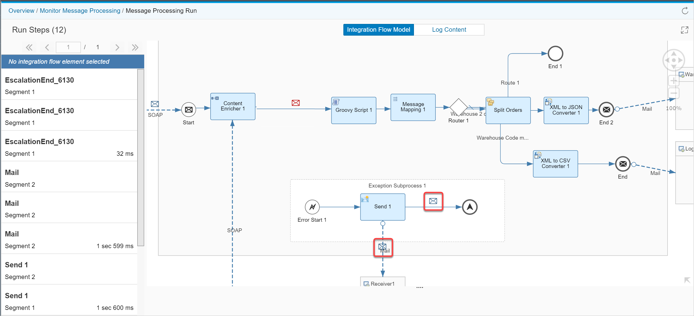

    A graphical viewer opens up and provides a visual representation of the exception location on the message execution pipeline. The graphical viewer shows that the exception thrown by the __Script__ step was caught in the __Exception Sub-process__. A mail was send and the message execution status was set to __Escalated__.

3. The mail received is also exactly the same as with the __Error End Event__:

    Check your configured inbox. You should get the following email:

       


[VALIDATE_1]

[ACCORDION-END]

---
