## Prerequisites
 - Enterprise Messaging License is bought: SKU 8005999.
 - JMS broker is provisioned - check [here] (https://blogs.sap.com/2017/06/20/cloud-integration-provision-message-broker/).

## Details
### You will learn
  - How to use Enterprise Messaging
  - How to automate retry of message processing in case of an errors
  - How to model exactly once processing in SAP Cloud Platform Integration

In the previous chapter, we simply sent an intimation of error through mail and expected the sender to resend the message in case of an error.

There are cases where the error is caused by a temporary reason and the processing usually succeeds after a while, like endpoint temporarily unavailable. In such case, the message need only be reprocessed as is and the processing succeeds.

There are other cases where the error is caused due to bad data or incorrect URLs. No number of retries can help process the message successfully without changing the incorrect data.

Automated retry mechanism will only be helpful in the first case.

In this chapter, we will model an automated retry mechanism.

To enable retry, we will store the failed message in a JMS queue and pick it up repeatedly to retry processing, until it is processed successfully. To accomplish this, we will perform the following steps:

1. We shall park the incoming data in a property.

2. In case of an exception, we shall write the message from the property to a JMS queue in the Exception Sub-process.

3. Create a duplicate flow which reads from the queue and retries message processing. If the exception recurs, the message will not be deleted from the queue. Hence it will be retrieved over and over until processed successfully or placed in the __Dead Letter Queue__.

---

[ACCORDION-BEGIN [Step 1: ](Park incoming message in a property)]

1. Add a __Content Modifier__ immediately after the __Start Event__:

    * Click on the design Palette.
    * Choose __Message Transformers__.
    * Click on __Content Modifier__.

    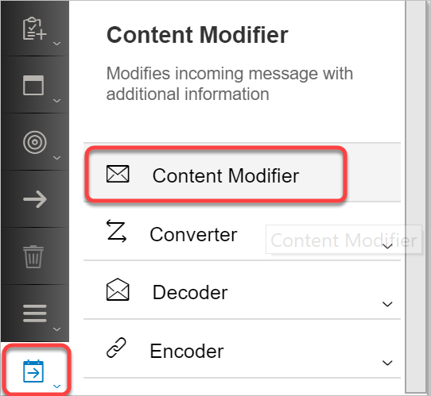

    * Drag it to the message execution pipeline between the __Message Start Event__ and the __Content Enricher__ step.

    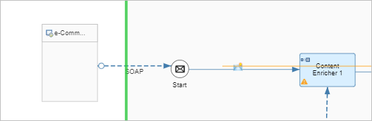

    * Rename the __Content Modifier__ - click on the __Content Modifier__ step, go to the __Properties Sheet__ --> __General__ tab    
    Set the __Name__ to __Park incoming message__.

    * Go to __Exchange Property__ tab, click on __Add__ and enter the following details:


    | Field | Value     |
    | :------------- | :------------- |
    | Action       | Create       |
    | Name       | Input       |
    | Type       | Expression       |
    | Datatype       | java.lang.String       |
    | Value       | ${in.body}       |
    | Default       | <blank>       |

    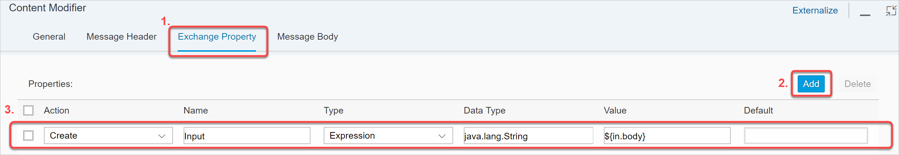

[DONE]
[ACCORDION-END]

[ACCORDION-BEGIN [Step 2: ](Write incoming message to JMS Queue for exceptions)]

In this step, we assume that an exception has happened. We will now store the incoming message into a JMS queue. For this purpose, we cannot take the message on the pipeline as we can never be sure where an exception can occur. So we need to use the message that we parked in the previous step - this way we are always sure that we are working on the incoming message and can duplicate the entire processing while we retry.

1. Load the initial message from the property into the body when an exception occurs:

    * Click on the design Palette.
    * Choose __Message Transformers__.
    * Click on __Content Modifier__.

    

    * Drag it into the Exception Sub-process, just after the __Error Start Event__.

    * Click on the __Content Modifier__, go to the properties sheet and rename it to __Retrieve incoming message into body__.

    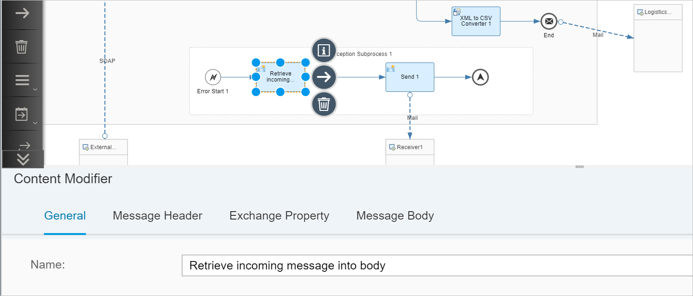

    * Go to the __Body__ tab and choose the following:


    | Field     | Value     |
    | :------------- | :------------- |
    | Type       | Expression       |
    | Body       | ${property.Input}       |

    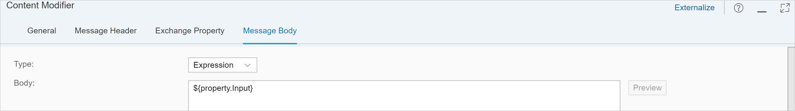

2. Add a JMS receiver in the Exception sub-process.

    * Click on the design Palette.
    * Choose __Call__.
    * Choose __External Call__.
    * Click on __Send__.

    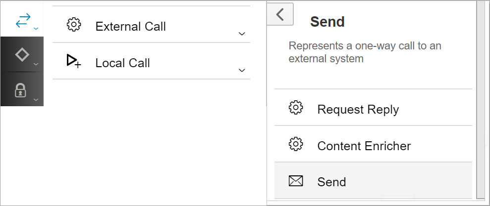

    * Drag it into the Exception Sub-process, just after the __Content Modifier__.

    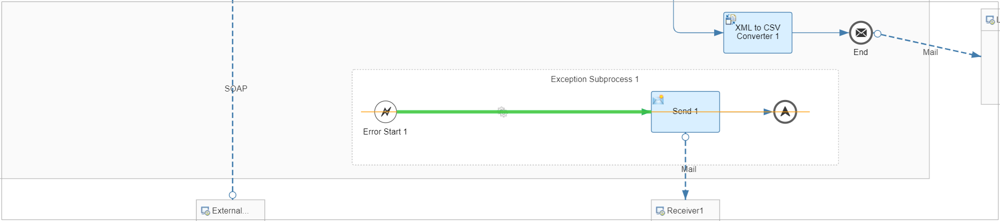

    * Click on the design Palette.
    * Choose __Participant__.
    * Choose __Receiver__.

    

    * Drag the receiver below the __Request Reply__ step as shown below:  

    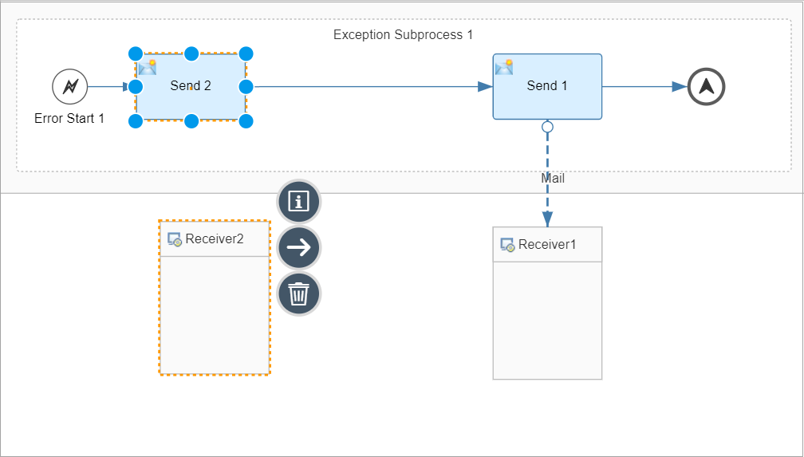

    * Click on the receiver, go to the properties sheet and rename the receiver to `JMSQueue`.

    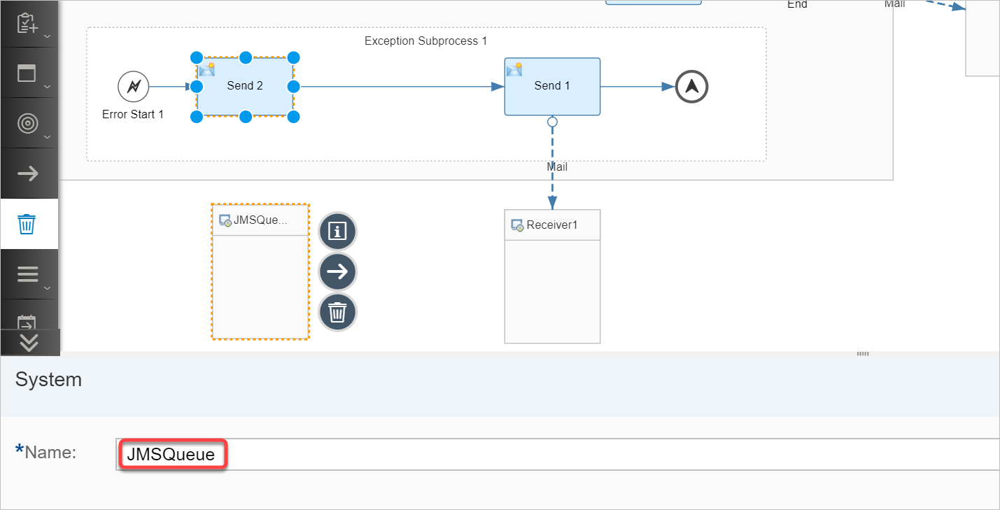

    * Hover over the __Request Reply__ step use the __Connector__ to connect it to the `JMSQueue` receiver. Choose JMS from the pop-up.

    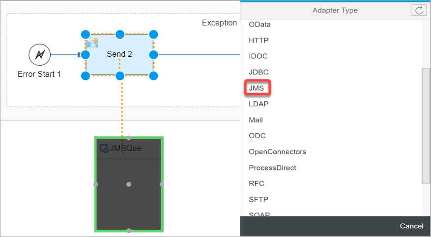

3. Configure the JMS connector:

    Add the following configuration to the JMS receiver in the __Processing__ tab:

    | Field | Value |
    | :------------- | :------------- |
    | Queue Name       | __Input__       |
    | Retention Threshold for Alerting (in d)       |2       |
    | Expiration Period (in d)       | 90       |
    | Encrypt Stored Message       | Checked       |
    | Transfer Exchange Properties       | Unchecked       |

[DONE]
[ACCORDION-END]

[ACCORDION-BEGIN [Step 4: ](Save, deploy and execute the original flow)]

1. Save and deploy the integration flow:

    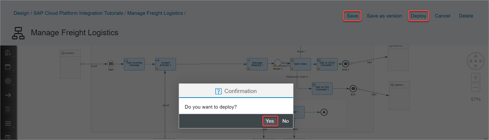

    As soon as you deploy the flow, a queue shall be created and this can be see in the Queue Monitor:

    Go to the __Operations view__ --> __Manage Store__ section and click on __Manage Queues__:

    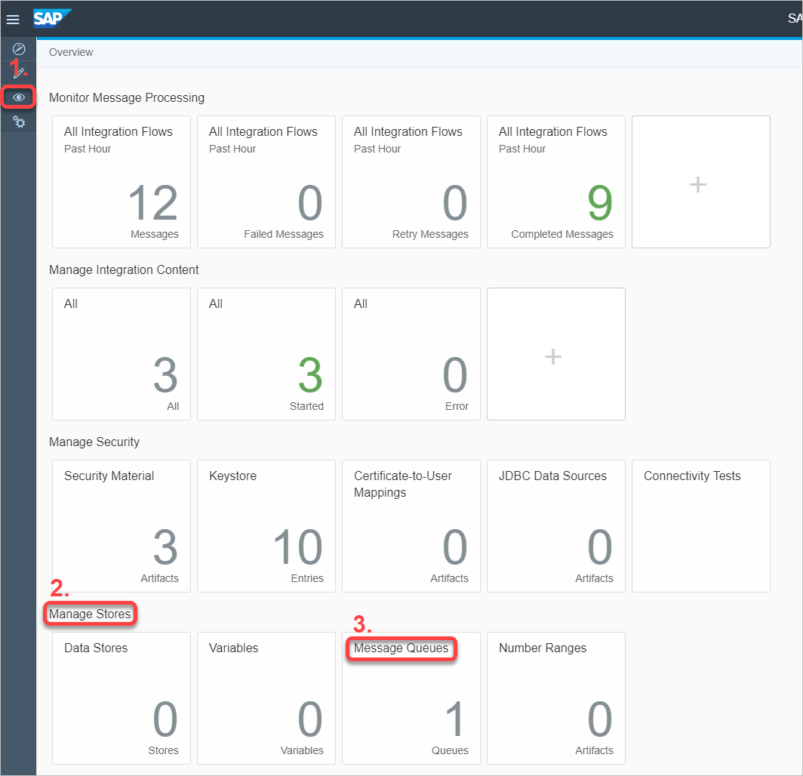

    As you can see, a single queue is created. The name of the queue is __Input__ - same as what was configured in the JMS receiver.

    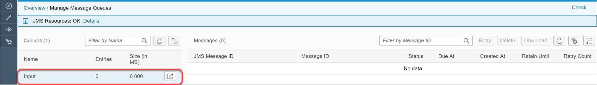

    There is currently no data in the queue.

    Let us now execute the flow to write a message into this queue.


2. Execute the integration flow and check the queue view again:

    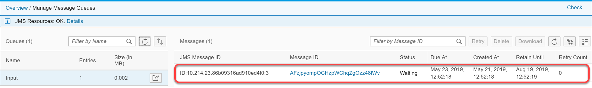

    We now see one entry in the queue.

3. Check the configured inbox. You should not have received any mails yet. This indicates that the flow did not complete processing.    

    Now let us create a retry logic.

[DONE]
[ACCORDION-END]

[ACCORDION-BEGIN [Step 5: ](Create duplicate flow for reading messages from JMS queue)]

In this exercise, we shall copy the original flow and make the following changes in it:

* Replace the SOAP sender with the JMS sender: this is because, we now want the integration flow to poll the JMS queue, not expose a SOAP endpoint. This flow shall poll the queue after regular intervals as configured in the JMS channel in the next exercise. Every message entered into the queue through the exception sub-process of the original flow shall be retried as a result of the above process.

* The Exception sub-process shall be removed - this is because, when an entry is read from the queue, it is deleted. In case an exception occurs, the entry will be written back into the queue (or not deleted). This will make sure that it is retried and later put in the dead-letter queue in case the process fails to process successfully in the configured number of retries.

* The exception inducing script should be removed - this makes sure that when the message is retried, the exception is not simulated and hence we should be able to process the message successfully in the first retry.


1. Copy the integration flow:
    * Go to the Integration Package view:

    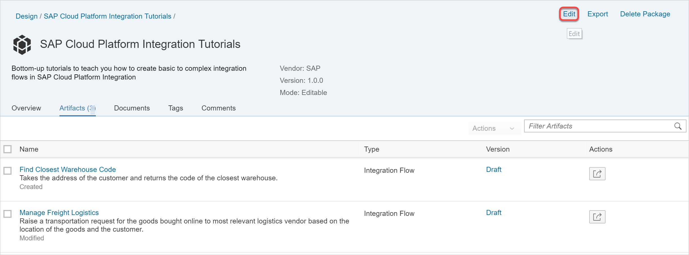

    * Click on __Edit__. Go to __Actions__ for the integration flow __Manage Freight Logistics__ and choose __Copy__:

    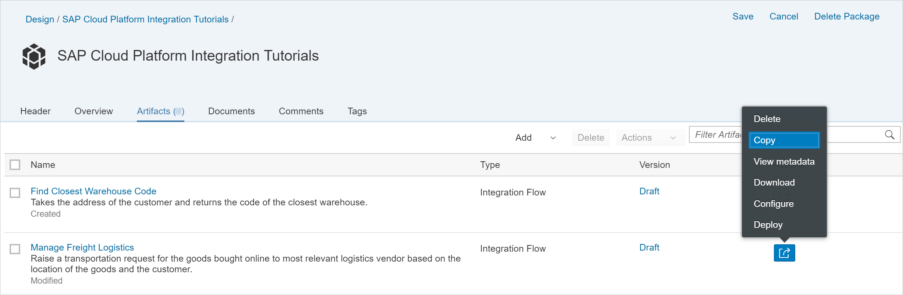

    * In the pop-up dialog, enter ```Manage Freight Logistics_retry``` as the __name__ of the new integration flow:

    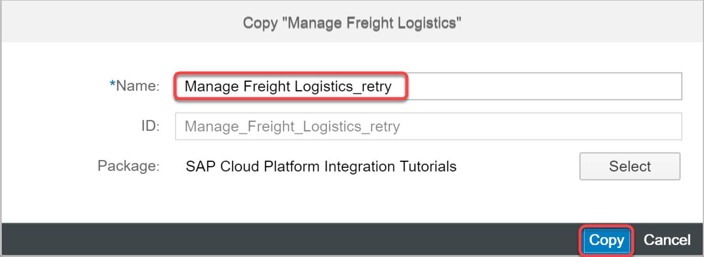

    Click __Copy__.

    The corresponding integration flow gets added to the integration package:

    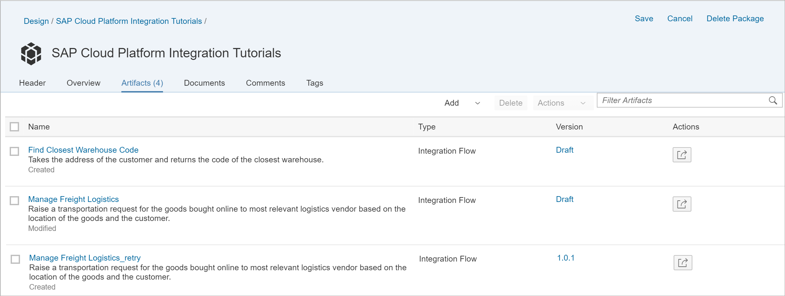

2. Edit the retry flow:

    1. Open the retry flow and click __Edit__:

        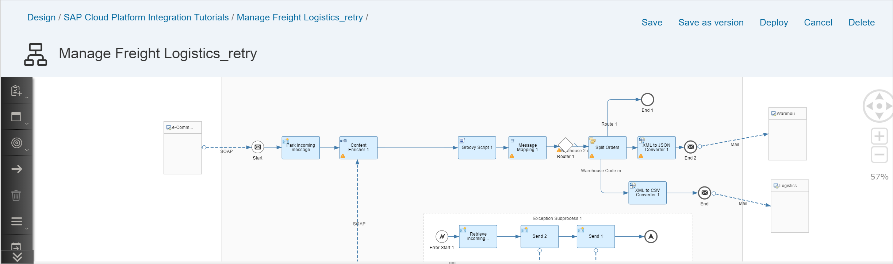

    1.  Delete the sender SOAP channel:

        Click on the channel and click on the __delete__ speed button:

        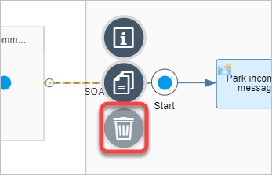

    2. Hover on the __e-CommerceVendor__ sender, use the speed button for __Connector__ and connect the sender to the __Message Start Event__:

        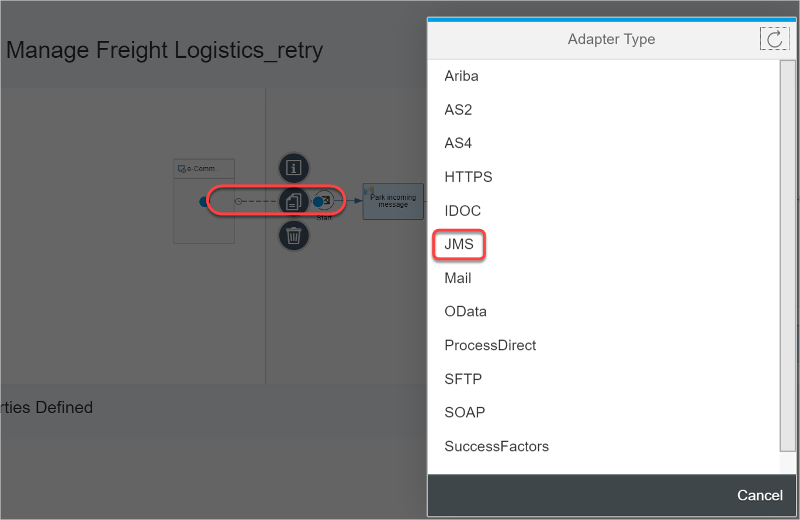

    3. Delete the script step - hover on the __Script__ step and choose the speed button for delete:

        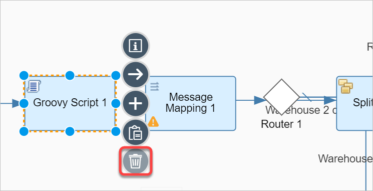

    4. Remove the Exception Sub-process: delete the following:

        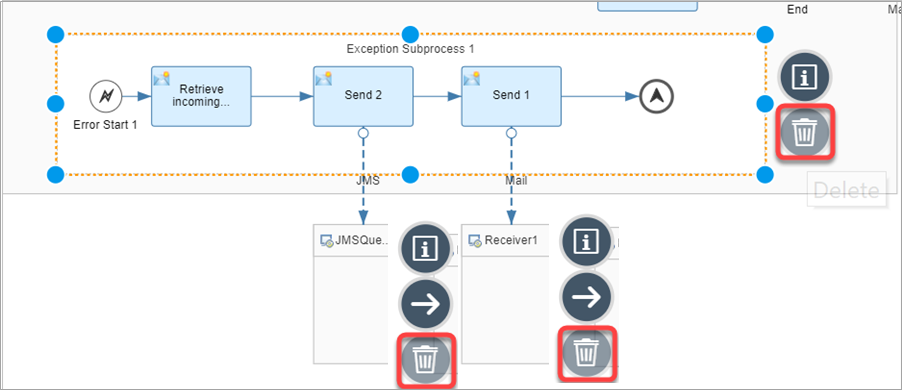  

        * `Exception Subprocess 1`
        * `JMSQueue`
        * `Receiver 1`


    The final integration flow looks like the picture below:

    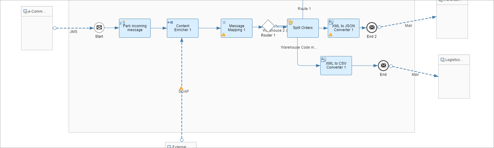

[DONE]
[ACCORDION-END]

[ACCORDION-BEGIN [Step 5: ](Configure retry setting in JMS queue)]

Configure the JMS sender as follows:


| Field     | Value     | Description
| :------------- | :------------- |
| Queue Name       | __Input__       | __Name of the queue to be read__
| Number of Concurrent Processes       | 1       | __How many concurrent processes must read from the queue__
| Retry Interval (in min)       | 1       | __After how many minutes should the process poll the queue__
| Exponential Back-off       | Checked       | __When this checkbox is checked, the retry interval is doubled after every retry. This ensures that in case the issue is caused by something that does not resolve quickly, the retry does not burden the system__
| Maximum Retry Interval (in min)       | 60       | __What is the maximum interval after which retry should not be performed. This is only relevant when Exponential back-off is selected__
| Dead-Letter Queue       | Checked       | __This is used to place entries that do not succeed after 2 retries in a separate queue, called the Dead-Letter queue__

[DONE]
[ACCORDION-END]


[ACCORDION-BEGIN [Step 6: ](Simulate and run a retry)]


1. Save and deploy the retry integration flow:

    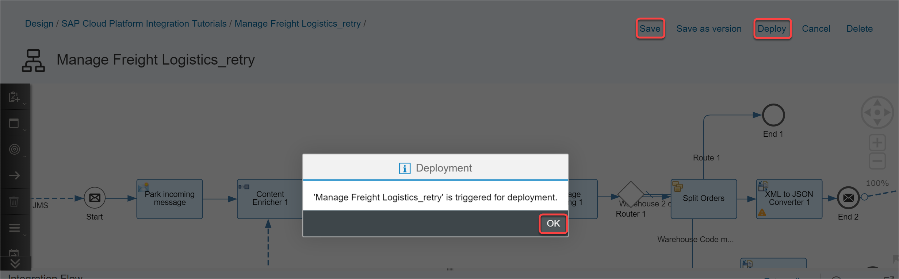

    As soon as the flow is deployed, it starts polling the queue for messages. As a result, the message from the queue should now be picked by the retry integration flow and processed.

2. Check the queue view: since the message is now picked, we should not see any messages in the queue:

    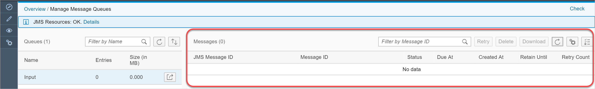

3. Since we do not raise an exception in the retry flow, this time, the flow will execute successfully and you should receive an email in the configured inbox.

    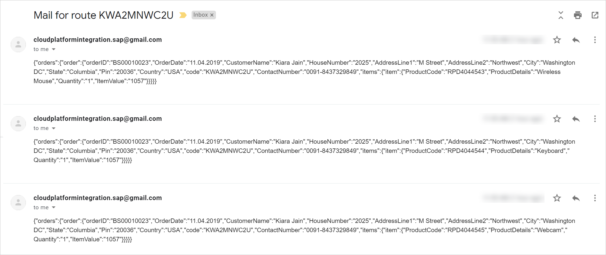


[VALIDATE_1]

[ACCORDION-END]


---
