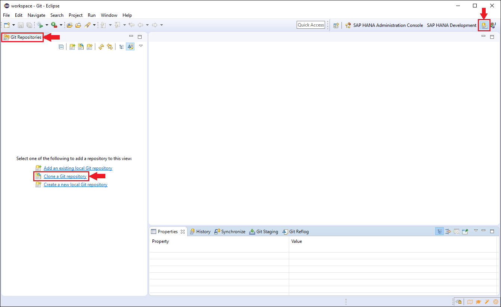
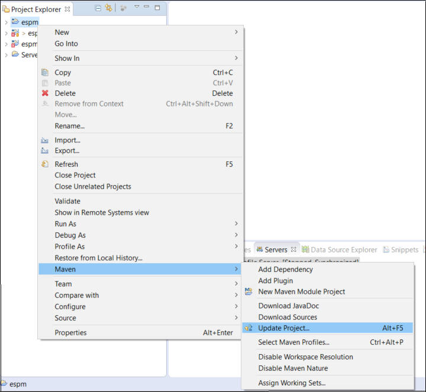
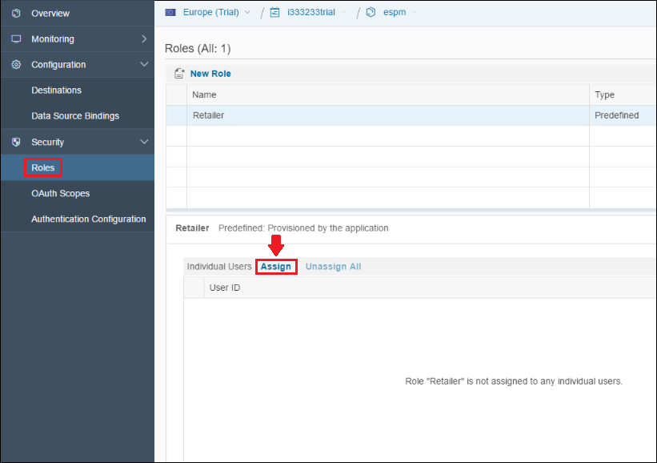

## Prerequisites  
 - **Proficiency:** Beginner

## Details
### You will learn  
- How to build the ESPM application on SAP Cloud Platform
- How to bind the application to a database
- How to add the retailer role

### Time to Complete
**15 Min**

---

[ACCORDION-BEGIN [Step 1: ](Clone the Git Repository)]
In this step you will create a git repository in the Eclipse IDE and copy the repository of the ESPM application.

1. Copy the repository URL.

    a. In your browser, go to <https://github.com/SAP/cloud-espm-v2>.

    b. Choose **Clone or Download**, and copy the URL. You can click  ( **Copy to clipboard** ).

2. Clone the Git repository in Eclipse.

    a. In Eclipse, select **Window** > **Perspective** > **Open Perspective** > **Other**.

    b. Select **Git** and click **OK** to open the **Git** perspective.

    c. From the **Git Repositories** view on the left select **Clone a Git repository**.

    As you already copied the `cloud-espm-v2` Git repository URL to your clipboard, the URI, Host, Repository path and Protocol fields are automatically filled.

    

    d. Choose **Next**.

    e. Select the master branch and choose **Next**.

    f. You will see the directory where the application will be stored. Choose **Finish**.

[DONE]
[ACCORDION-END]

[ACCORDION-BEGIN [Step 2: ](Import and Build the Maven Project)]

The following steps describe how you can import and then update the Maven project (which fixes any Maven and POM dependency-related issues). Then you will build the Maven project in Eclipse.

1. Import and update the Maven project

    a. In Eclipse, switch back to the **Java EE** perspective and go to **File > Import**.

    b. From the Import box that appears select **Maven > Existing Maven projects** and choose **Next**.

    c. Specify the root directory of the application (usually Git stores its information in your user folder, then a folder named "git" and then under a folder with the application name), then choose **Finish**.

    d. To update the dependencies right click on the **`espm` project > Maven > Update Project** and choose **OK** from the box that appears.
    
2. Build the Maven project

    a. Right click on the **`espm` project > Run As > Maven build...**

    b. In the **Goals** field type in **`clean install`** and choose **Run**. In a couple of minutes the project will be build.

[DONE]
[ACCORDION-END]

[ACCORDION-BEGIN [Step 3: ](Deploy the Application)]

The steps below outline the way in which you can deploy the ESPM Application on the SAP Cloud Platform.

1. Go to the [SAP Cloud Platform Cockpit](https://account.hanatrial.ondemand.com) and select the **Neo trial** button.

2. Go to **Applications** > **Java Applications** and click on **Deploy Application**.

3. Click on the **Browse** button next to the WAR File Location field and select the **git folder > `cloud-espm-v2` > deploy** and then select the `.war` file.

4. Change the Application Name to `espm` and select **Deploy**.

5. Once you receive the message that your application has been successfully deployed, click on the **Done** button.

[VALIDATE_1]
[ACCORDION-END]

[ACCORDION-BEGIN [Step 4: ](Bind the Application to a Database)]

This step describes how to create a new Schema in the cockpit and bind it to the application.

1. Create a new schema

    a. In the cockpit, select your account and choose **SAP HANA / SAP ASE** > **Databases & Schemas** from the navigation pane.

    b. Select the New button and enter the following information in the pop up window that appears, then click Save.

    Database ID: **`espm`**
    Database System: **`HANA MDC (<trial>)`**

2. Bind the database to the application

    a. Select your account and choose **Applications > Java Applications** from the Navigation pane.

    b. Click on the name of the **`espm`** application.

    c. From the Navigation pane select **Configuration > Data Source Bindings**.

    d. Select the **New Binding** button and enter the following information in the pop up window, then select **Save**.

Data Source: **`<default>`**
DB/Schema ID: **`espm`**
Database System: **`HANA (<shared>)`**

[DONE]
[ACCORDION-END]

[ACCORDION-BEGIN [Step 5: ](Add the Retailer Role)]

You need to add the Retailer role in the cockpit in order to be able to access the application with the Retailer UI.

1. Assign a user to the Retailer role.

    a. In the cockpit, click on the **`espm application`** and go to **Security > Roles**.

    b. Select **Assign*** and add your User ID. It is important that you add you user ID without the "trial" part.

    
2. Start and access the application

    a. Start the `ESPM` application by going to **Applications** > **Java Applications** and selecting the **`espm`** application. Then choose the **Start** button.

    b. Once the application has been started in the cockpit you can access it by using the URL under the Application URLs field.

    c. In order to access the application with the Retailer UI you need to change the `webshop` part of the URL to `retailer`.

    You can also access the application through the following links

- for the `eCommerce` site: 'https://espm\.hanatrial.ondemand.com/espm-cloud-web/webshop'
- for the Retailer UI: 'https://espm\.hanatrial.ondemand.com/espm-cloud-web/retailer'

Note: If you did not name the application `ESPM` during the deployment, you have to change the name part in the URL respectively.

[DONE]
[ACCORDION-END]

---
