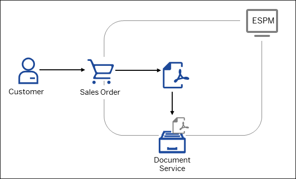
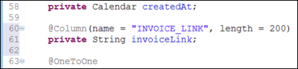
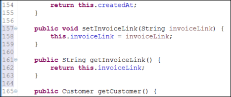
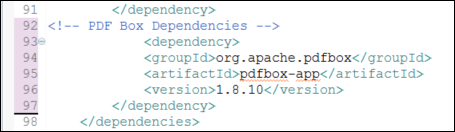
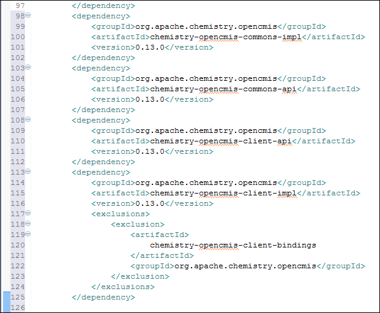
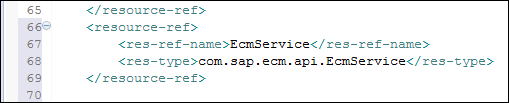
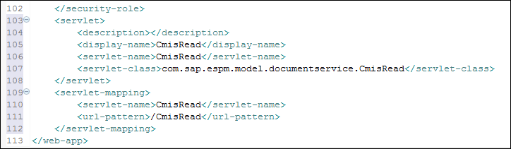
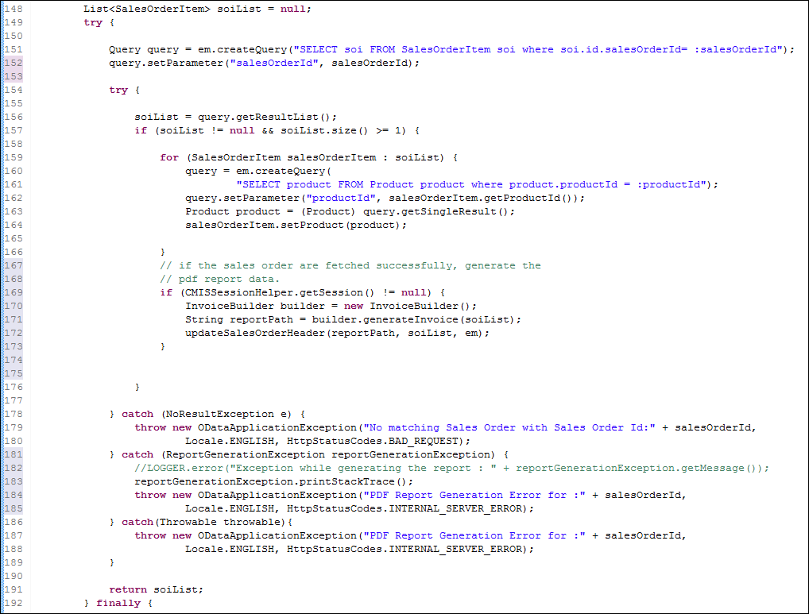
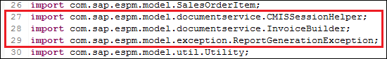
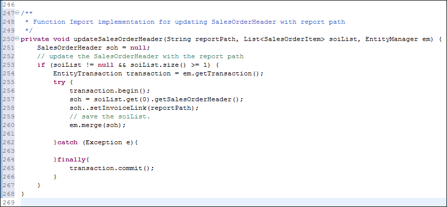

## Prerequisites  
 - You need to check out the _base_ branch from the GitHub repository.
 This branch contains the `vanilla espm` application on which you will be building upon in order to implement the document service.
 1. In Eclipse, go to the **Git** perspective.
 2. From the **Git Repositories** view on the left choose **`espm2.0`** > **Branches** > **Remote Tracking** and double-click the **origin/base** branch.
 3. Choose **Checkout as New Local Branch** from the dialog box that appears.
 > Note: You might notice there are errors in the project as you follow the steps below. All errors should be resolved once you do a maven build as described in Step 7 of this tutorial.

## Details
### You will learn  
  - How to connect your application to the Document service
  - How to store sales orders in the Document service repository

The SAP Cloud Platform Document service is used for managing files and folders on the cloud. It provides an on-demand content repository for unstructured storage. It is an easy-to-consume, central shared service that provides secure storage for content of SAP Cloud Platform. It can be implemented in applications that require document management as well as applications with binary large objects. See [Document Service](https://help.sap.com/viewer/b0cc1109d03c4dc299c215871eed8c42/Cloud/en-US/e60b7e45bb57101487a881c7c5487778.html).

To demonstrate the use of the Document service it has been implemented in the `ESPM webshop` application. Customers can create sales orders and pdf versions of those orders are then stored in the Document service repository. Once an order has been created the customer can go and download its pdf version.



---
[ACCORDION-BEGIN [Step 1: ](Update the SalesOrderHeader Model Class)]
The invoice PDF document is stored in the document service repository. Its path needs to be updated in the `SalesOrderHeader` class by adding property for storing the invoice link.

1. Switch to the **Java EE** perspective.
2. Go to

      Module: `espm-cloud-jpa`

      Path: `src/main/java > com.sap.espm.model`

      JPA Entity Class: `SalesOrderHeader`

      Add the following property for storing the invoice link. Then add its getter and setter methods.

```
@Column(name = "INVOICE_LINK", length = 200)
   private String invoiceLink;
}
```


```
public void setInvoiceLink(String invoiceLink) {
		this.invoiceLink = invoiceLink;
	}

	public String getInvoiceLink() {
		return this.invoiceLink;
	}
```



[DONE]
[ACCORDION-END]

[ACCORDION-BEGIN [Step 2: ](Add the Document Service and PDFbox Dependencies)]
1. Add the below dependency references to the `Apache PDFBox` in the `pom.xml` file.

      The `Apache PDFBox` library is an open source Java tool for working with PDF documents. It can be used for creation of new PDF documents, manipulation of existing ones, and to extract content from documents. For more information, see [`PDFBox`](https://pdfbox.apache.org/).

      Module: `espm-cloud-web`

```
          <!-- PDF Box Dependencies -->
            <dependency>
            <groupId>org.apache.pdfbox</groupId>
            <artifactId>pdfbox-app</artifactId>
            <version>1.8.10</version>
          </dependency>
```




2. Add the dependency references to `Apache Chemistry OpenCMIS` in the `pom.xml` file.

      Applications access the document service using OASIS standard protocol Content Management Interoperability Service (CMIS).
      Java applications running on SAP Cloud Platform can easily consume the document service using the provided client library.
      Since the document service is exposed using a standard protocol, it can also be considered by any other technology that supports the CMIS protocol.
      For more information about the `OpenCMIS`, see [Apache Chemistry](https://pdfbox.apache.org/)

      Module: `espm-cloud-web`

```
<dependency>
     		  <groupId>org.apache.chemistry.opencmis</groupId>
     		  <artifactId>chemistry-opencmis-commons-impl</artifactId>
     		  <version>0.13.0</version>
     	  </dependency>
     	  <dependency>
     		  <groupId>org.apache.chemistry.opencmis</groupId>
     		  <artifactId>chemistry-opencmis-commons-api</artifactId>
     		  <version>0.13.0</version>
     	  </dependency>
     	  <dependency>
     		  <groupId>org.apache.chemistry.opencmis</groupId>
     		  <artifactId>chemistry-opencmis-client-api</artifactId>
     		  <version>0.13.0</version>
     	  </dependency>
     	  <dependency>
     		  <groupId>org.apache.chemistry.opencmis</groupId>
     		  <artifactId>chemistry-opencmis-client-impl</artifactId>
     		  <version>0.13.0</version>
     		  <exclusions>
     			  <exclusion>
     				  <artifactId>
     					  chemistry-opencmis-client-bindings
     				  </artifactId>
     				  <groupId>org.apache.chemistry.opencmis</groupId>
     			  </exclusion>
     		  </exclusions>
     	  </dependency>
```



3. Define a resource reference in the `web.xml` in order to connect to the `ECMService` in the `web.xml` file.

      Module: `espm-cloud-web`
      Path: `src > main > webapp > WEB-INF > web.xml`

```
<resource-ref>
    <res-ref-name>EcmService</res-ref-name>
    <res-type>com.sap.ecm.api.EcmService</res-type>
</resource-ref>
```



[DONE]
[ACCORDION-END]

[ACCORDION-BEGIN [Step 3: ](Create a Document Service Repository)]
1. The Java properties file `config.properties` is used to store properties required for creating document service and read from it.

      Add the `config.properties` file in the following path with the below content.

      Module: `espm-cloud-web`

      Path: `espm-cloud-web > src > main > resources`

```
  #ESPM Document Repository Properties  
  uniqueName=espmdocs.repository  
  secretKey=Espm@1234567890  
```

[DONE]
[ACCORDION-END]

[ACCORDION-BEGIN [Step 4: ](Connect to the Document Service)]
1. Create a class `ReadProperties.java`.
This file will read properties from `config.properties` for the document service.

      Module: `espm-cloud-web`

      Package: `com.sap.espm.model.util`

      Use [the following code](https://github.com/SAP/cloud-espm-v2/blob/master/espm-cloud-web/src/main/java/com/sap/espm/model/util/ReadProperties.java) to implement the class.

[DONE]
[ACCORDION-END]

[ACCORDION-BEGIN [Step 5: ](Create the Necessary Classes)]
The following steps describe how to create classes for generating the Invoice PDF document, storing it in the document service repository, and for a return path to it.
1. Create the exception class `CMISConnectionException.java` for handling CMIS exceptions.

      Module: `espm-cloud-web`

      Package: `com.sap.espm.model.exception`

      Use [the following code](https://github.com/SAP/cloud-espm-v2/blob/master/espm-cloud-web/src/main/java/com/sap/espm/model/exception/CMISConnectionException.java) to implement the class.

2. Create a new class `CMISSessionHelper.java`. This class provides the implementation to connect to the document service and create the repository.

      Module: `espm-cloud-web`

      Package: `com.sap.espm.model.documentservice`

      Use [the following code](https://github.com/SAP/cloud-espm-v2/blob/master/espm-cloud-web/src/main/java/com/sap/espm/model/documentservice/CMISSessionHelper.java) to implement the class.

3. Create the exception class for handling the PDF generation exceptions `ReportGenerationException.java`.

      Module: `espm-cloud-web`

      Package: `com.sap.espm.model.exception`

      Use [the following code](https://github.com/SAP/cloud-espm-v2/blob/master/espm-cloud-web/src/main/java/com/sap/espm/model/exception/ReportGenerationException.java) to implement the class.

4. Create class `InvoiceBuilder.java` for creating invoice PDF document, storing it in the repository, and for a return path to it.

      Module: `espm-cloud-web`

      Package: `com.sap.espm.model.documentservice`

      Use [the following code](https://github.com/SAP/cloud-espm-v2/blob/master/espm-cloud-web/src/main/java/com/sap/espm/model/documentservice/InvoiceBuilder.java) to implement the class.

5. Create a Servlet Class `CmisRead.java`.

      When users click on any sales order from the list of sales orders, it will call `CmisRead` Servlet with a get URL parameter which contains the ID of the file/document clicked.
      This ID is what we will be saving in the database when we persist a file to document services repository during Sales Order Creation in ESPM.
      The `CmisRead` Servlet will read the file as stream based on the ID and force it to be downloaded by the browser.

      Module: `espm-cloud-web`

      Package: `com.sap.espm.model.pdf.generator`

      Use [the following code](https://github.com/SAP/cloud-espm-v2/blob/master/espm-cloud-web/src/main/java/com/sap/espm/model/pdf/generator/CmisRead.java) to implement the class.

6. Add the Servlet mapping in the `web.xml` file.

```
<servlet>
        <description></description>
        <display-name>CmisRead</display-name>
        <servlet-name>CmisRead</servlet-name>
        <servlet-class>com.sap.espm.model.pdf.generator.CmisRead</servlet-class>
</servlet>
<servlet-mapping>
        <servlet-name>CmisRead</servlet-name>
        <url-pattern>/CmisRead</url-pattern>
</servlet-mapping>
```



[DONE]
[ACCORDION-END]

[ACCORDION-BEGIN [Step 6: ](Update Class with the Path to the Invoice PDF Document)]
1. When the end user creates an order, the instance of the `invoiceBuilder` class needs to be called to create the PDF document and update the sales order.
For this, the class `SalesOrderProcessor.java` has to be modified. The code snipped below should be added in the get `SalesOrderById` method.

      Package: `com.sap.espm.model.function.impl`

      Class: `SalesOrderProcessor.java`

      Method: `getSalesOrderById`

```
try {

   Query query = em.createQuery("SELECT soi FROM SalesOrderItem soi where soi.id.salesOrderId= :salesOrderId");
   query.setParameter("salesOrderId", salesOrderId);

   try {

   	soiList = query.getResultList();
   	if (soiList != null && soiList.size() >= 1) {

   		for (SalesOrderItem salesOrderItem : soiList) {
   			query = em.createQuery(
   					"SELECT product FROM Product product where product.productId = :productId");
   			query.setParameter("productId", salesOrderItem.getProductId());
   			Product product = (Product) query.getSingleResult();
   			salesOrderItem.setProduct(product);

   		}
   		// if the sales order are fetched successfully, generate the
   		// pdf report data.
   		if (CMISSessionHelper.getSession() != null) {
   			InvoiceBuilder builder = new InvoiceBuilder();
   			String reportPath = builder.generateInvoice(soiList);
   			updateSalesOrderHeader(reportPath, soiList, em);
   		}


   	}

   } catch (NoResultException e) {
   	throw new ODataApplicationException("No matching Sales Order with Sales Order Id:" + salesOrderId,
   			Locale.ENGLISH, HttpStatusCodes.BAD_REQUEST);
   } catch (ReportGenerationException reportGenerationException) {
   	//LOGGER.error("Exception while generating the report : " + reportGenerationException.getMessage());
   	reportGenerationException.printStackTrace();
   	throw new ODataApplicationException("PDF Report Generation Error for :" + salesOrderId,
   			Locale.ENGLISH, HttpStatusCodes.INTERNAL_SERVER_ERROR);
   } catch(Throwable throwable){
   	throw new ODataApplicationException("PDF Report Generation Error for :" + salesOrderId,
   			Locale.ENGLISH, HttpStatusCodes.INTERNAL_SERVER_ERROR);
   }

   return soiList;
```



2. Add the import statements as shown in the snipped below.

```
import com.sap.espm.model.documentservice.CMISSessionHelper;
import com.sap.espm.model.documentservice.InvoiceBuilder;
import com.sap.espm.model.documentservice.ReportGenerationException;
```



3. Add the function for updating the `SalesOrderHeader` with path to the invoice PDF document.

      Package: `com.sap.espm.model.function.impl`

      Class: `SalesOrderProcessor.java`

      Method: `updateSalesOrderHeather`

```
/**
 * Function Import implementation for updating SalesOrderHeader with report path
 */
private void updateSalesOrderHeader(String reportPath, List<SalesOrderItem> soiList, EntityManager em) {
    SalesOrderHeader soh = null;
    // update the SalesOrderHeader with the report path
    if (soiList != null && soiList.size() >= 1) {
   	 EntityTransaction transaction = em.getTransaction();
   	 try {
   		 transaction.begin();
   		 soh = soiList.get(0).getSalesOrderHeader();
   		 soh..setInvoiceLink(reportPath);
   		 // save the soiList.
   		 em.merge(soh);

   	 }catch (Exception e){

   	 }finally{
   		 transaction.commit();
   	 }
    }
}
```



[DONE]
[ACCORDION-END]

[ACCORDION-BEGIN [Step 7: ](Add UI Changes)]
Add UI changes for viewing the Sales Order information and downloading the invoice PDF document.
For the end user to view their new orders, there is a separate view that needs to be enabled.

This view is shown on click of the **View my sales orders** button in the home page of the application.

  Path: `espm-cloud-web > src > main > webapp > webshop > controller`

  The below code snippet needs to be added to the function `onOrdersButtonPressed` in the `Home.controller.js` file.

```
  //var oBundle = this.getView().getModel('i18n').getResourceBundle();
  //MessageBox.information(oBundle.getText("soPopup.notImplemented"));
  var oRouter = UIComponent.getRouterFor(this);
  oRouter.navTo("SalesOrder");
```

[VALIDATE_1]
[ACCORDION-END]

[ACCORDION-BEGIN [Step 8: ](Build and update the Maven project)]
1. Do a Maven build of the project.
    - Right click on the **`espm` project** > **Run As** > **Maven build...**
    - In the **Goals** field type in `clean install` and choose **Run**. In a couple of minutes the project will be build.
2. After the build is done, do a Maven update on the project.
    - Right click on the **`espm` project** > **Maven** > **Update Project**.
    - Choose **OK** from the box that appears.

[DONE]
[ACCORDION-END]

[ACCORDION-BEGIN [Step 9: ](Document Service Demo)]
**Prerequisite:** In order to be able to download the pdf version of the sales order you have to place an order first.

1. From the application home page choose  -- **_View my sales orders_** -- in the upper-right corner.
2. In the **Email address** box that appears enter the registered email ID and choose the **Get sales orders list** button.
3. Once the **Sales order** list appears select the sales order you placed and information about the customer and the selected product will be displayed on the right side of the screen.
4. Choose the **Download PDF file** button in the bottom right corner.

[DONE]
[ACCORDION-END]


---
