## Prerequisites  
 - **Proficiency:** Intermediate

## Details
### You will learn
- How to expose OData into SAP Jam
- How to implement business records into SAP Jam using OData Annotations

### Time to Complete
**25 Min**

---
[ACCORDION-BEGIN [Step 1: ](Create an External Application in SAP Jam)]

There are two types of major applications whose content can be integrated into SAP Jam - document repositories and business records. Business records of type OData are integrated in the ESPM implementation of SAP Jam. In the case of the ESPM application, the Products and Customer Reviews data is exposed via OData into SAP Jam. The OData is mapped into graphical objects using an OData Annotations file, which is organized in accordance with the layout of the graphical user interface (GUI) objects, with indications about the type of data that should populate each segment of the GUI. In this tutorial, the OData Annotations file will be reviewed.

For more information about the use case and steps needed to integrate ESPM and SAP Jam, see the SAP Jam Overview and Integration tutorial. In this tutorial, the OData annotations file is already created and made available in `espm-cloud-web` module, path - `src/main/webapp/webshop/reviews_annotations.xml`.

[DONE]
[ACCORDION-END]
[ACCORDION-BEGIN [Step 2: ](Types of SAP Jam GUI Objects, Displaying Business Records)]

SAP Jam provides three basic types of GUI objects that display business records for external applications. This tutorial explains how you can create the OData annotations file containing the necessary annotations for rendering the ESPM business records data in the below GUI objects.

1. Business Records List View

      This view displays a list of the business records.

      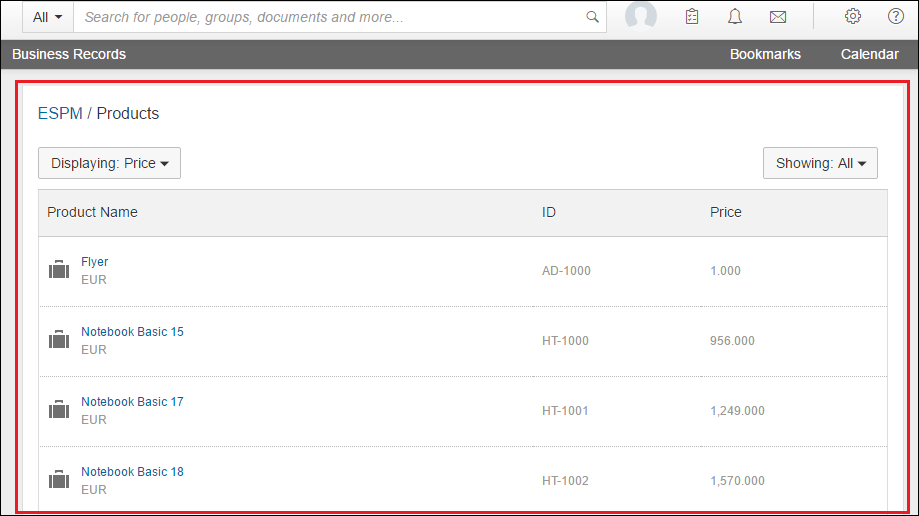

2. Business Records Details View

      This view displays the details of a business record. It appears as a top-level navigation for groups which are associated directly with an `ExternalObject`. The details can also be viewed when clicking on a business record within a list of Business Records.

      
3. `QuickView` Control

      The `QuickView` control renders external object details in a pop-up window when a user hovers over an object.

      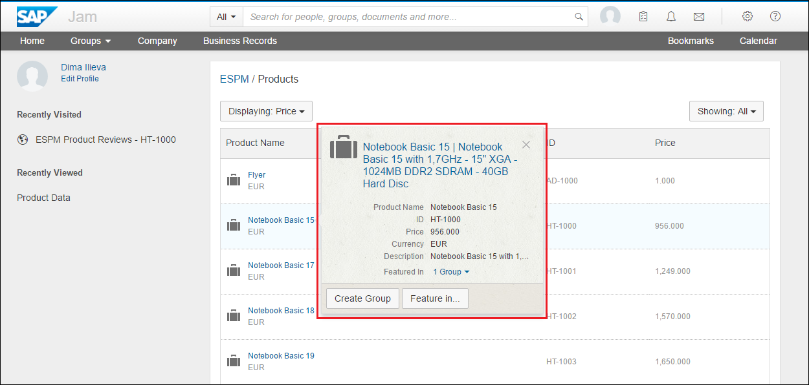

[VALIDATE_1]
[ACCORDION-END]

[ACCORDION-BEGIN [Step 3: ](OData Annotations)]

An EDMX file is an Entity Data Model XML file, which is made up of a conceptual model, a storage model, and the mapping between these two models. In this case, the ESPM OData metadata file is the EDMX file.

Annotations, specified in the OData Annotations file, map data from a specified OData API to a layout of that data that can be easily consumed by user interface (UI) component.

OData Vocabularies are the basis of OData Annotations. The OData Vocabulary terms are used in the annotations file. SAP Jam OData annotations, therefore, provide a way to map data from external applications for the graphical display of that data in a page in a SAP Jam group.

[DONE]
[ACCORDION-END]

[ACCORDION-BEGIN [Step 4: ](Developing the OData Annotations File)]

The file [reviews annotations](https://github.com/SAP/cloud-espm-v2/blob/master/espm-cloud-web/src/main/webapp/webshop/reviews_annotations.xml) is the OData annotations file for the ESPM application.
The process of creating the contents of the annotations file can be divided into two steps.

1. Write the EDMX wrapper around the OData annotations core.

      The EDMX wrapper describes, and links to, the XML NameSpaces that are used in the mapping. For the ESPM application, below is the XML code snapshot.

      

      - The reference to **`Alias UI`** specifies namespace for UI vocabularies from SAP which contain the vocabularies terms for displaying data in the above mentioned GUI types.
      - The reference to **`Alias ESPM`** refers to the metadata of the ESPM OData service, which will later be used to specify the annotation targets.
      - The **`Schema`** denotes the root of the annotations which is defined by the namespace.

2. Write the annotations specifying the mapping between Business Objects from OData API and Jam GUI objects that display them.
The Annotations element is used to apply a group of type or value annotations to a single model element.
      - **`Target`** - specifies the model element
      - **`Term`** - the vocabulary term that must be applied
      - **`Path`** - path the in model element that specify the value

      For the ESPM application, we define two annotation elements, one for each business object:
      - **`ESPM.Product`** -  this is the annotation, specifying how the `Product EntitySet` is displayed.
      - **`ESPM.CustomerReview`** - his is the annotation, specifying how the `CustomerReview EntitySet` is displayed.

      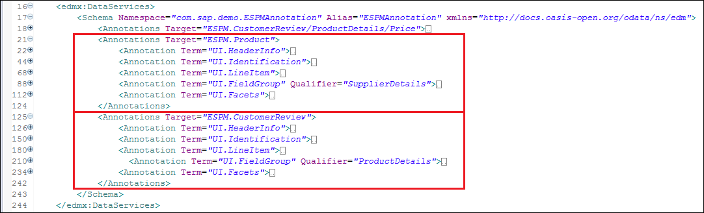

      Each annotation term maps to a GUI object in SAP Jam as follows
      - **`UI.HeaderInfo`** - refers to the header displayed in `UI.Identification`.

      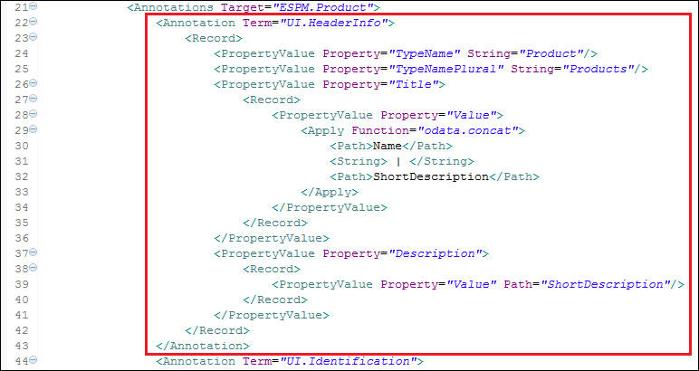

      

      - **`UI.Identification`** - refers to the `QuickView` Control and the Business Records Details View. Each record specifies one row in the `QuickView` Control and the Business Records Details View.

      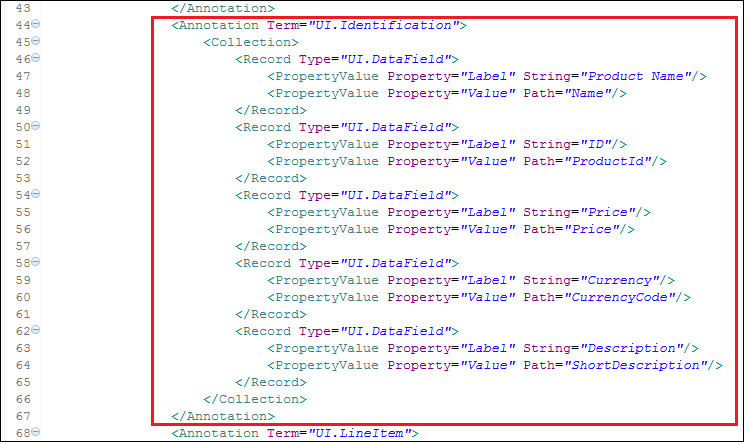

      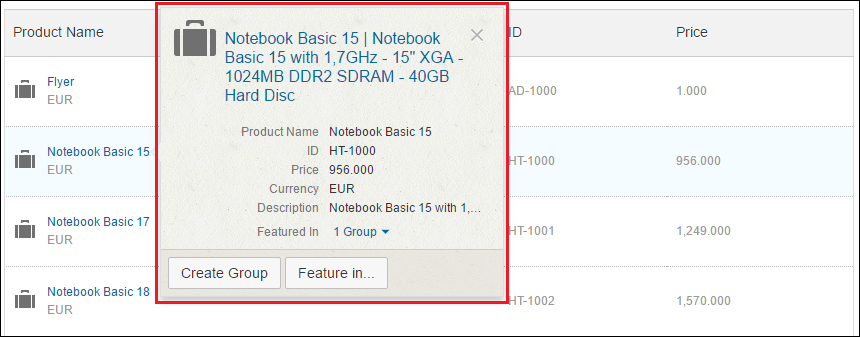

      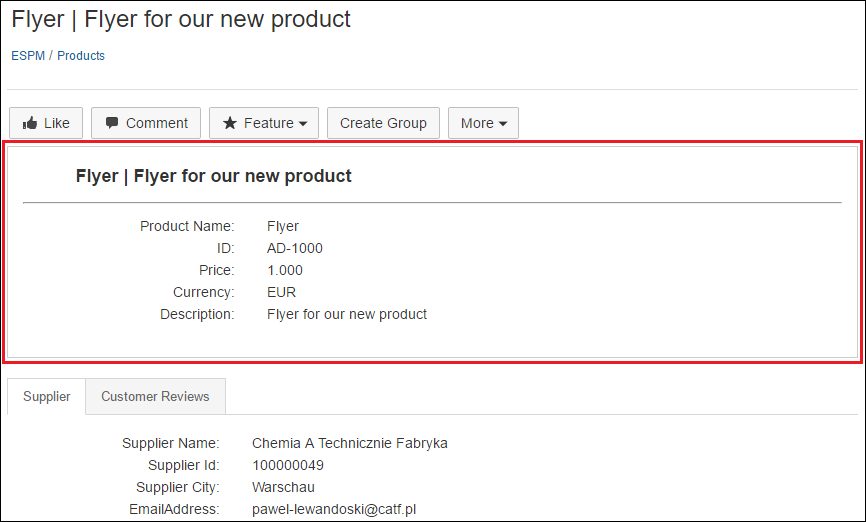

      - **`UI.LineItem`** - refers to the columns that are displayed in the Business Records List View. Each record specifies one column in the Business Records List View.

      

      

      - **`UI.FieldGroup`** - refers to the grouping of fields that are displayed in `UI.Facets`.

      

      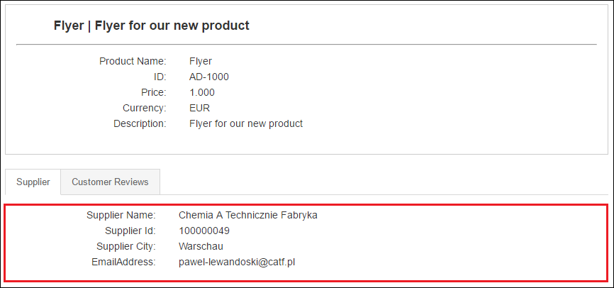

      - **`UI.Facets`** - refers to UI tabs that are displayed in the Business Records Details View. Each record specifies one tab.

      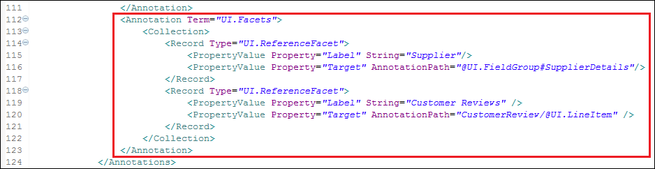

      

[DONE]
[ACCORDION-END]

[ACCORDION-BEGIN [Step 5: ](Important Snippets of Annotations in ESPM Jam Integration)]

1. For the `UI.HeaderInfo` in both `ESPM.Product` and `ESPM.CustomerReview`, the OData concatenation function is used for the title.
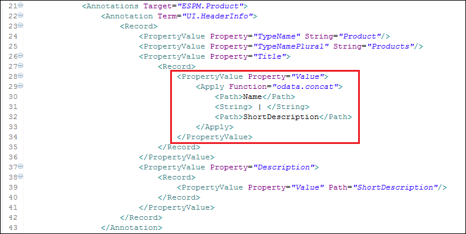

      - For the `ESPM.Product`, `ESPM.CustomerReview` has been added as related business records.

      This is achieved via the `UI.ReferenceFacet` highlighted below.

      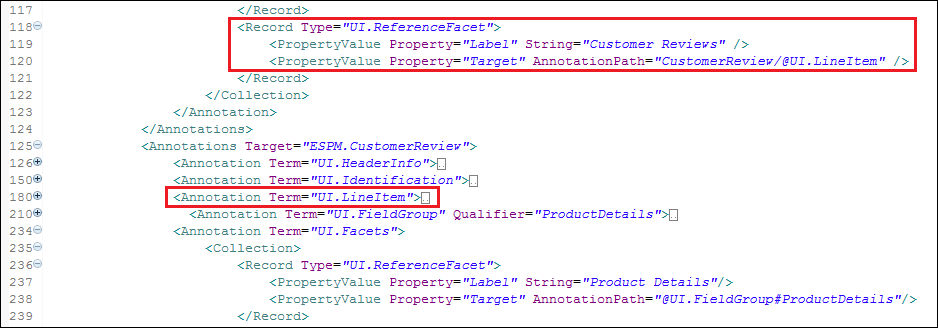

[DONE]
[ACCORDION-END]
