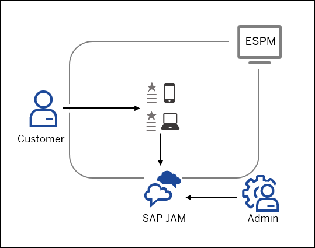
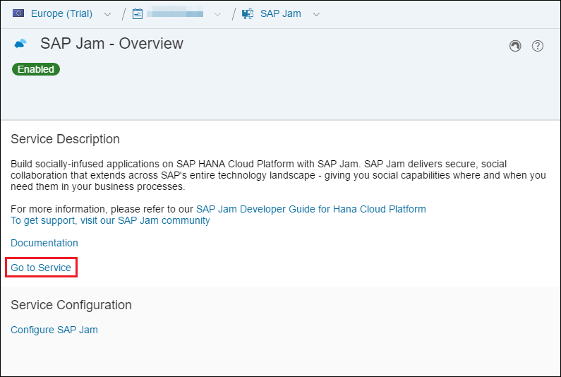
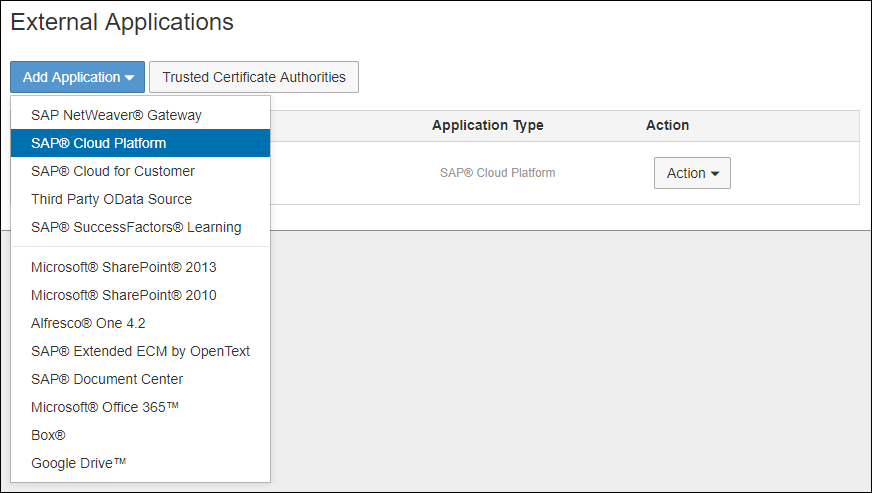
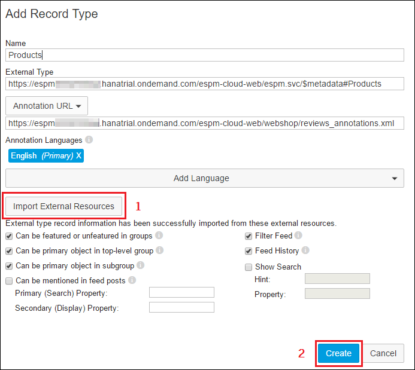
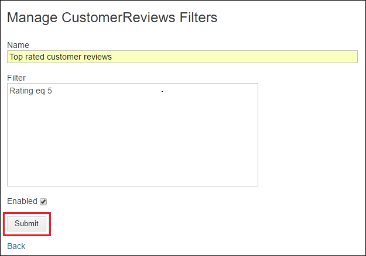
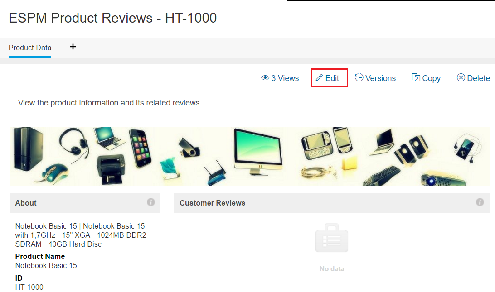

## Details
SAP Jam is SAP's cloud-based social platform for collaboration. It delivers secure collaboration in your working environment. In the case of the `ESPM` application, by integrating SAP Jam, customer reviews can be grouped into different categories to allow their better and faster analysis. Customers can write reviews and rate the products. This product reviews information can be fetched from within SAP Cloud Platform into SAP Jam. The admin can then analyze the data and receive information on top-rated products, bottom-rated products, etc. By using SAP Jam for collaboration, product managers and sales team can work together in order to analyze this information and optimize their strategy.

## Prerequisites  
 1. Make sure you have SAP Jam enabled in the SAP Cloud Platform cockpit.
    a. In the HCP cockpit, go to your account.
    b. From the Navigation menu on the left select **Services**.
    c. Select **SAP Jam**. The SAP Jam - Overview page will appear.
    d. Click on the **Enable** button to enable the service.
  2. Your `ESPM` application has been deployed and started as described in the `Set Up Your Environment` tutorial.

### You will learn  
- How to create a secure data connection between SAP Jam and an external business application
- How to define in what way the data from the external application will be displayed within SAP Jam
- How to create filters for the  record types

### Time to Complete
**20 Min**

---
[ACCORDION-BEGIN [Step 1: ](Launch SAP Jam Service)]

1. In the SAP Cloud Platform cockpit go to your account and select **Services** from the Navigation menu on the left.

2. Select **SAP Jam**.

3. From the **SAP Jam Overview** page that appears select the **Go to Service** link. This will start your own tenant for SAP Jam.

    

[VALIDATE_1]
[ACCORDION-END]

[ACCORDION-BEGIN [Step 2: ](Create an External Application in SAP Jam)]

This procedure is used to create a secure data connection between SAP Jam and an external business application.

1. In SAP Jam, click on   ( **Settings** ) in the top right corner and select **Admin**. The SAP Jam Admin page will appear.
2. From the sidebar menu on the left choose **Integrations** > **External Applications**. This will open the **External Applications** page.

3. Select **Add Application**. You will see a list of SAP and third party applications that can be integrated with SAP Jam. From this drop-down menu choose **SAP Cloud Platform**.

    

4. In the **Name** text box that appears type in `ESPM`.

5. Click on the **Select Authentication Type** drop-down menu and select **Common User**. For business record integrations, only **Common User** mode is used for testing and development purposes. For production systems, the **Authentication Type** should always be **Per User**.

6. Leave the **User Name** and **Password** fields blank and click **Save** to create the External Application.

The `ESPM` External Application you created will appear in the **External Applications** list that opens.

[DONE]
[ACCORDION-END]

[ACCORDION-BEGIN [Step 3: ](Import the ESPM Web Shop Records into SAP Jam)]

Record types in SAP Jam define how the data from the external application will be displayed within SAP Jam.

1. Import the Product Records

    a. From the **External Applications** page, select **Action** > **Manage Record Types** next to the `ESPM` application.

    b. Click on the **Add Record Type** button.

    c. In the **Name** text box, enter `Products`.

    d. In the **External Type** text box enter `https://espmxxxxxxxtrial.hanatrial.ondemand.com/espm-cloud-web/` and add `espm.svc/$metadata#Products`.
 This data includes the information on the products included in the `ESPM` application. It is exposed as OData.

    e. In the **Annotation URL** text box enter `https://espmxxxxxxxtrial.hanatrial.ondemand.com/espm-cloud-web/webshop/` and add `reviews_annotations.xml`.
    This file is used by SAP Jam to render the data.

    The `annotations.xml` file, together with the available data, exposed via OData, enables you to create an external application in SAP Jam that brings in products and product reviews data from the `ESPM` application into SAP Jam. The OData annotations file specifies how each type of data is displayed in a specified UI element.

    f. Select the **Import External Resources** button. A success page will be displayed. Choose **Done**.

    g. Click on the **Create** button.

    

    h. **Products** is created as an entry in the **Manage ESPM Record Types** page.

2. Import the Customer Reviews Records

    a. To import the Customer Reviews records repeat steps **_b_** to **_g_** again, but change the **Name** value in step **_c_** to `CustomerReviews` and the **External Type** value in step **_d_** to `https://espmxxxxxxxtrial.hanatrial.ondemand.com/espm-cloud-web/` and add `espm.svc/$metadata#CustomerReviews`.

    b. **`CustomerReviews`** is created as an entry in the **Manage ESPM Record Types** page.

[DONE]
[ACCORDION-END]

[ACCORDION-BEGIN [Step 4: ](Create Filters for Products and Customer Reviews Record Types)]

In order to be able to analyze the top and bottom rated products based on the customer reviews and ratings, you need to create filters for the **`CustomerReviews`** record types.

1. Create a filter for the top rated customer reviews.

    a. Select the **Filters** link from the **Manage ESPM Record Types** page, next to the **`CustomerReviews`** record.

    b. Click on the **New Filter** button.

    c. In the **Name** text box, enter `Top rated customer reviews`.

    d. In the **Filter** text box, enter `Rating eq 5`. The rating system of the `ESPM` application is from 1 to 5 and all top reviews would have the value 5.

    e. Select the checkbox next to **Enabled**.

    f. Click the **Submit** button.

    

2. Create a filter for the bottom rated customer reviews

    To create a filter for the bottom rated customer reviews repeat steps b to f, but change the **Name** value to `Bottom rated customer reviews` and the **Filter** text to `Rating eq 1` as this is the lowest possible rating.

[DONE]
[ACCORDION-END]

[ACCORDION-BEGIN [Step 5: ](Import the ESPM Reviews Group Template into SAP Jam)]

Group templates are used to organize content in a way that provides guidance to users on the best way to approach the work required to support a particular repeatable business process.

1. Import the group template.

    a. Download the group template zip file from the following URL
<https://sapjamsamplecode.github.io/GroupTemplates/ESPM_Reviews-Products.zip>

    b. Select  ( **Settings** ) and choose **Admin**.

    c. From the sidebar menu on the left choose **Product Setup** > **Group Templates**.

    d. Select the **Import a template** button.

    e. Navigate to the group template zip file you downloaded.

    f. Click the **Open** button.

    g. Click the **Import** button.

    h. Once the template has been imported an **Import a template** dialog box will be displayed. Select the **OK** button.

    i. Refresh the web page and you will see a new group template titled _ESPM Reviews - Products_. If you do not see the new group template, wait 30 seconds and try again.

2. Activate the group template

    Click the slider button next to the `ESPM` group template to enable it. The group template is now active.
[DONE]
[ACCORDION-END]

[ACCORDION-BEGIN [Step 6: ](Access the ESPM Business Records)]
1. Select **Business Records** from the top menu bar.

      

2. Select **ESPM** from the **Name** column.

3. Select **Products** from the **Type** column. A list of IDs from `ESPM` will be displayed.
[DONE]
[ACCORDION-END]

[ACCORDION-BEGIN [Step 7: ](Create an ESPM Reviews group in SAP Jam)]
1. Copy the ID value next of the **Notebook Basic 15** from the **ID** column.
2. Hover over the "Notebook Basic 15" in the **Product Name** column and a quick view panel of the product will appear.
3. Select the **Create Group** button in the quick view panel.
4. Click on the **No Template** drop-down list and select the **ESPM Reviews - Products** group template.
5. In the **Type a Group Name** text box, enter `ESPM Product Reviews -` and paste the ID value you copied after the dash.
6. Select **Public** to set the **Group Permissions**.
7. Select the **Activate this group now** checkbox.
8. Click the **Create** button. The new group has now been created.

[DONE]
[ACCORDION-END]

[ACCORDION-BEGIN [Step 8: ](Reconfigure the ESPM Reviews Group Widgets)]

You can manage the appearance and page design of your groups with the easy-to-use group widgets.

1. Open the **Customer Reviews** widget.

    a. From **Groups** drop-down menu in the top right corner select **ESPM Product Reviews - `HT-1000`**.

    b. Select **Overview** from the sidebar menu on the left.

    c. Choose **Edit**.

    

2. Configure the **Customer Reviews** widget.

    a. Hover over the **Customer Reviews** widget. The  ( **Edit** and **Remove** ) menu appears.

    b. Select  ( **Edit** ).

    c. Select **Customer Reviews** from the **Update Widget** drop-down menu.

    d. Select **Related** from the **Show** drop-down menu.

    e. Click the **OK** button. The **Customer Reviews** widget information appears.

3. Configure the **Top Rated Customer Reviews** widget.

    a. Hover over the **Top Rated Customer Reviews** widget. The  ( **Edit** and **Remove** ) menu appears.

    b. Select  ( **Edit** ).

    c. Select **Customer Reviews** from the **Update Widget** drop-down menu.

    d. Select **Related** from the **Show** drop-down menu.

    e. Select Top Rated Reviews from the "Filter by" drop-down list.

    f. Select the **Descending** radio button.

    g. Click the **OK** button. The **Top Rated Customer Reviews** widget information appears.

4. Configure the **Bottom Rated Customer Reviews** widget:

    a. Hover over the **Bottom Rated Customer Reviews** widget. The  ( **Edit** and **Remove** ) menu appears.

    b. Select  ( **Edit** ).

    c. Select **Customer Reviews** from the **Update Widget** drop-down menu.

    d. Select **Related** from the **Show** drop-down menu.

    e. Select Top Rated Reviews from the "Filter by" drop-down list.

    f. Select the **Ascending** radio button.

    g. Click the **OK** button. The **Bottom Rated Customer Reviews** widget information appears.

[DONE]
[ACCORDION-END]

[ACCORDION-BEGIN [Step 9: ](Publish the Product Data)]
1. Select the blue **Publish** button from the top of the page.
2. Leave the **Major change** radio button checked and click **Publish**.

The Overview page will now display rich information about the product and its reviews. Start collaborating with other users on this `ESPM` Review group! Try creating other sales collaboration groups for other items from the `ESPM` web shop business records as well.
[DONE]
[ACCORDION-END]
---
