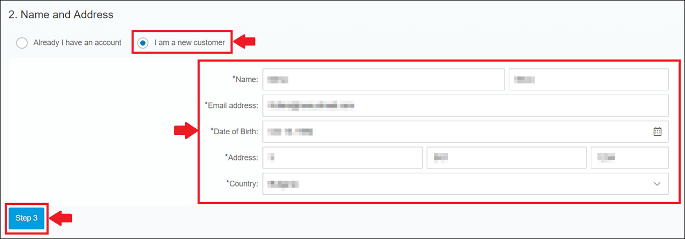
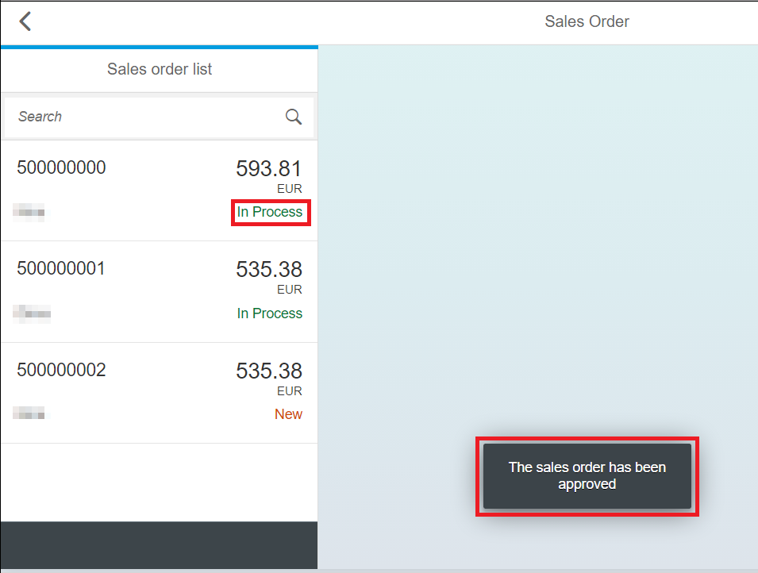
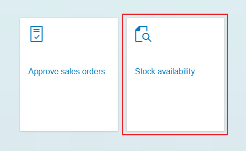
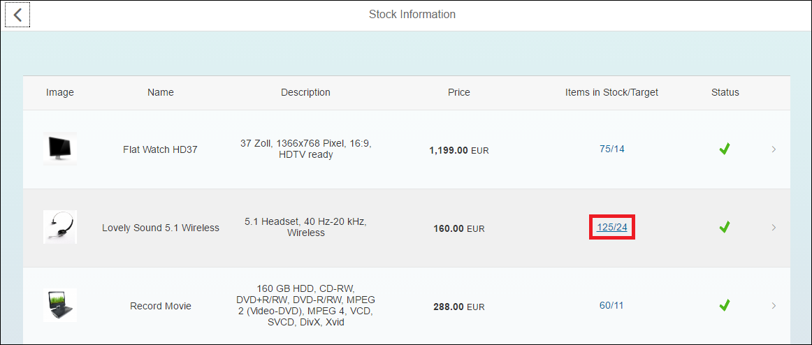
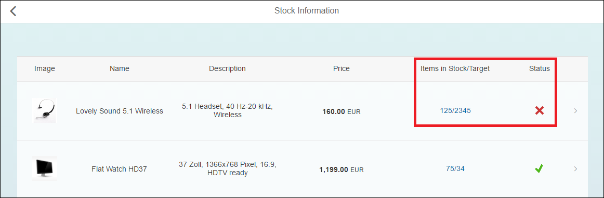

## Prerequisites  
 - **Proficiency:** Beginner

## Details
### You will learn  
- How to create sales order
- How to approve sales order
- How to update stock information

### Time to Complete
**10 Min**

---

[ACCORDION-BEGIN [Step 1: ](Create a Sales Order)]

1. Open the `ESPM Webshop` URL. You can access it by going to **Java Applications > `espm`** where you will find the URL under the **Application URLs** field.
2. In the **Search by name** field enter **Notebook Basic 15** and press the Enter key.
3. Click on the **Add to cart** button next to the product. The cart icon in the top right corner will be updated to show the number of products added to it.
4. Select the  (Cart) in the top right corner.
5. Select the **Go to checkout** button.
6. Once the Checkout screen appears select the **Step 2** button.
7. Select the **I am a new customer radio button** and fill in the customer information. When you are ready click on the **Step 3** button.

      

8. Enter the billing information and select the **Review** button.
9. From the Summary page select the **Place an order button**.
10. You will receive a message that your order has been created successfully. Choose **OK** and you will be taken back to the application's home page.

[VALIDATE_1]
[ACCORDION-END]

[ACCORDION-BEGIN [Step 2: ](Approve a Sales Order)]

1. Open the ESPM Retailer URL by changing the `webshop` part of the URL to `retailer`:
 `https://espmxxxxxxxtrial.hanatrial.ondemand.com/espm-cloud-web/retailer/`
2. Choose the **Approve sales orders** tile.
3. Select a sales order item from the Sales orders list. Its details will appear on the right side of the screen.
4. Click on the **Approve** button in the right bottom corner.
5. Select **OK** in the message box that appears to confirm the approval of the sales order.
6. A message will appear on the screen to indicate that the sales order has been successfully approved and the status of the order will change from **New** to **In Process**.

[DONE]
[ACCORDION-END]

[ACCORDION-BEGIN [Step 3: ](Update the Stock Information)]
1. Open the ESPM Retailer URL.
2. Choose the **Stock availability** tile.

      

3. The list of products and the stock information will appear on the screen. To update the minimum required stock information, click on the link under the **Items in Stock/Target** field for the respective product.

      

4. In the pop-up window that appears update the minimum stock level information and select **Submit**.
5. If the minimum stock level is greater than the actual items in stock, the Status will appear in red as shown below.

      

6. Once you submit the changes you will receive a message that the stock information has been updated.

[DONE]
[ACCORDION-END]

---
