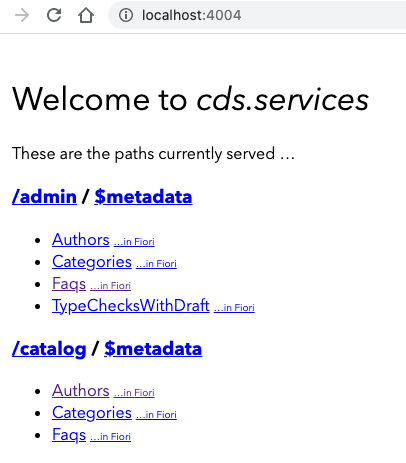

## Prerequisites
- You've installed [Node.js](https://nodejs.org/en/download/releases/). Make sure you run the latest long-term support (LTS) version of Node.js with an even number like 14. Refrain from using odd versions, for which some modules with native parts will have no support and thus might even fail to install. In case of problems, see the [Troubleshooting guide](https://cap.cloud.sap/docs/resources/troubleshooting#npm-installation) for CAP.
- Latest version of [Visual Studio Code](https://code.visualstudio.com/)
- A Kyma runtime -- see [Enable SAP Cloud Platform, Kyma runtime](cp-kyma-getting-started)
- (For Windows users only): You've installed the [SQLite](https://sqlite.org/download.html) tools for Windows. Find the steps how to install it in the Troubleshooting guide in section [How Do I Install SQLite](https://cap.cloud.sap/docs/advanced/troubleshooting#how-do-i-install-sqlite-on-windows) in the CAP documentation for more details.
- The Kubernetes CLI installed and configured with your Kubeconfig -- see [Install the Kubernetes Command Line Tool](cp-kyma-download-cli)
- [Docker](https://www.docker.com/)
- [Docker Hub Account](https://hub.docker.com/signup)


## Details
### You will learn
  - How to build a CAP application in the Kyma runtime

The SAP Cloud Application Programming Model helps you keep pace with ever-changing cloud environments. You stay focused on your domain problems, while low-level features like OData protocol serving, message brokers, or multi-tenancy are handled for you.

In this tutorial, you learn how to deploy and run an existing CAP application in Kyma runtime by using built-in tools like API Gateway and Service Mesh technology.


---

[ACCORDION-BEGIN [Step 1: ](Clone the Git repository)]

Copy the repository URL.

1. In your browser, navigate to [kyma-runtime-extension-samples](https://github.com/SAP-samples/kyma-runtime-extension-samples).

2. Choose the **Code** button and choose one of the options to download the code locally, or simply run the following command using your CLI at your desired folder location:

    ```Shell/Bash
    git clone https://github.com/SAP-samples/kyma-runtime-extension-samples
    ```

[DONE]
[ACCORDION-END]

[ACCORDION-BEGIN [Step 2: ](Explore the sample)]

1. Open the `cap-service` directory in your desired editor.

2. Explore the content of the sample.

3. The `app` directory contains a ready to use Node.js CAP service application modeling Questions and Answers.

    >For more information regarding the setup of the application, see [CAP Getting Started](https://cap.cloud.sap/docs/get-started/in-a-nutshell)

4. Within the `k8s` directory you can find the Kubernetes/Kyma resources you will apply to your Kyma runtime.

5. Within the `docker` folder you can find the Dockerfile definition that will be used to generate the Docker image. Notice the node version specified on line 2 of the file. This should be changed to match the version you use locally.


[DONE]
[ACCORDION-END]


[ACCORDION-BEGIN [Step 3: ](Set up local development environment)]

1. Within the `app` directory, run the following command using your command line interface (CLI) to install the application dependencies:

    ```Shell/Bash
    npm install
    ```


2. Using the CLI, install the `cds` development kit globally by executing the following command:

    ```Shell/Bash
    npm i -g @sap/cds-dk
    ```

    > This process takes some minutes installing the `cds` command, which you will use in the next steps.

    > On MacOS/Linux, you may need to follow the steps as described [here](https://docs.npmjs.com/resolving-eacces-permissions-errors-when-installing-packages-globally).

    > If there's an older `@sap/cds` package already installed on the machine, you may have to remove it first; if so, you'll be instructed to do so.

    > In case of problems, see the [Troubleshooting guide](https://cap.cloud.sap/docs/resources/troubleshooting#npm-installation) in the CAP documentation for more details.

3. To verify that the installation was successful, run `cds` without arguments:

    ```Shell/Bash
    cds
    ```

    > This lists the available `cds` commands. For example, use `cds version` to check the version that you've installed. To know what is the latest version, see the [Release Notes](https://cap.cloud.sap/docs/releases/) for CAP.

    

[DONE]
[ACCORDION-END]

[ACCORDION-BEGIN [Step 4: ](Run application locally)]

1.  Within the `app` directory, run the following command using your CLI to run the CAP service in "watch" mode to confirm all dependencies being installed

    ```Shell/Bash
    cds watch
    ```

2. The CAP Service should run on port 4004. Confirm by opening a browser to [http://localhost:4004](http://localhost:4004)

    >Note that you don't have the DB schemas deployed to the database, yet. We'll have to do this now.

3. Stop the CAP service in your command line

    >Pressing `CTRL-c` will stop the running application.


4. Deploy the DB schemas to you local `sqlite` database file by running the following command in your CLI

    ```Shell/Bash
    cds deploy --to sqlite
    ```

    The CDS deploy action should give you output similar to:

    ```Shell/Bash
      > filling sap.demo.faq.Authors from db/data/sap.demo.faq-Authors.csv
      > filling sap.demo.faq.Categories from db/data/sap.demo.faq-Categories.csv
      > filling sap.demo.faq.Faqs from db/data/sap.demo.faq-Faqs.csv
      > filling sap.demo.faq.Faqs_texts from db/data/sap.demo.faq.Faqs_texts.csv
      /> successfully deployed to ./sqlite.db
    ```

5. Start your CAP service again by executing

    ```Shell/Bash
    cds watch
    ```

The browser page should resemble

!

[DONE]
[ACCORDION-END]

[ACCORDION-BEGIN [Step 5: ](Build the Docker image)]

Run the following commands from the `cap-service` directory within your CLI.

>Make sure to replace the value of `<your-docker-id>` with your Docker account ID.

1. To build the Docker image, run this command:

    ```Shell/Bash
    docker build -t <your-docker-id>/cap-service -f docker/Dockerfile .
    ```

2. To push the Docker image to your Docker repository, run this command:

    ```Shell/Bash
    docker push <your-docker-id>/cap-service
    ```

[DONE]
[ACCORDION-END]

[ACCORDION-BEGIN [Step 6: ](Use the Docker image locally)]

Run the following commands from the `cap-service` directory within your CLI.

>Make sure to replace the value of `<your-docker-id>` with your Docker account ID.

1. Start the image locally by running the following command:  

    ```Shell/Bash
    docker run -p 4004:4004 --name cap-service <dockerid>/cap-service:latest
    ```

    >The -p command instructs Docker to map the host port 4004, shown on the left of the colon, to the port exposed by the image 4004, shown on the right. Using the --name parameter allows for an easy reference to the image to stop, start or remove it which is used in a later step.

    Running the command should result in a similar output:

    ```Shell/Bash
    > faq@1.0.0 start /usr/src/app
    > npx cds run


    [cds] - model loaded from 6 file(s):

      db/schema.cds
      srv/admin-service.cds
      srv/admin.cds
      srv/cat-service.cds
      srv/common.cds
      node_modules/@sap/cds/common.cds

    [cds] - connect to db > sqlite { database: 'sqlite.db' }
    [cds] - serving AdminService { at: '/admin', impl: 'srv/admin-service.js' }
    [cds] - serving CatalogService { at: '/catalog', impl: 'srv/cat-service.js' }

    [cds] - launched in: 1325.610ms
    [cds] - server listening on { url: 'http://localhost:4004' }
    ```

2. The CAP Service should now be available on port 4004. Confirm by opening a browser to [http://localhost:4004](http://localhost:4004)

3. Stop the Docker container by running:

    ```Shell/Bash
    docker stop cap-service
    ```

4. Here are some additional commands that you can use:

    To restart the Docker container, run:
    ```Shell/Bash
    docker start cap-service
    ```

    To remove the Docker container, run:
    ```Shell/Bash
    docker rm cap-service
    ```

[DONE]
[ACCORDION-END]

[ACCORDION-BEGIN [Step 7: ](Apply resources to Kyma runtime)]

You can find the resource definitions in the `k8s` folder. If you performed any changes in the configuration, these files may also need to be updated. The folder contains the following files that are relevant to this tutorial:

- `apirule.yaml`: defines the API endpoint which exposes the application to the Internet. This endpoint does not define any authentication access strategy and should be disabled when not in use.  
- `deployment.yaml`: defines the deployment definition for the CAP service, as well as a service which is used for internal communication within the Kyma runtime.

    >You will need the `Kubeconfig` setup to perform these steps as detailed in [Install the Kubernetes Command Line Tool](cp-kyma-download-cli). Please also note that the `kubeconfig` will need to be downloaded and configured once it expires after eight hours.

1. Start by creating the `dev` Namespace if it doesn't already exist:

    ```Shell/Bash
    kubectl create namespace dev
    ```

2. Within the `deployment.yaml`, adjust the value of `spec.template.spec.containers.image` to use your Docker image. Apply the Deployment:

    ```Shell/Bash
    kubectl -n dev apply -f ./k8s/deployment.yaml
    ```

3. Check the status of the Pod by running:

    ```Shell/Bash
    kubectl -n dev get po
    ```
    This command results in a table similar to the one below, showing a Pod with the name `cap-service-` ending with a random hash. When the pod is ready it will report the **STATUS** of **Running**.

    ```Shell/Bash
    NAME                           READY   STATUS    RESTARTS   AGE
    cap-service-c694bc847-tkthc   2/2     Running   0          23m
    ```

4. Apply the `APIRule` to expose the application to the internet:

    ```Shell/Bash
    kubectl -n dev apply -f ./k8s/apirule.yaml
    ```

5. The `APIRule` will be create endpoint with the following format:

  `https://cap-service.<cluster>.kyma.shoot.live.k8s-hana.ondemand.com`

  This can also be determined, by referencing the virtual service the `APIRule` creates by running:

```Shell/Bash
kubectl get virtualservice -n dev
```

  Reference the values found under **HOSTS**

```Shell/Bash
NAME               GATEWAYS                                      HOSTS                                                       AGE
cap-service-****   [kyma-gateway.kyma-system.svc.cluster.local]  [cap-service.******.kyma.shoot.live.k8s-hana.ondemand.com]  1d
```

  Copy the value of the **HOSTS** field, making sure to append `https://` to it, to test the application in your browser.


  **Congratulations!** You have successfully configured the Cap Service.

[VALIDATE_1]
[ACCORDION-END]

---
