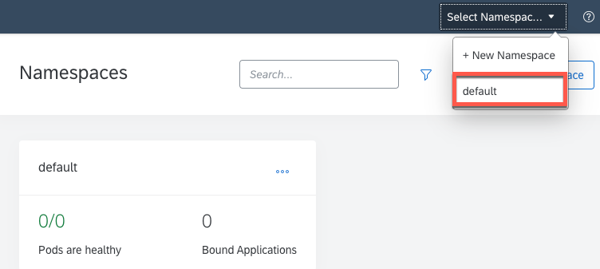
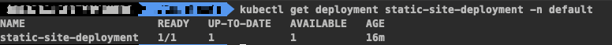
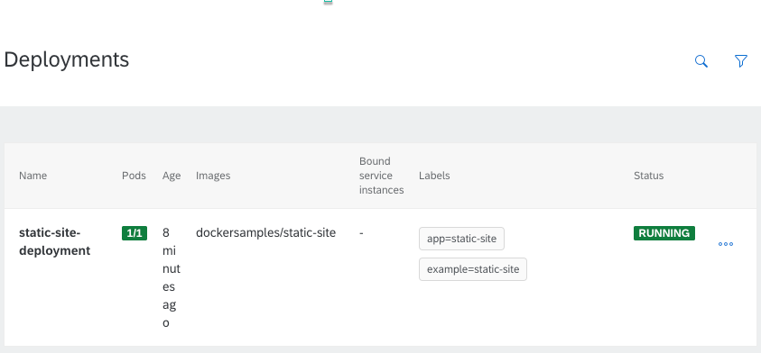

## Prerequisites
 - **Tutorials:** [Get a Free Trial Account on SAP BTP](hcp-create-trial-account)
 - **Tutorials:** [Enable SAP BTP, Kyma runtime](cp-kyma-getting-started)
 - **Tutorials:** [Install the Kubernetes Command Line Tool](cp-kyma-download-cli)

## Details
### You will learn
  - How to deploy a Docker image from public docker repository into Kyma

This tutorial will show you how to deploy a Docker image from a public docker repository into the
Kyma Runtime.

---

[ACCORDION-BEGIN [Step 1: ](Open Kyma runtime console UI)]

Login into your SAP BTP trial account and click at the overview of your subaccount. From there click **Link to Dashboard**.

!


[DONE]
[ACCORDION-END]


[ACCORDION-BEGIN [Step 2: ](Create a Kyma deployment file)]

In your command prompt, choose a directory of your preference and create the file deployment.yaml using the following command:

[OPTION BEGIN [Windows]]

```Shell/Bash
(
echo apiVersion: apps/v1^
kind: Deployment^
metadata:^
  name: static-site-deployment^
  namespace: default^
  labels:^
    app: static-site^
    example: static-site^
spec:^
  replicas: 1^
  selector:^
    matchLabels:^
      app: static-site^
      example: static-site^
  template:^
    metadata:^
      labels:^
        app: static-site^
        example: static-site^
    spec:^
      containers:^
        - name: static-site^
          image: "dockersamples/static-site"^
          imagePullPolicy: IfNotPresent)>deployment.yaml
```

[OPTION END]


[OPTION BEGIN [Mac and Linux]]

```Shell/Bash
cat >deployment.yaml <<EOL
apiVersion: apps/v1
kind: Deployment
metadata:
  name: static-site-deployment
  namespace: default
  labels:
    app: static-site
    example: static-site
spec:
  replicas: 1
  selector:
    matchLabels:
      app: static-site
      example: static-site
  template:
    metadata:
      labels:
        app: static-site
        example: static-site
    spec:
      containers:
        - name: static-site
          image: "dockersamples/static-site"
          imagePullPolicy: IfNotPresent
EOL
```

[OPTION END]


In the file above you have defined the following tags:

  - A Deployment named **static-site-deployment** is created, indicated by the `.metadata.name` field
  - The Deployment creates three replicated Pods, indicated by the `.spec.replicas` field.
  - The `.spec.selector` field defines how the Deployment finds which Pods to manage. In this case, you simply select a label that is defined in the Pod template (`app: static-site`).
  - The template field contains the following sub-fields:
    - The Pods are labeled `app: static-site` using the `.metadata.labels` field.
    - The Pod template's specification, or `.template.spec` field, indicates that the Pods run one container, `static-site`, which runs the `static-site` Docker Hub image at version latest, as the specific version was not declared.
    - Create one container and name it `static-site` using the `spec.template.spec.containers[0].name` field.

For more references on Deployment labels and documentation go to the documentation [Create Deployment](https://kubernetes.io/docs/concepts/workloads/controllers/deployment/#creating-a-deployment).


[DONE]
[ACCORDION-END]

[ACCORDION-BEGIN [Step 5: ](Deploy docker image to Kyma)]

You have your Kyma deployment file created. The last step is to apply this configuration to the Kyma Cluster.
Deployments can be created in a two-way format on Kyma, using the kubectl command or the Console UI.
Choose your preferred mode and follow the procedures below:

[OPTION BEGIN [kubectl]]

1. Go to your command prompt

2. Execute the following command
```Shell/Bash
kubectl apply -f deployment.yaml
```

[OPTION END]


[OPTION BEGIN [Console UI]]

1. Go to the Kyma Console UI, select the `default` namespace overview and and select the **Deploy new resource button**.
!

2. Browse the deployment.yaml file, previously created, and select Deploy to confirm the changes.
!

3. Select Deploy to confirm the changes.
!

[OPTION END]


[DONE]
[ACCORDION-END]

[ACCORDION-BEGIN [Step 6: ](Validate the service)]
[OPTION BEGIN [kubectl]]

1. Go to your command prompt

2. Execute the following command
```Shell/Bash
kubectl get deployment static-site-deployment -n default
```
3. The command presents the following status
!

[OPTION END]


[OPTION BEGIN [Console UI]]

Go to Operation > Deployments to make sure the status of static-site-deployment is RUNNING.

!


[OPTION END]

To learn more about the capabilities and features of the Kyma, runtime follow the Kyma tutorials, blog posts, read the documentation or check out the YouTube videos. If you aren't aware, there is also a [Kyma slack channel](https://Kyma-community.slack.com/) where you can ask questions to the active community.

[VALIDATE_1]
[ACCORDION-END]


---
