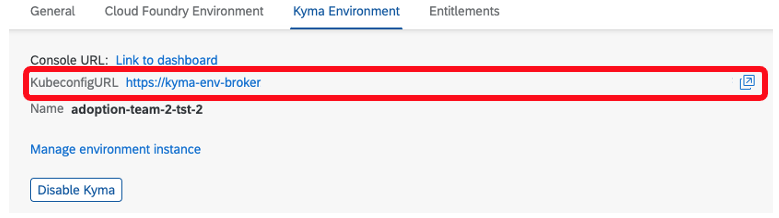
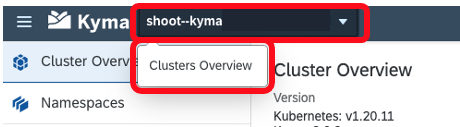
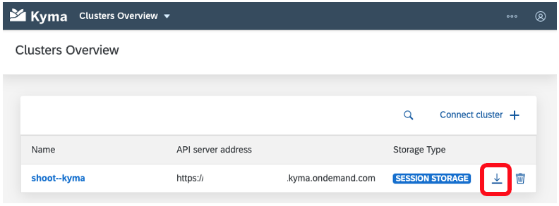

# Install the Kubernetes Command Line Tool
<!-- description --> Download and install kubectl - the Kubernetes command line tool which allows access to the SAP BTP, Kyma runtime via the command line.

## Prerequisites
 - **Tutorials:** [Enable SAP BTP, Kyma Runtime](cp-kyma-getting-started)

## You will learn  
  - How to download `kubectl` - the Kubernetes command line tool
  - How to install `kubectl` and connect it to a Kyma runtime
  - How to explore a few basic `kubectl` commands

## Intro
The Kyma runtime is a Kubernetes cluster. To manage resources and configurations from the command line, the tool `kubectl` can be used. This tutorial provides the steps to configure the tool to access the Kyma runtime. In subsequent tutorials you will learn various commands provided by `kubectl`.

---

### Download and install kubectl


1. Download the latest `kubectl` command line tool from the Kubernetes website. Use the following URL:  

    <https://kubernetes.io/docs/tasks/tools/install-kubectl>

2. On the Kubernetes website, follow the instructions listed for your operating system, for example: [Install kubectl on macOS](https://kubernetes.io/docs/tasks/tools/install-kubectl/#install-kubectl-on-macos).


### Download and install kubectl oidc-login


The use of the `kubectl` command line tool requires an authenticated user to perform any tasks on the Kyma runtime. The Kyma runtime is configured to use `OpenID` Connect (OIDC) authentication and requires the installation of the plugin `kubectl oidc-login` to perform the authentication.    

1. Install [kubectl oidc-login](https://github.com/int128/kubelogin) by following the instructions detailed in the project repository. Use the relevant commands for macOS, Linux, or Windows users.

    > On Windows, it is recommended to use the release binaries to install the kubectl oidc-login plugin. The installation of the kubectl oidc-login plugin using Chocolatey and `Krew` could cause issues.

    > The kubectl oidc-login runs on port 8000, in case of issues please make sure the port is not occupied.


### Test the kubectl installation


1. Open a command prompt on your computer.

    > On Windows, you can search for the `cmd` or `command prompt` applications in the Start menu.  
    >
    > On macOS, use Spotlight to find the "terminal" application.
    >
    > On Linux/Unix, you know how this works - just open your favorite command shell.

2. Test the `kubectl` command line tool to make sure it is installed correctly by running the following command in your CLI:

```Shell/Bash
kubectl version --client
```

This should return a list of version properties, for example:

```Shell/Bash
Client Version: version.Info{Major:"1", Minor:"22", GitVersion:"v1.22.2", GitCommit:"8b5a19147530eaac9476b0ab82980b4088bbc1b2", GitTreeState:"clean", BuildDate:"2021-09-15T21:31:32Z", GoVersion:"go1.16.8", Compiler:"gc", Platform:"darwin/amd64"}
```


### Download the Kyma runtime kubeconfig


The `kubectl` tool relies on a configuration file called the `kubeconfig`, to configure access to the cluster. This step details how this can be obtained from both the BTP Cockpit and the Console UI.

To obtain the `kubeconfig` from the SAP BTP Cockpit:

1. Within your BTP account, navigate to the sub-account which has the Kyma runtime is enabled.

2. Choose the menu option **Overview**

3. Scroll down to the **Kyma Environment** details

4. Choose the link next to **`KubeconfigURL`** to download the `kubeconfig`

    

To obtain the `kubeconfig` from the Console UI:   

1. Navigate to the Console UI of your Kyma runtime.

2. Log onto the Kyma runtime.

3. At the top-left of the Kyma runtime window you will find a drop down which displays the name of the currently connected runtime.

4. Select the drop down and choose the option **Clusters Overview**

    

5. Choose the **Download Kubeconfig** option to download the file.

    


### Set the KUBECONFIG environment variable


1. Open a command line prompt on your computer. In the command line screen, type in the following:

[OPTION BEGIN [Mac and Linux]]

```Shell/Bash
export KUBECONFIG=<KUBECONFIG_FILE_PATH>
```

[OPTION END]

[OPTION BEGIN [Windows]]

```PowerShell
$ENV:KUBECONFIG="<KUBECONFIG_FILE_PATH>"
```

```DOS
set KUBECONFIG="<KUBECONFIG_FILE_PATH>"
```

[OPTION END]

Replace the `<KUBECONFIG_FILE_PATH>` section with the file path, including the file name and extension, of the `Kubeconfig` you downloaded in the previous step.

2. Test the configuration by running this command:  

    ```Shell/Bash
    kubectl config get-contexts
    ```

    This should return a response similar to:

    |CURRENT|NAME|CLUSTER|AUTHINFO|NAMESPACE|
    |-------|----|-------|--------|---------|
    |*      | `shoot--kyma-stage--c-#######`|`shoot--kyma-stage--c-#######`|`shoot--kyma-stage--c-#######`| |

3. You are now set up to use the Kyma runtime on SAP BTP Platform.

> For more information on `kubectl`, visit the Kubernetes [overview](https://kubernetes.io/docs/reference/kubectl/overview/) and [kubectl-commands](https://kubernetes.io/docs/reference/generated/kubectl/kubectl-commands) websites.


---
