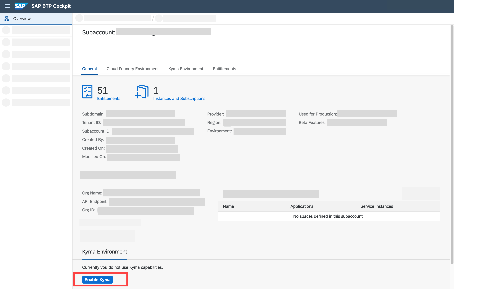
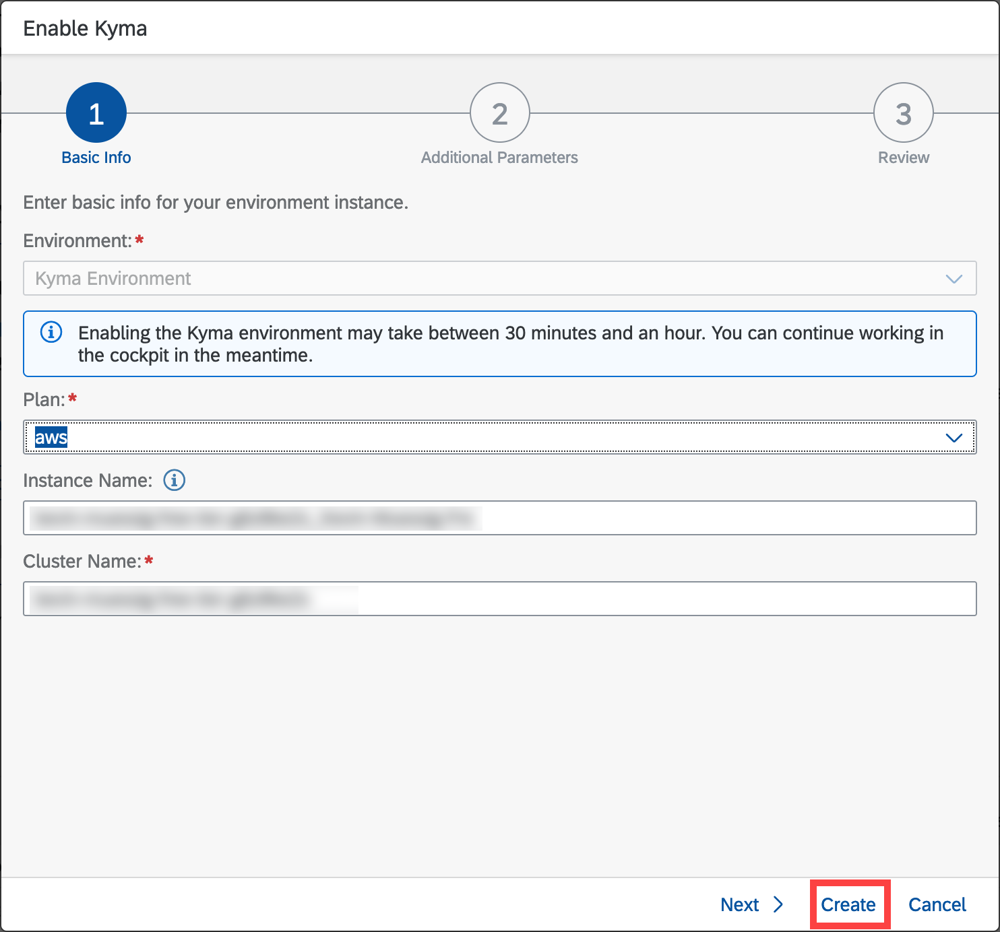
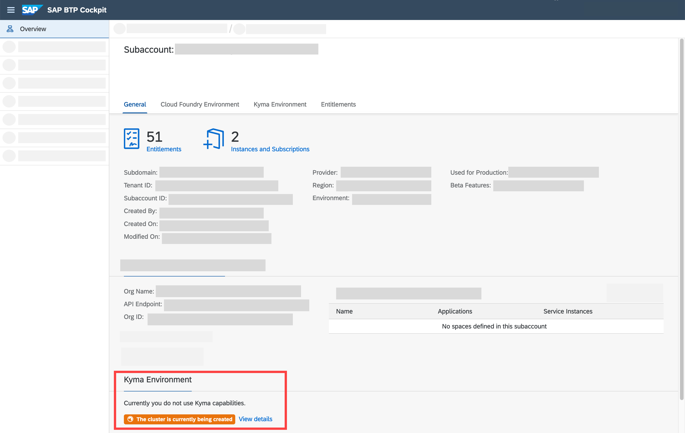
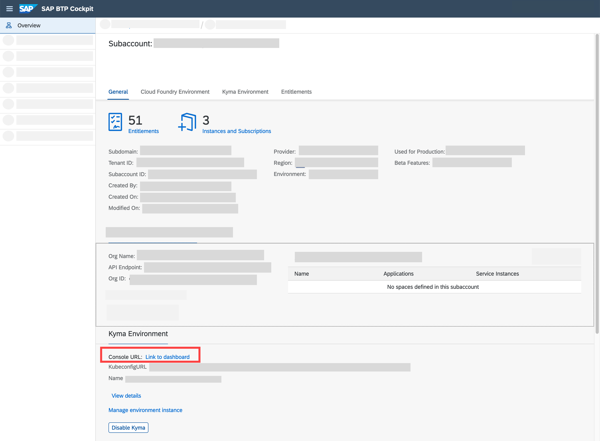
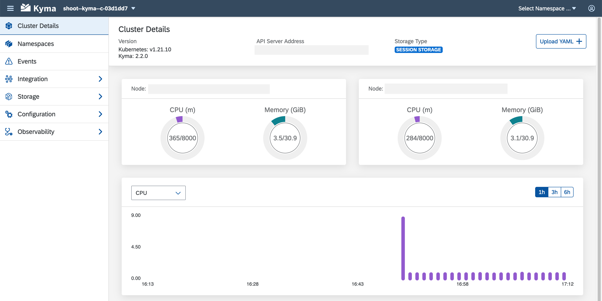

## Prerequisites
 - **Tutorials:** [Get an Account on SAP BTP to Try Out Free Tier Service Plans](btp-free-tier-account)

## Details
### You will learn
  - How to enable the [SAP BTP, Kyma runtime Free Tier]().

---

[ACCORDION-BEGIN [Step 1: ](Enable the Kyma environment)]

1. In your Free Tier subaccount click **Enable Kyma** to trigger the enablement of the Kyma environment.

    !

2. In the popup, enter your cluster name of choice and click **Create**.

    !

    In the background, a new Kubernetes cluster is being set up where the Kyma runtime and all its components will run on. This might take between 30-60 min.

    To continue with this tutorial, you need to wait until the enablement is finished. You can still use the SAP BTP Free Tier or close the window as the setup process will continue automatically.

    !

    To learn more about the Kyma environment and its functionality, see:

    - [SAP BTP, Kyma runtime](https://discovery-center.cloud.sap/serviceCatalog/kyma-runtime)
    - [SAP Help Portal - Kyma Environment](https://help.sap.com/viewer/3504ec5ef16548778610c7e89cc0eac3/Cloud/en-US/468c2f3c3ca24c2c8497ef9f83154c44.html)
    - [kyma-project](https://kyma-project.io/docs/kyma/latest)
    - [Kyma - YouTube](https://www.youtube.com/channel/UC8Q8bBtYe9gQN-dQ-_L8JvQ)
    - [Cloud Native for Beginners - YouTube](https://youtube.com/playlist?list=PL6RpkC85SLQCwaJ54TAAHMvSl5wpVPrai)

[DONE]
[ACCORDION-END]

[ACCORDION-BEGIN [Step 4: ](Open Kyma runtime console UI)]

To open the Kyma runtime console UI, click on **Link to Dashboard** under the **Kyma Environment** section of the Subaccount Overview page.

!

The Kyma Dashboard should open in a new Browser Tab.

!

[VALIDATE_4]
[ACCORDION-END]
