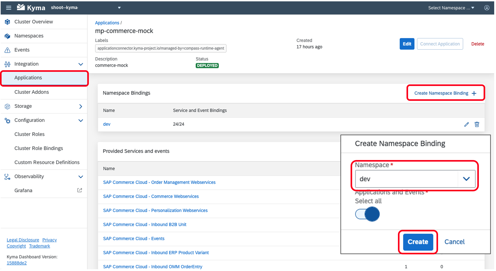
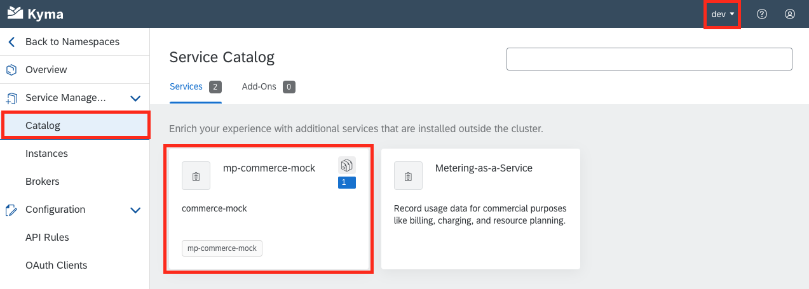
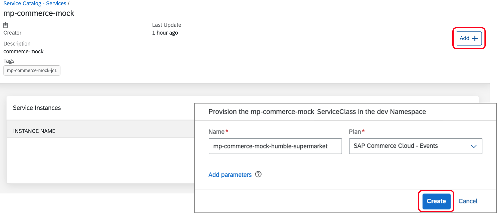
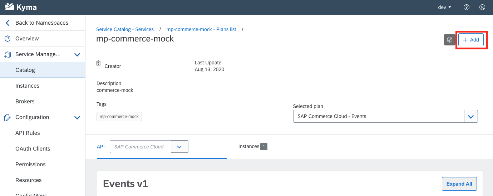
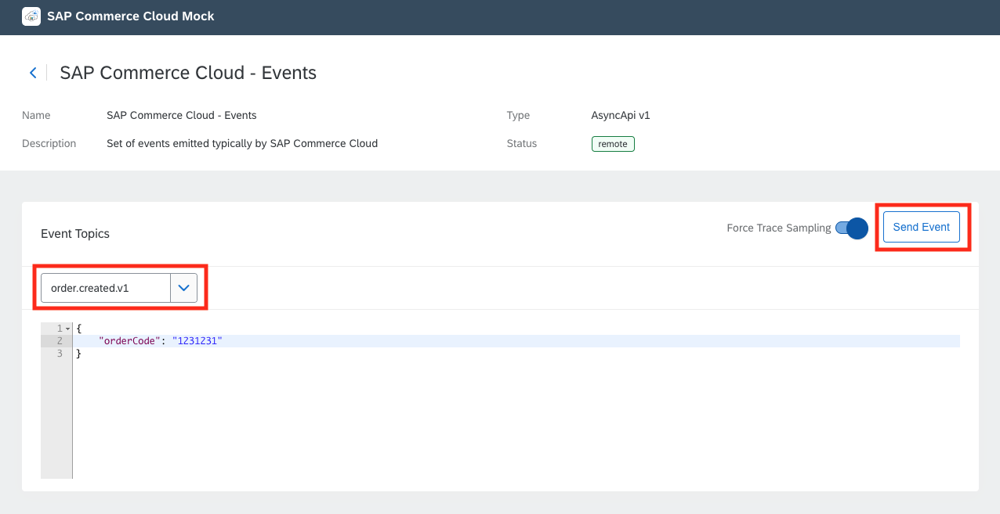
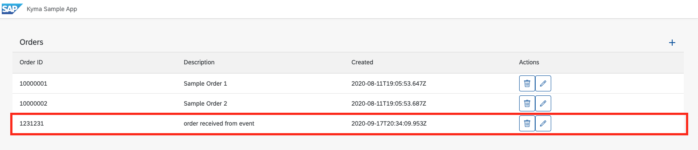

## Prerequisites
 - [`kubectl` configured to KUBECONFIG downloaded from Kyma Runtime](cp-kyma-download-cli)
 - [Deploy a Go MSSQL API Endpoint in the Kyma Runtime](cp-kyma-api-mssql-golang)
 - [Deploy the Commerce Mock Application in the Kyma Runtime](cp-kyma-mocks)

## Details
### You will learn
  - How to trigger a microservice with an event

---

[ACCORDION-BEGIN [Step 1: ](Clone the Git repository)]

1. Copy the repository URL.

  In your browser, navigate to [kyma-runtime-extension-samples](https://github.com/SAP-samples/kyma-runtime-extension-samples)

  Choose the `Code` button and choose one of the options to download the code locally or simply run the following command within your CLI at your desired folder location.

    ```Shell/Bash
    git clone https://github.com/SAP-samples/kyma-runtime-extension-samples
    ```


[DONE]
[ACCORDION-END]

[ACCORDION-BEGIN [Step 2: ](Explore the sample)]

1. Open the directory `api-mssql-go` in your desired editor.

2. Explore the content of the sample.

3. Within the file `internal/api/events.go` you will find the code that handles the consumption of the event data. This code expects to receive a json payload containing an `orderCode`. This function is exposed on the path `/orderCodeEvent`, which is defined in `cmd/api/main.go`.

4. Within the `k8s` directory you will find the `Trigger` which defines how an event will be consumed. The fields of interest included:

| Property                                | Description                                                   | Value            |
|-----------------------------------------|---------------------------------------------------------------|------------------|
| spec.filter.attributes.eventtypeversion | The event version to subscribe to                             | v1               |
| spec.filter.attributes.source           | the name of the Application that publishes the events         | mp-commerce-mock |
| spec.filter.attributes.type             | The event type to subscribe to                                | order.created    |
| spec.filter.subscriber.ref.name         | The name of the service to receive the event                  | api-mssql-go     |
| spec.filter.subscriber.uri              | The URI endpoint of the service that should receive the event | `/orderCodeEvent`  |


[DONE]
[ACCORDION-END]


[ACCORDION-BEGIN [Step 3: ](Bind commerce mock to namespace)]

In this step we will bind the mock application to the **dev** namespace. This process is used to enable the usage of the APIs and events of the mock application to the bounded namespace. The API and events will then appear within the **Service Catalog** of the namespace.

1. Open the Kyma runtime console.

2. Choose the menu option **Integration > Applications/Systems**.

3. Choose **mp-commerce-mock**.

4. Choose **Create Binding**.

5. Choose the namespace **dev**.

6. Choose **Create**

    

[DONE]
[ACCORDION-END]

[ACCORDION-BEGIN [Step 4: ](Create service instance)]

In this step we will create a service instance of the events exposed by the mock application.  This is done to enabled the consumption of the events within the **dev** namespace.

1. Open the Kyma runtime console

2. Choose the namespace **dev**.

3. Choose the menu option **Service Management > Catalog**.

4. Choose **mp-commerce-mock**.

    

5. Choose the Service Class Plan **SAP Commerce Cloud - Events**.

    

6. Choose **Add**.

    

7. Choose **Create** to create an instance.

[DONE]
[ACCORDION-END]

[ACCORDION-BEGIN [Step 5: ](Apply trigger)]

In this step we will define a **trigger** which is used to create a subscriber of an event. This will allow use to specify that our API application **api-mssql-go**, by referencing it's service, should receive the payload of the event **order.created**.

1. Apply the `Trigger` by running the following command in the Command Line Interface.

    ```Shell/Bash
    kubectl -n dev apply -f ./k8s/event-trigger.yaml
    ```

2. Verify that the **trigger** was created successfully by running the command:

    ```Shell/Bash
    kubectl get trigger api-mssql-go-trigger -n dev -o yaml
    ```

    > After the trigger definition you should find a status object indicating the status of the related resources.

    ```yaml
    status:
      conditions:
      - lastTransitionTime: "2020-10-07T16:09:44Z"
        status: "True"
        type: BrokerReady
      - lastTransitionTime: "2020-10-07T16:09:26Z"
        status: "True"
        type: DependencyReady
      - lastTransitionTime: "2020-10-07T16:09:44Z"
        status: "True"
        type: Ready
      - lastTransitionTime: "2020-10-07T16:09:27Z"
        status: "True"
        type: Subscribed
      - lastTransitionTime: "2020-10-07T16:09:26Z"
        status: "True"
        type: SubscriberResolved
    ```

[DONE]
[ACCORDION-END]

[ACCORDION-BEGIN [Step 6: ](Test scenario)]

With the configuration steps completed, we can now test the scenario to validate that it is working as intended.

1. Open the mock application in the browser by first choosing the menu option **Configuration > `APIRules`**.

2. Choose the **Host** entry for the **commerce-mock** `APIRule` to open it in the browser. This URL should be similar to `https://commerce.*******.kyma.shoot.live.k8s-hana.ondemand.com`.

3. Choose the **Remote APIS** tab.

    

4. Choose the **SAP Commerce Cloud - Events** option.

5. For the **Event Topics** choose **order.created.v1**.

6. Modify the **`orderCode`** value is desired and choose **Send Event

    

7. With the Kyma console choose the menu option **Configuration > `APIRules`**.

8. Choose the **Host** entry for the **fe-ui5-mssql** `APIRule` to open the application in the browser. This should be similar to `https://fe-ui5-mssql.*******.kyma.shoot.live.k8s-hana.ondemand.com`.

9. You should now see the data received by the event as shown below.

    

[VALIDATE_1]

[DONE]
[ACCORDION-END]


---
