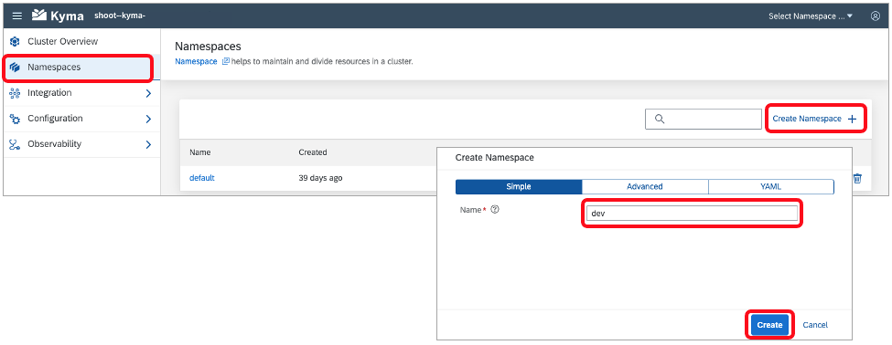
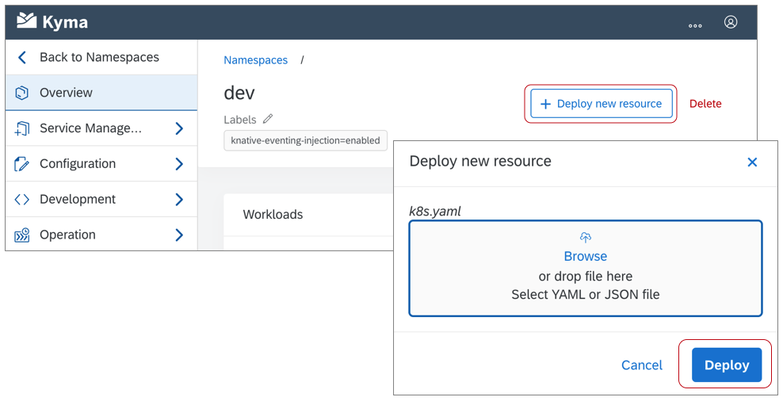
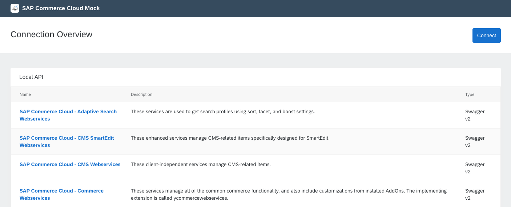
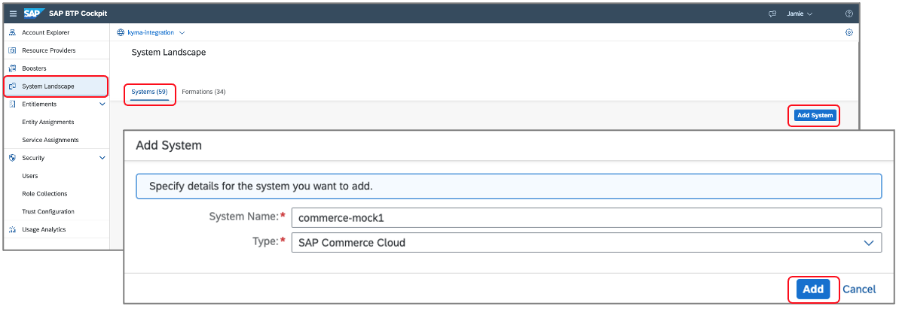
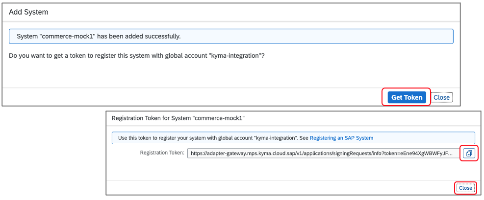
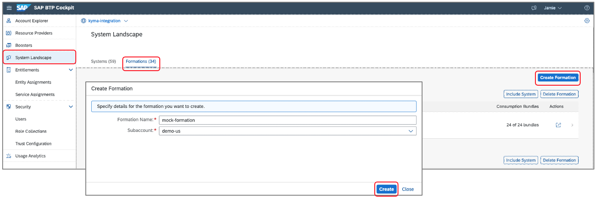
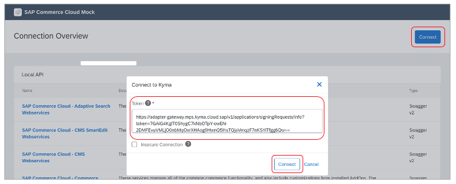
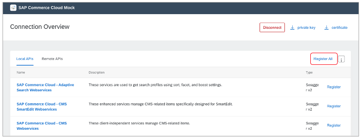
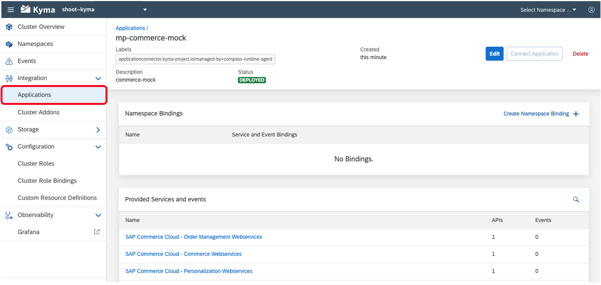

## Prerequisites
  - [GIT](https://git-scm.com/downloads) installed

## Details
### You will learn
  - How to create a Namespace in the Kyma runtime
  - How to deploy the Kyma mock application, which includes a Kyma `APIRule` to expose the API to the Internet

The Kyma mock application contains lightweight substitutes for SAP applications to ease the development and testing of extension and integration scenarios based on [`Varkes`](https://github.com/kyma-incubator/varkes). Together with SAP BTP, Kyma runtime, it allows for efficient implementation of application extensions without the need to access the real SAP applications during development.

---

[ACCORDION-BEGIN [Step 1: ](Clone the Git repository)]

1. The Kyma mock applications can be found in the [xf-application-mocks](https://github.com/SAP-samples/xf-application-mocks) repository. Within the repo you can find each of the mock applications and their Deployment files within the respective folder. The process outlined in the tutorial is the same for each, but focuses on configuring the Commerce mock.

2. Download the code by choosing the green **Code** button and then choosing one of the options to download the code locally.

    You can instead run the following command within your CLI at your desired folder location:

    ```Shell/Bash
    git clone https://github.com/SAP-samples/xf-application-mocks
    ```

[DONE]
[ACCORDION-END]

[ACCORDION-BEGIN [Step 2: ](Apply resources to Kyma runtime)]

1. Open the Kyma console and create the `dev` Namespace by choosing **Add new namespace**, providing the name `dev`, and choosing **Create**.

    

    > Namespaces separate objects inside a Kubernetes cluster. The concept is similar to folders in a file system. Each Kubernetes cluster has a `default` namespace to begin with.

2. Open the `dev` Namespace by choosing the tile, if it is not already open.

3. Apply the Deployment of the mock application to the `dev` Namespace by choosing the menu option **Workloads > Overview** if not already open. Within the **Overview** dialog, choose the **Deploy new workload -> Upload YAML** option and using the **Browse** option, choose the `k8s.yaml` file. Choose **Deploy**.

    

    > The new deployment is represented as declarative YAML object which describes what you want to run inside your namespace. You can find the file at `/xf-application-mocks/commerce-mock/deployment/k8s.yaml`.

4. Apply the `APIRule` of the mock application to the `dev` Namespace by choosing the **Deploy new workload** option, using the **Browse** option to choose the `kyma.yaml` file. Choose **Deploy**. The `APIRule` exposes the resource to the Internet without any authentication. You may choose to remove the `APIRule` when not in use.

    > Even API rules can be created by describing them within YAML files. You can find the file at at `/xf-application-mocks/commerce-mock/deployment/kyma.yaml`.

[DONE]
[ACCORDION-END]


[ACCORDION-BEGIN [Step 3: ](Open Commerce mock application)]

1. Open the `APIRules` in the Kyma console within the `dev` Namespace by choosing the **Discovery and Network > `APIRules`** menu option.

2. Open the mock application in the browser by choosing the **Host** value `https://commerce.*******.kyma.shoot.live.k8s-hana.ondemand.com`. If you receive the error `upstream connect...`, the application may have not finished starting. Wait for a minute or two and try again.

3. Leave the mock application open in the browser, it will be used in a later step.

  

[DONE]
[ACCORDION-END]

[ACCORDION-BEGIN [Step 4: ](Create a System)]

In this step, you will create a System in the SAP BTP which will be used to pair the mock application to the Kyma runtime. This step will be performed at the **Global** account level of your SAP BTP account.

1. Open your global SAP BTP account and choose the **System Landscape > Systems** menu options.

2. Choose the **Register System** option, provide the name **commerce-mock**, set the type to **SAP Commerce Cloud** and then choose **Register**.

    

3. Copy the **Token** value and close the window. This value will expire in five minutes and will be needed in a subsequent step.

    > If the token expires before use, you can obtain a new one by choosing the `Display Token` option shown next to the entry in the Systems list.

    


[DONE]
[ACCORDION-END]

[ACCORDION-BEGIN [Step 5: ](Create a Formation)]

In this step, you will create a Formation. A Formation is used to connect one or more Systems created in the SAP BTP to a runtime. This step will be performed at the **Global** account level of your SAP BTP account.

1. Within your global SAP BTP account, choose the **System Landscape > Formations** menu options. Choose the **Create Formation** option.

2. Provide a **Name**, choose your **Subaccount** where the Kyma runtime is enabled, choose the **commerce-mock** System. Choose **Create**.

    

[VALIDATE_1]
[ACCORDION-END]

[ACCORDION-BEGIN [Step 6: ](Pair an application)]

The pairing process will establish a trust between the Commerce mock application and in this case the SAP Kyma runtime. Once the pairing is complete, the registration of APIs and business events can be performed. This process allow developers to utilize the APIs and business events with the authentication aspects handled automatically.

1. Navigate back to the mock application browser window and choose **Connect**. Paste the copied value in the token text area and then choose **Connect**. If the token has expired, you may receive an error. Simply return to [Step 4: ](Create a System) and generate a new token.

    

2. Choose **Register All** to register the APIs and events from the mock application.

    

[DONE]
[ACCORDION-END]


[ACCORDION-BEGIN [Step 6: ](Verify setup)]

1. Navigate back to the Kyma home workspace by choosing **Back to Namespaces**.

2. In the Kyma home workspace, choose **Integration > Applications/Systems**.

3. Choose the **mp-commerce-mock** application by clicking on the name value shown in the list.

> After choosing the system, you should now see a list of the APIs and events the mock application is exposing.

  

[VALIDATE_2]

**Congratulations!** You have successfully configured the Commerce mock application.

[ACCORDION-END]

---
