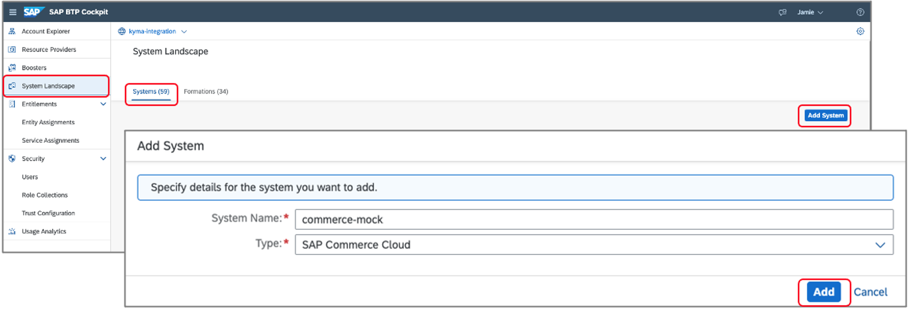

## Prerequisites
  - [`kubectl` configured to KUBECONFIG downloaded from Kyma Runtime](cp-kyma-download-cli)

## Details
### You will learn
  - How to create a namespace in Kyma runtime
  - How to deploy the Kyma Mock application, which includes a Kyma `APIRule` to expose the API to the internet

The Kyma Mock application contains lightweight substitutes for SAP applications to ease the development and testing of extension and integration scenarios based on [`Varkes`](https://github.com/kyma-incubator/varkes). Together with SAP Cloud Platform, Kyma runtime, it allows for efficient implementation of application extensions without the need to access the real SAP applications during development.

---

[ACCORDION-BEGIN [Step 1: ](Explore the Git repository)]

The mocking applications can be found at:

[https://github.com/SAP-samples/xf-application-mocks](https://github.com/SAP-samples/xf-application-mocks)

Within the repo you will find each of the mock applications and their deployment files within the respective folder. The process outlined in the tutorial will be the same for each, but will focus on configuring the commerce mock.

[DONE]
[ACCORDION-END]

[ACCORDION-BEGIN [Step 2: ](Apply resources to Kyma runtime)]

1. Start by creating the namespace **dev** if it doesn't already exist.

    ```Shell/Bash
    kubectl create namespace dev
    ```

2. Apply the Deployment of the mock application to the dev namespace:

    ```Shell/Bash
    kubectl apply -n dev -f https://raw.githubusercontent.com/SAP-samples/xf-application-mocks/master/commerce-mock/deployment/k8s.yaml
    ```

3. Apply the `APIRule` which will expose the mock application to the internet:

    ```Shell/Bash
    kubectl apply -n dev -f https://raw.githubusercontent.com/SAP-samples/xf-application-mocks/master/commerce-mock/deployment/xf.yaml
    ```

[DONE]
[ACCORDION-END]


[ACCORDION-BEGIN [Step 3: ](Open commerce mock application)]

1. During the process of applying the `APIRule` a Virtual Service will be created which exposes the API to the internet. The `APIRules` can be viewed within the Kyma console within the **dev** namespace under the menu option **Configuration > `APIRules`**, which will display the associated **Host** value. We can do the same using `kubectl` by running the command:

    ```Shell/Bash
    kubectl get virtualservice -n dev
    ```

    #### This command should result in a table similar to the one below showing the **HOST** value.
    | NAME | GATEWAYS   |  HOSTS    |   AGE |
    |---|---|---|---|
    | commerce-mock-jzcnn |  [kyma-gateway.kyma-system.svc.cluster.local]  | [commerce.*******.kyma.shoot.live.k8s-hana.ondemand.com] |  91d |

2. Open the mock application in the browser using the **HOST** value `https://commerce.*******.kyma.shoot.live.k8s-hana.ondemand.com`.

[DONE]
[ACCORDION-END]

[ACCORDION-BEGIN [Step 4: ](Create system)]

In this step we will create a system in the SAP Cloud Platform which will be used to pair the mock application to the Kyma runtime.

1. Open your global SAP Cloud Platform account and choose the menu option **System Landscape > Systems**.

2. Choose the option **Register System**, provide the name **commerce-mock**, set the type to **SAP Commerce Cloud** and then choose **Register**.

    

3. Copy the **Token** value and close the window. This value will expire in five minutes and will be needed in a subsequent step.

    

[DONE]
[ACCORDION-END]

[ACCORDION-BEGIN [Step 5: ](Create formation)]

In this step we will create a Formation. A Formation is used to connect one or more Systems created in the SAP Cloud Platform to a runtime.

1. Within your global SAP Cloud Platform account, choose the menu option **System Landscape > Formations**. Choose the option **Create Formation**.

2. Provide a **Name**, choose your **Subaccount** where the Kyma runtime is enabled, choose the **commerce-mock** system and finally choose **Create**.

    

[VALIDATE_1]

[DONE]
[ACCORDION-END]

[ACCORDION-BEGIN [Step 6: ](Pair an application)]

1. Navigate back to the mock application and choose **Connect**.  Paste the copied value in the token text area and then choose **Connect**. If the token has expired you may receive an error. Simply return to [Step 4: ](Creating a System) and generate a new token.

    

2. Choose **Register All** to register the APIs and Events from the mock application.

    

[DONE]
[ACCORDION-END]


[ACCORDION-BEGIN [Step 6: ](Verify setup)]

1. In the Kyma home workspace choose **Integration > Applications**.

2. Choose the application **mp-commerce-mock** by clicking on the name value shown in the list.

> After choosing the system you should now see a listing of the APIs and Events the mock application is exposing.

  

[DONE]
[ACCORDION-END]

---
