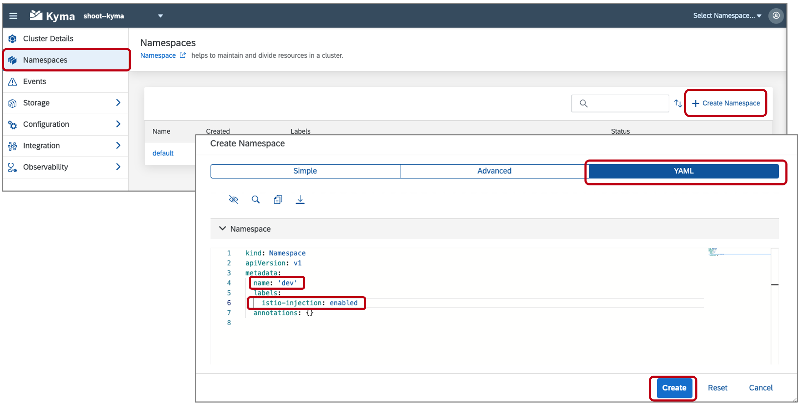
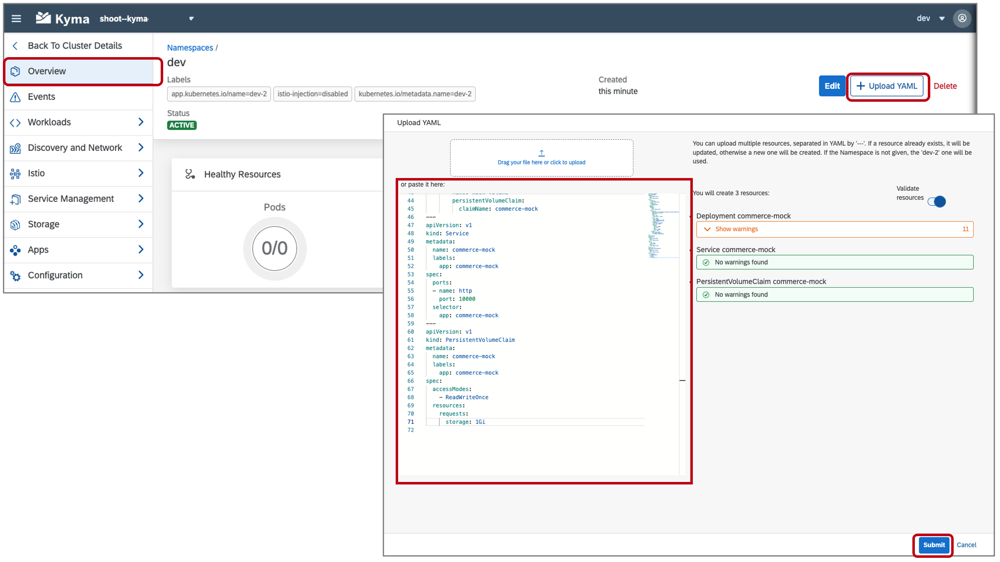
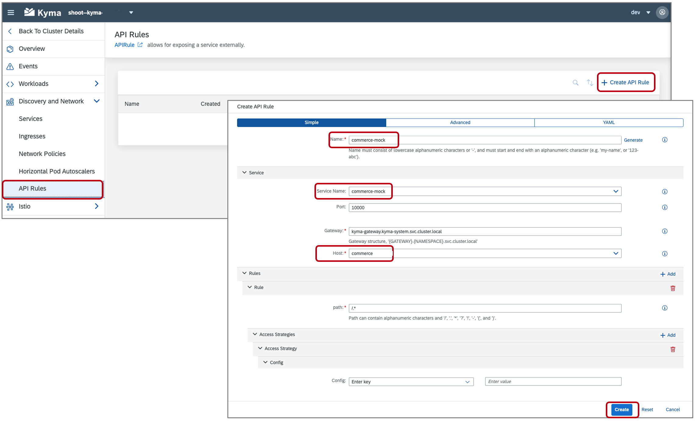

# Deploy Commerce Mock Application in the Kyma Runtime
<!-- description --> Deploy and connect the Commerce mock application to the Kyma runtime.

## Prerequisites
  - [GIT](https://git-scm.com/downloads) installed

## You will learn
  - How to create a Namespace in the Kyma runtime
  - How to deploy the Kyma mock application, which includes a Kyma `APIRule` to expose the API to the Internet

## Intro
The Kyma mock application contains lightweight substitutes for SAP applications to ease the development and testing of extension and integration scenarios based on [`Varkes`](https://github.com/kyma-incubator/varkes). Together with SAP BTP, Kyma runtime, it allows for efficient implementation of application extensions without the need to access the real SAP applications during development.

---

### Clone the Git repository


1. The Kyma mock applications can be found in the [xf-application-mocks](https://github.com/SAP-samples/xf-application-mocks) repository. Within the repo you can find each of the mock applications and their Deployment files within the respective folder. The process outlined in the tutorial is the same for each, but focuses on configuring the Commerce mock.

2. Download the code by choosing the green **Code** button and then choosing one of the options to download the code locally.

    You can instead run the following command within your CLI at your desired folder location:

    ```Shell/Bash
    git clone https://github.com/SAP-samples/xf-application-mocks
    ```


### Apply resources to Kyma runtime


1. Open the Kyma console and create the `dev` Namespace by choosing the menu option **Namespaces** and then choosing the option **Create Namespace**. Choose the tab `YAML`, provide the name `dev`, set the label `istio-injection` to `enabled` and then choose **Create**.

    

    > Namespaces separate objects inside a Kubernetes cluster. The concept is similar to folders in a file system. Each Kubernetes cluster has a `default` namespace to begin with. Choosing a different value for the namespace will require adjustments to the provided samples.

    > Setting **istio-injection** to the on enabled state activates `Istio`, which is the service mesh implementation used by the Kyma runtime.

2. Open the `dev` Namespace by choosing the tile, if it is not already open.

3. Apply the Deployment of the mock application to the `dev` Namespace by choosing the menu option **Overview** if not already open. Within the **Overview** dialog, choose **Upload YAML**. Either copy the contents of the file `/xf-application-mocks/commerce-mock/deployment/k8s.yaml` into the window or use the option to upload it. 

    

4. Notice that this file contains the resource definitions for the Deployment as well as the Service and the Persistent Volume Claim. Choose **Submit** to create the resources.


5. Create the `APIRule` of the mock application to the `dev` Namespace by choosing the menu option **Discovery and Network > `API Rules`** and then choosing **Create API Rule**. Provide the **Name** `commerce-mock`, choose the **Service Name** `commerce-mock` and enter `commerce` for the **Host**. Choose **Create** to create the `APIRule`.

    

    > Even API rules can be created by describing them within YAML files. You can find the YAML definition of the `APIRule` at `/xf-application-mocks/commerce-mock/deployment/kyma.yaml`.


### Open Commerce mock application


1. Open the `APIRules` in the Kyma console within the `dev` Namespace by choosing the **Discovery and Network > `APIRules`** menu option.

2. Open the mock application in the browser by choosing the **Host** value `https://commerce.*******.kyma.ondemand.com`. If you receive the error `upstream connect...`, the application may have not finished starting. Wait for a minute or two and try again.

3. Leave the mock application open in the browser, it will be used in a later step.

  


### Create a System


In this step, you will create a System in the SAP BTP which will be used to pair the mock application to the Kyma runtime. This step will be performed at the **Global** account level of your SAP BTP account.

1. Open your global SAP BTP account and choose the **System Landscape** menu option.

2. Under the tab **Systems**, Choose the **Add System** option, provide the name **commerce-mock**, set the type to **SAP Commerce Cloud** and then choose **Add**.

    

3. Choose the option **Get Token**, copy the **Token** value and close the window. This value will expire in five minutes and will be needed in a subsequent step.

    > If the token expires before use, you can obtain a new one by choosing the `Get Token` option shown next to the entry in the Systems list.

    


### Create a Formation


In this step, you will create a Formation. A Formation is used to connect one or more Systems created in the SAP BTP to a runtime. This step will be performed at the **Global** account level of your SAP BTP account.

1. Within your global SAP BTP account, choose the **System Landscape** menu option. Choose the tab **Formations** and choose the **Create Formation** option.

2. Provide a **Name** and choose your **Subaccount** where the Kyma runtime is enabled. Choose **Create**.

    

3. Choose the option **Include System**, select **commerce-mock** for the system and choose **Include**.

    


### Pair an application


The pairing process will establish a trust between the Commerce mock application and in this case the SAP Kyma runtime. Once the pairing is complete, the registration of APIs and business events can be performed. This process allow developers to utilize the APIs and business events with the authentication aspects handled automatically.

1. Navigate back to the mock application browser window and choose **Connect**. Paste the copied value in the token text area and then choose **Connect**. If the token has expired, you may receive an error. Simply return to [Step 4: ](Create a System) and generate a new token.

    

2. Choose **Register All** to register the APIs and events from the mock application.

    


### Verify setup


1. Navigate back to the Kyma home workspace by choosing **Back to Namespaces**.

2. In the Kyma home workspace, choose **Integration > Applications**.

3. Choose the **mp-commerce-mock** application by clicking on the name value shown in the list.

> After choosing the system, you should now see a list of the APIs and events the mock application is exposing.

  


**Congratulations!** You have successfully configured the Commerce mock application.

---
