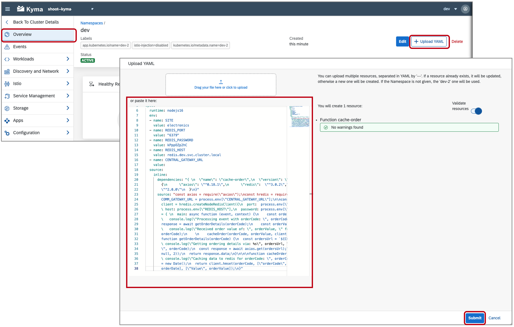
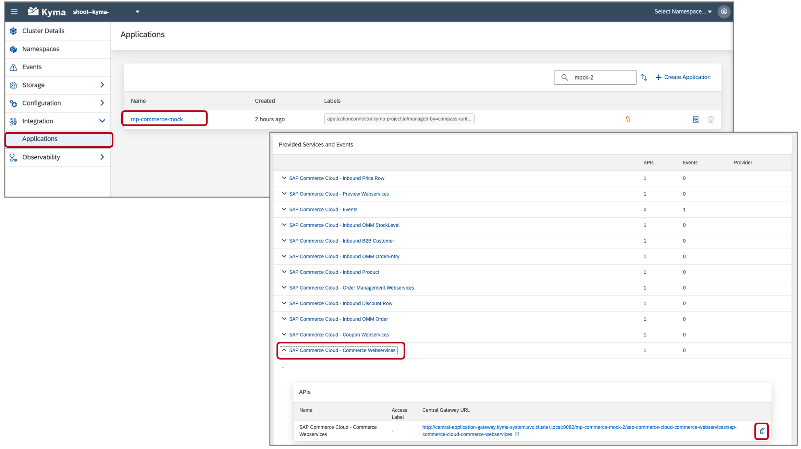
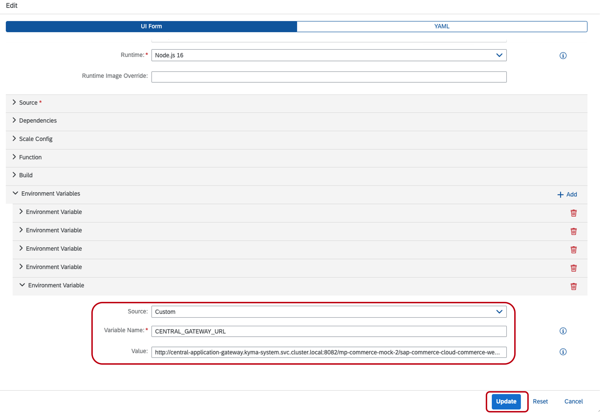
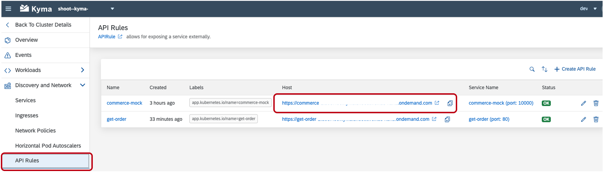
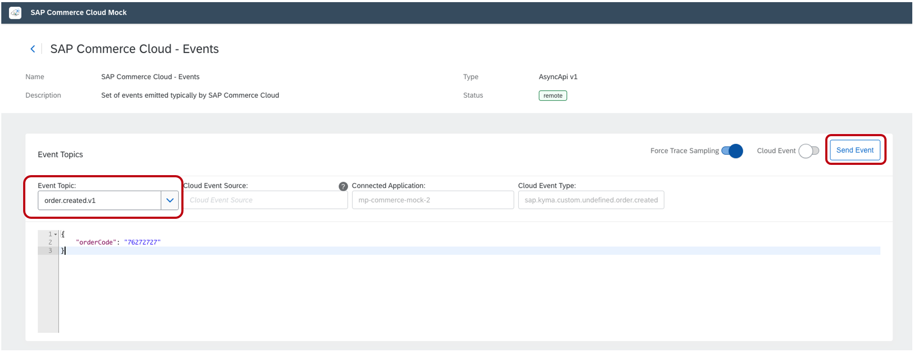

# Use Redis in the Kyma Runtime to Store and Retrieve Data
<!-- description --> Deploy Redis and configure two serverless functions to cache and retrieve data from the Redis instance within the Kyma runtime.

## Prerequisites
  - [Provision Kyma](cp-kyma-getting-started)
  - [Setup Mock Application](cp-kyma-mocks)

## You will learn
  - How to deploy a microservice using the Kyma Console
  - How to deploy functions using the Kyma Console
  - How to create API Rules
  - How APIs and Events are used.

## Intro
This sample provides a Redis deployment and two serverless functions that interact with it. The function `cache-order` will be set to subscribe to an `order.created` event provided by the Commerce mock application. Once triggered, the function will perform an API call to the Commerce mock to obtain additional details regarding the order and then cache the information into Redis. The function `get-order`, exposed as an API, is used to then retrieve the order details from the Redis cache.

---

### Clone the Git repository


1. Go to the [kyma-runtime-extension-samples](https://github.com/SAP-samples/kyma-runtime-extension-samples) repository. This repository contains a collection of Kyma sample applications which will be used during the tutorial.

2. Download the code by choosing the green **Code** button, and then choosing one of the options to download the code locally.

   You can instead run the following command using your CLI at your desired folder location:

```Shell/Bash
git clone https://github.com/SAP-samples/kyma-runtime-extension-samples
```


### Deploy functions


In this step, you will deploy two functions into the Kyma runtime that were obtained in [Step 1](Clone the Git repository). These resources include:

  - **`cache-order-function.yaml`**: This function will subscribe to an event published by the Commerce mock application. Once triggered, it will call back to the Commerce mock application to obtain the `totalPriceWithTax` and then cache the information into Redis.
  - **`get-order-function.yaml`**: This function will be exposed as an API allowing retrieval of data stored within the Redis cache.

1. In the `dev` namespace, choose the menu option **Overview**.

2. Choose **Overview > Upload YAML**, copy the contents of the file **`redis-function/k8s/cache-order-function.yaml`** and then choose **Submit**.

    

3. Repeat the steps to create the function `get-order` using the file **`redis-function/k8s/get-order-function.yaml`** .


### Expose a function


1. To expose the `get-order` function as an API, choose the menu option **Discovery and Network > API Rules**. Choose **Create API Rule** and provide the value `get-order` for the **Name**, **Service Name** and **Host**. Choose **Create**.

    


### Deploy Redis


In this step, you will deploy Redis into the Kyma runtime that were obtained in [Step 1](Clone the Git repository). These resources include:

  - **`redis.yaml`**: The deployment defining the Redis cache configuration.
  - **`redis-service.yaml`**: The Kubernetes service which exposes the Redis instance to the two Serverless functions.
  - **`redis-secret.yaml`**: The Kubernetes secret which defines the Redis password.


1. In the `dev` namespace, choose the menu option **Overview**.

2. Choose **Upload YAML**. Upload or copy the contents of the file **`redis-function/k8s/redis.yaml`** and choose **Submit**. Perform the same procedure to upload the contents of the file **`redis-function/k8s/redis-service.yaml`**.

3. Choose the menu option **Configuration > Secrets**. Choose **Create Secret** and choose the **YAML** tab. Copy the contents of the file **`redis-function/k8s/redis-secret.yaml`** over-writing the preexisting content found within the pane and then choose **Create**.

4. After completing the deployment of the resources, the **Healthy Resources** panel found in **Overview** will report the status of the **deployments** and the **pods** they generate. The chart indicates the amount **Ready** vs the **Total**. An equal relation means everything is ready.

      


### Add event subscription to function


In this step, you will configure the function `cache-order`, deployed in the previous step, to run when the **order.created** event is fired from the Commerce Mock application.

1. In the `dev` namespace, choose **Workloads > Functions**.

2. Choose the function **cache-order**.

3. Choose the **Configuration** tab and then choose **Create Subscription**.

    [Cache Order](./assets/open-function-co.png)

4. In the **Create Subscription** dialog use the following values as shown in the screenshot and then choose **Create**

    - **Name:** order-created
    - **Service**: cache-order
    - **Application name:** mp-commerce-mock
    - **Event name:** order.created
    - **Event version:** v1

    [Add Event](./assets/add-event.png)


### Obtain the API URL for the function


In this step, you will copy the URL to the commerce web services API which will be used by the function cache-order.

1. Choose the menu option **Back to Cluster Details** to go back to the Kyma home workspace.

2. In the Kyma home workspace, choose **Integration > Applications**.

3. Choose the **`mp-commerce-mock`** application by clicking on the name value shown in the list.

4. Choose **`SAP Commerce Cloud - Commerce Webservices`**.

5. Choose the **copy** option to copy the Central Gateway URL of the **`SAP Commerce Cloud - Commerce Webservices`**. This will be used in the function **cache-order**.

    


### Adjust function variable


In this step, the URL copied in the previous step will be assigned to an environment variable of the function **cache-order**. This will allow the function to call the **`SAP Commerce Cloud - Commerce Webservices`** of the commerce mock application.

1. In the Kyma home workspace, choose **Namespace**.

2. Choose the `dev` namespace and choose **Workloads > Functions**.

3. Choose the function **cache-order** to open it.

4. Choose the **Edit** option and scroll down to the **Environment Variables** and find the **Environment Variable** with the **Variable Name** `CENTRAL_GATEWAY_URL`

5. Paste the value copied in the previous step into the **Value** field making sure that the value beings with `**http://central-application...**` and choose **Update**.

    

5. Choosing **Update** will cause the function to be rebuilt and deployed. The **Status** field will indicate that the function is **Deploying** and will change to **Running** once this process completes.


### Test event consumption


With the configuration steps completed, you can now test the scenario to validate that it is working as intended.

1. Open the mock application in the browser by choosing **Discovery and Network > `API Rules`** from the menu.

2. Choose the **Host** entry for the **commerce-mock** `APIRule` to open it in the browser. This URL should be similar to:
   `https://commerce.*******.kyma.ondemand.com`

    

3. Choose the **Remote APIs** tab.

    

4. Choose the **SAP Commerce Cloud - Events** option.

5. For the **Event Topics**, choose **order.created.v1**.

6. Modify the `orderCode` value as desired and choose **Send Event**. Make sure to remember the `orderCode` value, it will be used in a later step.

    


### Review output in function logs


In this step, we will view the logs outputted by the function to verify that the scenario is working.

1. In the `dev` namespace, choose **Workload > Functions**.

2. Choose the function **cache-order**.

3. Scroll to the bottom of the pane to find the option **Replicas of the Function** and choose the value found in the table. The name will not match what is shown in the screenshot.

4. Under **Containers** choose **View Logs** for the container **function**.

    

5. If necessary search for the value `orderCode`.

6. The output should be similar to:

    


### Get output from API rule function


In this step, we use the get-order function to perform a read request of the data cached in the Redis database.

1. Choose **Discovery and Network > `API Rules`** from the menu.

2. Choose the **Host** entry for the **get-order** `APIRule` to open the application in the browser. When first opened you will received the message

    `{"error":"No orderCode received!"}`

3. Append the value `?orderCode=12331231` to the URL where the value is the same as used when sending the event, for example

    `https://get-order.*********.kyma.ondemand.com/?orderCode=1231231`

4. This should output the value saved when the event was submitted.

    `{"orderCode":"1231231","Date":"Tue Nov 17 2020 19:28:42 GMT+0000 (Coordinated Universal Time)","Value":"100"}`


**Congratulations!** You have successfully completed the mission.

---
