## Prerequisites
 - You have an SAP BTP trial account.
 - You have access to both an SAP Cloud Connector and an SAP S/4HANA demo/test system that you want to connect to your SAP BTP trial account. These systems might be provided to you by the instructor in a workshop or you might have set them up from the SAP Cloud Appliance Library yourself. Please make sure that you have the server names, ports and a user and password available.

## Details
### You will learn
  - How to setup connectivity on SAP Cloud Connector
  - How to create runtime and design time destinations for content federation

---

[ACCORDION-BEGIN [Step 1: ](Open SAP Cloud Connector)]

1. Open the URL of your SAP Cloud Connector in Chrome.

    > In your SAP S/4HANA trial CAL system, you can access it by connecting via Remote Desktop Connection. You can find the link to the SAP Cloud Connector and the initial password in the Welcome page that can be accessed via the **Welcome** Chrome icon on the desktop.

2. Enter your `user name` and `password` and click **Login**.

    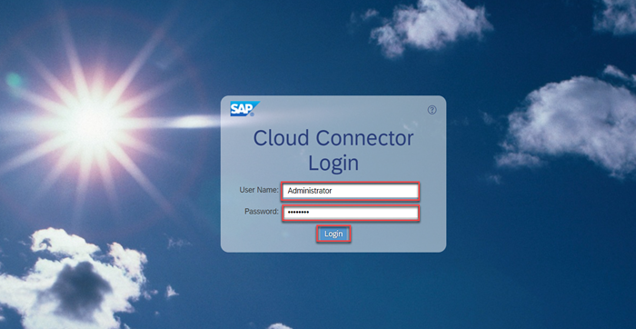

3. If required, enter a new password.

[DONE]
[ACCORDION-END]

[ACCORDION-BEGIN [Step 2: ](Connect your SAP BTP trial subaccount)]

If this is the first time SAP Cloud Connector is started, you will see the **Define Subaccount** page. Otherwise, the Connector Overview page opens.

1. On the Connector Overview Page, click **Add Subaccount** to add your SAP BTP trial account.

    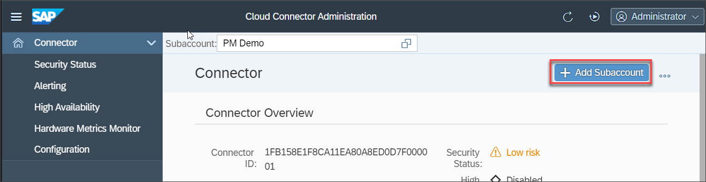

    On the **Define subaccount** page, you can directly start entering the details of your SAP BTP trial.

    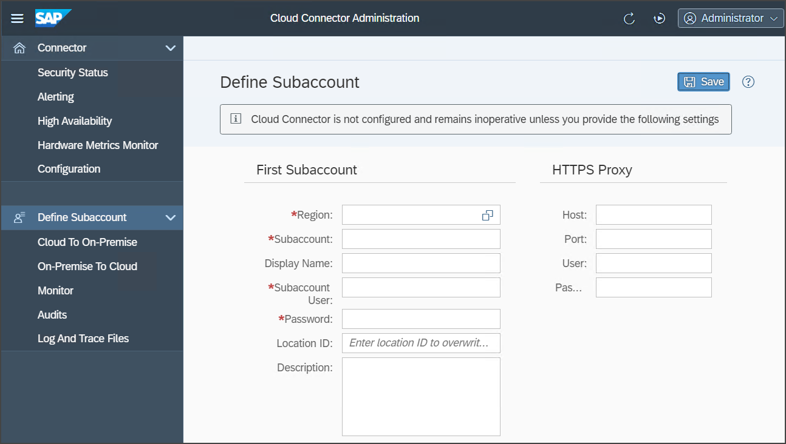

2. To find the right information to enter into SAP Cloud Connector, access your SAP BTP trial in a second browser tab at <https://account.hanatrial.ondemand.com/trial/#/home/trial>.

3. Click **Enter trial**, then click the **trial** tile.

    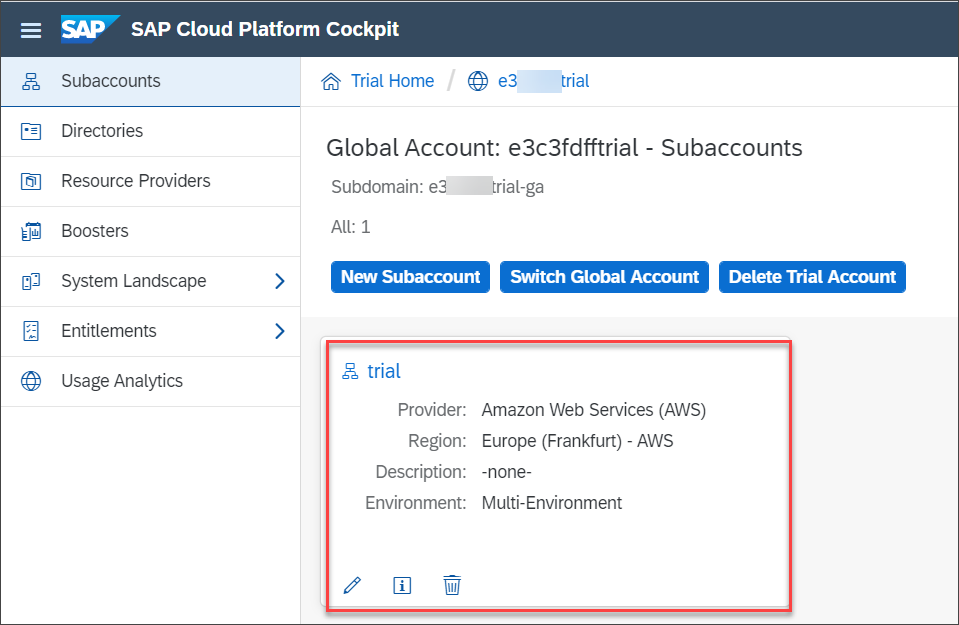

4. You can find the required information to enter in the SAP Cloud Connector form on this Overview page. You can identify the region ID from the **API end point** on the Cloud Foundry Environment tab and find the subaccount ID on top of the page next to **ID:**.

    Copy the subaccount ID.

    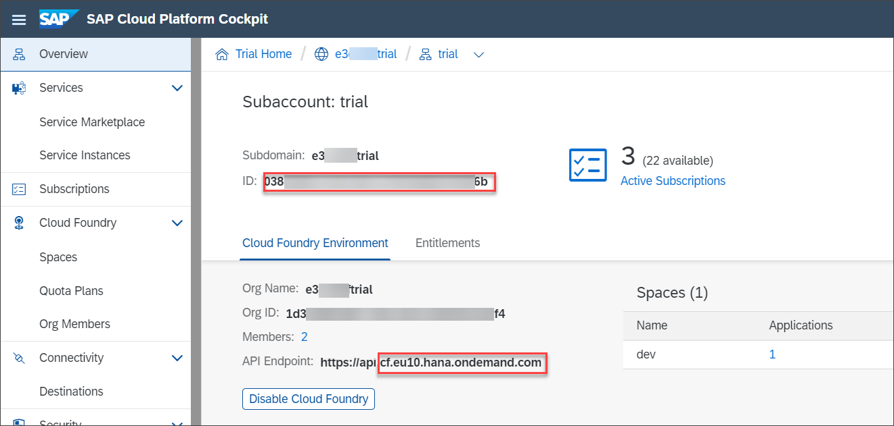

5. Go back to the SAP Cloud Connector tab. In the form, click the selector icon and select the region of your trial account. The ID of the selected region should start with `cf`.

    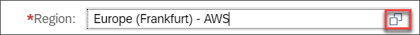
    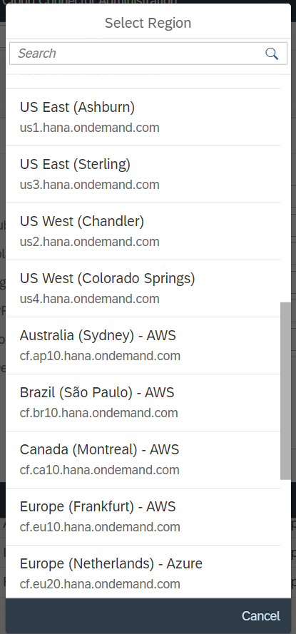

5. Paste the subaccount ID from the SAP BTP cockpit Overview page into the **Subaccount** field.
6. Enter an easily identifiable display name, e.g. your SAP BTP trial's subdomain into **Display Name**.
7. Enter the ``email address`` and ``password`` that you use to login to your SAP BTP trial into **Login E-Mail** and **Password**.
8. If you have attached another SAP Cloud Connector to your SAP BTP trial account already, enter any unique **Location ID** here to distinguish this SAP Cloud Connector from the existing one. Otherwise, you can leave this field empty.

    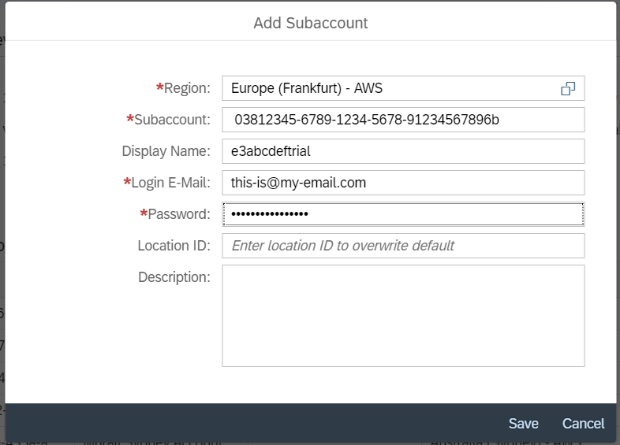

7. Click **Save**.

You have connected your trial subaccount and can now see it in the subaccount dashboard. The status is still yellow, as backend access has not been configured yet.

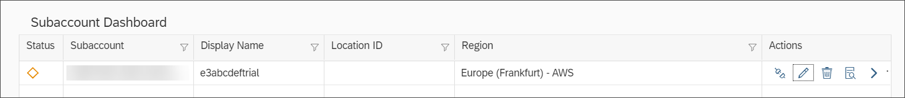

[DONE]
[ACCORDION-END]

[ACCORDION-BEGIN [Step 3: ](Configure access control)]

In this step, you specify the on-premise backend system that your trial should be able to access.

1. You can see that the newly connected subaccount is already selected. Click **Cloud To On-Premise** in the menu on the left side of the screen.

    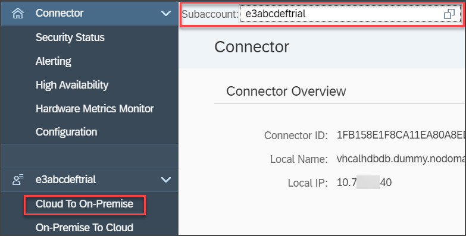

2. Click the **plus** icon on the **Access Control** tab to add your on-premise system.

    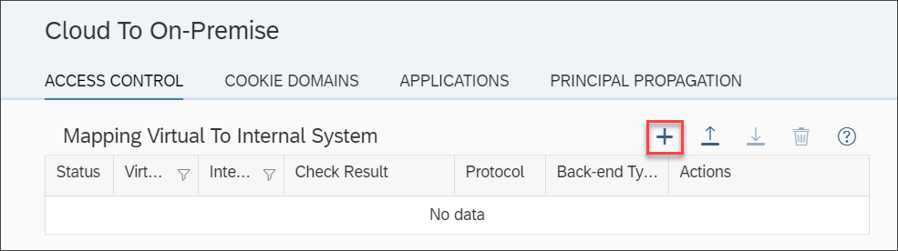

3. Keep the default **``ABAP System``** and click **Next**.

    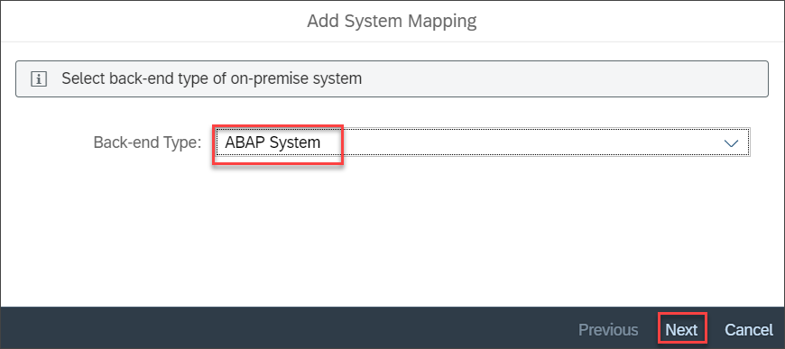

4. Select **``HTTPS``** as protocol for communication with your on-premise system and click **Next**.

    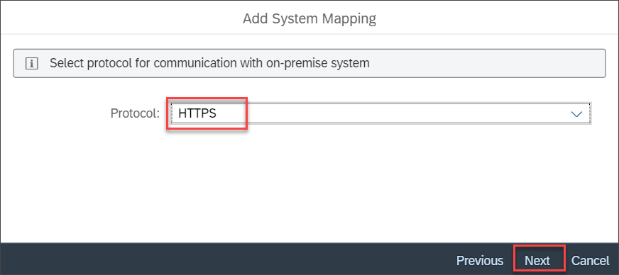

5. Enter the internal host name of your SAP S/4HANA system and the internal port. If you are using a system from the SAP Cloud Appliance Library (CAL), you can find the IP address in the details of your instance. The port is 44300 in this case. Then click **Next**.

    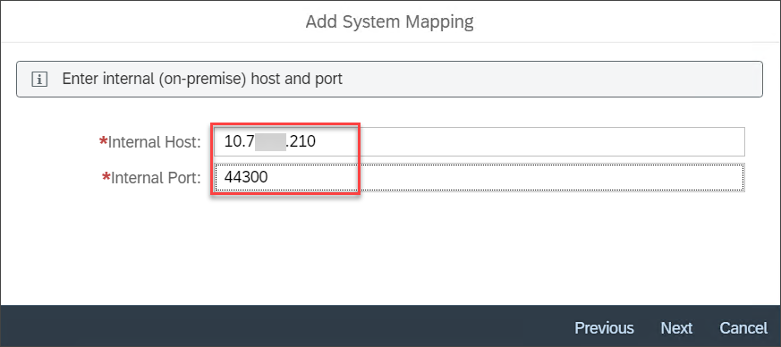

    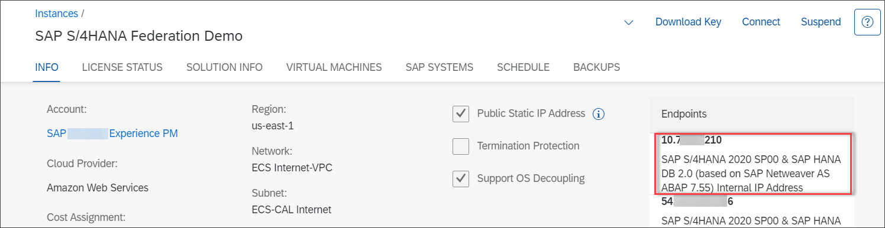

6. Enter **``s4hana``** as **Virtual Host** and **`44300`** as **Virtual Port** and click **Next**.

    > You can choose any virtual host name and port here, but you need to reuse the ones defined here when creating a destination later.

    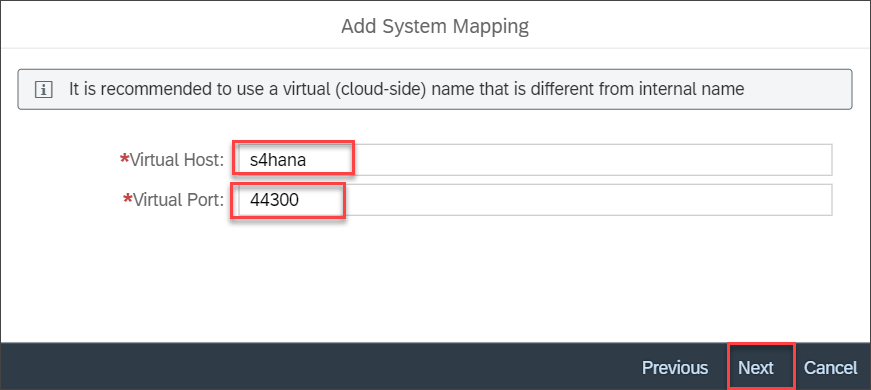

7. In the next screen, just click **Next**.

    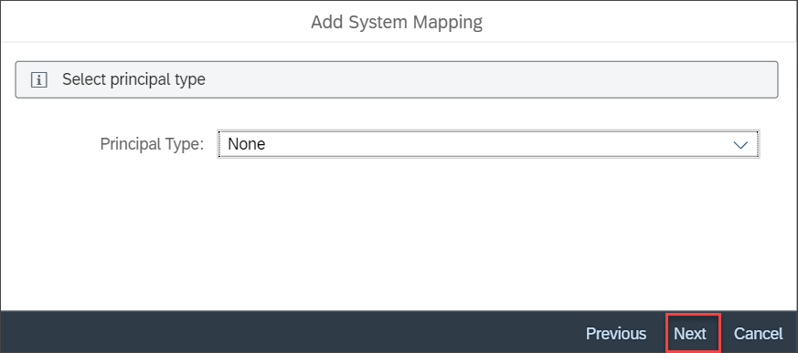

    >In a productive environment, we recommend that you use Principal Propagation or some other more advanced authentication concepts. In this tutorial, we just use the quickest and simplest approach for the sake of time.

8. Click **Next**.

    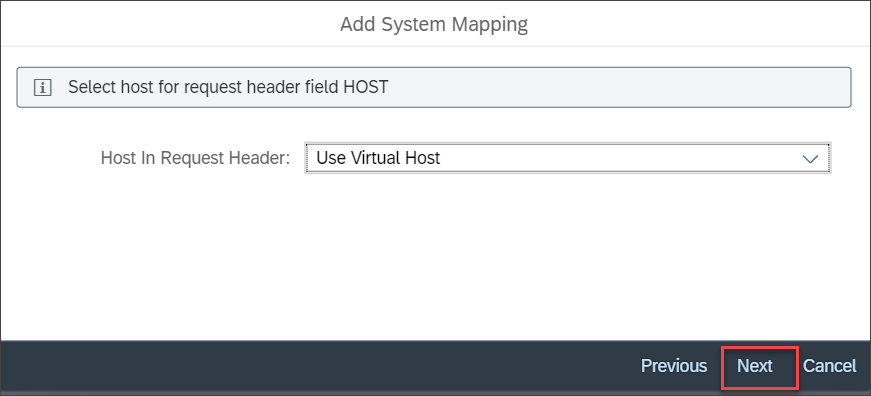

9. If you want, enter a description. Then click **Next**.

10. In the summary, check the **Check Internal Host** checkbox and click **Finish**.

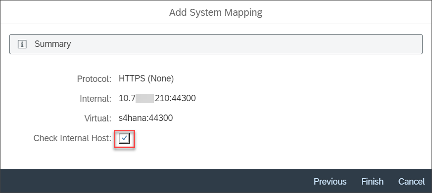

You now see a new entry in the mappings table. The icon in the **Check Result** column should be green, but the status is still grey, as no accessible resources have been defined yet.

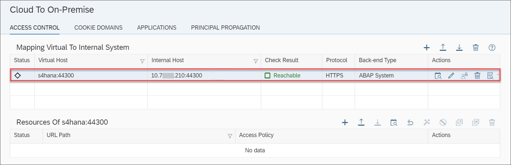

[DONE]
[ACCORDION-END]

[ACCORDION-BEGIN [Step 4: ](Add resources)]

1. In the lower table **Resources of s4hana:44300** click the **plus** icon.

    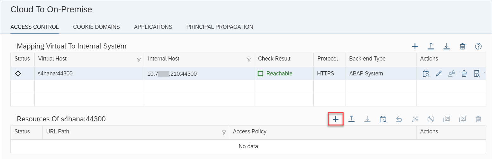

2. Enter **`/`** in **URL Path**.

    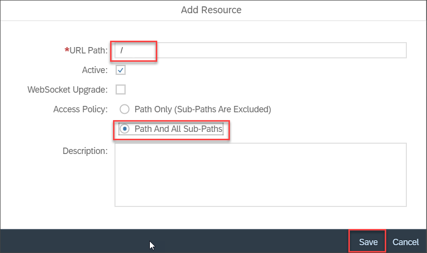

    > Usually you would define this in a more fine granular way, but since this is just a demo system, we will keep it simple.

3. Select **``Path And All Sub-Paths``** in **Access Policy**.

4. Click **Save**.

You now see a new entry in the lower table and the status of the entries in both tables should be green. SAP Cloud Connector configuration is now finished. You can leave the SAP Cloud Connector now.

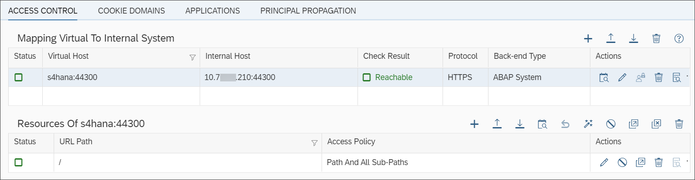

[DONE]
[ACCORDION-END]

[ACCORDION-BEGIN [Step 5: ](Create the design-time destination)]

The design-time destination is used to fetch the federated content from the content provider system during design-time.

1. Go back to the browser tab with your SAP BTP trial subaccount Overview page.

2. In the menu, navigate to **Connectivity** > **Destinations**.

    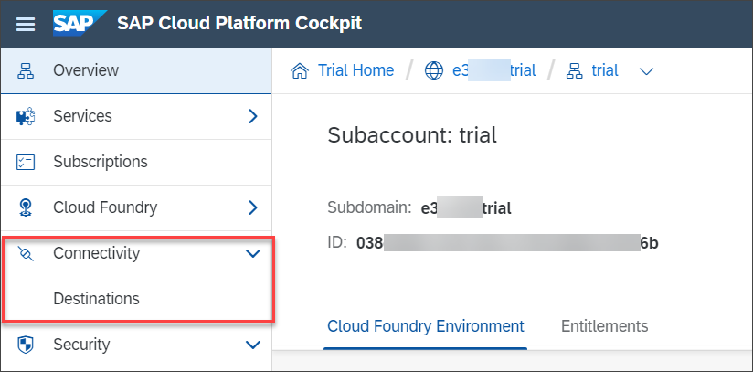

3. Click **New Destination**.

    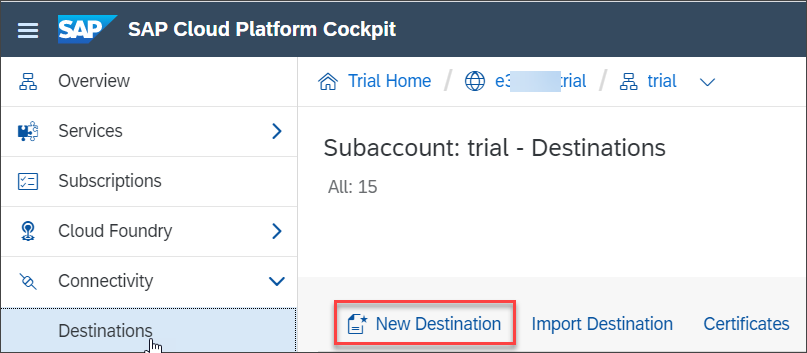

4. Fill in the form:

    |  Field Name     | Value
    |  :------------- | :-------------
    |  Name           | `s4hanadt`
    |  Type           | `HTTP`
    |  Description    | `SAP S/4HANA system`
    |  URL            | `http://s4hana:44300/sap/bc/ui2/cdm3/entities`
    |  Proxy Type     | `OnPremise`
    |  Authentication | `BasicAuthentication`
    |  User           | `<User ID on your SAP S/4HANA system>`
    |  Password       | `<Password of the user>`

    If you entered a Location ID in SAP Cloud Connector, enter the same value here in **Location ID** as well.

5. Click **New Property** to add an additional property to your destination.

    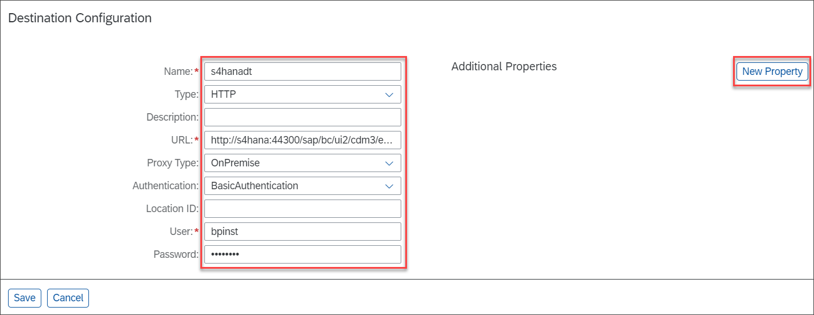

6. Enter ``sap-client`` and the client of your SAP S/4HANA system, e.g. 100 for SAP S/4HANA trial systems, as property name and value.

7. Click **Save**.

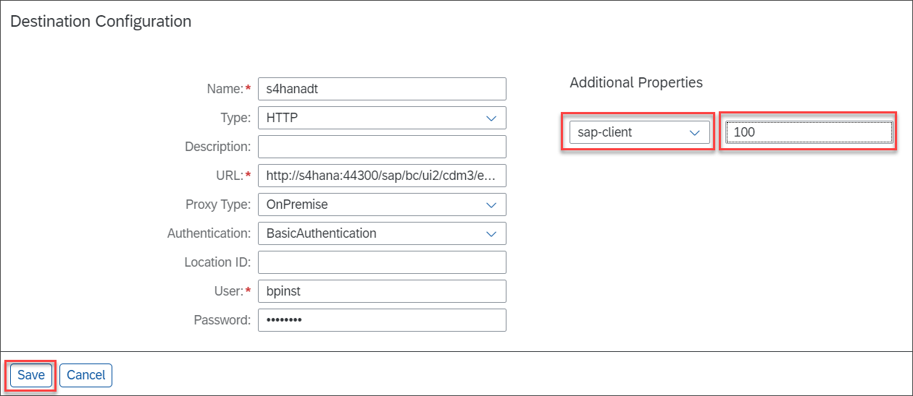

[DONE]
[ACCORDION-END]

[ACCORDION-BEGIN [Step 6: ](Create the runtime destination)]

The runtime destination is used to launch federated applications at runtime.

1. Below the destination that you just created, click **Clone**.

    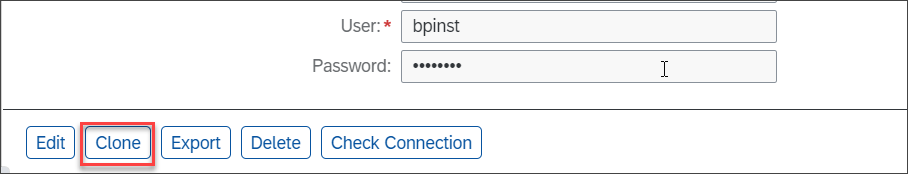

2. Change the **Name** of the new destination to **`s4hanart`**.

3. Remove the part after the port from the **URL**.

4. Enter the password ``Welcome1`` again.

5. Click **New Property** to add the following properties to your destination. You can **type in the property name, if it is not available in the dropdown list**.

    |  Property Name     | Value
    |  :------------- | :-------------
    |  HTML5.DynamicDestination           | `true`
    |  sap-platform  | `ABAP` (type the property name)
    |  sap-service    | A string that consists of the first two  characters 32 and the instance number of the ABAP application server, e.g. 3200 (type the property name)
    |  sap-sysid            | `<System ID of your SAP S/4HANA system>` - **S4H** for your CAL system (type the property name)

6. Click **Save**.

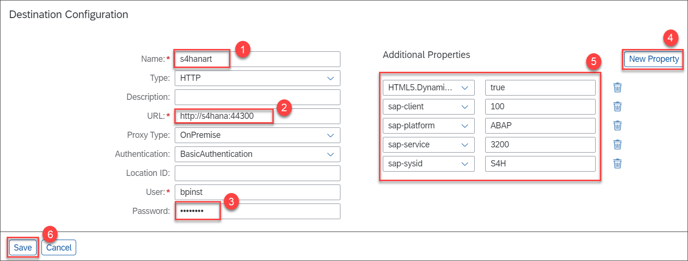

[VALIDATE_7]
[ACCORDION-END]

---
