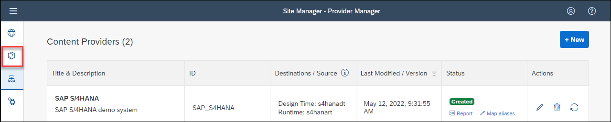
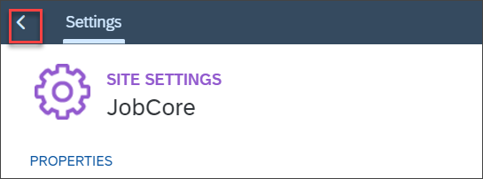

## Prerequisites
 - You have set up SAP Cloud Connector and runtime and design time destinations for your SAP S/4HANA system.
 - You exposed roles in your SAP S/4HANA system. 
 - You have created an SAP Build Work Zone site (see tutorial group [Create your First Business Site with Apps](group.launchpad-cf-create-site)).

## You will learn
  - How to create a new content provider 
  - How to add federated content to the My Content area
  - How to make federated roles available in your SAP Build Work Zone site

---

### Create a new Content Provider

In a first step, you will add the SAP S/4HANA system as a content provider.

1. Open the Site Manager of SAP Build Work Zone, standard edition.

2. Click the Provider Manager tab.

    

3. Click **+New** to create a new Content Provider.

    

4. Fill in the form using the destinations that you created in the second tutorial.

    |  Field Name     | Value
    |  :------------- | :-------------
    |  Name           | `SAP S/4HANA`
    |  Description    | `SAP S/4HANA demo system`
    |  ID             | Remove /, so the ID does not contain special characters except underscores.
    |  Design-Time Destination  | Select `s4hanadt` from drop-down list
    |  Runtime Destination  | Select `s4hanart` from drop-down list
    |  Runtime Destination for OData  | `Use default runtime destination`
    |  Content Addition Mode  | `Manual addition of selected content items`

5. Click **Save**.

       

    > If you select *Automatic addition of all content items*, all exposed content items will be automatically selected in the Content Explorer and added to the My Content tab, as soon as you create the content provider. In this case, when updating a provider, all the new content items are automatically added. In this exercise, you will add content items manually.

    > If you select *Include group and catalog assignments to roles*, the relationship of groups and catalogs to roles from the SAP S/4HANA system is taken into account for the display of the groups and catalogs on SAP Build Work Zone. For more details see [the documentation](https://help.sap.com/docs/WZ_STD/8c8e1958338140699bd4811b37b82ece/215517e6d4f44c96b790bbcb56d63572.html). 

    The content provider is added to the list and the content is loaded. This might take some seconds.

 6. Wait till the status says **Created**. If this takes long, try refreshing the browser page.

    <!-- border --> 

### Add roles to My Content

1. Click the **Content Manager** icon to manually assign content from your SAP S/4HANA system to ``My Content``, so you can add it to a site.

    

2. On top of the page, click **Content Explorer** to access content coming from content providers.

    

3. Click the **SAP S/4HANA** tile to access the content provider that you just created.

    

4. Click the checkboxes to select both roles.

5. Then click **Add to My Content**.

    

You see that both roles have been added.

>You can remove roles from My Content by clicking the *Remove* link.

### Check roles in My Content

1. On top of the page, click **My Content**.

    

2. Click the **Accounts Payable Accountant** role to open it and view the apps that are part of this role.

    

You can see that there are 84 apps available in this role. In the next step, you will assign the role to your site.

### Assign roles to site

To make the apps that come with the two federated roles available in your site, you need to assign the roles to the site.

1. Click the **Site Directory** icon to access your site.

    

2. Click the **Site Settings** icon to open the ``JobCore`` site that you created in previous tutorials.

    

3. Click **Edit** to switch to Editing mode.

    

4. Click into the **+ Search for items by their title** field to launch a search for all assignable items.

    You get a list with the two roles that you just added.

5. Click the **Assign** icons next to both roles.

    

    The **Assign** icon switches to a red **Unassign** icon.

6. Click **Save**.

    

7. Click the **Back to Site Directory** icon.

    

### Assign roles to your user

Apps are only displayed to users with the corresponding roles assigned. You assign those roles as role collections to users in the SAP BTP cockpit.

1. Open the SAP BTP cockpit of your trial account.

2. Navigate to **Security > Users** to assign the role collections to your user. When you added the federated content, one role collection for each federated role was automatically created.

    

3. In the list of users available in your subaccount, click on the name of your user.

    

4. In the user details panel on the right, click the three dots in the **Role Collections** section to open the menu. Then select ``Assign Role Collection``.

    

5. In the pop-up window select the checkboxes in front of the two federated roles ``~sap_s4hana_SAP_BR_MASTER_SPECIALIST_FIN`` and ``~sap_s4hana_SAP_BR_AP_ACCOUNTANT``. Then click **Assign Role Collection**.

    

Now you are done in SAP BTP cockpit.

### Access the federated content

1. Go back to the Site Directory to launch your ``JobCore`` site.

2. Click the **Go to Site** icon.

    <!-- border --> 

    The site opens in a new browser tab.

3. Check the new SAP S/4HANA apps and groups that have become available in the site.

    

4. Launch the SAPUI5 app **Manage Outgoing Checks** in the **Checks** group. Click **Go** to see some data.

    

    <!-- border --> 

5. Click the SAP icon to go back to the Work Zone homepage.

6. Launch the SAP GUI app **Maintain Business Partner** in the **Business Data Master** group.

    

---
