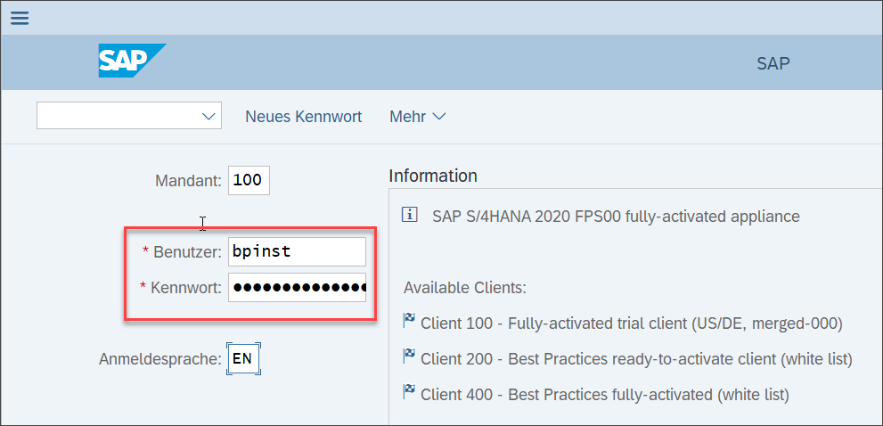
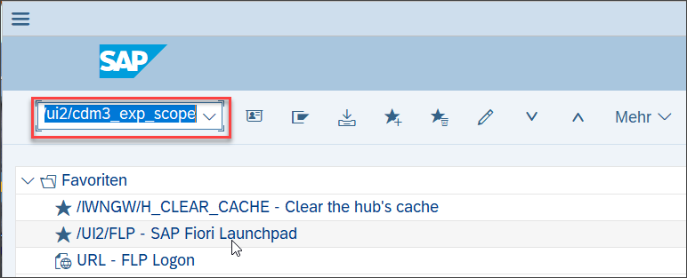
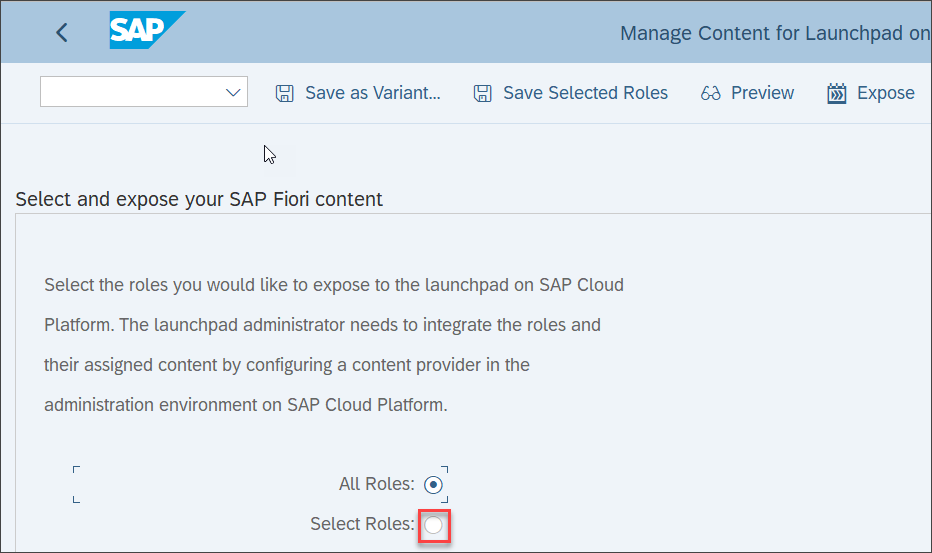
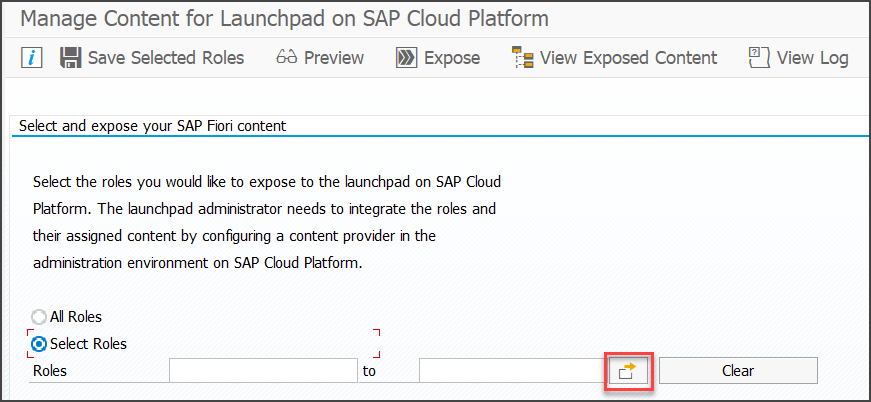
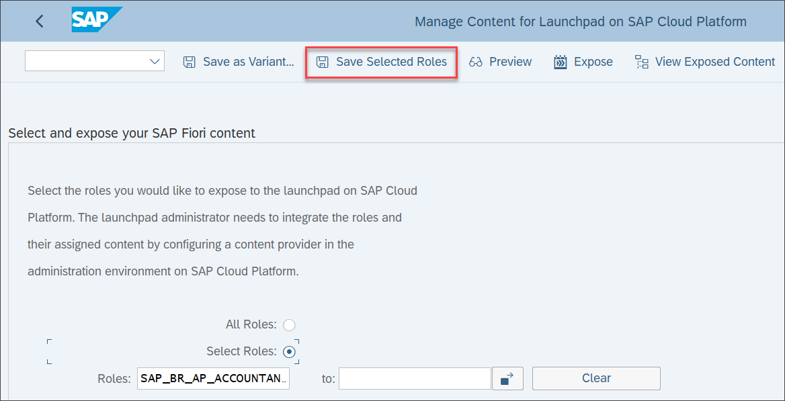
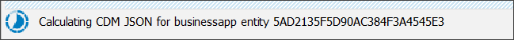
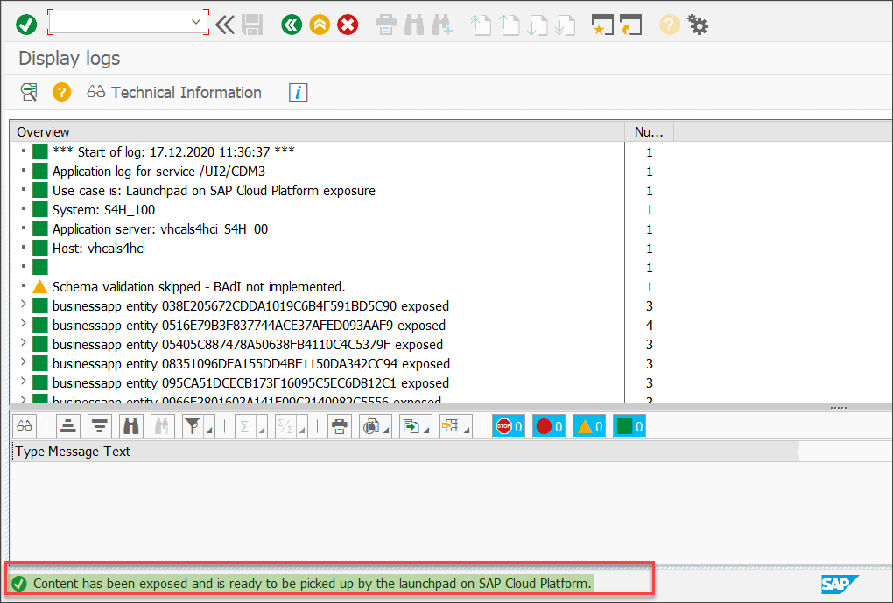
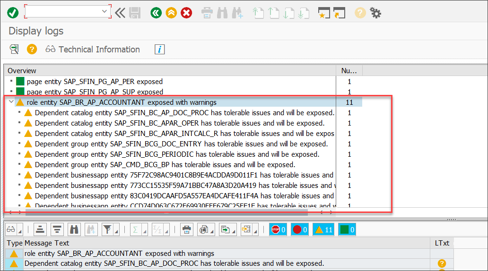

## Prerequisites
 - You have access to an SAP S/4HANA system with SAP Fiori Front-end Server 2020 that was configured for connectivity with your SAP BTP trial account.

## Details
### You will learn
  - Create a federation scope
  - Expose the scope for consumption by the SAP Launchpad

---

[ACCORDION-BEGIN [Step 1: ](Login to your SAP S/4HANA system)]

Login to your SAP S/4HANA system with SAP Logon.

[DONE]
[ACCORDION-END]

[ACCORDION-BEGIN [Step 2: ](Select SAP Fiori Content for Exposure)]

1. Enter transaction code ``/n/ui2/cdm3_exp_scope``.

    

2. In the **Select and expose your SAP Fiori content** screen, click the **Select Roles** radio button to select only some roles for content exposure.

    

3. Then click the **Multiple Selection** icon to open role selection.

    

4. Enter the two roles ``SAP_BR_AP_ACCOUNTANT`` and ``SAP_BR_MASTER_SPECIALIST_FIN`` either by typing them in or using the value help.

5. Then click the **Copy** icon.

    

6. Click  **Save Selected Roles** to keep the roles for future exposure.

    

[DONE]
[ACCORDION-END]

[ACCORDION-BEGIN [Step 3: ](Expose Selected Roles)]

Click **Expose** to start exposing the selected roles and their assigned content like apps, catalogs, and spaces.

The exposure process starts. In the status bar you can check the progress. Preparation of the content usually takes 1 to 2 minutes.

[DONE]
[ACCORDION-END]

[ACCORDION-BEGIN [Step 4: ](Check exposure log)]

Once the exposure process is finished, the exposure log is displayed. In the status bar, you also see a success message.

1. Scroll down to the bottom of the log.

2. Expand the entry ``role entity SAP_BR_AP_ACCOUNTANT exposed with warnings`` to check the warnings.

> You see which of the groups, catalogs, and apps were exposed with (tolerable) issues.

Now you are done with exposing the content and can go to the SAP  Launchpad to consume the exposed content.

[VALIDATE_6]
[ACCORDION-END]

---
