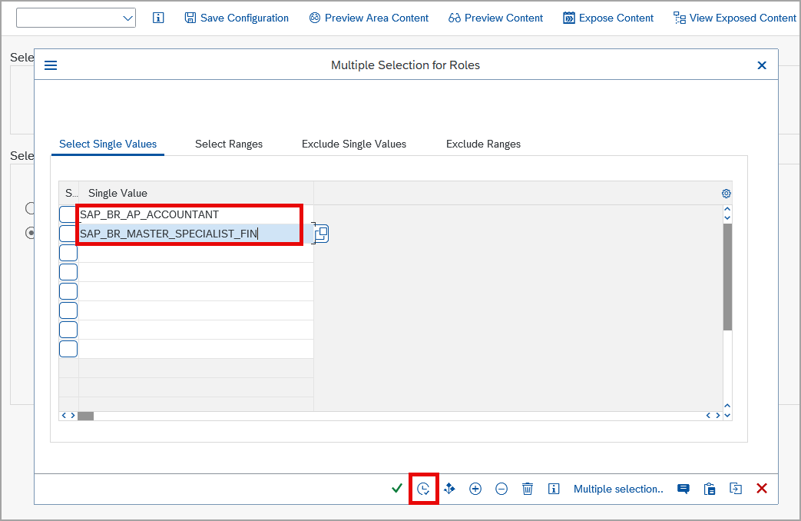

## Prerequisites
 - You have access to an SAP S/4HANA system with SAP Fiori Front-end Server 2020 or higher that was configured for connectivity with your SAP BTP trial account. The screenshots in this tutorial were taken from an SAP S/4HANA 2023 FPS01 system, but differences in older systems are also explained. 

## You will learn
  - Create a federation scope
  - Expose the scope for consumption by SAP Build Work Zone

---

### Login to your SAP S/4HANA system

Login to your SAP S/4HANA system with SAP Logon. 

### Select SAP Fiori Content for Exposure

1. Enter transaction code ``/n/ui2/cdm3_exp_scope``.

    

2. In the **Launchpad Content Exposure** screen, click the  **Multiple Selection** icon to open role selection.
    

    > **Note**: When using an older SAP S/4HANA system, the screen will look a bit different, as the option to select between exposure version 1 and version 2 only became available with SAP S/4HANA 2023 FPS01. In this tutorial, simply keep version 1. To learn more about the exposure versions, please check the [documentation](https://help.sap.com/docs/build-work-zone-standard-edition/sap-build-work-zone-standard-edition/federation-of-remote-content-providers).

3. Enter the two roles ``SAP_BR_AP_ACCOUNTANT`` and ``SAP_BR_MASTER_SPECIALIST_FIN`` either by typing them in or using the value help.

2. Then click the **Copy** icon.

    

3. Click  **Save Configuration** to keep the roles for future exposure.

    

### Expose Selected Roles

Click **Expose Content** to start exposing the selected roles and their assigned content like apps, catalogs, spaces and pages.

The exposure process starts. In the status message you can see the progress. Preparation of the content usually takes 1 to 2 minutes.

### Check exposure log

Once the exposure process is finished, the exposure log is displayed. In the status bar, you also see a success message.

   Scroll down to the bottom of the log.

Now you are done with exposing the content and can go to SAP Build Work Zone to consume the exposed content.

---
