## Prerequisites
- [Get a Free Account on SAP BTP Trial](hcp-create-trial-account)
- To integrate federated content into an SAP Launchpad site, you already need a launchpad site available in your SAP BTP trial account. Please follow at least the first two tutorials of the [Create your First SAP Launchpad site group](group.launchpad-cf-create-site) or the full [Deliver your First SAP Fiori launchpad site with integrated apps mission](mission.launchpad-cf) to set up the SAP Launchpad service on your SAP BTP trial account.
- To test content federation, you need an SAP S/4HANA system on release 2020 and have administrator access to it. This tutorial describes the configuration of an [SAP S/4 HANA Fully Activated Appliance 30-day trial system](https://www.sap.com/products/s4hana-erp/trial.html). You can find more details about the process to start your SAP S/4HANA trial in this [Quick Start Document](https://www.sap.com/documents/2019/04/4276422b-487d-0010-87a3-c30de2ffd8ff.html#page=1).
&nbsp;
To avoid reconfiguration of the SAP Cloud Connector after each restart, we recommend to use the system with a static public IP address.
&nbsp;
Please keep in mind that the trial is only free for 30 days, so only request the system, when you are ready to run the tutorial.
&nbsp;
- You need an SAP Cloud Connector installed. If you are using the SAP S/4HANA trial, the SAP Cloud Connector is already included in it.

## Details
### You will learn
  - How to set up the allow list to enable your SAP BTP trial to access the SAP S/4HANA system
  - How to set the SAP Fiori launchpad parameter `EXPOSURE_SYSTEM_ALIASES_MODE` in the SAP S/4HANA Customizing.

In this group of tutorials, you will integrate SAP Fiori launchpad content from an SAP S/4HANA system to the SAP Launchpad service on SAP BTP using content federation. With this functionality, SAP enables SAP S/4HANA (and other products) to serve as content providers by exposing their business content and role structures to the central Launchpad, which makes the day-to-day operation and maintenance by the content administrator much more efficient.

You will learn how to combine federated content from SAP S/4HANA with apps from other sources like custom apps running on SAP BTP or SAP Business Suite applications in one launchpad site.

---

[ACCORDION-BEGIN [Step 1: ](Login to your SAP S/4HANA system)]

1. If you are using your own instance of the SAP S/4HANA 2020, Fully Activated Appliance solution in SAP Cloud Appliance Library, click **Connect**.

    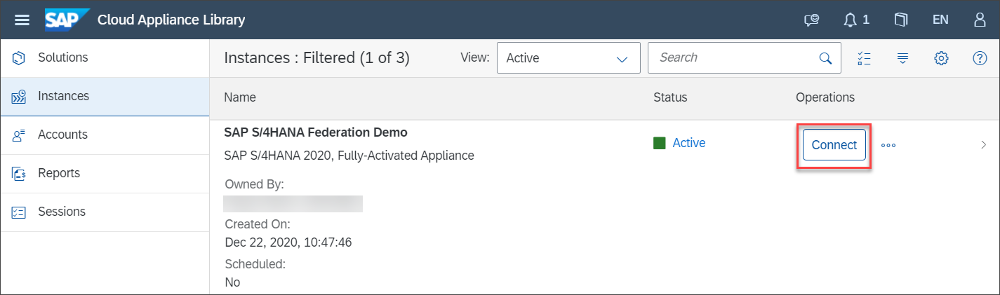

2.   You can either use the **Windows Remote Desktop** and login via SAP Logon there or login directly  via SAP GUI by clicking **Connect** in the SAP GUI row in the **Connect to the Instance** pop-up . Please check the [Getting Started with the SAP S/4HANA 2020 (SP00) Fully-Activated Appliance Guide](https://caldocs.hana.ondemand.com/caldocs/help/7a3ebd3e-d005-4c70-ae35-40a167aed981_Getting_Started_Guide_v1.pdf) for details.

    An **.sap** file will be downloaded to your computer to connect to the SAP S/4HANA system.

    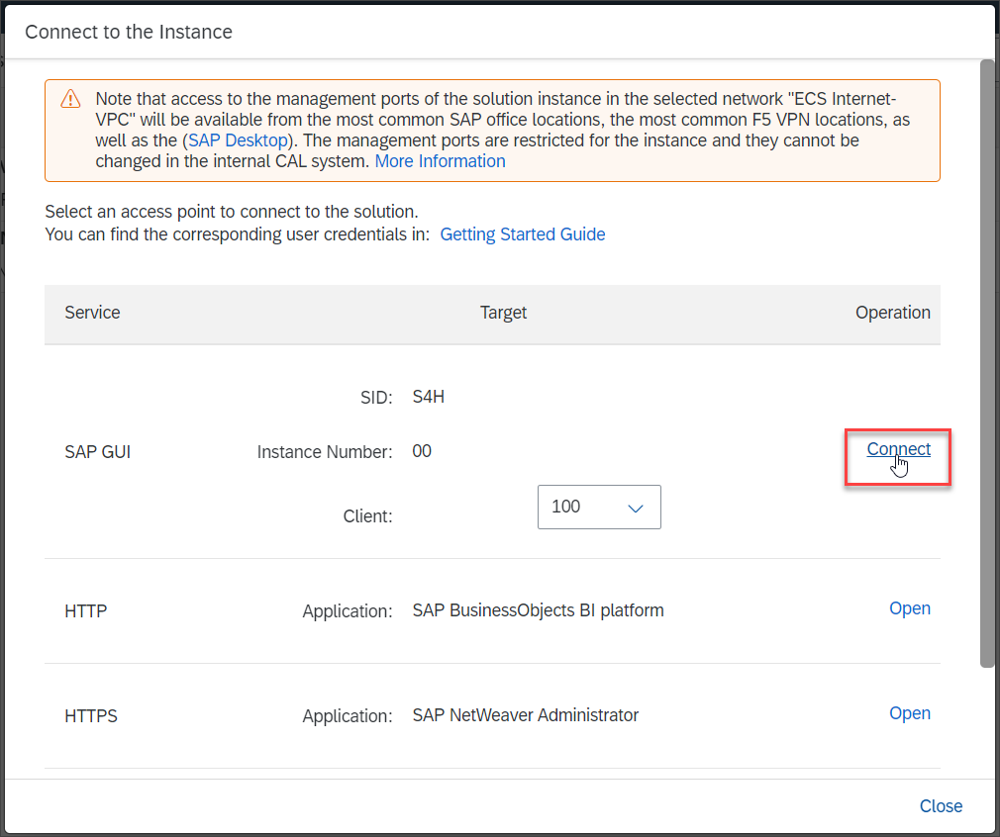

3. Click the downloaded file. If required, click **Allow** in the pop-up window.

    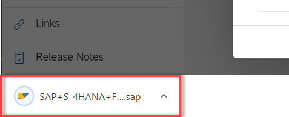

4. Login to client 100 of system S4H with default user ``BPINST`` and password ``Welcome1``.

    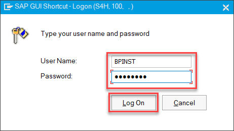

[DONE]
[ACCORDION-END]

[ACCORDION-BEGIN [Step 2: ](Open UCON cockpit)]

Since the SAP S/4HANA apps are integrated into the SAP Launchpad service using iFrames, you need to configure an allowlist to protect your system against clickjacking attacks. The allowlist service is an ABAP-wide service to implement protections. You can manage such allowlist scenarios with the Unified Connectivity Framework (UCON Framework) to optimize the protection of your RFC and HTTP(S) communication against unauthorized access.

To allow the SAP Launchpad service to consume data from your SAP S/4HANA system, you should add your trial account to the allowlist for Clickjacking Framing Protection.

>If you do not activate the allowlist, the launchpad defaults to a more restrictive clickjacking protection mechanism. It will then only allow framing if the host of the application is part of the same domain as the embedding application, i.e. the Launchpad (same origin policy).

Start the transaction ``uconcockpit``.

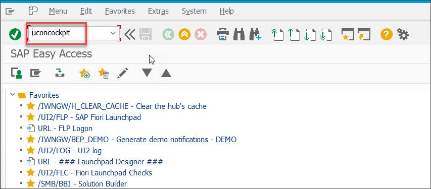

[DONE]
[ACCORDION-END]

[ACCORDION-BEGIN [Step 3: ](Activate clickjacking protection)]

1. In the drop-down list, select **HTTP Whitelist Scenario**.

    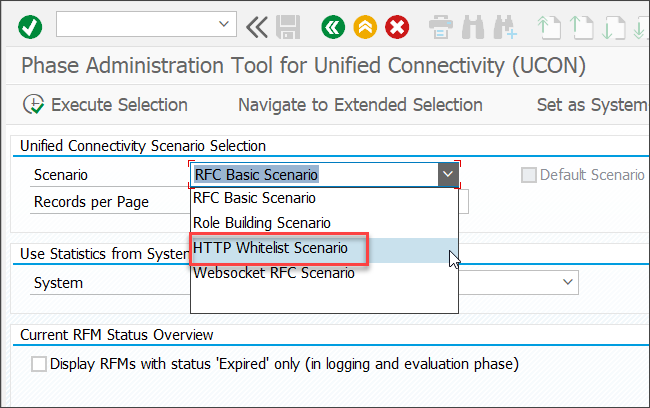

2. If the **Clickjacking Framing Protection** scenario is not available in the list, you need to activate it. To do so, select **HTTP Whitelist** > **Setup** in the menu bar.

    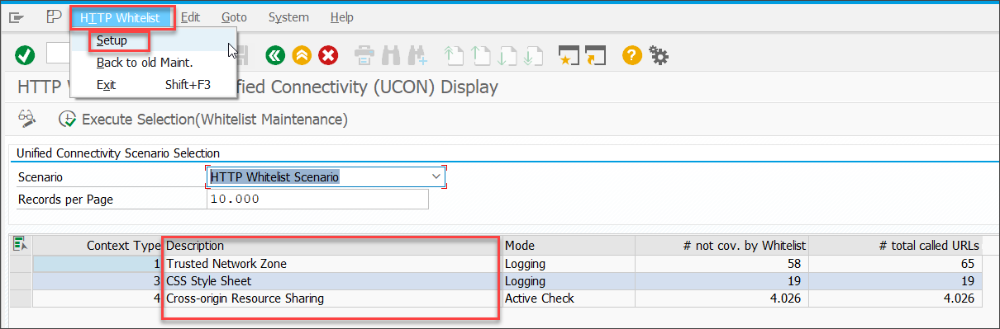

3. In the pop-up, check the entry **activate Clickjacking Protection (Context Type 02) for all clients (recommended)**. Then click the **Continue** icon.

    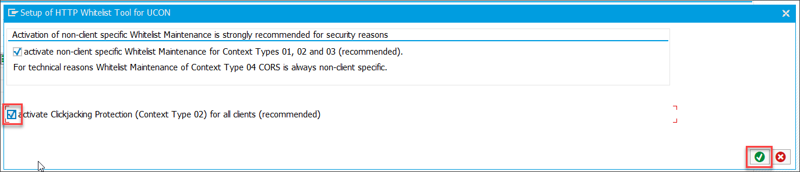

    >For more details, see [Using a Whitelist for Clickjacking Framing Protection](https://help.sap.com/viewer/864321b9b3dd487d94c70f6a007b0397/7.51.8/en-US/966b6233e5404ebe80513ae082131132.html)

You now see the **Clickjacking Framing Protection** entry in the table. It is currently set to **Logging** mode. This means that connections are only logged, but not checked. With this setting, connectivity from your SAP BTP trial account will work. However, this is not a secure setting. In a productive environment, you would need to add the patterns for your SAP Launchpad service to the allowlist and then set the scenario to **Active check** mode.

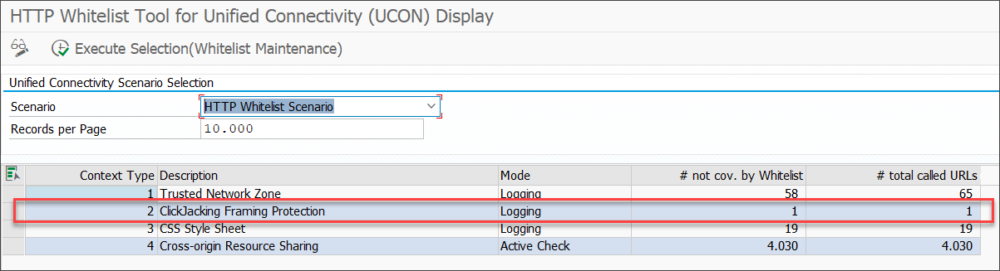

[DONE]
[ACCORDION-END]

[ACCORDION-BEGIN [Step 4: ](Open SAP Fiori launchpad client-specific settings)]

The parameter ``EXPOSURE_SYSTEM_ALIASES_MODE`` defines how to handle system aliases during content exposure. In an embedded deployment of the SAP Fiori front-end server, all apps run on the same server. Therefore, system aliases can be cleared during exposure. In a hub deployment in contrast, they might come from different back-end systems and each back-end system may have several aliases. Therefore, you need to map these aliases to the runtime destinations manually after creating the content provider in the last tutorial of this group. See the [documentation](https://help.sap.com/viewer/8c8e1958338140699bd4811b37b82ece/Cloud/en-US/021bc1192cbd455d898542dcf584440e.html) for details.

This parameter must only be set in an embedded scenario where the SAP Fiori front-end server is deployed into the AS ABAP of the SAP S/4HANA system. This is the case in the SAP S/4HANA trial system.

1. Enter ``/nspro`` in the command field to access the customizing.

    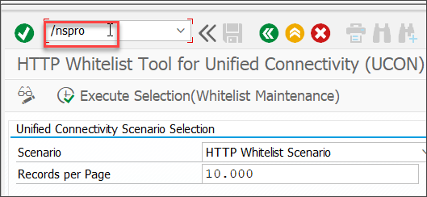

2. Click **SAP Reference IMG**.

    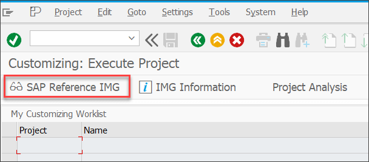

3. In the tree, open **SAP NetWeaver** > **UI Technologies** > **SAP Fiori** > **SAP Fiori Launchpad Settings**.

4. Then click the **IMG Activity** icon in front of **Change Client-Specific Settings**.

    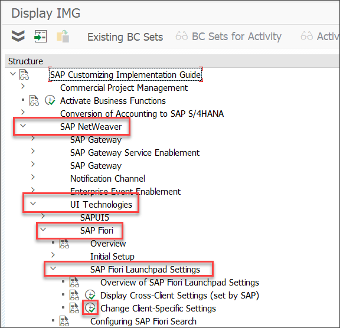

[DONE]
[ACCORDION-END]

[ACCORDION-BEGIN [Step 5: ](Set customizing parameter EXPOSURE_SYSTEM_ALIASES_MODE)]

5. Click **New Entries** to create one new entry.

    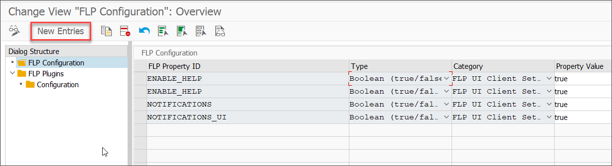

6. For the new entry, make the following inputs in the first row of the table:

    FLP Property ID: `EXPOSURE_SYSTEM_ALIASES_MODE`

    Type: `String type`

    Category: `FLP UI Server Settings`

    Property Value:  `CLEAR`

    > Don't worry if the values for Type and Category are not displayed in this view although you made them. They will show up after saving.

7. Click the **Save** icon.

    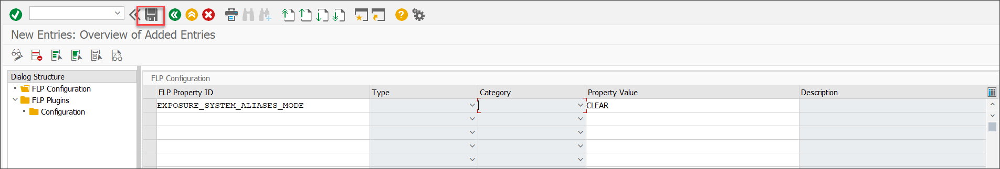

    To save your settings, you need to assign a customizing request.

8. Click the **Create** icon to create a new customizing request.

    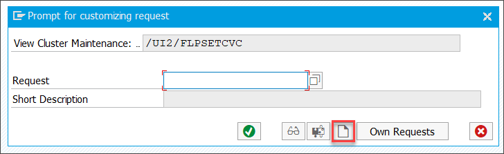

9. If you want, enter a description. Then click the **Save** icon.

    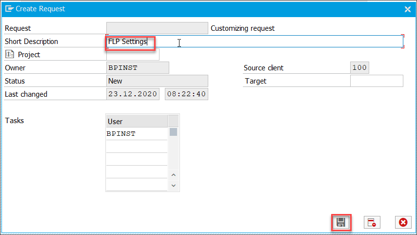

10. Click the **OK** icon to confirm the selected customizing request.

    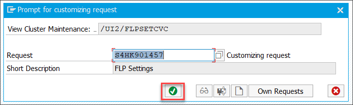

11. Your entry was saved. Click the **Back** icon to go back to the main settings table.

    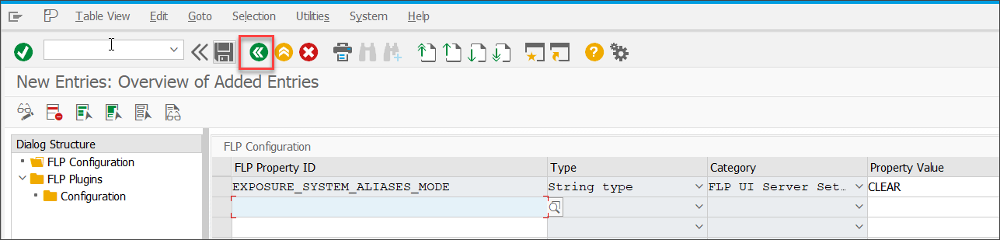

Now you made all settings required in the SAP S/4HANA trial system.

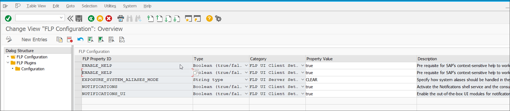

[DONE]
[ACCORDION-END]

[ACCORDION-BEGIN [Step 6: ](Check activation status of cdm3 service)]

If you work in your own SAP S/4HANA test system or just want to make sure all prerequisites for content exposure are met, you might check if the  service ``/sap/bc/ui2/cdm3`` is activated in the SAP S/4HANA system. This is the case in the preconfigured SAP S/4HANA trial.

1. Enter ``/nsicf`` into the command field to launch transaction ``SICF``.  

2. Enter ``cdm3`` in **Service Name** and click the **Execute** icon.

    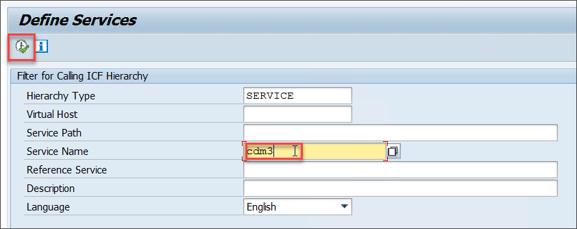

3. Right-click the **cdm3** service. Check that the **Activate Service** entry is grey and inactive. This means that the service is already activated. Otherwise, you can activate it now by clicking Activate Service.

    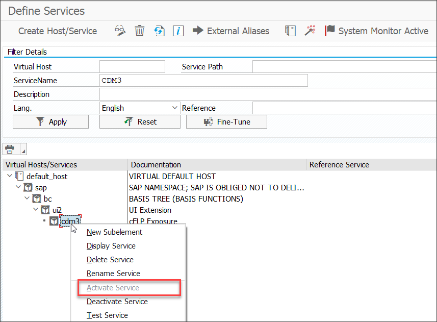

[DONE]
[ACCORDION-END]

[ACCORDION-BEGIN [Step 7: ](Check exposing user)]

You also need to make sure that the user which does the content exposure has the right role and that the page cache is turned on for them. This is also already the case for user ``bpinst``.

1. Enter ``/nsu01`` into the command field to launch **User Maintenance**.

2. Enter the ``bpinst`` as **User** as this is the user that will do the content exposure. Then click the **Display** icon.

    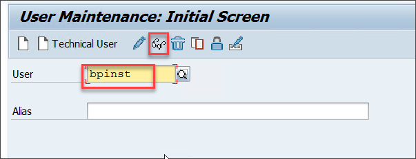

    > The permissions to run the content exposure are delivered with the role ``SAP_FLP_ADMIN``. The BPINST user has full administrator permissions and can be used for content exposure.

4. Go to tab **Parameters** and make sure that the parameter  ``/UI2/PAGE_CACHE_OFF`` does **not** show up here. If it does, remove it.

    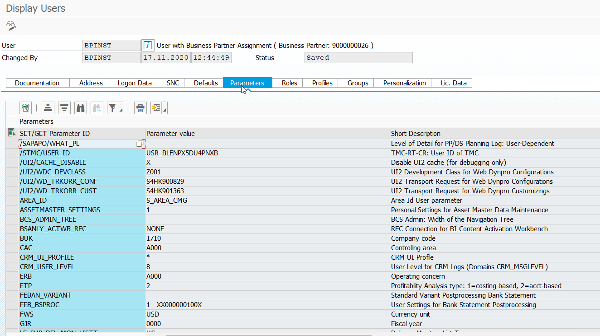

> This parameter is only used for test purposes to identify caching issues. It should not be available in productive systems anyhow, as it can slow down the loading process significantly.

[VALIDATE_6]
[ACCORDION-END]

---
