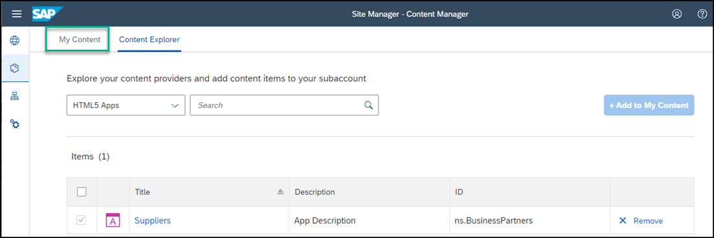
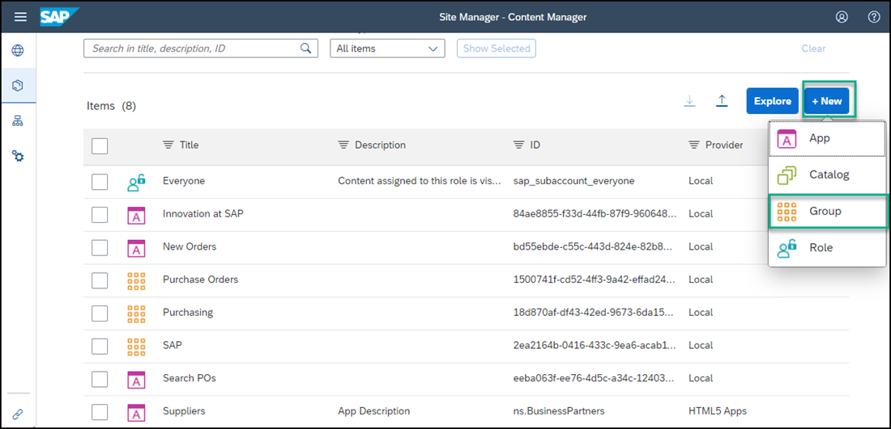
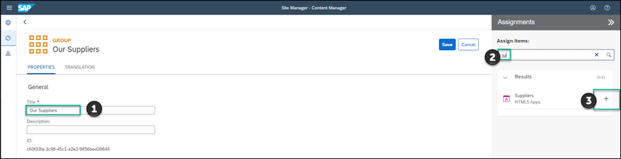
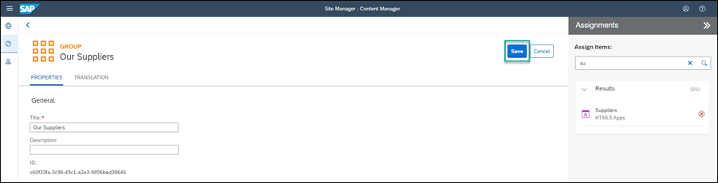
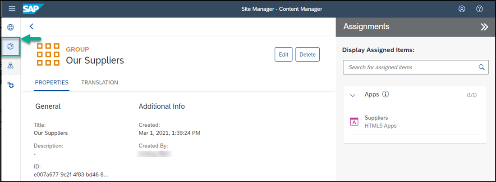

## Prerequisites
 - You've already created the `JobCore` Launchpad site.
 - You've deployed your SAPUI5 app (including the navigation properties), to SAP Cloud Platform.

## Details
### You will learn
  - How to add a deployed, custom-developed SAPUI5 app to your SAP Cloud Platform Launchpad site

---
Once you've deployed your SAPUI5 app to SAP Cloud Platform, it becomes available to add to a Launchpad site.

[ACCORDION-BEGIN [Step 1: ](Open Content Manager)]

1. In the side navigation panel of your subaccount, click **Subscriptions** and enter **Launchpad** in the search bar.

2. Then on the **Launchpad** tile, click **Go to Application**.

    The Launchpad service allows you to create SAP Fiori Launchpad sites in the Cloud using the following 3 tools:

     - **Site Directory**: this is where you manage launchpad sites including adding and deleting sites, as well as updating the site's settings.

      - **Content Manager**: this is where you manage cross-site business content. Use this tool to configure your content or to explore and add predefined content from available content providers.

      - **Provider Manager**: this is where you manage content providers. These content providers expose business content that you can integrate into your sites.

3. Click the **Content Manager** icon in the side panel to open the **Content Manager**.

    !

>The **Content Manager** has two tabs: **My Content** where you can manually configure content items and view any other available content items, and the **Content Explorer** where you can explore exposed content from available content providers, select the content, and add it to your own content.

[DONE]
[ACCORDION-END]

[ACCORDION-BEGIN [Step 2: ](Add SAPUI5 app to site)]

1. Click the **Content Explorer** tab to explore content from the available content providers.

    

2. Select the **HTML5 Apps** provider.

    >The **HTML5 Apps** content provider is created automatically. Any app that you deploy to SAP Cloud Platform is automatically added as content to this provider.

    !

3. You'll see that your `Suppliers` app that you've just created in SAP Business Application Studio, already exists in this provider. Select it and click **+ Add to My Content**.

    !

4. Click the **My Content** tab.

    

    Note that your `Suppliers` app is in the list of content items.

[DONE]
[ACCORDION-END]

[ACCORDION-BEGIN [Step 3: ](Create group and assign app to it)]

In this step you'll create a new group and you'll assign the `Suppliers` app to it.

> A group is a set of one or more apps displayed together in the launchpad. Assigning apps to groups allows users to view them in the launchpad.

1. Click **+ New** in the **Content Manager** and select **Group** to create a new group.

    

2. Enter `Our Suppliers` as the **Title**.

3. In the **Assignments** panel on the right, type `su` to search for your `Suppliers` app and then click the **+** icon next to the app name to assign your app to this group.
 You'll see that the icon changes.

    

4. Click **Save**.

    

[DONE]
[ACCORDION-END]

[ACCORDION-BEGIN [Step 4: ](Assign app to Everyone role)]

In this step, you'll assign the `Suppliers` app to the `Everyone` role. This is a default role - content assigned to the `Everyone` role is visible to all users.

1. Open the **Content Manager** from the side panel.

    

2. Click the `Everyone` role to open the Role editor.

3. Click **Edit**.

    

4. Select the `Suppliers` app from the right panel.

5. Click **Save**.

[DONE]
[ACCORDION-END]

[ACCORDION-BEGIN [Step 5: ](Review your site)]

1. Click the **Site Directory** icon to open the Site Directory.

    

2. Click **Go to site** on the site tile.

    

      You'll see the `Our Suppliers` group with the `Suppliers` app.

3. Click the app to launch it.

    

[VALIDATE_6]
[ACCORDION-END]
