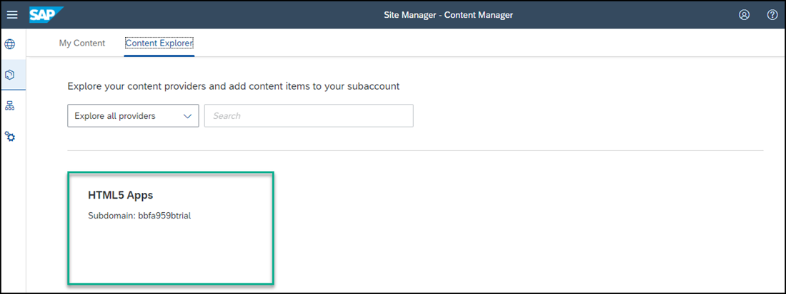
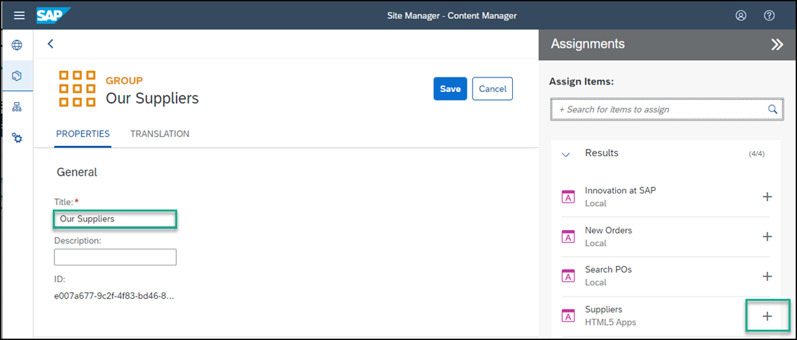
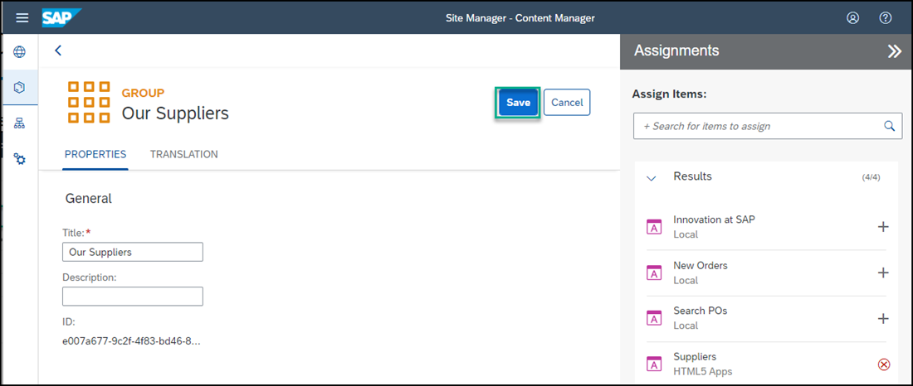

## Prerequisites
 - You've already created the `JobCore` Launchpad site.
 - You've deployed your SAPUI5 app (including the navigation properties), to SAP Cloud Platform.

## Details
### You will learn
  - How to add a deployed, custom-developed SAPUI5 app to your SAP Cloud Platform Launchpad site

---
Once you've deployed your SAPUI5 app to SAP Cloud Platform, it becomes available to add to a Launchpad site.

[ACCORDION-BEGIN [Step 1: ](Fetch updated content using the Provider Manager)]

1. In the side navigation panel of your subaccount, click **Subscriptions** and enter **Launchpad** in the search bar.

2. Then on the **Launchpad** tile, click **Go to Application**.    

3. Click the **Provider Manager** icon to view any available content providers.

    

4. Select the **HTML5 Apps** content provider.

    >The **HTML5 Apps** content provider is created automatically. Any app that you deploy to SAP Cloud Platform is automatically added as content to this provider.

    !

5. Click the **Fetch updated content** icon.

    

The **HTML5 Apps** content provider should now expose any newly deployed app for integration.

[DONE]
[ACCORDION-END]

[ACCORDION-BEGIN [Step 2: ](Add your deployed SAPUI5 app to your content)]

1. Click the **Content Manager** icon in the side panel to open the **Content Manager**.

    !

    >The **Content Manager** has two tabs: **My Content** where you can manually configure content items and view any other available content items, and the **Content Explorer** where you can explore exposed content from available content providers, select the content, and add it to your own content.

2. Click the **Content Explorer** tab to explore content from the available content providers.

    

3. Select the **HTML5 Apps** provider.

    

3. You'll see that your `Suppliers` app that you've just created in SAP Business Application Studio, already exists in this provider. Select it and click **+ Add to My Content**.

    !

4. Click the **My Content** tab.

    

    Note that your `Suppliers` app is in the list of content items.

[DONE]
[ACCORDION-END]

[ACCORDION-BEGIN [Step 3: ](Create group and assign app to it)]

In this step, you'll create a new group and assign the `Suppliers` app to it.

> A group is a set of one or more apps displayed together in the launchpad. Assigning apps to groups allows users to view them in the launchpad.

1. Click **+ New** in the **Content Manager** and select **Group** to create a new group.

    

2. Enter `Our Suppliers` as the **Title**.

3. In the **Assignments** panel on the right, click in the search box to see a list of apps.

    >If you have many apps, you can type some letters of your app name in the search bar, (for example, `su`) to search for the app.

4. Next to the `Suppliers` app, click the **+** icon to assign your app to this group.

    

    You'll see that the icon changes.

4. Click **Save**.

    

[DONE]
[ACCORDION-END]

[ACCORDION-BEGIN [Step 4: ](Assign app to Everyone role)]

In this step, you'll assign the `Suppliers` app to the `Everyone` role. This is a default role - content assigned to the `Everyone` role is visible to all users.

1. Open the **Content Manager** from the side panel.

    

2. Click the `Everyone` role to open the role editor.

3. Click **Edit**.

    

4. Click the search box in the **Assignments** panel on the right. Any available apps are shown in the list below.

5. Next to the `Suppliers` app, click the **+** icon. You'll see that the icon changes.

6. Click **Save**.

[DONE]
[ACCORDION-END]

[ACCORDION-BEGIN [Step 5: ](Review your site)]

1. Click the **Site Directory** icon to open the Site Directory.

    

2. Click **Go to site** on the site tile.

    

    You'll see all the apps that you have created in your launchpad. In the `Our Suppliers` group, you'll see the `Suppliers` app that we've just created.

    

3. Click the app to launch it.

    

[VALIDATE_6]
[ACCORDION-END]
