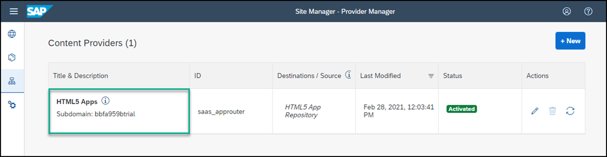
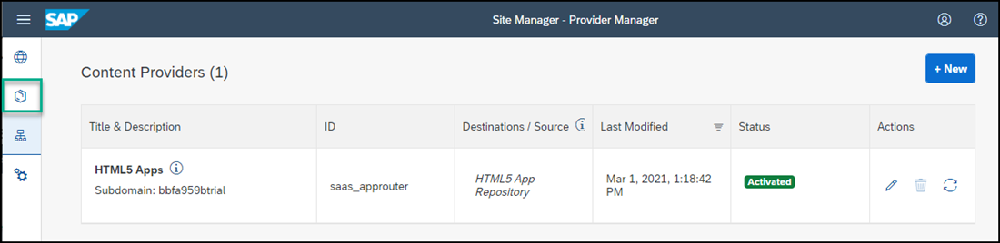
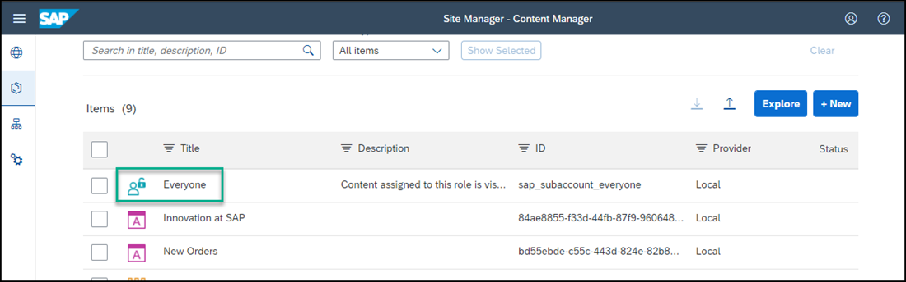
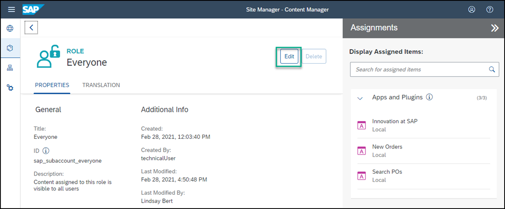

# Integrate Your SAPUI5 App into Your Site
<!-- description --> Add an SAPUI5 app to a site in SAP Build Work Zone, standard edition.

## Prerequisites
 - You've already created the `JobCore` site
 - You've deployed your SAPUI5 app (including the navigation properties), to SAP BTP, Cloud Foundry environment

## You will learn
  - How to add a deployed, custom-developed, SAPUI5 app to your site

---
Once you've deployed your SAPUI5 app to SAP BTP, it becomes available to add to your site.

### Fetch updated content using the Channel Manager

In this step, you will find your custom developed app that you deployed to your subaccount in SAP BTP.

1. In the side navigation panel of your subaccount, click **Instances and Subscriptions** and then next to **SAP Build Work Zone, standard edition**, click the **Go to Application** icon.

    

2. Click the **Channel Manager** icon to view any available content providers.

    

3. Select the **HTML5 Apps** content provider.

    >The **HTML5 Apps** content provider is created automatically. Any app that you deploy to SAP BTP is automatically added as content to this provider.

    <!-- border -->

4. Click the **Fetch updated content** icon.

    

The **HTML5 Apps** content provider should now expose any newly deployed app for integration.

### Add your deployed SAPUI5 app to your content

1. Click the icon in the side panel to open the **Content Manager**.

    <!-- border -->

2. Click the **Content Explorer** button to explore content from the available content providers.

    

3. Select the **HTML5 Apps** provider.

    

4. You'll see that your `Suppliers` app that you've just created in SAP Business Application Studio, already exists in this provider. Select it and click **+ Add to My Content**.

    <!-- border -->

5. Select the `Suppliers` app and click **Add**.

    

6. Using the breadcrumbs, go back to the Content Manager.

    

    Note that your `Suppliers` app is in the list of content items.

    

### Assign app to Everyone role

In this step, you'll assign the `Suppliers` app to the `Everyone` role. This is a default role - content assigned to the `Everyone` role is visible to all users.

1. In the **Content Manager**, click the `Everyone` role.

    

2. Click **Edit**.

    

3. In the **Assignment Status** column, toggle the switch to assign the app to the `Everyone` role. 

    

4. Click **Save**.

### Add the app to your page

1. Using the breadcrumbs, go back to the Content Manager.

2. Select the `Overview` page. 

    

3. When the page opens you'll see other apps and a card that you added in the previous tutorials. Click **Edit**.

    

4. Hover in the section where your other apps are displayed, click the **+** icon.

    

5. Select the `Suppliers` app and click **Add**.

    

6. Click **Save**.

### Review your site

1. Click the **Site Directory** icon to open the Site Directory.

    

2. Click **Go to site** on the site tile.

    

    You'll see all the apps that you have added to your site as well as the UI integration card.

    

3. Go ahead and click the apps to launch them.

   
### Review your site

1. Click the **Site Directory** icon to open the Site Directory.

    

2. Click **Go to site** on the site tile.

    

    You'll see all the apps that you have created in your site. In the `Our Suppliers` group, you'll see the `Suppliers` app that we've just created.

    

3. Click the app to launch it.

    
