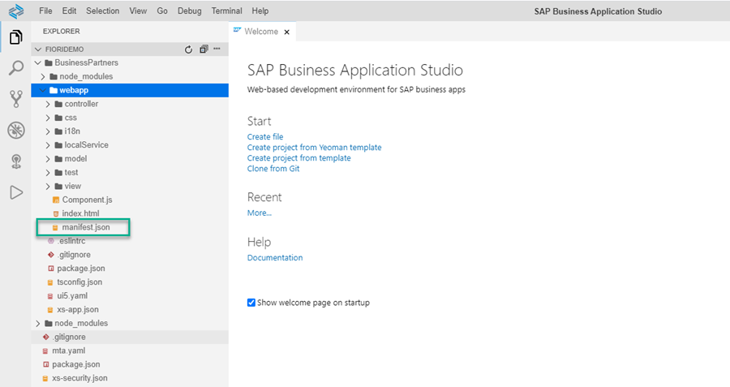
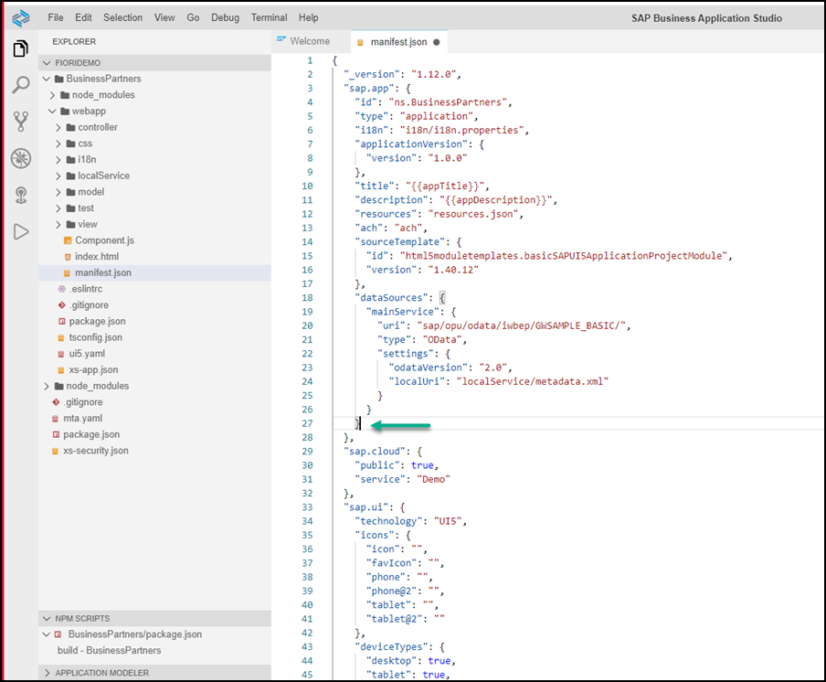
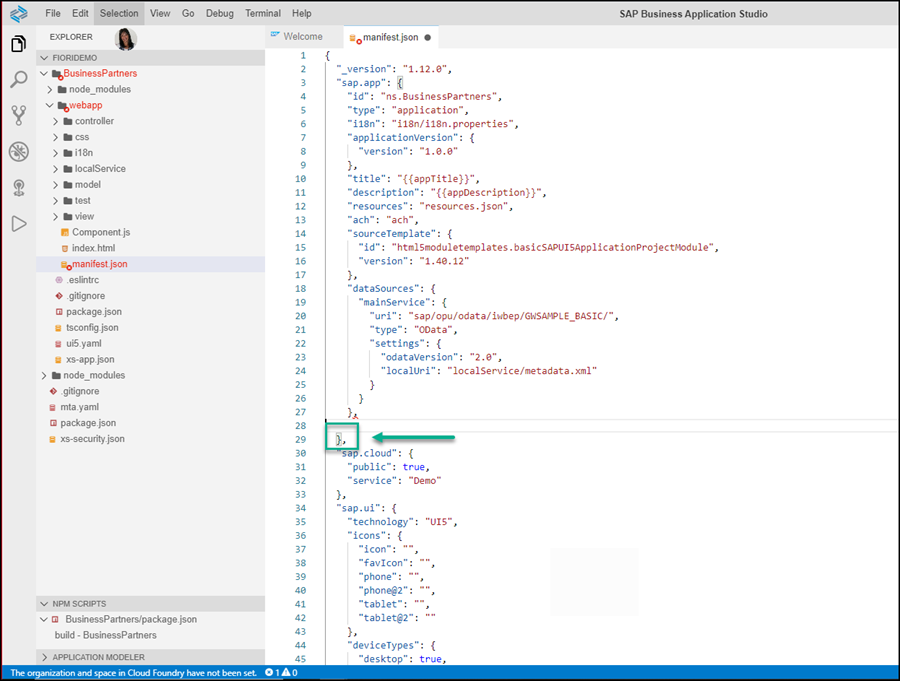
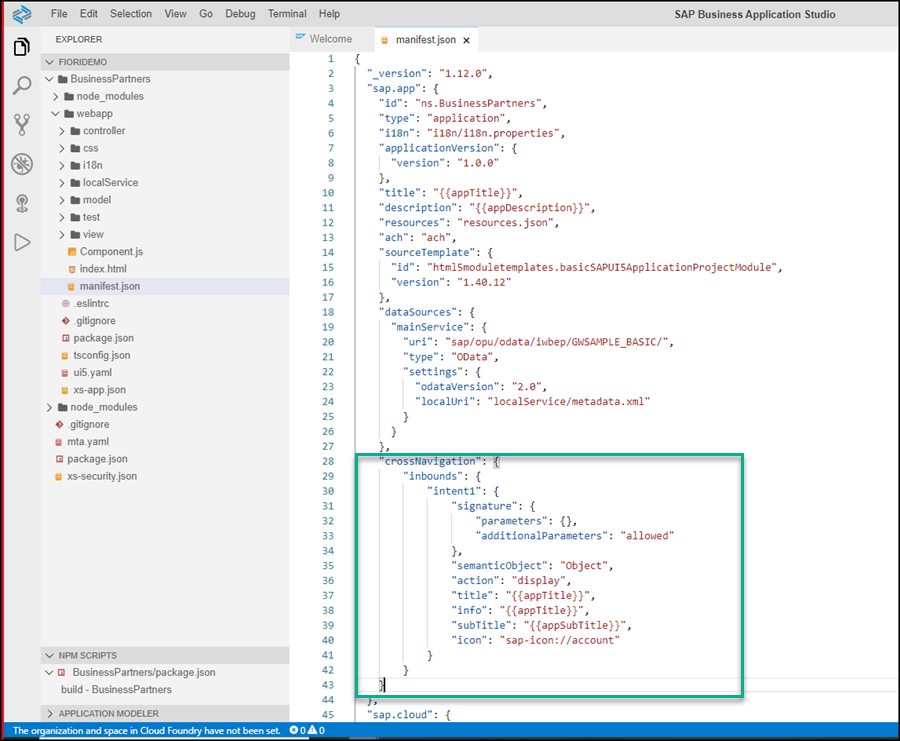

## Details
### You will learn
  - How to configure the navigation properties for your custom app

Adding navigation properties to custom-developed apps is mandatory in order to enable adding them to an SAP Cloud Platform Launchpad site. To add navigation properties to an app, edit its `manifest.json` file and add an intent to it. An intent is a unique combination of a semantic object and an action.

---

[ACCORDION-BEGIN [Step 1: ](Open manifest.json file)]
1. In your SAP Business Application Studio explorer, expand your app folder and then expand the `webapp` subfolder and select it.

2. Click the `manifest.json` file to open it.

    

[DONE]
[ACCORDION-END]


[ACCORDION-BEGIN [Step 2: ](Add intent)]
Now you'll add the intent navigation parameters to the `sap.app` descriptor in the `manifest.json` file.

1. Under the **sap.app** section of the `manifest.json` file, put your cursor on the line before the closing bracket of the `sap.app` section. In our example, we'll put it after the closing bracket of the `datasources` section.

    

2. Add the intent descriptor as follows:

    - Add a comma after the closing bracket of the `datasources` section to add a new section.

        

    - Click enter to add a new row and then backspace to make sure you're at the beginning of the newly added row.

    - Copy the following intent information (note the copy button on the right of this code).

        ```JSON
        "crossNavigation": {
            "inbounds": {
                "intent1": {
                    "signature": {
                        "parameters": {},
                        "additionalParameters": "allowed"
                    },
                    "semanticObject": "Object",
                    "action": "display",
                    "title": "{{appTitle}}",
                    "info": "{{appTitle}}",
                    "subTitle": "{{appSubTitle}}",
                    "icon": "sap-icon://account"
                }
            }
        }
        ```

    - Paste this code in your `manifest.json` file. It should look like this:

        

3. Click **File > Save**.

[DONE]
[ACCORDION-END]

[ACCORDION-BEGIN [Step 3: ](Test yourself)]

[VALIDATE_6]
[ACCORDION-END]
