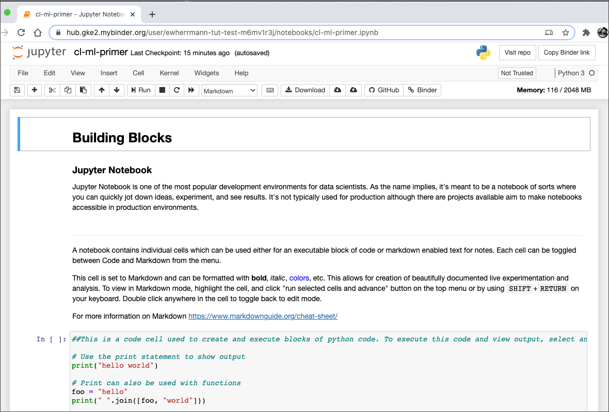

## Prerequisites
 - General understanding of Python helpful, but not required

## Details
### You will learn
  - How to use `Python`, `Jupyter Notebook`, `Numpy`, and `Pandas`
  - How to build a text classification model using `Scikit-Learn`
  - How to analyze model accuracy

---

## Building Blocks
[ACCORDION-BEGIN [Step 1: ](Launch Jupyter Notebook)]
>The development environment used here is Jupyter Notebook and steps are included to be able to run it on the cloud based service [Binder](https://mybinder.org/); however, you can also install and run it locally if desired. Local installation is out of the scope of this tutorial, but you can find more information at [jupyter.org](https://jupyter.org/)

>For this tutorial, there are two different notebook files to choose from. Both are available on GitHub at <https://github.com/SAP-samples/cloud-ml-basic-intro>
>
>- `cp-ml-primer.ipynb` - preferred notebook with descriptions, but little to no code. Code must be copied and pasted from tutorial directly.
>- `cp-ml-primer-solution.ipynb` - notebook with both descriptions and code if you are in a hurry or get stuck

Binder is a cloud based service that allows you to pull a notebook from a GitHub repository and launch it in a cloud based Jupyter notebook server.

0. Launch the notebook by either:
    - Directly using URL <https://mybinder.org/v2/gh/SAP-samples/cloud-ml-basic-intro/HEAD?filepath=cp-ml-primer.ipynb>
    - Or by going to <https://mybinder.org> and entering the GitHub repository and notebook info
        - GitHub repository name or URL `https://github.com/SAP-samples/cloud-ml-basic-intro`
        - Path to a notebook file `cp-ml-primer.ipynb`
        - Press the **launch** button
0. The server will launch and open in your browser.



#### **IMPORTANT**
Binder will timeout and disconnect if left idle for too long, so it is important to frequently use the option to save and load your changes using browser storage.


You can also download your notebook `.ipynb` file and save it locally, which can be used on any Jupyter Notebook server later using menu option `File->Download as>Notebook`


[DONE]
[ACCORDION-END]

[ACCORDION-BEGIN [Step 2: ](Getting Familiar with Jupyter)]
>You will find a lot of the tutorial information and steps both here and in your recently opened Jupyter notebook; feel free to follow along on either.

Jupyter Notebook is one of the most popular development environments for data scientists. As the name implies, it's meant to be a notebook of sorts where you can quickly jot down ideas, experiment, and see results. It's not typically used for production; although, there are projects available that aim to make notebooks accessible in production environments.

A notebook contains individual cells which can be used either for an executable block of code or markdown enabled text for notes. Each cell can be toggled between Code and Markdown from the menu. To view in Markdown mode or execute the code in a cell:

0. Highlight the cell by clicking anywhere in the margin directly left of the cell
0. Click "Run" on the top menu or by using SHIFT+RETURN on your keyboard.
0. Double click anywhere in the cell to toggle back to edit mode.

#### Highlighted Cell Type Indicator


#### Change Highlighted Cell Type


#### Markdown Cell Before Execution


#### Markdown Cell After Execution


#### Code Cell Before Execution


#### Code Cell After Execution


>
- You can change the code and rerun it to see any changed output.
- You can also clear output from menu by highlighting cell and then from menu using
`Cell->Current Outputs->Clear`
- There are a few more code cells to play around with and execute in the notebook Jupyter section.

[DONE]
[ACCORDION-END]

[ACCORDION-BEGIN [Step 3: ](Install `NumPy` Package)]
A python package is a module that can be installed and used in your environment. Since we are running this tutorial in a Jupyter server in the cloud, some of the packages we will be using will need to be installed.

Run notebook code to import `sys` package and install & import `numpy` package
```python
import sys
!{sys.executable} -m pip install numpy
```

[DONE]
[ACCORDION-END]

[ACCORDION-BEGIN [Step 4: ](Using `NumPy`)]
`NumPy` is heavily used in python when dealing with data science and machine learning projects. It's a super efficient tool for creating and processing multi dimensional arrays.

#### Simple Array
0. Find code cell for simple array and enter code:
```Python
import numpy as np
#
simple_array = np.array([5, 10])
print(f'simple array contents: {simple_array}')
print(f'simple array shape: {simple_array.shape}')
print(f'simple array cell content by index: {simple_array[0]}')
```
0. Run code cell
0. Analyze output

The output shows that you now have a simple 1 dimensional array with a shape/length of 2. You can access an item in the array by index.


#### Multi dimensional Array
0. Insert new code cell with code:
```python
import string
multi_array = np.array([list(string.ascii_lowercase), list(range(26))], dtype=object)
print(f'multi array contents: {multi_array}')
print(f'multi array shape: {multi_array.shape}')
print(f'multi array cell content by index: {multi_array[0][0]}')
```
0. Run code cell
0. Analyze output

The output shows that you now have a 2 dimensional array containing both letters and numbers with a shape of 2 rows X 26 items. You can still access an item in the array by it's index.


>
- `NumPy` arrays are optimized for memory usage and size is defined up at declaration. If you want to append an unknown amount of items dynamically, a native Python structure may be a better fit
- `NumPy` has many powerful mathematical functions that can be performed on arrays
- Find more info <https://numpy.org/doc/stable/user/quickstart.html#the-basics>

[DONE]
[ACCORDION-END]

[ACCORDION-BEGIN [Step 5: ](Using `Pandas`)]
Pandas is like a small, in-memory date store that allows for processing data. Internally, it utilizes `numpy`, but adds some convenient query and data access. One very common usage is to import and export CSV files to and from a Pandas DataFrame.

Install `Pandas` package by creating and running new code cell:
```python
!{sys.executable} -m pip install pandas
import pandas as pd
```

The two main Pandas data structures are Series and DataFrame.

A *Series* is a one-dimensional array that also contains an index which serves as a label for each item

0. Create series from a list:
```python
egeeks = ['Thomas','Rich','Craig','Dan','Ed']
ring_srs = pd.Series([12,8,10,8,13],index=egeeks, name='Ring Size')
print("Series type:", type(ring_srs))
print("Series name:", ring_srs.name)
print(f"Rich's ring size is {ring_srs['Rich']}")
ring_srs
```
0. Analyze output


0. Create series from a dictionary:
```python
state_srs = pd.Series({"Thomas": "Indiana", "Rich": "Pennsylvania", "Craig": "North Rhine-Westphalia", "Dan": "New York", "Ed":"Indiana"}, name="State")
print("Series name:", state_srs.name)
print("Series type:", type(state_srs))
print(f"Thomas lives in {state_srs['Thomas']}")
state_srs
```
0. Analyze - the output should look similar to the output above from the series you created from a list

A *DataFrame* is a two-dimensional array with rows, columns, and labels. All individual rows and columns of a DataFrame are made up of individual Series.

0. Create new DataFrame from your two previously created series:
```python
egeeks_df = pd.concat([ring_srs, state_srs], axis=1)
print(type(egeeks_df))
print(f"Rich lives in {egeeks_df.loc['Rich']['State']}")
egeeks_df
```
0. Analyze output - DataFrame is made up of an index, 2 columns, and 5 rows of data. An individual data can be accessed by an index and column name lookup.

0. Run and analyze the remaining cells in the notebook for the Pandas section to explore more DataFrame characteristics and capabilities.

[DONE]
[ACCORDION-END]

## Machine Learning
Now that you are familiar with some of the basic tools, it's time to dive into machine learning. In the following steps, you will build a machine learning model that will predict if a line of text is more likely a quote from a `Star Wars` character or `Elon Musk`. May the force be with you.

>
- Most of the steps below require you to enter and run the code in a cell in Jupyter.
- The data files are located both in the GitHub repository and your local notebook.
- To view available files within Jupyter, use menu option File->Open

[ACCORDION-BEGIN [Step 6: ](Install Scikit-Learn)]
For this tutorial, you will use scikit-learn, a popular machine learning library for python.

```python
!{sys.executable} -m pip install sklearn
```

[DONE]
[ACCORDION-END]

[ACCORDION-BEGIN [Step 7: ](Prepare Musk Data)]
The dataset used contains tweets from `Elon Musk`, but we will need to do some preprocessing to optimize the text for our model.

0. Load data
```python
elon_df = pd.read_csv('data_elonmusk.csv', encoding='latin1')
```
0. Preview data
```python
print('Elon Tweets and Retweets:', len(elon_df))
elon_df.head(20) #show first 20 lines
```
0. Create new DataFrame with no `retweets`
```python
elon_clean_df = pd.DataFrame(elon_df.loc[elon_df['Retweet from'].isnull()]['Tweet'].tolist(), columns=['text',])
```
0. Clean up the data for processing
```python
#create new column for cleaned up dialogue
elon_clean_df['dialogue'] = elon_clean_df['text']
#remove URLs using regex
elon_clean_df['dialogue'] = elon_clean_df['dialogue'].str.replace(r"http\S+", "")
elon_clean_df['dialogue'] = elon_clean_df['dialogue'].str.replace(r"http", "")
#remove @ mentions using regex
elon_clean_df['dialogue'] = elon_clean_df['dialogue'].str.replace(r"@\S+", "")
#replace any line breaks with spaces
elon_clean_df['dialogue'] = elon_clean_df['dialogue'].str.replace(r"\n", " ")
```
0. Preview your preprocessed data
```python
print('Elon Tweets', len(elon_clean_df))
elon_clean_df.head(20)
```

[DONE]
[ACCORDION-END]

[ACCORDION-BEGIN [Step 8: ](Prepare Star Wars Data)]
0. Load data from all three movies in the original trilogy
```python
hope_df = pd.read_csv('SW_EpisodeIV.txt', delim_whitespace=True, names=["id","character","dialogue"], index_col="id", skiprows=[0,])
emp_df = pd.read_csv('SW_EpisodeV.txt', delim_whitespace=True, names=["id","character","dialogue"], index_col="id", skiprows=[0,])
jedi_df = pd.read_csv('SW_EpisodeVI.txt', delim_whitespace=True, names=["id","character","dialogue"], index_col="id", skiprows=[0,])
```
0. Create new DataFrame combining all movie lines
```python
sw_df = pd.concat([hope_df, emp_df, jedi_df])
print('Total Star Wars movie lines: ', len(sw_df))
sw_df.head(20)
```

[DONE]
[ACCORDION-END]

[ACCORDION-BEGIN [Step 9: ](Combine Datasets)]
0. Add column to each dataset to indicate the source
```python
elon_clean_df['who said it'] = 'Elon Musk'
sw_df['who said it'] = 'Star Wars'
```
0. Combine data into a single DataFrame using only the needed columns
```python
all_df = pd.concat([elon_clean_df[['dialogue', 'who said it']], sw_df[['dialogue', 'who said it']]])
```
0. Preview data
```python
print("Total lines of dialogue:", len(all_df))
all_df.head(10).append(all_df.tail(10)) #show a preview
```


[DONE]
[ACCORDION-END]

>Many of the following steps use Scikit-Learn, a common python package for machine learning.

[ACCORDION-BEGIN [Step 10: ](Vectorization - Fit / Train)]
Machines like numbers, not text. In order to perform machine learning on text documents, we first need to turn the text content into numerical feature vectors. There are many different methods and theories for vectorization and some options are better depending on the use case. For this tutorial, we will use TF-IDF (Term Frequency times Inverse Document Frequency). TF-IDF is a way of adjusting the importance or weight of individual terms in relation to all of the terms and frequencies of the entire dataset.

For the context of this tutorial, the term *fit* is used interchangeably with the term *train*.

```python
from sklearn.feature_extraction.text import TfidfVectorizer
tfidf_vectorizer = TfidfVectorizer(stop_words="english")
tfidf_vectorizer.fit(all_df['dialogue'])
```

[DONE]
[ACCORDION-END]

[ACCORDION-BEGIN [Step 11: ](Shuffle and Split Data)]
It is important to hold back some data to test the model's accuracy.

```python
from sklearn.model_selection import train_test_split
all_df_train, all_df_test = train_test_split(all_df, test_size=0.20) #split 20% for testing
print("All data:", len(all_df))
print("Train data:", len(all_df_train))
print("Test data:", len(all_df_test))
all_df_test.head(20)
```

[DONE]
[ACCORDION-END]

[ACCORDION-BEGIN [Step 12: ](Vectorization - Transform Training Data)]
In the previous vectorization step, the `vectorizer` object was fit with the entire dataset to create a map of terms. Now you will transform each individual line of text from the training data into a vector for fitting the text classifier model.
```python
dialogue_tfidf_train = tfidf_vectorizer.transform(all_df_train['dialogue'])
dialogue_tfidf_train
```

[DONE]
[ACCORDION-END]

[ACCORDION-BEGIN [Step 13: ](Train the Model)]
Now that the training data has been vectorized, it's time to train/fit the model. The input for the following `fit` method is 2 `iterable` arrays, one for the vectorized representation of the text and the other for the target value of `Star Wars` or `Elon Musk`. It is expected that the arrays are the same size and order.
```python
#train our classifier model
from sklearn.naive_bayes import MultinomialNB
sw_elon_clf = MultinomialNB().fit(dialogue_tfidf_train, all_df_train['who said it'])
```

[DONE]
[ACCORDION-END]

[ACCORDION-BEGIN [Step 14: ](Predict Test Data)]
After the model has been trained, it can be used to predict the target values of other data.
```python
#vectorize test data
dialogue_tfidf_test = tfidf_vectorizer.transform(all_df_test['dialogue'])
#run predictions for our test data
all_df_test['who said it prediction'] = sw_elon_clf.predict(dialogue_tfidf_test)
#preview predictions
all_df_test.head(20)
```

You trained a machine learning model and generated predictions!


[DONE]
[ACCORDION-END]

[ACCORDION-BEGIN [Step 15: ](Metrics)]
To measure accuracy, use the test predictions and analyze results.

0. Measure accuracy by comparing target and predicted values
```python
from sklearn import metrics
print("Accuracy score:", metrics.accuracy_score(all_df_test['who said it'], all_df_test['who said it prediction']) * 100)
```
0. View confusion matrix to see where our model was most and least accurate
```python
cm = metrics.confusion_matrix(all_df_test['who said it'], all_df_test['who said it prediction'], labels=['Elon Musk', 'Star Wars'])
print(cm)
```

Don't be alarmed if your accuracy doesn't match what you see below. Because of the difference of the split data, results will vary, but it should be fairly close.


[DONE]
[ACCORDION-END]

[ACCORDION-BEGIN [Step 16: ](Chart Confusion Matrix)]
The confusion matrix shows our agreements and disagreements for both target values. To make it more clear, we can use `matplotlib` to generate a more user friendly version of the confusion matrix.

0. Install `matplotlib` package
```python
!{sys.executable} -m pip install matplotlib
```
0. Build chart
```python
import matplotlib.pyplot as plt
from itertools import product
#
plt.figure(figsize=(8, 8))
plt.imshow(cm, interpolation='nearest', cmap="RdYlGn")
plt.tight_layout()
plt.colorbar()
#
plt.title('Who Said It Confusion Matrix', fontsize=20)
plt.xlabel('Predicted', fontsize=20)
plt.ylabel('Actual', fontsize=20)
#
classes = ['Elon Musk', 'Star Wars']
tick_marks = np.arange(len(classes))
plt.xticks(tick_marks, classes, fontsize=20, rotation=45)
plt.yticks(tick_marks, classes, fontsize=20)
#
#iterate through matrix and plot values
for i, j in product(range(cm.shape[0]), range(cm.shape[1])):
  plt.text(j, i, cm[i, j], horizontalalignment="center", color="white", fontsize=40)
#
plt.show
```

You should see a chart similar to this. If not, try to rerun code cell.


>
- Top left: # of predictions where the actual and predicted value was Musk
- Top right: # of predictions where the actual value was Musk but the predicted value was Star Wars
- Bottom left: # of predictions where the actual value was Star Wars but the predicted value was Musk
- Bottom right: # of predictions where both the actual and predicted value was Star Wars

[DONE]
[ACCORDION-END]

[ACCORDION-BEGIN [Step 17: ](Build Pipeline)]
Once the model is built, you will most likely want to use it to predict and classify future lines of dialogue. It's important that you preprocess and vectorize any future data the same way in which it was built before feeding it in for classification. Scikit-Learn provides the concept of pipelines that are objects that can store all the necessary steps to process data.

0. Build pipeline
```python
from sklearn.pipeline import Pipeline
sw_elon_clf_pipe = Pipeline([
    ('vect', tfidf_vectorizer),
    ('clf', sw_elon_clf),
])
```
0. Test a prediction
```python
test_line = "may the force be with you"
sw_elon_clf_pipe.predict([test_line,])
```
0. Save pipeline object for later use
```python
import joblib
joblib.dump(sw_elon_clf_pipe, 'sw_elon_model.pkl')
```


[DONE]
[ACCORDION-END]

[ACCORDION-BEGIN [Step 18: ](Ad Hoc Predictions)]
Now that the pipeline has been built, use it to run some ad hoc predictions. Have fun with it!

```python
sw_elon_clf_pipe = joblib.load('sw_elon_model.pkl') #load pipeline object
test_lines = [
    'may the force be with you',
    'i love tesla',
    'i am your father',
    'seagulls stop it now',
    'the next SAP teched should be on Mars',
    'come to the dark side, we have cookies',
]
#
test_predictions = sw_elon_clf_pipe.predict(test_lines)
#
test_results_df = pd.DataFrame({"Text": test_lines, "Prediction": test_predictions})
test_results_df
```

How did your model do?


[DONE]
[ACCORDION-END]

[ACCORDION-BEGIN [Step 19: ](BONUS: UI for Fun)]
As a fun bonus, create a quick UI in Jupyter notebook that will allow you to input some text, hit enter, and show the prediction

```python
from ipywidgets import widgets
from IPython.display import display
#
text_box = widgets.Text()
#
print("Who is most likely to say:")
display(text_box)
#
def handle_submit(sender):
    print(f"'{text_box.value}':", sw_elon_clf_pipe.predict([text_box.value,])[0])
#    
text_box.on_submit(handle_submit)
```

Type in some text and hit enter to see who was more likely to say it.


[DONE]
[ACCORDION-END]

[ACCORDION-BEGIN [STEP 20: ](The End: Congrats)]

Wow, a fully functional, production like machine learning toy app! Hopefully you are now equipped with the necessary knowledge to begin your own adventure in Data Science and Machine Learning.

[DONE]
[ACCORDION-END]

---
