## Prerequisites
 - [Create a Cloud Foundry Account](https://developers.sap.com/tutorials/cp-cf-create-account.html)
 - [Install the Cloud Foundry Command Line Interface (CLI)](https://developers.sap.com/tutorials/cp-cf-download-cli.html)

## Details
### You will learn
  - Navigate the SAP Cloud Platform for the Cloud Foundry environment Cockpit
  - Check the Machine Learning Foundation Entitlements
  - The basics about the Service Marketplace, service instance and service keys
  - Create a new instance of the SAP Leonardo Machine Learning foundation services

[ACCORDION-BEGIN [Step](Access your Cloud Foundry trial environment)]

Access the SAP Cloud Platform Cockpit and login if necessary:

 - <https://account.hanatrial.ondemand.com/cockpit#/home/trialhome>

Select the **Cloud Foundry Trial**.


[DONE]
[ACCORDION-END]

[ACCORDION-BEGIN [Step](Verify your Entitlement and Service Plan)]

Before, you can activate the ***Machine Learning Foundation***, you will need to make sure that the entitlement is properly configured for the  service.

In a consumption-based model, all the eligible services are entitled in the global account. This means that they are all available for use without any limits or quotas.

However, as the administrator of a global account in the consumption-based model, you assign the services that the developers can use and provision in each subaccount.

By assigning services to each subaccount, you can regulate how the eligible cloud services are used across the various subaccounts in the global account using entitlements and service plans.

Eligible services may have defined variants, called service plans. Service plans specify the scope of a service in terms of versions or sizes (small, medium, large, and so on) that you can assign.

In general, within the trial environment, in your subaccount, you will be entitled the ***standard*** service plan for the ***ML Foundation Trial***.

On the navigation side bar, click on **Entitlements**, then using the drop down select **ML Foundation Trial**.

Your **trial** subaccount should be assigned to the **standard** service plan.

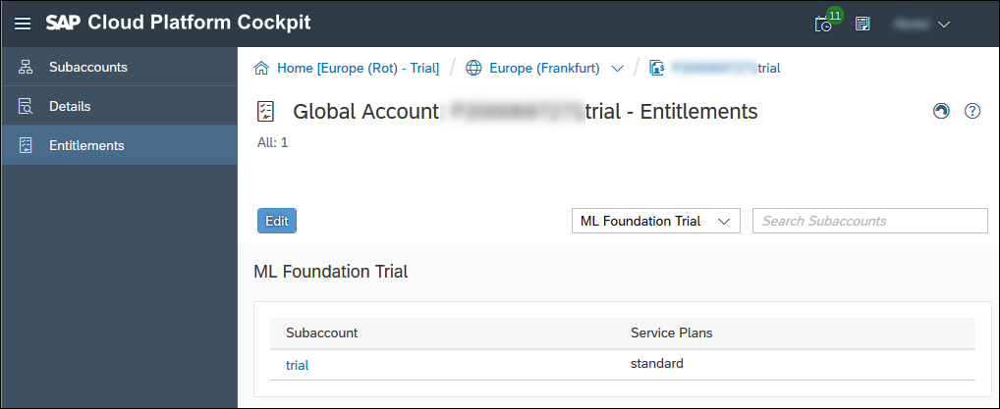

[DONE]
[ACCORDION-END]

[ACCORDION-BEGIN [Step](Access your Space)]

By default, a trial account contains **one** subaccount named **trial** and **one** space **dev**.

On the navigation side bar, click on **Subaccounts**, then select the **trial** subaccount.

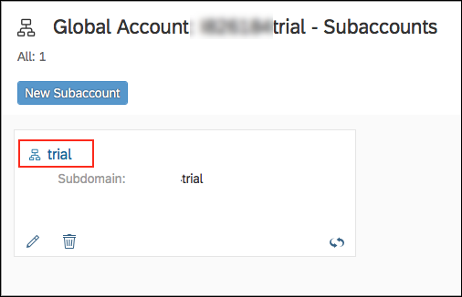

Once in your subaccount, you can notice that your subaccount is assigned a **Quota** for the ML Foundation.

On the navigation side bar, click on **Spaces**.

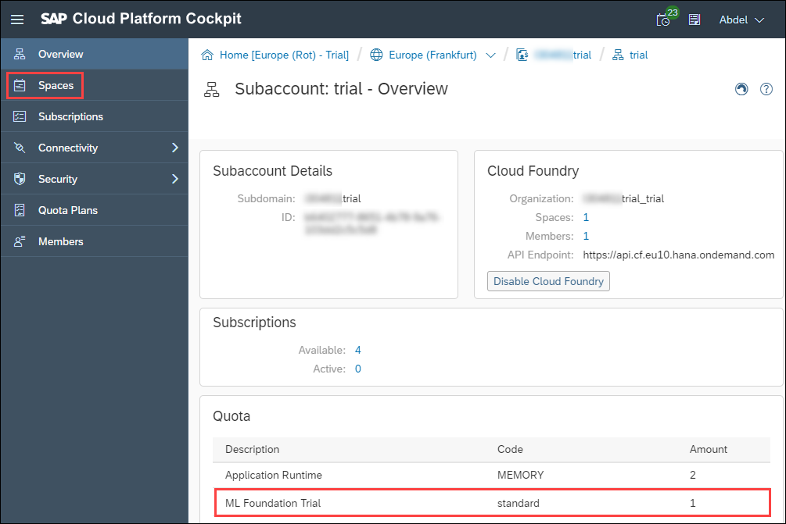

Next, click on the **dev** space box to open your working space.

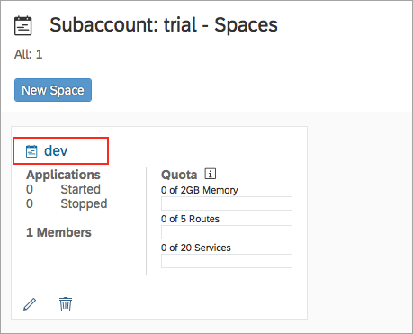

[DONE]
[ACCORDION-END]

[ACCORDION-BEGIN [Step](Access your Service Marketplace)]

In the Cloud Foundry environment, you usually enable services by creating a service instance using either the SAP Cloud Platform cockpit or the Cloud Foundry command line interface (cf CLI).

In the Cloud Foundry environment, services are offered in a marketplace, from which users can create service instances on-demand.

Once in your space, on the navigation side bar, expand **Services > Service Marketplace**.

The full list of available services with a ***quota*** for the current space will be displayed.

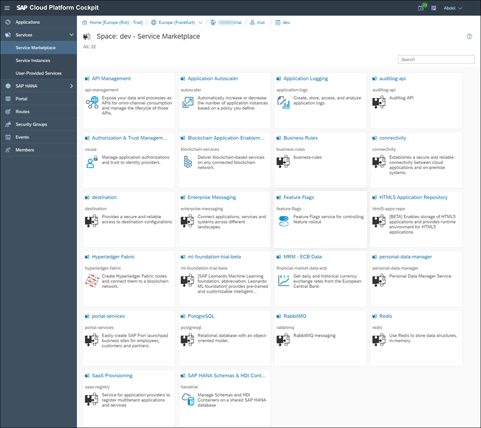

[DONE]
[ACCORDION-END]

[ACCORDION-BEGIN [Step](Create a service instance)]

Service instances are created using a specific service plan which is a configuration variant of a service. For example, a database may be configured with various ***t-shirt sizes***, each of which is a different service plan.

You can create a service instance using either the SAP Cloud Platform cockpit or the Cloud Foundry Command Line Interface.

### **SAP Cloud Platform Cockpit Method**

Using the ***Search*** field, enter **`ml-foundation`**.

Click on the **`ml-foundation-trial-beta`**.

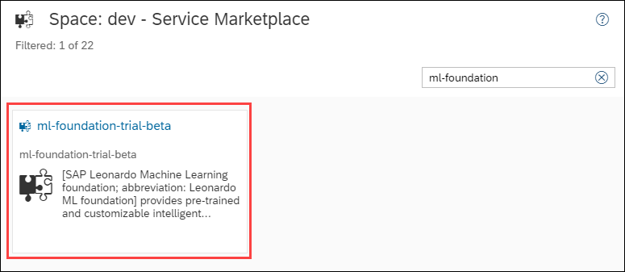

Next, the ***Overview*** page will provide you access to the product [documentation ](https://help.sap.com/viewer/product/SAP_LEONARDO_MACHINE_LEARNING_FOUNDATION/latest)

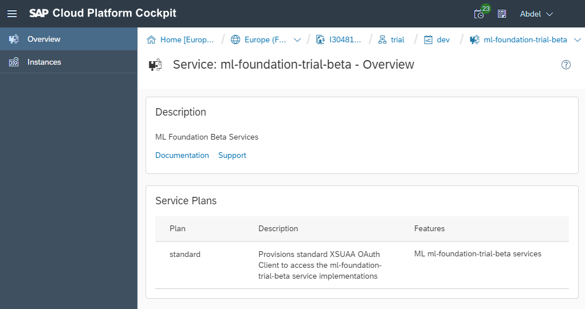

On the navigation side bar, click on **Instances**, then click on **New Instance**.

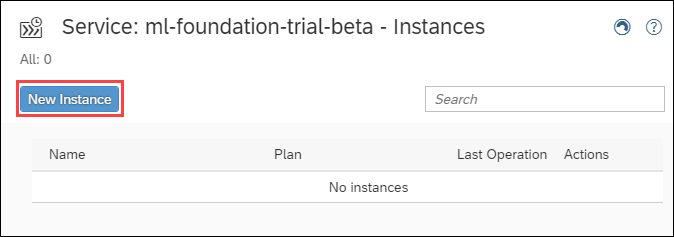

You can leave the default value selected for the ***Service Plan*** and click on **Next**.

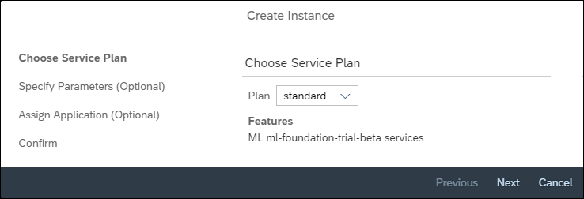

You can leave empty the ***Parameters*** and click on **Next**.

You can leave the ***Application*** assigned to ***none*** and click on **Next**.

Enter **`my-ml-foundation`**.

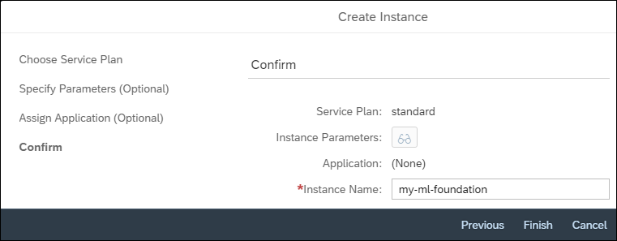

Click on **Finish**.

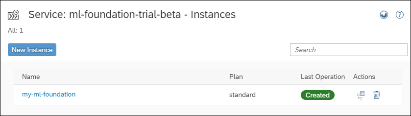

### **Cloud Foundry Command Line Interface Method**

In order to create a service instance from the Cloud Foundry Command Line Interface, you will need to execute a command like this:

```
cf create-service <service name> <plan> <instance name>
```

Open a console and execute the following command:

```shell
cf create-service ml-foundation-trial-beta standard my-ml-foundation
```

[DONE]
[ACCORDION-END]

[ACCORDION-BEGIN [Step](Create a service key)]

service keys CAN BE USED to generate credentials to communicate directly with a service instance. Once you configure them for your service, local clients, apps in other spaces, or entities outside your deployment can access your service with these keys.

In the ML Foundation case, it will also provide a list of service URLs that you can use to access the exposed services.

Here is a description of the details returned in your service key:

|Name                  | Description
|----------------------|--------------------
| **`appname`**        | Application Name
| **`clientid`**       | OAuth client ID
| **`clientsecret`**   | OAuth client secret
| **`identityzone`**   | Name of your identity zone
| **`identityzoneid`** | Id of your identity zone
| **`serviceurls`**    | API URLs
| **`url`**            | Authentication (XSUAA) server URL

You can create a service instance using either the SAP Cloud Platform cockpit or the Cloud Foundry Command Line Interface.

### **SAP Cloud Platform Cockpit Method**

Click on the **`my-ml-foundation`** entry.


Click on **Service Keys**.

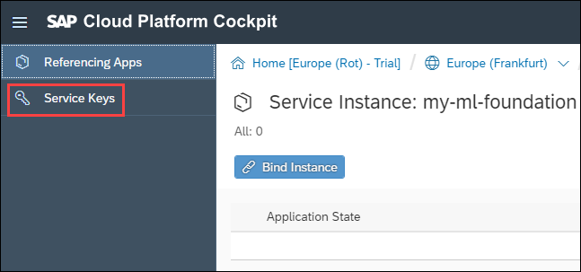

Click on **Create Service Key**.

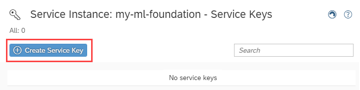

Enter **`my-ml-foundation-key`**.

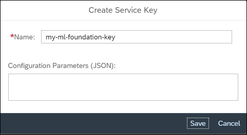

Click on **Save**.


**Make a local copy of the service key details in a notepad.**

### **Cloud Foundry Command Line Interface Method**

In order to create a service instance from the Cloud Foundry Command Line Interface, you will need to execute a command like this:

```
cf create-service-key <instance name> <key name>
```

Open a console and execute the following command:

```shell
cf create-service-key my-ml-foundation my-ml-foundation-key
```

Then you can get the service key details using the following command:

```shell
cf service-key my-ml-foundation my-ml-foundation-key
```

**Make a local copy of the service key details in a notepad.**

[DONE]
[ACCORDION-END]

[ACCORDION-BEGIN [Step](Validate your configuration)]

Provide an answer to the question below then click on **Validate**.

[VALIDATE_1]
[ACCORDION-END]


---
