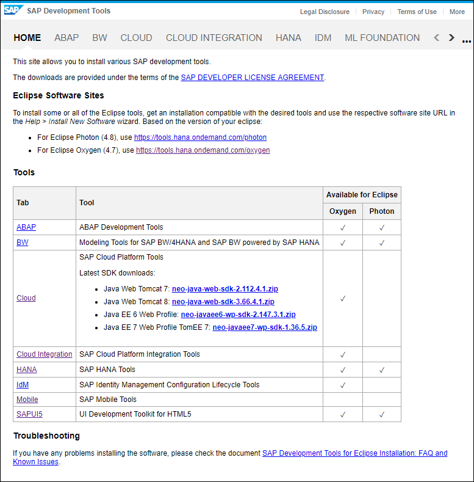

## Prerequisites
 - [Install the Cloud Foundry Command Line Interface (CLI)](https://developers.sap.com/tutorials/cp-cf-download-cli.html)

## Details
### You will learn
  - Where to download the SAP Leonardo Machine Learning foundation plugin for SAP Cloud Platform CLI
  - Install the SAP Leonardo Machine Learning foundation plugin for SAP Cloud Platform CLI

[ACCORDION-BEGIN [Step](Download the Machine Learning foundation plugin)]

Go to the [SAP Development Tools](https://tools.hana.ondemand.com) site.



Access the [ML Foundation](https://tools.hana.ondemand.com/#mlfoundation) section.


Click on the download link according to your operating system.

[DONE]
[ACCORDION-END]

[ACCORDION-BEGIN [Step](Install the Machine Learning foundation plugin)]

Once downloaded, extract the content of the zip file and then open a terminal console at that location.

Then execute one of the following command depending on your operating system:

- Linux / Mac OS:

```shell
cf install-plugin -f sapmlcli
```

- Windows:

```shell
cf install-plugin -f sapmlcli.exe
```

The terminal should display the following output:

```
Installing plugin SAPML...
OK
Plugin SAPML 1.0.0 successfully installed.
```

[DONE]
[ACCORDION-END]

[ACCORDION-BEGIN [Step](Verify your installation)]

In your terminal console, run the following command to verify that the plugin is properly installed:

```shell
cf plugins
```

[VALIDATE_1]
[ACCORDION-END]


---
