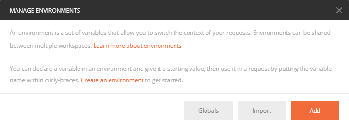

mlfs-cf-oauth-token-rest---
title: Get your OAuth Access Token using a REST Client
description: Call the authentication API to retrieve your Access Token
auto_validation: true
time: 10
tags: [tutorial>beginner, topic>cloud, topic>machine-learning, products>sap-cloud-platform, products>sap-cloud-platform-for-the-cloud-foundry-environment]
primary_tag: products>sap-leonardo-machine-learning-foundation
---

## Prerequisites
 - [Create a Machine Learning Foundation service instance on the Cloud Foundry environment](https://developers.sap.com/tutorial-navigator.html?mlfs-cf-create-instance.html)
 - [Install Postman as a REST client](https://developers.sap.com/tutorials/api-tools-postman-install.html)

## Details
### You will learn
  - The basics about User Account and Authentication on the Cloud Foundry environment
  - The basics about Postman environment variables
  - Call an API from Postman  

[ACCORDION-BEGIN [Step](User Account and Authentication on the Cloud Foundry environment)]

The Cloud Foundry environment of SAP Cloud Platform provides platform security functions such as business user authentication, authentication of applications, authorization management, trust management, and other security functions.

It adopts common industry security standards in order to provide flexibility for customers through a high degree of interoperability with other vendors.

Using identity federation, by linking and reusing electronic identities of a user across multiple identity providers, an application is freed from the obligation to obtain and store users' credentials for authentication.

Instead, the application reuses an identity provider that is already storing users' electronic identities for authentication, provided that the application trusts this identity provider.

This makes it possible to decouple and centralize authentication and authorization functionality.

Several major protocols have been developed to support the concept of identity federation:

 - SAML 2.0
 - OAuth 2.0

To get your OAuth access token you will need to some details provided by the service key:

Here is a description of the details returned in your service key:

|Name                  | Description
|----------------------|--------------------
| **`clientid`**       | OAuth client ID
| **`clientsecret`**   | OAuth client secret
| **`url`**            | Authentication (XSUAA) server URL

[DONE]
[ACCORDION-END]

[ACCORDION-BEGIN [Step](Create your Postman environment)]

In order to ease the re-usability of your OAuth access token, you will leverage Postman environment.

Open **Postman**.

By default, ***No environment*** will be setup.


Click on the gear icon then select **Manage Environments**.

Click on **Add**.



Enter **my-ml-foundation**.


Close the information message using the cross as highlighted on the previous screenshot.

Enter the details from your service key for:

|Name                  | Description
|----------------------|--------------------
| **`clientid`**       | OAuth client ID
| **`clientsecret`**   | OAuth client secret
| **`url`**            | Authentication (XSUAA) server URL


Click on **Add**.

You can now use the cross in the top right corner to leave the environment creation popup.


You can now select the **my-ml-foundation** environment from the list.


[DONE]
[ACCORDION-END]

[ACCORDION-BEGIN [Step](Prepare OAuth Token request)]

Open a new tab in ***Postman***.

Fill in the following information:

Field Name               | Value
:----------------------- | :--------------
<nobr>HTTP Method</nobr> | GET
<nobr>URL</nobr>         | `{{url}}/oauth/token?grant_type=client_credentials`

On the **Authorization** tab, select **`Basic Auth`**, then enter **`{{clientid}}`** as username and **`{{clientsecret}}`** as password.

> ### **Note:** **`{{url}}`**,  **`{{clientid}}`** and **`{{clientsecret}}`**  will be automagically replaced by your environment variable.


Switch to the **Tests** tab and insert the following code:

```
pm.environment.set("OAuthToken", decodeURIComponent(pm.response.json().access_token))
```

[DONE]
[ACCORDION-END]

[ACCORDION-BEGIN [Step](Send the OAuth Token request)]

Click on **Send**.


You should receive the following response:


```
{
    "access_token": "<< your access token >>",
    "token_type": "bearer",
    "expires_in": 43199,
    "scope": "<< your authorization scope >>",
    "jti": "b67eaabd1a8f4e5083b3c43b1b23091b"
}
```

The **scope** defines the scope of your current authorization.

[DONE]
[ACCORDION-END]

[ACCORDION-BEGIN [Step](Check your Postman environment))]

Click on the ***eye*** icon in the top right corner.

You can notice that a new environment variable name ***`OAuthToken`*** was added.


[DONE]
[ACCORDION-END]

[ACCORDION-BEGIN [Step](Validate your configuration)]

Provide an answer to the question below then click on **Validate**.

[VALIDATE_1]
[ACCORDION-END]
---
