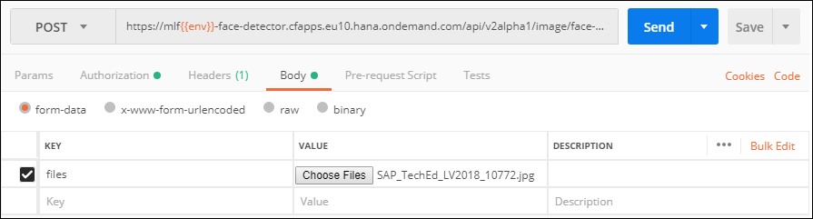
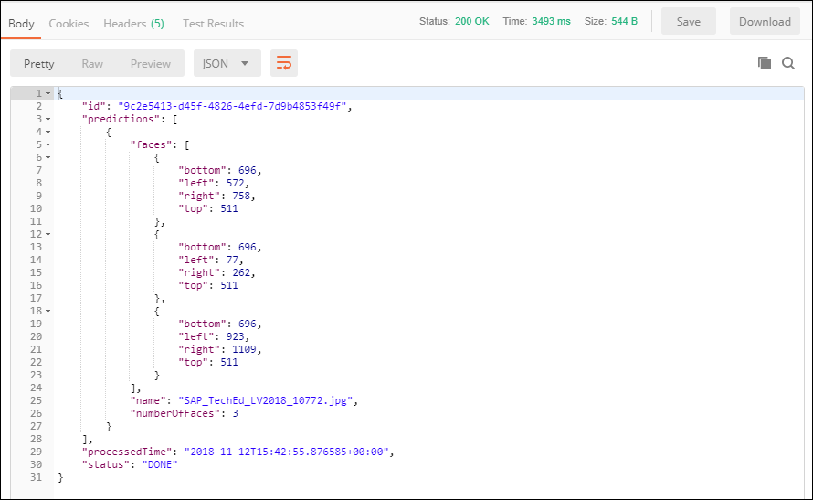

## Prerequisites
 - [Create a Machine Learning Foundation service instance on the Cloud Foundry environment](https://developers.sap.com/tutorials/cp-mlf-create-instance.html)
 - [Install Postman as a REST client](https://developers.sap.com/tutorials/api-tools-postman-install.html)
 - [Get your OAuth Access Token using a REST Client](https://developers.sap.com/tutorials/cp-mlf-rest-generate-oauth-token.html)

## Details
### You will learn
  - Call an API from a REST client like Postman
  - The basics about Machine Learning Foundation Service for Face Detection

> ### **Note:** This service was in alpha version when this tutorial was released.

[ACCORDION-BEGIN [Step](The Face Detection Service)]

The Face Detection service can be used for detecting faces in an image or a set of images and returns information declaring boundary box for each face in every image.

This is the list of accepted file extensions:

|Name                  | Description
|----------------------|--------------------
| **Archive file**     | `zip`, `tar`, `gz`, `tgz`
| **Image file**       | `jpg`, `jpe`, `jpeg`, `png`, `gif`, `bmp`

The images should be RGB, or 8-bit gray scale.

If an archive file is provided, no additional files can be provided.

The input file (or the archive file) is provided using form data (as an element named ***files*** in the form data).

The service will return a JSON response that includes the bounding boxes coordinates for the identified faces.

For more details, you can check the following link:

 - [Inference Service for Face Detection on the SAP API Business Hub](https://api.sap.com/api/face_detection_api/resource)

[DONE]
[ACCORDION-END]

[ACCORDION-BEGIN [Step](Call the API)]

Open a new tab in ***Postman***.

Make sure that the ***`my-l-foundation`*** environment is selected.

On the **Authorization** tab, select **Bearer Token**, then enter **`{{OAuthToken}}`** as value.


> ### **Note:**: the **`OAuthToken`** environment variable can be retrieved following the [Get your OAuth Access Token using a REST Client](https://developers.sap.com/tutorials/cp-mlf-rest-generate-oauth-token.html) tutorial.

Fill in the following additional information:

Field Name               | Value
:----------------------- | :--------------
<nobr>HTTP Method</nobr> | POST
<nobr>URL<nobr>          | <nobr>`https://mlftrial-face-detector.cfapps.eu10.hana.ondemand.com/api/v2alpha1/image/face-detection`</nobr>

> **Note** As a reminder, the URL depends on you Cloud Platform landscape region but for the trial landscape only ***Europe (Frankfurt)*** provide access to the Machine Learning Foundation services.

On the **Body** tab, keep **`form-data`** selected. Add a new key named **files** and switch it to **File** instead of **Text** (default).

Select your image file.



If you are missing some inspiration, you can use the following pictures from the **Women Tech Influencer Fireside Chat** at SAP TechEd Las Vegas 2018 :

 - <a href="https://sapteched2018.event-hosting.com/srv/ds/custom/download?size=2048&images=550132" target="blank" download="SAP_TechEd_LV2018_10751.jpg">Image `SAP_TechEd_LV2018_10751`</a>
 - <a href="https://sapteched2018.event-hosting.com/srv/ds/custom/download?size=2048&images=550134" target="blank" download="SAP_TechEd_LV2018_10772.jpg">Image `SAP_TechEd_LV2018_10772`</a>
 - <a href="https://sapteched2018.event-hosting.com/srv/ds/custom/download?size=2048&images=550135" target="blank" download="SAP_TechEd_LV2018_10779.jpg">Image `SAP_TechEd_LV2018_10779`</a>

The first image (`SAP_TechEd_LV2018_10751.jpg`) contains 3 person with only 1 face visible, the second image (`SAP_TechEd_LV2018_10772.jpg`) contains 5 person with only 3 face visible and the third image (`SAP_TechEd_LV2018_10779.jpg`) also 5 person with only 3 face visible.

Click on **Send**.

You should receive a response that includes a series of faces entries.



This is the result for `SAP_TechEd_LV2018_10772`:

```json
"predictions": [
    {
        "faces": [
            {
                "bottom": 696,
                "left": 572,
                "right": 758,
                "top": 511
            },
            {
                "bottom": 696,
                "left": 77,
                "right": 262,
                "top": 511
            },
            {
                "bottom": 696,
                "left": 923,
                "right": 1109,
                "top": 511
            }
        ],
        "name": "SAP_TechEd_LV2018_10772.jpg",
        "numberOfFaces": 3
    }
]
```

Each entry in the response represents a box that identify one of the face.

Here is the results represented on <a href="https://sapteched2018.event-hosting.com/srv/ds/custom/download?size=2048&images=550134" target="blank" download="Image SAP_TechEd_LV2018_10772">Image `SAP_TechEd_LV2018_10772`</a>

<div>

<canvas id="canvas_SAP_TechEd_LV2018_10772.jpg"/>
<script>
var fontSize = 14;

var response = {
    "id": "b0b3fae9-ffbe-4a83-77d7-03edf57bcae0",
    "predictions": [
        {
            "faces": [
                {
                    "bottom": 696,
                    "left": 572,
                    "right": 758,
                    "top": 511
                },
                {
                    "bottom": 696,
                    "left": 77,
                    "right": 262,
                    "top": 511
                },
                {
                    "bottom": 696,
                    "left": 923,
                    "right": 1109,
                    "top": 511
                }
            ],
            "name": "SAP_TechEd_LV2018_10772.jpg",
            "numberOfFaces": 3
        }
    ],
    "processedTime": "2018-11-13T18:25:17.413827+00:00",
    "status": "DONE"
};
function drawCanvas(imageId) {
	var oImg    = document.getElementById(imageId);
    var oCanvas = document.getElementById("canvas_" + imageId);

	oCanvas.width  = oImg.width;
	oCanvas.height = oImg.height;

	var ctx = oCanvas.getContext("2d");
    ctx.drawImage(oImg, 0, 0, oImg.width, oImg.height);

    ctx.lineWidth="3";
    ctx.strokeStyle="red";
	ctx.fillStyle = "white";
	ctx.font = fontSize + "px Arial";

    oImg.style.display = "none";
    return ctx;
}
function drawBoundingBox(ctx, imageId, item, text) {
	var oImg    = document.getElementById(imageId);
    var oCanvas = document.getElementById("canvas_" + imageId);

    var widthRatio  = oCanvas.width  / oImg.naturalWidth;
    var heightRatio = oCanvas.height / oImg.naturalHeight;

    // get the box attributes
    var left = item.left * widthRatio;
    var top  = item.top  * heightRatio;
    var width  = (item.right  - item.left) * widthRatio;
    var height = (item.bottom - item.top ) * heightRatio;

    // draw the box
    ctx.strokeRect(left, top, width, height);

    // write the text with the box angle
    ctx.save();
    ctx.fillStyle = 'red';
    ctx.fillRect(left, top, ctx.measureText(text).width + ctx.lineWidth, ctx.lineWidth + fontSize);
    // write the text in the box
    ctx.fillStyle = "white";
    ctx.fillText(text, left, top + fontSize);
    ctx.restore();
}

window.onload = function() {
	for (var idx = 0; idx < response.predictions.length; idx++) {
        var items = response.predictions[idx].faces;
        var name = response.predictions[idx].name;
        var oImg = document.getElementById(name);
        if(oImg){
            oImg.onload = function(){
                var ctx = drawCanvas(name);
                for (var i = 0; i < items.length; i++) {
                    drawBoundingBox(ctx, name, items[i], "Face #" + i);
                }                
            }
            oImg.src = oImg.src;
        }
	}
};
</script>
</div>

Here is a simple HTML code you can use to visualize other results:

```HTML
<html>
<body>


<canvas id="canvas_SAP_TechEd_LV2018_10772.jpg"/>
<script>
var fontSize = 14;

var response = {
    "id": "b0b3fae9-ffbe-4a83-77d7-03edf57bcae0",
    "predictions": [
        {
            "faces": [
                {
                    "bottom": 696,
                    "left": 572,
                    "right": 758,
                    "top": 511
                },
                {
                    "bottom": 696,
                    "left": 77,
                    "right": 262,
                    "top": 511
                },
                {
                    "bottom": 696,
                    "left": 923,
                    "right": 1109,
                    "top": 511
                }
            ],
            "name": "SAP_TechEd_LV2018_10772.jpg",
            "numberOfFaces": 3
        }
    ],
    "processedTime": "2018-11-13T18:25:17.413827+00:00",
    "status": "DONE"
};
function drawCanvas(imageId) {
	var oImg    = document.getElementById(imageId);
    var oCanvas = document.getElementById("canvas_" + imageId);

	oCanvas.width  = oImg.width;
	oCanvas.height = oImg.height;

	var ctx = oCanvas.getContext("2d");
    ctx.drawImage(oImg, 0, 0, oImg.width, oImg.height);

    ctx.lineWidth="3";
    ctx.strokeStyle="red";
	ctx.fillStyle = "white";
	ctx.font = fontSize + "px Arial";

    oImg.style.display = "none";
    return ctx;
}
function drawBoundingBox(ctx, imageId, item, text) {
	var oImg    = document.getElementById(imageId);
    var oCanvas = document.getElementById("canvas_" + imageId);

    var widthRatio  = oCanvas.width  / oImg.naturalWidth;
    var heightRatio = oCanvas.height / oImg.naturalHeight;

    // get the box attributes
    var left = item.left * widthRatio;
    var top  = item.top  * heightRatio;
    var width  = (item.right  - item.left) * widthRatio;
    var height = (item.bottom - item.top ) * heightRatio;

    // draw the box
    ctx.strokeRect(left, top, width, height);

    // write the text with the box angle
    ctx.save();
    ctx.fillStyle = 'red';
    ctx.fillRect(left, top, ctx.measureText(text).width + ctx.lineWidth, ctx.lineWidth + fontSize);
    // write the text in the box
    ctx.fillStyle = "white";
    ctx.fillText(text, left, top + fontSize);
    ctx.restore();
}

window.onload = function() {
	for (var idx = 0; idx < response.predictions.length; idx++) {
        var items = response.predictions[idx].faces;
        var name = response.predictions[idx].name;
        var oImg = document.getElementById(name);
        if(oImg){
            oImg.onload = function(){
                var ctx = drawCanvas(name);
                for (var i = 0; i < items.length; i++) {
                    drawBoundingBox(ctx, name, items[i], "Face #" + i);
                }                
            }
            oImg.src = oImg.src;
        }
	}
};
</script>
</body>
</html>
```

You will notice that the [`strokeRect` function](https://www.w3schools.com/tags/canvas_strokerect.asp) uses the following format:

- x	: The x-coordinate of the upper-left corner of the rectangle
- y	: The y-coordinate of the upper-left corner of the rectangle
- width	: The width of the rectangle, in pixels
- height : The height of the rectangle, in pixels

Which correspond to following attribute of the bounding box:

- x	: left
- y	: top
- width	: right - left
- height : bottom - top

[DONE]
[ACCORDION-END]

[ACCORDION-BEGIN [Step](Validate your results)]

Provide an answer to the question below then click on **Validate**.

[VALIDATE_1]
[ACCORDION-END]
---
