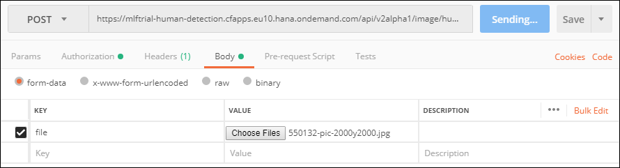
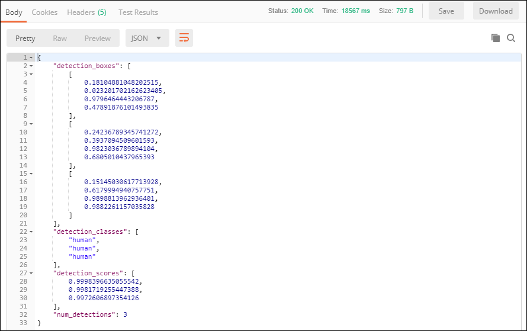

## Prerequisites
 - [Create a Machine Learning Foundation service instance on the Cloud Foundry environment](https://developers.sap.com/tutorials/cp-mlf-create-instance.html)
 - [Install Postman as a REST client](https://developers.sap.com/tutorials/api-tools-postman-install.html)
 - [Get your OAuth Access Token using a REST Client](https://developers.sap.com/tutorials/cp-mlf-rest-generate-oauth-token.html)

## Details
### You will learn
  - Call an API from a REST client like Postman
  - The basics about Machine Learning Foundation Service for Human Detection

> ### **Note:** This service was in alpha version when this tutorial was released.

[ACCORDION-BEGIN [Step](The Human Detection Service)]

The Human Detection service can be used for detecting people in an image or a set of images and returns information declaring boundary box around the people in every image.

This is the list of accepted file extensions:

|Name                  | Description
|----------------------|--------------------
| **Archive file**     | `zip`, `tar`, `gz`, `tgz`
| **Image file**       | `jpg`, `jpe`, `jpeg`, `png`, `gif`, `bmp`

The images should be RGB, or 8-bit gray scale.

If an archive file is provided, no additional files can be provided.

The input file (or the archive file) is provided using form data (as an element named ***file*** in the form data).

The service will return a JSON response that includes the bounding boxes coordinates for the identified humans.

For more details, you can check the following link:

 - [Inference Service for Human Detection on the SAP API Business Hub](https://api.sap.com/api/human_detection_api/resource)

[DONE]
[ACCORDION-END]

[ACCORDION-BEGIN [Step](Call the API)]

Open a new tab in ***Postman***.

Make sure that the ***`my-ml-foundation`*** environment is selected.

On the **Authorization** tab, select **Bearer Token**, then enter **`{{OAuthToken}}`** as value.


> ### **Note:**: the **`OAuthToken`** environment variable can be retrieved following the [Get your OAuth Access Token using a REST Client](https://developers.sap.com/tutorials/cp-mlf-rest-generate-oauth-token.html) tutorial.

Fill in the following additional information:

Field Name               | Value
:----------------------- | :--------------
<nobr>HTTP Method</nobr> | POST
<nobr>URL<nobr>          | <nobr>`https://mlftrial-human-detection.cfapps.eu10.hana.ondemand.com/api/v2alpha1/image/human-detection/`</nobr>

> **Note** As a reminder, the URL depends on you Cloud Platform landscape region but for the trial landscape only ***Europe (Frankfurt)*** provide access to the Machine Learning Foundation services.

On the **Body** tab, keep **`form-data`** selected. Add a new key named **file** and switch it to **File** instead of **Text** (default).

Select your image file.



If you are missing some inspiration, you can use the following pictures from the **Women Tech Influencer Fireside Chat** at SAP TechEd Las Vegas 2018 :

 - <a href="https://sapteched2018.event-hosting.com/srv/ds/custom/download?size=2048&images=550132" target="blank" download="SAP_TechEd_LV2018_10751.jpg">Image `SAP_TechEd_LV2018_10751`</a>
 - <a href="https://sapteched2018.event-hosting.com/srv/ds/custom/download?size=2048&images=550134" target="blank" download="SAP_TechEd_LV2018_10772.jpg">Image `SAP_TechEd_LV2018_10772`</a>
 - <a href="https://sapteched2018.event-hosting.com/srv/ds/custom/download?size=2048&images=550135" target="blank" download="SAP_TechEd_LV2018_10779.jpg">Image `SAP_TechEd_LV2018_10779`</a>

The first image (`SAP_TechEd_LV2018_10751.jpg`) contains only 3 person, the second image (`SAP_TechEd_LV2018_10772.jpg`) contains 5 person and the third image (`SAP_TechEd_LV2018_10779.jpg`) 6 person.

Click on **Send**.

You should receive a response that includes the bounding boxes for each detected person, the class for each entry and the associated score.




This is the result for `SAP_TechEd_LV2018_10751`:


```json
{
    "detection_boxes": [
        [
            0.18104881048202515,
            0.023201702162623405,
            0.9796464443206787,
            0.47891876101493835
        ],
        [
            0.24236789345741272,
            0.3937094509601593,
            0.9823036789894104,
            0.6805010437965393
        ],
        [
            0.15145030617713928,
            0.6179994940757751,
            0.9898813962936401,
            0.9882261157035828
        ]
    ],
    "detection_classes": [
        "human",
        "human",
        "human"
    ],
    "detection_scores": [
        0.9998396635055542,
        0.9981719255447388,
        0.9972606897354126
    ],
    "num_detections": 3
}
```

Each entry in the detection box represents a box that identify one of the person.

Here is the results represented on <a href="https://sapteched2018.event-hosting.com/srv/ds/custom/download?size=2048&images=550132" target="blank" download="SAP_TechEd_LV2018_10751.jpg">Image `SAP_TechEd_LV2018_10751`</a>:

<div id="div">
<script>
var fontSize = 14;

var name = "SAP_TechEd_LV2018_10751.jpg";
var response = {
	"detection_boxes": [
		[
			0.18104881048202515,
			0.023201702162623405,
			0.9796464443206787,
			0.47891876101493835
		],
		[
			0.24236789345741272,
			0.3937094509601593,
			0.9823036789894104,
			0.6805010437965393
		],
		[
			0.15145030617713928,
			0.6179994940757751,
			0.9898813962936401,
			0.9882261157035828
		]
	],
	"detection_classes": [
		"human",
		"human",
		"human"
	],
	"detection_scores": [
		0.9998396635055542,
		0.9981719255447388,
		0.9972606897354126
	],
	"num_detections": 3
};

function createCanvas(oImg, items) {
    var oCanvas = document.createElement("CANVAS");
    var ctx = oCanvas.getContext("2d");

    function resizeCanvas() {
        // set the image width to the window width
        imgRatioW = oImg.naturalWidth / window.innerWidth;
        oImg.width  = window.innerWidth;
        oImg.height = oImg.naturalHeight / imgRatioW ;
        // adjust the canvas dimension
        oCanvas.width  = oImg.width;
        oCanvas.height = oImg.height;
        // get the width & height for the image / canvas
        var itemRatioW = oCanvas.width  / oImg.naturalWidth;
        var itemRatioH = oCanvas.height / oImg.naturalHeight;
        // draw the canvas
        ctx.drawImage(oImg, 0, 0, oImg.width, oImg.height);
        ctx.lineWidth="3";
        ctx.strokeStyle="red";
        ctx.fillStyle = "white";
        ctx.font = fontSize + "px Arial";
        // display the items
        for (var i = 0; i < items.length; i++) {
            var text = "#" + i  + ": " + response.detection_classes[i] + " " + ( response.detection_scores[i] * 100 ).toFixed(2) + "%";
            // get the box attributes
            var left = items[i][1] * oCanvas.width  ;
            var top  = items[i][0] * oCanvas.height ;
            var width  = (items[i][3] * oCanvas.width  - items[i][1] * oCanvas.width  );
            var height = (items[i][2] * oCanvas.height - items[i][0] * oCanvas.height );

            // draw the box
            ctx.strokeRect(left, top, width, height);
            // write the text with the box angle
            ctx.save();
            ctx.fillStyle = 'red';
            ctx.fillRect(left, top, ctx.measureText(text).width + ctx.lineWidth, ctx.lineWidth + fontSize);
            // write the text in the box
            ctx.fillStyle = "white";
            ctx.fillText(text, left, top + fontSize);
            ctx.restore();
        }
    }
    // call the resize function
    resizeCanvas();
    // add the event listener
    window.addEventListener('resize', resizeCanvas, false);
    return oCanvas;
}

window.onload = function() {
    var oImg = document.createElement("IMG");
    oImg.onload = function(){
        document.getElementById("div").appendChild(createCanvas(this, response.detection_boxes));
    }
    oImg.src = name;
};
</script>
</div>

Here is a simple HTML code you can use to visualize other results:

```HTML
<html>
<body>
<div id="div">
<script>
var fontSize = 14;

var name = "SAP_TechEd_LV2018_10751.jpg";
var response = {
	"detection_boxes": [
		[
			0.18104881048202515,
			0.023201702162623405,
			0.9796464443206787,
			0.47891876101493835
		],
		[
			0.24236789345741272,
			0.3937094509601593,
			0.9823036789894104,
			0.6805010437965393
		],
		[
			0.15145030617713928,
			0.6179994940757751,
			0.9898813962936401,
			0.9882261157035828
		]
	],
	"detection_classes": [
		"human",
		"human",
		"human"
	],
	"detection_scores": [
		0.9998396635055542,
		0.9981719255447388,
		0.9972606897354126
	],
	"num_detections": 3
};

function createCanvas(oImg, items) {
    var oCanvas = document.createElement("CANVAS");
    var ctx = oCanvas.getContext("2d");

    function resizeCanvas() {
        // set the image width to the window width
        imgRatioW = oImg.naturalWidth / window.innerWidth;
        oImg.width  = window.innerWidth;
        oImg.height = oImg.naturalHeight / imgRatioW ;
        // adjust the canvas dimension
        oCanvas.width  = oImg.width;
        oCanvas.height = oImg.height;
        // get the width & height for the image / canvas
        var itemRatioW = oCanvas.width  / oImg.naturalWidth;
        var itemRatioH = oCanvas.height / oImg.naturalHeight;
        // draw the canvas
        ctx.drawImage(oImg, 0, 0, oImg.width, oImg.height);
        ctx.lineWidth="3";
        ctx.strokeStyle="red";
        ctx.fillStyle = "white";
        ctx.font = fontSize + "px Arial";
        // display the items
        for (var i = 0; i < items.length; i++) {
            var text = "#" + i  + ": " + response.detection_classes[i] + " " + ( response.detection_scores[i] * 100 ).toFixed(2) + "%";
            // get the box attributes
            var left = items[i][1] * oCanvas.width  ;
            var top  = items[i][0] * oCanvas.height ;
            var width  = (items[i][3] * oCanvas.width  - items[i][1] * oCanvas.width  );
            var height = (items[i][2] * oCanvas.height - items[i][0] * oCanvas.height );

            // draw the box
            ctx.strokeRect(left, top, width, height);
            // write the text with the box angle
            ctx.save();
            ctx.fillStyle = 'red';
            ctx.fillRect(left, top, ctx.measureText(text).width + ctx.lineWidth, ctx.lineWidth + fontSize);
            // write the text in the box
            ctx.fillStyle = "white";
            ctx.fillText(text, left, top + fontSize);
            ctx.restore();
        }
    }
    // call the resize function
    resizeCanvas();
    // add the event listener
    window.addEventListener('resize', resizeCanvas, false);
    return oCanvas;
}

window.onload = function() {
    var oImg = document.createElement("IMG");
    oImg.onload = function(){
        document.getElementById("div").appendChild(createCanvas(this, response.detection_boxes));
    }
    oImg.src = name;
};
</script>
</div>
</body>
</html>
```

> ###**Note:**
> In order to use this sample HTML code, you will need to save the images in the same location as the HTML code using the same name used when submitting the service call (in the current code: `SAP_TechEd_LV2018_10751.jpg`).

You will notice that the [`strokeRect` function](https://www.w3schools.com/tags/canvas_strokerect.asp) uses the following format:

- x	: The x-coordinate of the upper-left corner of the rectangle
- y	: The y-coordinate of the upper-left corner of the rectangle
- width	: The width of the rectangle, in pixels
- height : The height of the rectangle, in pixels

Which correspond to following attribute of the bounding box (the returned value represent the relative position for x and y using the image width and height):

- x	: index 1 * canvas width
- y	: index 0 * canvas height
- width	: index 3 * canvas width - index 1 * canvas width
- height : index 2 * canvas height - index 0 * canvas height

[DONE]
[ACCORDION-END]

[ACCORDION-BEGIN [Step](Validate your results)]

Provide an answer to the question below then click on **Validate**.

[VALIDATE_1]
[ACCORDION-END]
