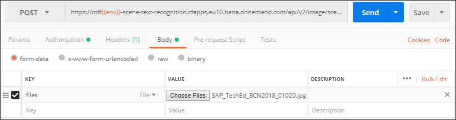
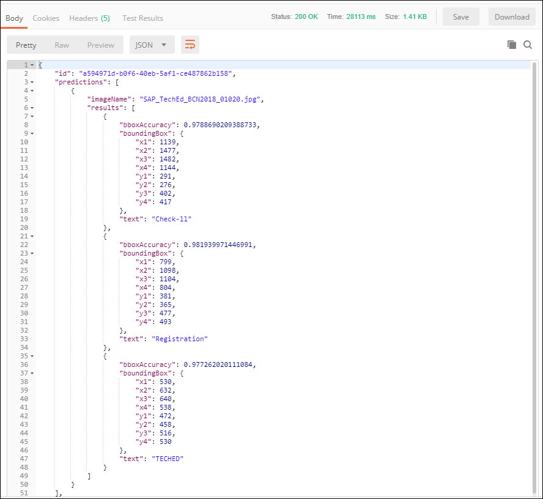
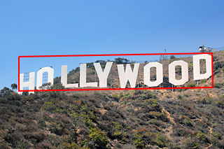

## Prerequisites
 - [Create a Machine Learning Foundation service instance on the Cloud Foundry environment](https://developers.sap.com/tutorials/cp-mlf-create-instance.html)
 - [Install Postman as a REST client](https://developers.sap.com/tutorials/api-tools-postman-install.html)
 - [Get your OAuth Access Token using a REST Client](https://developers.sap.com/tutorials/cp-mlf-rest-generate-oauth-token.html)

## Details
### You will learn
  - Call an API from a REST client like Postman
  - The basics about Machine Learning Foundation Service for Scene Text Recognition

[ACCORDION-BEGIN [Step](The Scene Text Recognition Service)]

The Scene Text Recognition service localizes and reads text from natural images and scenes.

> ***Differences with the OCR service***
In comparison to the Optical Character Recognition service, the Scene Text Recognition service offers
>
- Works with real-life color images
- Ability to work with font-less text
- Extract word-art / `picturized` text
- Works in different orientations of texts
- Text occurring in natural images like low-contrast, emboss/engrave

>When the formats from which the text has to be read are documents or print media scans, the OCR service should be used whereas in case of natural images (e.g. reading the counter of a utility meter or the number-plate of an automobile), the Scene Text Recognition service should be used.

This is the list of accepted file extensions:

|Name                  | Description
|----------------------|--------------------
| **Image file**       | `jpg`, `jpe`, `jpeg`, `png`

The images should be RGB.

The input file is provided using form data (as an element named ***files*** in the form data).

The service will return a JSON response that includes the detected texts within the scene along with the bounding box coordinates.

For more details, you can check the [Inference Service for Scene Text Recognition on the SAP API Business Hub](https://api.sap.com/api/scene_text_recognition_api/resource).

[DONE]
[ACCORDION-END]

[ACCORDION-BEGIN [Step](Call the API)]

Open a new tab in ***Postman***.

Make sure that the ***`my-l-foundation`*** environment is selected.

On the **Authorization** tab, select **Bearer Token**, then enter **`{{OAuthToken}}`** as value.


> ### **Note:**: the **`OAuthToken`** environment variable can be retrieved following the [Get your OAuth Access Token using a REST Client](https://developers.sap.com/tutorials/cp-mlf-rest-generate-oauth-token.html) tutorial.

Fill in the following additional information:

Field Name               | Value
:----------------------- | :--------------
<nobr>HTTP Method</nobr> | POST
<nobr>URL<nobr>          | <nobr>`https://mlftrial-scene-text-recognition.cfapps.eu10.hana.ondemand.com/api/v2/image/scene-text-recognition`</nobr>

> **Note** As a reminder, the URL depends on you Cloud Platform landscape region but for the trial landscape only ***Europe (Frankfurt)*** provide access to the Machine Learning Foundation services.

On the **Body** tab, keep **`form-data`** selected. Add a new key named **files** and switch it to **File** instead of **Text** (default).

Select your image file.



If you are missing some inspiration, you can use the [Hollywood sign picture](https://upload.wikimedia.org/wikipedia/commons/thumb/c/ce/HollywoodSign.jpg/320px-HollywoodSign.jpg).


Click on **Send**.

You should receive a response that includes a series of entries:



```json
{
    "imageName": "320px-HollywoodSign.jpg",
    "results": [
      {
        "bboxAccuracy": 0.9450600147247314,
        "boundingBox": {
          "x1": 27,
          "x2": 303,
          "x3": 304,
          "x4": 27,
          "y1": 81,
          "y2": 76,
          "y3": 125,
          "y4": 130
        },
        "text": "HOLLYYOOD"
      }
    ]
}
```

Each entry in the response represents a box that identify a bounding box with an associated text.



Here is a simple HTML code you can use to visualize other results:

```HTML
<html>
<body>

<canvas id="canvas">Your browser does not support the HTML5 canvas tag.</canvas>


<script>
window.onload = function() {
    var img    = document.getElementById("img");
    var canvas = document.getElementById("canvas");

    var ctx = canvas.getContext("2d");
    img.src="https://upload.wikimedia.org/wikipedia/commons/thumb/c/ce/HollywoodSign.jpg/320px-HollywoodSign.jpg";

    img.onload = function(){
        canvas.width  = img.width;
        canvas.height = img.height;
        ctx.drawImage(img, 0, 0, img.width, img.height, 0, 0, img.width, img.height);

        ctx.beginPath();
        ctx.lineWidth="2";
        ctx.strokeStyle="red";

        ctx.moveTo(27,81);
        ctx.lineTo(303,76);
        ctx.lineTo(304,125);
        ctx.lineTo(27,130);
        ctx.lineTo(27,81);
        ctx.stroke();        
    }       
};
</script>
</body>
</html>
```
You will notice that the coordinates are not rectangles, but are 4 points x and y.

[DONE]
[ACCORDION-END]

[ACCORDION-BEGIN [Step](Validate your results)]

Provide an answer to the question below then click on **Validate**.

[VALIDATE_1]
[ACCORDION-END]
