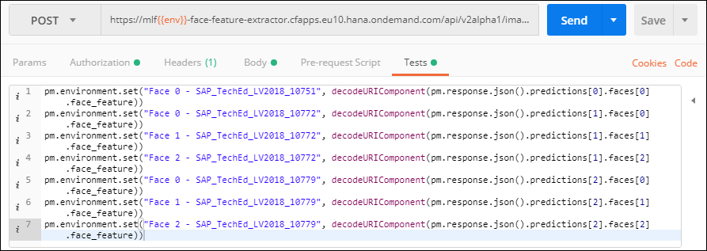
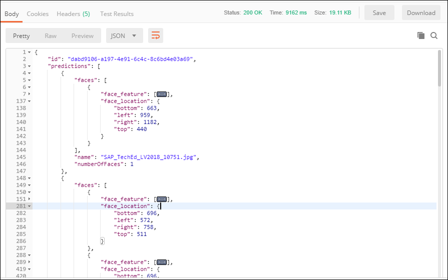
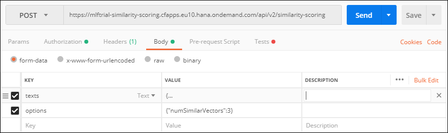

## Prerequisites
 - [Create a Machine Learning Foundation service instance on the Cloud Foundry environment](https://developers.sap.com/tutorials/cp-mlf-create-instance.html)
 - [Install Postman as a REST client](https://developers.sap.com/tutorials/api-tools-postman-install.html)
 - [Get your OAuth Access Token using a REST Client](https://developers.sap.com/tutorial-navigator.html?cp-mlf-rest-get-oauth-token.html)

## Details
### You will learn
  - Call multiple API and reuse the result into the next one from a REST client like Postman
  - The basics about Machine Learning Foundation Service for Similarity Scoring & Face Feature Extraction

> ### **Note:** The Face Feature Extraction service was in alpha version when this tutorial was released.

[ACCORDION-BEGIN [Step](The Face Feature Extraction Service)]

Similarly to the Text Feature Extraction or the Image Feature Extraction service, the Face Feature Extraction service will detect faces in an image or a set of images and extracts a vector of features out of each detected face.

This is the list of accepted file extensions:

|Name                  | Description
|----------------------|--------------------
| **Archive file**     | `zip`, `tar`, `gz`, `tgz`
| **Image file**       | `jpg`, `jpe`, `jpeg`, `png`, `gif`, `bmp`

The images should be RGB, or 8-bit gray scale.

If an archive file is provided, no additional files can be provided.

The input file (or the archive file) is provided using form data (as an element named ***files*** in the form data).

The service will return a JSON response that includes:

 - the number of detected faces
 - the bounding boxes coordinates for the identified faces
 - the associated vector of features for the detected face

For more details, you can check the [Inference Service for Face Feature Extraction on the SAP API Business Hub](https://api.sap.com/api/face_feature_extraction_api/resource).

[DONE]
[ACCORDION-END]

[ACCORDION-BEGIN [Step](The Similarity Scoring Service)]

The Similarity Scoring service compares vectors of extracted features with respect to cosine similarity.

A vector of features can be represented using the following format ***[number, number, number, ..., number]***.

The set of feature vectors which should be compared must be provided either using:

 - an archive file which will contain multiple feature vector file
 - plain text that represents a vector of features

With both options, you can provide either a single set of feature vector entries or two sets of feature vector entries which will drive the way entries are processed:

 - with a single feature vector entries, every feature vector entries will be compared to each other ((n-1)!-1 comparison).
 - with two set of feature vector entries, every feature vector entries in the first set will be compared to every feature vector entries from the second set (n*m comparison).

The input content will provided using form data, either as:

- a single or two element named ***files*** in the form data for the ***archive file***
- a single or two element named ***texts*** in the form data for the ***plain text***

This is the list of accepted file extensions for the archive file:

|Name                  | Description
|----------------------|--------------------
| **Archive file**     | `zip`, `tar`, `gz`, `tgz`

A required setting must also be provided as part of the form data (named ***options*** in the form data) using a JSON string format.

| Name                                    | Description            
|-----------------------------------------|--------------------------------------------
| <nobr><b>`numSimilarVectors`</b></nobr> | Number of most similar vectors to return in the response

The service will return a JSON response that includes a series of scores for each comparison.

For more details, you can check the [Inference Service for Similarity Scoring on the SAP API Business Hub](https://api.sap.com/api/similarity_scoring_api/resource).

[DONE]
[ACCORDION-END]

[ACCORDION-BEGIN [Step](Call the Face Feature Extraction API)]

First you will need to select and download a series of pictures with faces.

If you are missing some inspiration, you can use the following pictures from the **Women Tech Influencer Fireside Chat** at SAP TechEd Las Vegas 2018 :

 - <a href="https://sapteched2018.event-hosting.com/srv/ds/custom/download?size=2048&images=550132" target="blank" download="Image 10751.jpg">Image 10751</a>
 - <a href="https://sapteched2018.event-hosting.com/srv/ds/custom/download?size=2048&images=550134" target="blank" download="Image 10772.jpg">Image 10772</a>
 - <a href="https://sapteched2018.event-hosting.com/srv/ds/custom/download?size=2048&images=550135" target="blank" download="Image 10779.jpg">Image 10779</a>

The first image (`SAP_TechEd_LV2018_10751.jpg`) contains only one face, the second image (`SAP_TechEd_LV2018_10772.jpg`) contains three faces and the third image (`SAP_TechEd_LV2018_10779.jpg`) another three faces.

As you will notice one face is present in all 3 pictures and a second face in only 2.

Open a new tab in ***Postman***.

Make sure that the ***`my-l-foundation`*** environment is selected.

On the **Authorization** tab, select **Bearer Token**, then enter **`{{OAuthToken}}`** as value.


> ### **Note:**: the **`OAuthToken`** environment variable can be retrieved following the [Get your OAuth Access Token using a REST Client](https://developers.sap.com/tutorial-navigator.html?cp-mlf-rest-get-oauth-token.html) tutorial.

Fill in the following additional information:

Field Name               | Value
:----------------------- | :--------------
<nobr>HTTP Method</nobr> | POST
<nobr>URL<nobr>          | <nobr>`https://mlftrial-face-feature-extractor.cfapps.eu10.hana.ondemand.com/api/v2alpha1/image/face-feature-extraction`</nobr>

> **Note** As a reminder, the URL depends on you Cloud Platform landscape region but for the trial landscape only ***Europe (Frankfurt)*** provide access to the Machine Learning Foundation services.

On the **Body** tab, keep **`form-data`** selected.

Add 3 elements with the **key** named **files** and switch it to **File** instead of **Text** (default).

Then set the file with the downloaded images in the following order:

 - <a href="https://sapteched2018.event-hosting.com/srv/ds/custom/download?size=2048&images=550132" target="blank" download="Image 10751.jpg">Image 10751</a>
 - <a href="https://sapteched2018.event-hosting.com/srv/ds/custom/download?size=2048&images=550134" target="blank" download="Image 10772.jpg">Image 10772</a>
 - <a href="https://sapteched2018.event-hosting.com/srv/ds/custom/download?size=2048&images=550135" target="blank" download="Image 10779.jpg">Image 10779</a>

The sequence of files is important here as you will be using a script to retrieve the corresponding responses.


Switch to the **Tests** tab and insert the following code:

```
pm.environment.set("v00", decodeURIComponent(pm.response.json().predictions[0].faces[0].face_feature))
pm.environment.set("v10", decodeURIComponent(pm.response.json().predictions[1].faces[0].face_feature))
pm.environment.set("v11", decodeURIComponent(pm.response.json().predictions[1].faces[1].face_feature))
pm.environment.set("v12", decodeURIComponent(pm.response.json().predictions[1].faces[2].face_feature))
pm.environment.set("v20", decodeURIComponent(pm.response.json().predictions[2].faces[0].face_feature))
pm.environment.set("v21", decodeURIComponent(pm.response.json().predictions[2].faces[1].face_feature))
pm.environment.set("v22", decodeURIComponent(pm.response.json().predictions[2].faces[2].face_feature))
```



Click on **Send**.

You should receive a response that includes for each input image an entry with a series of faces entries with the bounding box and the face feature vector:



```json
{
    "faces": [
        {
            "face_feature": [ "..."
            ],
            "face_location": {
                "bottom": 663,
                "left": 959,
                "right": 1182,
                "top": 440
            }
        }
    ],
    "name": "SAP_TechEd_LV2018_10751.jpg",
    "numberOfFaces": 1
}
```

Each entry in the response represents a box that identify one of the face.

<table border="0">
	<tr><td></td></tr><tr><td><canvas id="canvas_550132"/></td></tr>
	<tr><td></td></tr><tr><td><canvas id="canvas_550134"/></td></tr>
	<tr><td></td></tr><tr><td><canvas id="canvas_550135"/></td></tr>				
</table>

<script>
function myFunction(imagId) {
	var oImg = document.getElementById("img_" + imagId);;
	var oCanvas = document.getElementById("canvas_" + imagId);
	oCanvas.width = oImg.width;
	oCanvas.height = oImg.height * oImg.width / oImg.naturalWidth;

	var ctx = oCanvas.getContext("2d");
    ctx.drawImage(oImg, 0, 0, oImg.width, oImg.height * oImg.width / oImg.naturalWidth);

    ctx.lineWidth="3";
    ctx.strokeStyle="red";
	ctx.fillStyle = "white";
	ctx.font = "30pt Arial";

	ctx.scale( oCanvas.width  / oImg.naturalWidth, oCanvas.height / oImg.naturalHeight);

    return ctx;
}

window.onload = function() {
	var oImg_550132    = document.getElementById("img_550132");
    var oImg_550134    = document.getElementById("img_550134");
    var oImg_550135    = document.getElementById("img_550135");

	oImg_550132.onload = function(){
		var ctx = myFunction("550132")
 		ctx.strokeRect(959,440,1182-959,663-440);   ctx.fillText("v00", 959, 440);
    }

	oImg_550134.onload = function(){
		var ctx = myFunction("550134")
		ctx.strokeRect(572,511,758-572,696-511);   ctx.fillText("v10", 572, 511);
		ctx.strokeRect(77,511,262-77,696-511);   ctx.fillText("v11", 77, 511);
		ctx.strokeRect(923,511,1109-923,696-511);   ctx.fillText("v12", 923, 511);

	}
	oImg_550135.onload = function(){
        var ctx = myFunction("550135")
		ctx.strokeRect(324,490,510-324,676-490);   ctx.fillText("v20", 324, 490);
		ctx.strokeRect(786,511,941-786,666-511);   ctx.fillText("v21", 786, 511);
		ctx.strokeRect(1088,469,1274-1088,655-469);   ctx.fillText("v22", 1088, 469);
	}

	oImg_550132.src="https://sapteched2018.event-hosting.com/srv/ds/custom/download?size=2048&images=550132";
    oImg_550134.src="https://sapteched2018.event-hosting.com/srv/ds/custom/download?size=2048&images=550134";
    oImg_550135.src="https://sapteched2018.event-hosting.com/srv/ds/custom/download?size=2048&images=550135";
};
</script>

Here is a simple HTML code you can use to visualize other results:

```HTML
<html>
<body>

<table border="0">
	<tr><td></td></tr><tr><td><canvas id="canvas_550132"/></td></tr>
	<tr><td></td></tr><tr><td><canvas id="canvas_550134"/></td></tr>
	<tr><td></td></tr><tr><td><canvas id="canvas_550135"/></td></tr>				
</table>

<script>
function myFunction(imagId) {
	var oImg = document.getElementById("img_" + imagId);;
	var oCanvas = document.getElementById("canvas_" + imagId);
	oCanvas.width = oImg.width;
	oCanvas.height = oImg.height * oImg.width / oImg.naturalWidth;

	var ctx = oCanvas.getContext("2d");
    ctx.drawImage(oImg, 0, 0, oImg.width, oImg.height * oImg.width / oImg.naturalWidth);

    ctx.lineWidth="10";
    ctx.strokeStyle="red";
	ctx.scale( oCanvas.width  / oImg.naturalWidth, oCanvas.height / oImg.naturalHeight);

    return ctx;
}

window.onload = function() {
	var oImg_550132    = document.getElementById("img_550132");
    var oImg_550134    = document.getElementById("img_550134");
    var oImg_550135    = document.getElementById("img_550135");

	oImg_550132.onload = function(){
		var ctx = myFunction("550132")
 		ctx.strokeRect(959,440,1182-959,663-440);
    }

	oImg_550134.onload = function(){
		var ctx = myFunction("550134")
		ctx.strokeRect(572,511,758-572,696-511);
		ctx.strokeRect(77,511,262-77,696-511);
		ctx.strokeRect(923,511,1109-923,696-511);

	}
	oImg_550135.onload = function(){
        var ctx = myFunction("550135")
		ctx.strokeRect(324,490,510-324,676-490);
		ctx.strokeRect(786,511,941-786,666-511);
		ctx.strokeRect(1088,469,1274-1088,655-469);
	}

	oImg_550132.src="https://sapteched2018.event-hosting.com/srv/ds/custom/download?size=2048&images=550132";
    oImg_550134.src="https://sapteched2018.event-hosting.com/srv/ds/custom/download?size=2048&images=550134";
    oImg_550135.src="https://sapteched2018.event-hosting.com/srv/ds/custom/download?size=2048&images=550135";
};
</script>
</body>
</html>
```
You will notice that the rectangle uses the following format: (left, top, right - left, bottom - top).

[DONE]
[ACCORDION-END]

[ACCORDION-BEGIN [Step](Call the Similarity Scoring API)]

Open a new tab in ***Postman***.

Make sure that the ***`my-l-foundation`*** environment is selected.

On the **Authorization** tab, select **Bearer Token**, then enter **`{{OAuthToken}}`** as value.

Fill in the following additional information:

Field Name               | Value
:----------------------- | :--------------
<nobr>HTTP Method</nobr> | POST
<nobr>URL<nobr>          | <nobr>`https://mlftrial-similarity-scoring.cfapps.eu10.hana.ondemand.com/api/v2/similarity-scoring`</nobr>

On the **Body** tab, keep **`form-data`** selected.

Add a key named **texts** and switch it to **Text** (default).

Paste the following value:

```JSON
{
	"0":
	[
		{"id": "v00", "vector": [{{v00}}]},
		{"id": "v10", "vector": [{{v10}}]},
		{"id": "v11", "vector": [{{v11}}]},
		{"id": "v12", "vector": [{{v12}}]},
		{"id": "v20", "vector": [{{v20}}]},
		{"id": "v21", "vector": [{{v21}}]},
		{"id": "v22", "vector": [{{v22}}]}
	]
}
```

Add a key named **options** and switch it to **Text** (default).

Paste the following value:

```JSON
{"numSimilarVectors":3}
```



Click on **Send**.

You should receive a response that includes for each input feature vector (in your case 7 in total) the top 3 most similar feature vectors.

For example here, the face identified as **`v00`** from the first image (`SAP_TechEd_LV2018_10751.jpg`) has been matched with faces:

 - **`v11`** from the second image (`SAP_TechEd_LV2018_10772.jpg`) with a score of ***0.88***
 - **`v12`** from the second image (`SAP_TechEd_LV2018_10772.jpg`) with a score of ***0.93***
 - **`v21`** from the second image (`SAP_TechEd_LV2018_10779.jpg`) with a score of ***0.96***

```json
{
    "id": "v00",
    "similarVectors": [
        {
            "id": "v21",
            "score": 0.9653868993549426
        },
        {
            "id": "v12",
            "score": 0.9343656611744725
        },
        {
            "id": "v11",
            "score": 0.8803163672575983
        }
    ]
}
```

[DONE]
[ACCORDION-END]

[ACCORDION-BEGIN [Step](Validate your results)]

Provide an answer to the question below then click on **Validate**.

[VALIDATE_1]
[ACCORDION-END]
---
