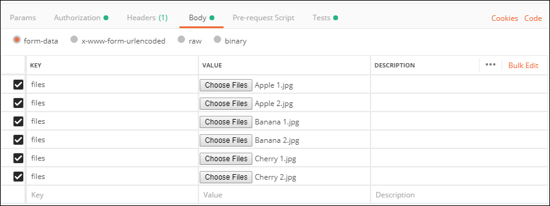
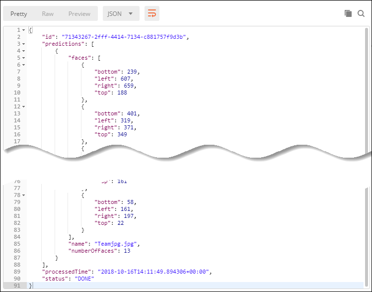
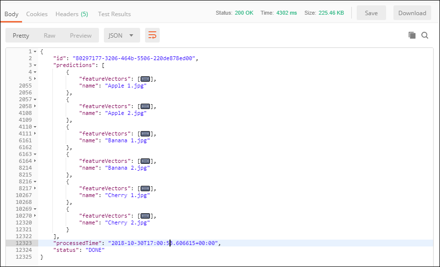
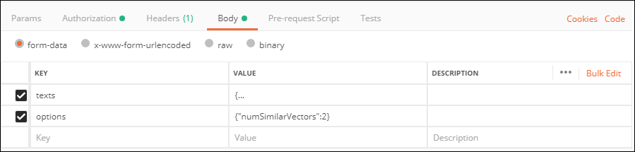

## Prerequisites
 - [Create a Machine Learning Foundation service instance on the Cloud Foundry environment](https://developers.sap.com/tutorials/cp-mlf-create-instance.html)
 - [Install Postman as a REST client](https://developers.sap.com/tutorials/api-tools-postman-install.html)
 - [Get your OAuth Access Token using a REST Client](https://developers.sap.com/tutorial-navigator.html?cp-mlf-rest-get-oauth-token.html)

## Details
### You will learn
  - Call multiple API and reuse the result into the next one from a REST client like Postman
  - The basics about Machine Learning Foundation Service for Similarity Scoring & Image Feature Extraction

> ### **Note:** The Face Feature Extraction service was in alpha version when this tutorial was released.

[ACCORDION-BEGIN [Step](The Image Feature Extraction Service)]

Similarly to the Text Feature Extraction or the Face Feature Extraction service, the Image Feature Extraction service extracts a vector of features out of an input image.

This is the list of accepted file extensions:

|Name                  | Description
|----------------------|--------------------
| **Archive file**     | `zip`, `tar`, `gz`, `tgz`
| **Image file**       | `jpg`, `jpe`, `jpeg`, `png`, `gif`, `bmp`

The images should be RGB, or 8-bit gray scale.

If an archive file is provided, no additional files can be provided.

The input file (or the archive file) is provided using form data (as an element named ***files*** in the form data).

The service will return a JSON response that includes the vector of features for the associated image.

For more details, you can check the [Inference Service for Image Feature Extraction on the SAP API Business Hub](https://api.sap.com/api/img_feature_extraction_api/resource).

[DONE]
[ACCORDION-END]

[ACCORDION-BEGIN [Step](The Similarity Scoring Service)]

The Similarity Scoring service compares vectors of extracted features with respect to cosine similarity.

A vector of features can be represented using the following format ***[number, number, number, ..., number]***.

The set of feature vectors which should be compared must be provided either using:

 - an archive file which will contain multiple feature vector file
 - plain text that represents a vector of features

With both options, you can provide either a single set of feature vector entries or two sets of feature vector entries which will drive the way entries are processed:

 - with a single feature vector entries, every feature vector entries will be compared to each other ((n-1)!-1 comparison).
 - with two set of feature vector entries, every feature vector entries in the first set will be compared to every feature vector entries from the second set (n*m comparison).

The input content will provided using form data, either as:

- a single or two element named ***files*** in the form data for the ***archive file***
- a single or two element named ***texts*** in the form data for the ***plain text***

This is the list of accepted file extensions for the archive file:

|Name                  | Description
|----------------------|--------------------
| **Archive file**     | `zip`, `tar`, `gz`, `tgz`

A required setting must also be provided as part of the form data (named ***options*** in the form data) using a JSON string format.

| Name                                    | Description            
|-----------------------------------------|--------------------------------------------
| <nobr><b>`numSimilarVectors`</b></nobr> | Number of most similar vectors to return in the response

The service will return a JSON response that includes a series of scores for each comparison.

For more details, you can check the [Inference Service for Similarity Scoring on the SAP API Business Hub](https://api.sap.com/api/similarity_scoring_api/resource).

[DONE]
[ACCORDION-END]

[ACCORDION-BEGIN [Step](Call the Image Feature Extraction API)]

First you will need to select and download a series of pictures to be used with Image Feature Extraction service.

If you are missing some inspiration, you can use the following pictures from the [**`ImageNet`**](http://www.image-net.org/) database around fruits:

 - <a href="https://farm4.static.flickr.com/3049/2864856895_63aba50a68.jpg" target="blank" download="Apple 1.jpg">Apple 1</a>
 - <a href="https://farm3.static.flickr.com/2068/2127339915_f9ae445652.jpg" target="blank" download="Apple 2.jpg">Apple 2</a>
 - <a href="https://farm2.static.flickr.com/1138/1274351453_870429bb8e.jpg" target="blank" download="Banana 1.jpg">Banana 1</a>
 - <a href="https://farm1.static.flickr.com/142/367481160_a0d6cdf933.jpg"   target="blank" download="Banana 2.jpg">Banana 2</a>
 - <a href="https://farm4.static.flickr.com/3592/3614068732_545a4fc3a1.jpg" target="blank" download="Cherry 1.jpg">Cherry 1</a>
 - <a href="https://farm3.static.flickr.com/2443/3704400156_5f2dc5fb07.jpg" target="blank" download="Cherry 2.jpg">Cherry 2</a>

To keep it simple, only one class should be detected from each image.

Open a new tab in ***Postman***.

Make sure that the ***`my-l-foundation`*** environment is selected.

On the **Authorization** tab, select **Bearer Token**, then enter **`{{OAuthToken}}`** as value.


> ### **Note:**: the **`OAuthToken`** environment variable can be retrieved following the [Get your OAuth Access Token using a REST Client](https://developers.sap.com/tutorial-navigator.html?cp-mlf-rest-get-oauth-token.html) tutorial.

Fill in the following additional information:

Field Name               | Value
:----------------------- | :--------------
<nobr>HTTP Method</nobr> | POST
<nobr>URL<nobr>          | <nobr>`https://mlftrial-image-feature-extractor.cfapps.eu10.hana.ondemand.com/api/v2/image/feature-extraction`</nobr>

> **Note** As a reminder, the URL depends on you Cloud Platform landscape region but for the trial landscape only ***Europe (Frankfurt)*** provide access to the Machine Learning Foundation services.

On the **Body** tab, keep **`form-data`** selected.

Add 6 elements with the **key** named **files** and switch it to **File** instead of **Text** (default).

Then set the file with the downloaded images in the following order:

 - <a href="https://farm4.static.flickr.com/3049/2864856895_63aba50a68.jpg" target="blank" download="Apple 1.jpg">Apple 1</a>
 - <a href="https://farm3.static.flickr.com/2068/2127339915_f9ae445652.jpg" target="blank" download="Apple 2.jpg">Apple 2</a>
 - <a href="https://farm2.static.flickr.com/1138/1274351453_870429bb8e.jpg" target="blank" download="Banana 1.jpg">Banana 1</a>
 - <a href="https://farm1.static.flickr.com/142/367481160_a0d6cdf933.jpg"   target="blank" download="Banana 2.jpg">Banana 2</a>
 - <a href="https://farm4.static.flickr.com/3592/3614068732_545a4fc3a1.jpg" target="blank" download="Cherry 1.jpg">Cherry 1</a>
 - <a href="https://farm3.static.flickr.com/2443/3704400156_5f2dc5fb07.jpg" target="blank" download="Cherry 2.jpg">Cherry 2</a>

The sequence of files is important here as you will be using a script to retrieve the corresponding responses.



Switch to the **Tests** tab and insert the following code:

```
pm.environment.set("Apple 1", decodeURIComponent(pm.response.json().predictions[0].featureVectors))
pm.environment.set("Apple 2", decodeURIComponent(pm.response.json().predictions[1].featureVectors))
pm.environment.set("Banana 1", decodeURIComponent(pm.response.json().predictions[2].featureVectors))
pm.environment.set("Banana 2", decodeURIComponent(pm.response.json().predictions[3].featureVectors))
pm.environment.set("Cherry 1", decodeURIComponent(pm.response.json().predictions[4].featureVectors))
pm.environment.set("Cherry 2", decodeURIComponent(pm.response.json().predictions[4].featureVectors))
```



Click on **Send**.

You should receive a response that includes for each image an entry with the feature vector:



```json
{
    "featureVectors": [ 0, "..."
    ],
    "name": "Apple 1.jpg"
}
```

Each entry in the response represents a box that identify one of the face.


[DONE]
[ACCORDION-END]

[ACCORDION-BEGIN [Step](Call the Similarity Scoring API)]

Open a new tab in ***Postman***.

Make sure that the ***`my-l-foundation`*** environment is selected.

On the **Authorization** tab, select **Bearer Token**, then enter **`{{OAuthToken}}`** as value.

Fill in the following additional information:

Field Name               | Value
:----------------------- | :--------------
<nobr>HTTP Method</nobr> | POST
<nobr>URL<nobr>          | <nobr>`https://mlftrial-similarity-scoring.cfapps.eu10.hana.ondemand.com/api/v2/similarity-scoring`</nobr>

On the **Body** tab, keep **`form-data`** selected.

Add a key named **texts** and switch it to **Text** (default).

Paste the following value:

```JSON
{
	"0":
	[
		{"id": "Apple 1", "vector": [{{Apple 1}}]},
		{"id": "Apple 2", "vector": [{{Apple 2}}]},
		{"id": "Banana 1", "vector": [{{Banana 1}}]},
		{"id": "Banana 2", "vector": [{{Banana 2}}]},
		{"id": "Cherry 1", "vector": [{{Cherry 1}}]},
		{"id": "Cherry 2", "vector": [{{Cherry 2}}]}		
	]
}
```

Add a key named **options** and switch it to **Text** (default).

Paste the following value:

```JSON
{"numSimilarVectors":2}
```



Click on **Send**.

You should receive a response that includes for each input feature vector (in your case 6 in total) the top 3 most similar feature vectors.

For example here, the image identified as **`Apple 1`** has been matched with **`Apple 2`** with a score of **0.81** and only **0.59** with **`Cherry 1`**:

```json
{
    "id": "Apple 1",
    "similarVectors": [
        {
            "id": "Apple 2",
            "score": 0.8198536095383784
        },
        {
            "id": "Cherry 1",
            "score": 0.590942196617069
        }
    ]
}
```

[DONE]
[ACCORDION-END]

[ACCORDION-BEGIN [Step](Validate your results)]

Provide an answer to the question below then click on **Validate**.

[VALIDATE_1]
[ACCORDION-END]
---
