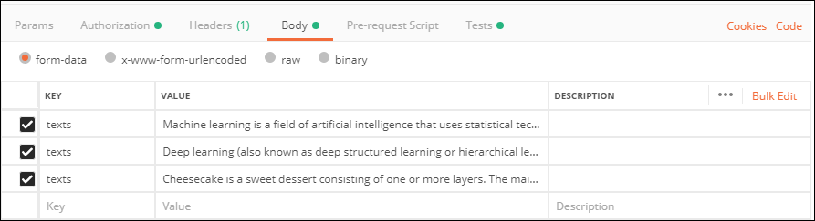
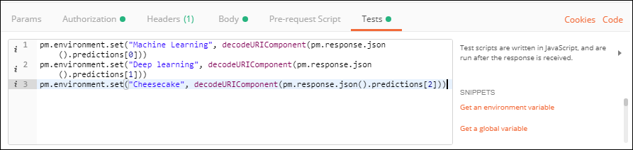
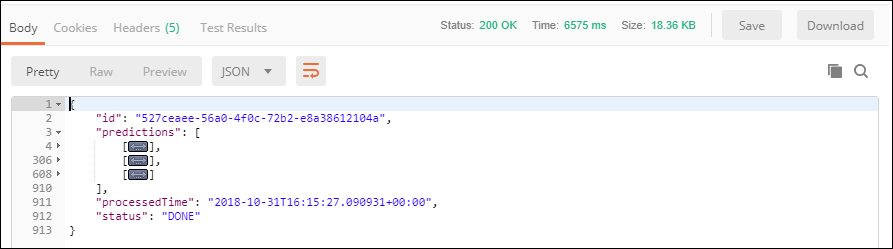
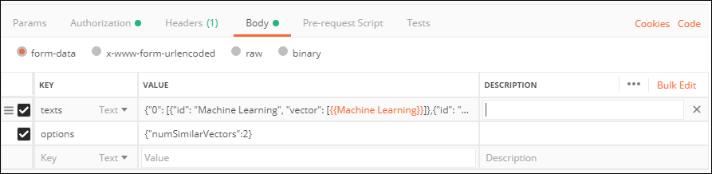

## Prerequisites
 - [Create a Machine Learning Foundation service instance on the Cloud Foundry environment](https://developers.sap.com/tutorial-navigator.html?mlfs-cf-create-instance.html)
 - [Install Postman as a REST client](https://developers.sap.com/tutorials/api-tools-postman-install.html)
 - [Get your OAuth Access Token using a REST Client](https://developers.sap.com/tutorial-navigator.html?cp-mlf-rest-get-oauth-token.html)

## Details
### You will learn
  - Call multiple API and reuse the result into the next one from a REST client like Postman
  - The basics about Machine Learning Foundation Service for Similarity Scoring & Text Feature Extraction

> ### **Note:** This service was in alpha version when this tutorial was released.

[ACCORDION-BEGIN [Step](The Text Feature Extraction Service)]

Similarly to the Face Feature Extraction or the Image Feature Extraction service, the Text Feature Extraction service extracts a vector of features out of an input text.

This is the list of accepted file extensions:

|Name                  | Description
|----------------------|--------------------
| **Archive file**     | `zip`, `tar`, `gz`, `tgz`
| **Text file**        | `txt`

If an archive file is provided, no additional files can be provided.

The input file (or the archive file) is provided using form data (as an element named ***files*** in the form data).

The service will return a JSON response that includes the vector of features for the associated text files.

For more details, you can check the [Inference Service for Image Feature Extraction on the SAP API Business Hub](https://api.sap.com/api/document_feature_extraction_api/resource).

[DONE]
[ACCORDION-END]

[ACCORDION-BEGIN [Step](The Similarity Scoring Service)]

The Similarity Scoring service compares vectors of extracted features with respect to cosine similarity.

A vector of features can be represented using the following format ***[number, number, number, ..., number]***.

The set of feature vectors which should be compared must be provided either using:

 - an archive file which will contain multiple feature vector file
 - plain text that represents a vector of features

With both options, you can provide either a single set of feature vector entries or two sets of feature vector entries which will drive the way entries are processed:

 - with a single feature vector entries, every feature vector entries will be compared to each other ((n-1)!-1 comparison).
 - with two set of feature vector entries, every feature vector entries in the first set will be compared to every feature vector entries from the second set (n*m comparison).

The input content will provided using form data, either as:

- a single or two element named ***files*** in the form data for the ***archive file***
- a single or two element named ***texts*** in the form data for the ***plain text***

This is the list of accepted file extensions for the archive file:

|Name                  | Description
|----------------------|--------------------
| **Archive file**     | `zip`, `tar`, `gz`, `tgz`

A required setting must also be provided as part of the form data (named ***options*** in the form data) using a JSON string format.

| Name                                    | Description            
|-----------------------------------------|--------------------------------------------
| <nobr><b>`numSimilarVectors`</b></nobr> | Number of most similar vectors to return in the response

The service will return a JSON response that includes a series of scores for each comparison.

For more details, you can check the [Inference Service for Similarity Scoring on the SAP API Business Hub](https://api.sap.com/api/similarity_scoring_api/resource).

[DONE]
[ACCORDION-END]

[ACCORDION-BEGIN [Step](Call the Image Feature Extraction API)]

First you will need to select and download a series of pictures to be used with Image Feature Extraction service.

If you are missing some inspiration, use the following articles content to create your text files:

 - <a href="https://en.wikipedia.org/wiki/Machine_learning" target="blank">Wikipedia article on Machine Learning</a>
 - <a href="https://en.wikipedia.org/wiki/Deep_learning" target="blank">Wikipedia article on Deep Learning</a>
 - <a href="https://en.wikipedia.org/wiki/Cheesecake" target="blank">Wikipedia article on Cheesecake</a>

Open a new tab in ***Postman***.

Make sure that the ***`my-l-foundation`*** environment is selected.

On the **Authorization** tab, select **Bearer Token**, then enter **`{{OAuthToken}}`** as value.


> ### **Note:**: the **`OAuthToken`** environment variable can be retrieved following the [Get your OAuth Access Token using a REST Client](https://developers.sap.com/tutorial-navigator.html?cp-mlf-rest-get-oauth-token.html) tutorial.

Fill in the following additional information:

Field Name               | Value
:----------------------- | :--------------
<nobr>HTTP Method</nobr> | POST
<nobr>URL<nobr>          | <nobr>`https://mlftrial-face-feature-extractor.cfapps.eu10.hana.ondemand.com/api/v2alpha1/image/face-feature-extraction`</nobr>

> **Note** As a reminder, the URL depends on you Cloud Platform landscape region but for the trial landscape only ***Europe (Frankfurt)*** provide access to the Machine Learning Foundation services.

On the **Body** tab, keep **`form-data`** selected.

Add 3 elements with the **key** named **texts** and switch it to **Text** instead of **File**.

Then set the file with the created text files from the below Wikipedia articles in the following order:

 - <a href="https://en.wikipedia.org/wiki/Machine_learning" target="blank">Wikipedia article on Machine Learning</a> with the following value:

```text
Machine learning is a field of artificial intelligence that uses statistical techniques to give computer systems the ability to "learn" (e.g., progressively improve performance on a specific task) from data, without being explicitly programmed.

The name machine learning was coined in 1959 by Arthur Samuel. Machine learning explores the study and construction of algorithms that can learn from and make predictions on data – such algorithms overcome following strictly static program instructions by making data-driven predictions or decisions,:2 through building a model from sample inputs. Machine learning is employed in a range of computing tasks where designing and programming explicit algorithms with good performance is difficult or infeasible; example applications include email filtering, detection of network intruders, and computer vision.

Machine learning is closely related to (and often overlaps with) computational statistics, which also focuses on prediction-making through the use of computers. It has strong ties to mathematical optimization, which delivers methods, theory and application domains to the field. Machine learning is sometimes conflated with data mining, where the latter subfield focuses more on exploratory data analysis and is known as unsupervised learning.

Within the field of data analytics, machine learning is a method used to devise complex models and algorithms that lend themselves to prediction; in commercial use, this is known as predictive analytics. These analytical models allow researchers, data scientists, engineers, and analysts to "produce reliable, repeatable decisions and results" and uncover "hidden insights" through learning from historical relationships and trends in the data.
```

 - <a href="https://en.wikipedia.org/wiki/Deep_learning" target="blank">Wikipedia article on Deep Learning</a> with the following value:

```text
Deep learning (also known as deep structured learning or hierarchical learning) is part of a broader family of machine learning methods based on learning data representations, as opposed to task-specific algorithms. Learning can be supervised, semi-supervised or unsupervised.

Deep learning architectures such as deep neural networks, deep belief networks and recurrent neural networks have been applied to fields including computer vision, speech recognition, natural language processing, audio recognition, social network filtering, machine translation, bioinformatics, drug design and board game programs, where they have produced results comparable to and in some cases superior to human experts.

Deep learning models are vaguely inspired by information processing and communication patterns in biological nervous systems yet have various differences from the structural and functional properties of biological brains (especially human brain), which make them incompatible with neuroscience evidences.
```

 - <a href="https://en.wikipedia.org/wiki/Cheesecake" target="blank">Wikipedia article on Cheesecake</a> with the following value:

```text
Cheesecake is a sweet dessert consisting of one or more layers. The main, and thickest layer, consists of a mixture of soft, fresh cheese (typically cream cheese or ricotta), eggs, vanilla and sugar; if there is a bottom layer it often consists of a crust or base made from crushed cookies (or digestive biscuits), graham crackers, pastry, or sponge cake. It may be baked or unbaked (usually refrigerated). Cheesecake is usually sweetened with sugar and may be flavored or topped with fruit, whipped cream, nuts, cookies, fruit sauce, or chocolate syrup. Cheesecake can be prepared in many flavors, such as strawberry, pumpkin, key lime, lemon, chocolate, Oreo, chestnut, or toffee.
```


The sequence of files is important here as you will be using a script to retrieve the corresponding responses.



Switch to the **Tests** tab and insert the following code:

```
pm.environment.set("Machine Learning", decodeURIComponent(pm.response.json().predictions[0]))
pm.environment.set("Deep learning", decodeURIComponent(pm.response.json().predictions[1]))
pm.environment.set("Cheesecake", decodeURIComponent(pm.response.json().predictions[2]))
```



Click on **Send**.

You should receive a response that includes for each text an entry with the feature vector.



[DONE]
[ACCORDION-END]

[ACCORDION-BEGIN [Step](Call the Similarity Scoring API)]

Open a new tab in ***Postman***.

Make sure that the ***`my-l-foundation`*** environment is selected.

On the **Authorization** tab, select **Bearer Token**, then enter **`{{OAuthToken}}`** as value.

Fill in the following additional information:

Field Name               | Value
:----------------------- | :--------------
<nobr>HTTP Method</nobr> | POST
<nobr>URL<nobr>          | <nobr>`https://mlftrial-similarity-scoring.cfapps.eu10.hana.ondemand.com/api/v2/similarity-scoring`</nobr>

On the **Body** tab, keep **`form-data`** selected.

Add a key named **texts** and switch it to **Text** (default).

Paste the following value:

```JSON
{
	"0":
	[
		{"id": "Machine Learning", "vector": [{{Machine Learning}}]},
		{"id": "Deep learning", "vector": [{{Deep learning}}]},
		{"id": "Cheesecake", "vector": [{{Cheesecake}}]}		
	]
}
```

Add a key named **options** and switch it to **Text** (default).

Paste the following value:

```JSON
{"numSimilarVectors":2}
```



Click on **Send**.

You should receive a response that includes for each input feature vector (in your case 6 in total) the top 3 most similar feature vectors.

For example here, the image identified as **`Machine Learning`** has been matched with **`Deep learning`** with a score of **0.96** and only **0.65** with **`Cheesecake`**:

```json
{
    "id": "Machine Learning",
    "similarVectors": [
        {
            "id": "Deep learning",
            "score": 0.963691210847067
        },
        {
            "id": "Cheesecake",
            "score": 0.6516945761961646
        }
    ]
}
```

[DONE]
[ACCORDION-END]

[ACCORDION-BEGIN [Step](Validate your results)]

Provide an answer to the question below then click on **Validate**.

[VALIDATE_1]
[ACCORDION-END]
---
