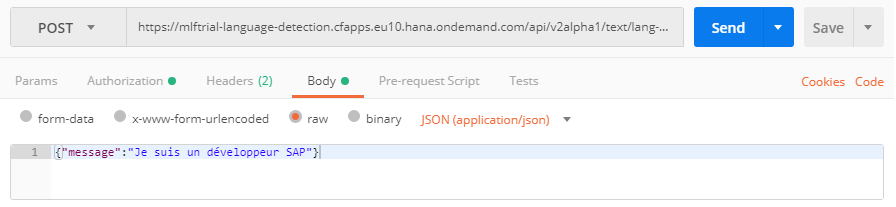
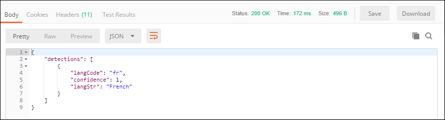

## Prerequisites
 - [Create a Machine Learning Foundation service instance on the Cloud Foundry environment](https://developers.sap.com/tutorials/cp-mlf-create-instance.html)
 - [Install Postman as a REST client](https://developers.sap.com/tutorials/api-tools-postman-install.html)
 - [Get your OAuth Access Token using a REST Client](https://developers.sap.com/tutorials/cp-mlf-rest-generate-oauth-token.html)

## Details
### You will learn
  - Call an API from a REST client like Postman
  - The basics about Machine Learning Foundation Service for Language Detection

> ### **Note:** This service was in alpha version when this tutorial was released.

[ACCORDION-BEGIN [Step](The Language Detection Service)]

The Language Detection service identifies the language of a given piece of text.

The input text is provided using the request body in a JSON format.

The service will return a JSON response that includes a two-character language ID along with the following series of properties:

Property                  | Description
:------------------------ | :--------------
<nobr>`confidence`</nobr> | Carries the prediction confidence score within the range [0,1], 0 being lowest and 1 being highest. For example: confidence value 1 means 100%. 0.1 means 10%
<nobr>`langCode`</nobr>	  | The code used by language as ID.
<nobr>`langStr`</nobr>	  | The English language expansion of the language ID

For more details, you can check the following link:

 - [Inference Service for Language Detection on the SAP API Business Hub](https://api.sap.com/api/language_detection_api/resource).

[DONE]
[ACCORDION-END]

[ACCORDION-BEGIN [Step](Call the API)]

Open a new tab in ***Postman***.

Make sure that the ***`my-ml-foundation`*** environment is selected.

On the **Authorization** tab, select **Bearer Token**, then enter **`{{OAuthToken}}`** as value.


> ### **Note:**: the **`OAuthToken`** environment variable can be retrieved following the [Get your OAuth Access Token using a REST Client](https://developers.sap.com/tutorials/cp-mlf-rest-generate-oauth-token.html) tutorial.

Fill in the following additional information:

Field Name               | Value
:----------------------- | :--------------
<nobr>HTTP Method</nobr> | POST
<nobr>URL<nobr>          | <nobr>`https://mlftrial-language-detection.cfapps.eu10.hana.ondemand.com/api/v2alpha1/text/lang-detect`</nobr>

> **Note** As a reminder, the URL depends on you Cloud Platform landscape region but for the trial landscape only ***Europe (Frankfurt)*** provide access to the Machine Learning Foundation services.

On the **Body** tab, select **`raw`** then select **`JSON (application/json)`** instead of *Text*.

And in the **body** area paste the following content:

```JSON
{"message":"Je suis un développeur SAP"}
```



Click on **Send**.

You should receive a response that includes the detected language:



```json
{
    "detections": [
        {
            "langCode": "fr",
            "confidence": 1,
            "langStr": "French"
        }
    ]
}
```

[DONE]
[ACCORDION-END]

[ACCORDION-BEGIN [Step](Validate your results)]

Provide an answer to the question below then click on **Validate**.

[VALIDATE_1]
[ACCORDION-END]
