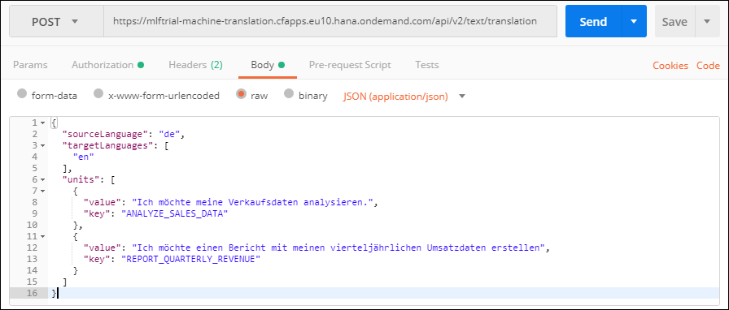
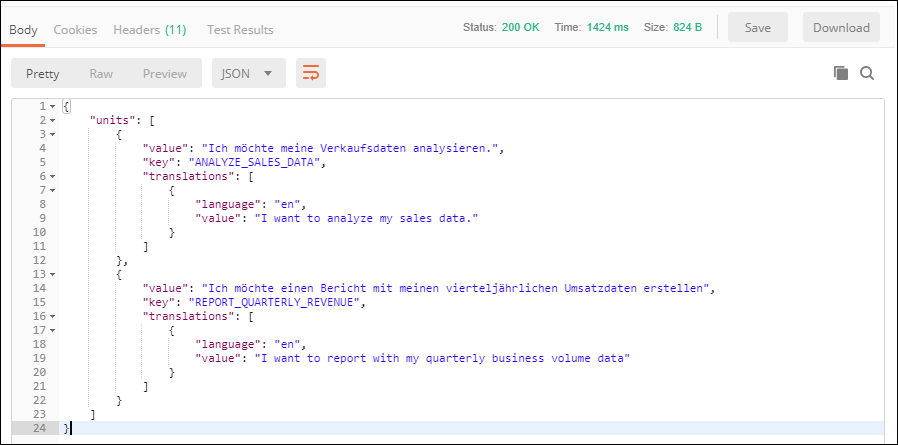

## Prerequisites
 - [Create a Machine Learning Foundation service instance on the Cloud Foundry environment](https://developers.sap.com/tutorials/cp-mlf-create-instance.html)
 - [Install Postman as a REST client](https://developers.sap.com/tutorials/api-tools-postman-install.html)
 - [Get your OAuth Access Token using a REST Client](https://developers.sap.com/tutorials/cp-mlf-rest-generate-oauth-token.html)

## Details
### You will learn
  - Call an API from a REST client like Postman
  - The basics about Machine Learning Foundation Service for Machine Translation

> ### **Note:** This service was in alpha version when this tutorial was released.

[ACCORDION-BEGIN [Step](The Machine Translation Service)]

The Machine Translation service enables you to translate texts into a range of languages.

This service is powered by **SAP Translation Hub** and is trained on SAP-related content to provide accurate domain adaptation and terminology coverage.

The service execution requires the following details provided using the request body in a JSON format:
 - the source language
 - the target languages (one or more)
 - a series of input texts with an associated key identifier

The service will return a JSON response that includes the original input text with the associated translations.

For more details, you can check the following link:

 - [Inference Service for Machine Translation on the SAP API Business Hub](https://api.sap.com/api/translation_api/resource).

[DONE]
[ACCORDION-END]

[ACCORDION-BEGIN [Step](Call the API)]

Open a new tab in ***Postman***.

Make sure that the ***`my-ml-foundation`*** environment is selected.

On the **Authorization** tab, select **Bearer Token**, then enter **`{{OAuthToken}}`** as value.


> ### **Note:**: the **`OAuthToken`** environment variable can be retrieved following the [Get your OAuth Access Token using a REST Client](https://developers.sap.com/tutorials/cp-mlf-rest-generate-oauth-token.html) tutorial.

Fill in the following additional information:

Field Name               | Value
:----------------------- | :--------------
<nobr>HTTP Method</nobr> | POST
<nobr>URL<nobr>          | <nobr>`https://mlftrial-machine-translation.cfapps.eu10.hana.ondemand.com/api/v2/text/translation`</nobr>

> **Note** As a reminder, the URL depends on you Cloud Platform landscape region but for the trial landscape only ***Europe (Frankfurt)*** provide access to the Machine Learning Foundation services.

On the **Body** tab, select **`raw`** then select **`JSON (application/json)`** instead of *Text*.

And in the **body** area paste the following content:

```JSON
{
  "sourceLanguage": "de",
  "targetLanguages": [
    "en"
  ],
  "units": [
    {
      "value": "Ich möchte meine Verkaufsdaten analysieren.",
      "key": "ANALYZE_SALES_DATA"
  	},
	{
      "value": "Ich möchte einen Bericht mit meinen vierteljährlichen Umsatzdaten erstellen",
      "key": "REPORT_QUARTERLY_REVENUE"
    }
  ]
}
```

This will translate the 2 units in English from German.



Click on **Send**.

You should receive a response that includes a series of faces entries:



```json
{
    "value": "Ich möchte meine Verkaufsdaten analysieren.",
    "key": "ANALYZE_SALES_DATA",
    "translations": [
        {
            "language": "en",
            "value": "I want to analyze my sales data."
        }
    ]
}
```

[DONE]
[ACCORDION-END]

[ACCORDION-BEGIN [Step](Validate your results)]

Provide an answer to the question below then click on **Validate**.

[VALIDATE_1]
[ACCORDION-END]
